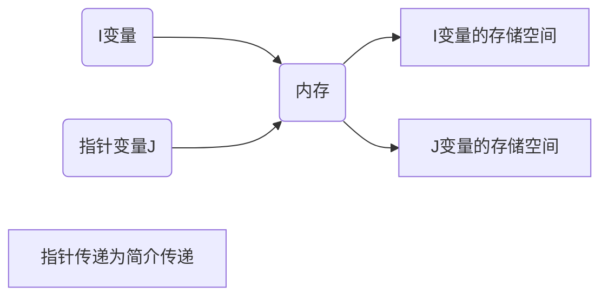

# 基础作业

### 1 总结strn系列函数和mem系列函数

- strn

  - | 函数名  |                             格式                             |                           使用效果                           |
    | :-----: | :----------------------------------------------------------: | :----------------------------------------------------------: |
    | strncpy |             strncpy(char *to, const, char *from)             | 将字符串from中至多count个字符复制到字符串to中。如果字符串from的长度小于count,其余部分用\0'填补。返回处理完成的字符串。 |
    | strncmp | int strncmp( const char *str1, const char *str2, size_ t count ); | 比较字符串str1和str2 中至多count个字符。函数返回值和strcmp相同 |
    | strncat | char *strncat( char *str1, const char *str2, size_tcount );  | 将字符串from中至多count个字符连接到字符串to中。并且在末尾追加结束符 |

- mom函数

  - | 函数名 | 表达式                | 使用效果                                                   |
    | ------ | --------------------- | ---------------------------------------------------------- |
    | memset | memset(d,0,sizeof(d)) | 将从d开始的sizeof长度的元素都变成0，其中0可以是任意const值 |
    | memcpy | memcpy(b,0,sizeof(b)) | 拷贝从b开始的sizeof长度的元素。                            |

    

### 2 下面这个语句为什么不能正常执行？

 

- 未初始化指针

### 3画图，画出变量传递过程的内存示意图

- 

  ```mermaid
graph LR
  A(I变量) -->B(内存)
    B --> D[I变量的存储空间]
    D1(J变量)-->B(内存)
    B --> E[J变量的存储空间]
    F[变量传递为直接传递]
  ```

- `J = I`   =>将变量`I`的值给`J` 

- 实际上是将`I`的值存到`J`的存储空间中

### 4画图，画出指针传递过程的内存示意图



- `J = &I`   =>将变量`I`的地址给`J` 
- 实际上是将`I`在内存中的地址地址存到`J`的存储空间中