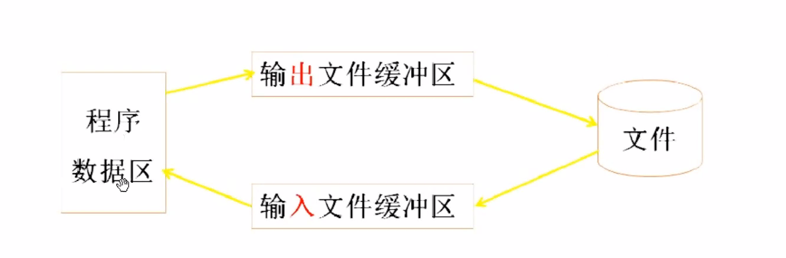
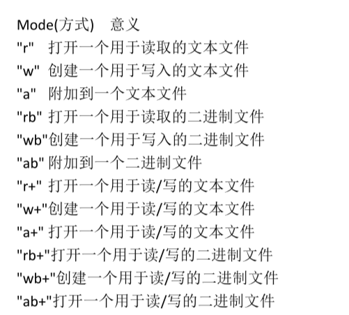
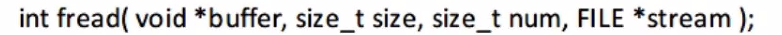

# day15

### Ep01 文件操作

**手持两把锟斤拷，口中疾呼烫烫烫。脚踏千朵屯屯屯，笑看万物锘锘锘**



- 文件指存储在磁盘里的数据
- 在格式化的时候分配block

- 

- C语言文件读取与写入是通过将文件看成一个字符序列进行读入和写出的。所以读取与写入文件就用到了指针，而这个指针是一个特殊的指针，我们称为文件指针。
  
  ```c++
  //打开文件 
  #include<cstdio>
  #include<cstdlib>
  int main()
  {
      char c;
      int ret;
      FILE *fp;
      fp=fopen("file.txt","r+");
      //可以为相对路径，也可以是绝对路径
      if(NULL==fp)
      { //如果执行失败则会返回错误码，
        //perror的作用是返回上面函数的错误码。
          perror("fopen");
          goto error;
      }
      /*
      while((c=fgetc(fp)!=EOF)
      {
          putchar(c);
      }
      */
      c='H';
      ret = fputc(c,fp);//ret为返回值
      if(EOF==ret)
      {
          perror("fputc");
          goto error;
      }
      //已经存入缓冲区
  	//刷新缓冲区的时候将缓冲区写入文件
      fclose(fp);
      error:
}
  ```
  
- 刷新缓冲区的情况

  - fclose
  - fflash(fp) 主动刷新
  - 写满了就会刷新缓冲区

- 如何用fgets读取一整行

  - ```c++
    fgets(buf.sizeof(buf),fp);
    whlie(memset(buf,0,sizeof(buf),
          fgets(buf.sizeof(buf),fp)!=NULL);
    ```

### Ep03

* fwrite&&fread

  > - 必须遵循，按什么格式写就按什么格式读
  >
  > - 
  >
  >   - 返回一个整型数
  >   - 
  >
  > - 
  >
  > - 
  >
  >   ```c++
  >   int main()
  >   {
  >       FILE *fp;
  >       char str[10]="10000";
  >       int val=10000;
  >       int ret;
  >       fp=fopen("file.txt","r+");
  >       if(NULL==fp)
  >       {
  >           perror("fopen");
  >           goto errot;
  >       }
  >       ret=fwrite(str,sizeof(char),stelen(str),fp);
  >       //ret=fwrite(&val,sizeof(int),1,fp);
  >       //写入整数
  >       //写入整数时，会将内存中的16进制换算成ASCⅡ码
  >      
  >       menset(str,0,sizeif(int));
  >       fread(str,sizeof(char));
  >       fclose(fp);
  >   error;
  >   }
  >   
  >   ```
  >
  > - 往文件中写入\n，存入磁盘的是\r\n。
  >
  > - 从文件中读出时，遇到\r\n，底层接口会自动转换为\n,
  >
  > - 偏移时，如果跨过了一个\n，要多偏移一位