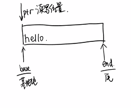

# day16

### Ep01

- main函数的传参

  > - ```c++
  >   int main(int argc,char *argv)
  >   {
  >   	int i;
  >   	for(i=0;i<argc;i++)
  >   	{
  >   		puts(argv[i]);
  >   	}//输出为绝对路径
  >       fp=fopen(argv[1],"r+")
  >       if(NULL=fp)
  >       {
  >           perror("fopen");
  >           goto error;
  >       }
  >           while((c=fgetc(fp))!=EOF)
  >           {
  >               putcharc)
  >           }
  >       fclose(fp);
  >       error:
  >       system("pause");
  >   }
  >   ```

### Ep02 

- fpirntf

  > - 写到文件中，对比printf多了一个fp参数

- spritnf


### Ep03 复习

- 文件操作

  > - 计算机组成
  >
  >   - cpu：只能访问内存的数据
  >   - 内存：正在运行的文件，占用cpu
  >     - 容量小，断电易丢失数据
  >   - 外部设备
  >     - 磁盘：容量大，断点不丢失
  >     - IO设备和总线
  >     - 输入输出设备
  >
  > - ```mermaid
  >   graph LR
  >   A[内存] -->B[磁盘数据]
  >   C[CPU]-->A
  >       
  >       
  >       
  >   ```
  >
  > - 文件的分类
  >
  >   - 二进制&&ASCⅡ码
  >
  > - 文件的打开
  >
  >   - 打开权限
  >     - r只读
  >     - r+读写
  >       - 写入\n的时候，会储存\r\n
  >       - 注意fseek
  >     - rb+ 二进制读写
  >     - w只写但是会清空原文件
  >     - w+读写但是会清空源文件
  >   - FILE结构体（文件缓冲区）分配在用户态空间
  >   - base：基地
  >   - ptr：读写位置
  >   - end：结尾
  >   - size：偏移大小
  >   - 
  >   - 在开始读写的时候，ptr指针指向base
  >   - 每次读写的时候都偏移ptr指针
  >   - 通过fseek偏移指针来写入文件
  >   - （因为读取时ptr指针已经指向下一个字节）
  >   - size 当ptr偏移达到size时，ptr偏移就会返回EOF
  >   - 如何检查打开失败
  >     - 检查fopen的返回值，如果为NULL，则使用perror显示报错原因
  >
  > - 文件的关闭：fclose
  >
  > - 文件读写位置的偏移：fseek
  >
  >   - 基准点
  >     - SEEK_SET
  >     - SEEK_CUR
  >     - SEEK_END
  >   - 偏移量：可正可负
  >
  > - 文件的读取
  >
  >   - fgetc：
  >   - fgets：
  >   - fscanf：读取ASCⅡ码，保证读的内容为字符串
  >   - fread（指定读取数量，最常用）：读取二进制文件
  >
  > - 文件的写入
  >
  >   - fputc：
  >   - fputs：
  >   - fprintf：
  >   - fwrite（指定写入数量，常用）：
  >
  > - 命令行参数：main函数的形参
  >
  >   - `int main(int argc,char*argv[])`
  >   - 参数数量，参数数组
  >   - argc：输入的命令有xxx个单词，单词下标范围为`0~argc-1`

- 项目：学生管理系统

  > - 登陆
  >   - 提供用户交互
  >   - 打开账户文件进行比对（）
  >   - 设计账号信息，读取链表比对
  > - 学生信息的增删查改
  >   - 读取文件
  >   - 对链表进行增删查改

