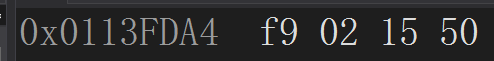

## 1.测试一下你的编译器short\int\long\long long数据类型依次占据多大的内存空间

- short	     2位 
- int              4位
- long           4位
- long long  8位


```c++
#include<stdio.h>
int main() {
	short i = 3;
	int j = 4;
	long n = 5;
	long long m = 6;
	return 0;
}
```

## 2.int a = -1234, b = 2345，根据a和b的首地址，说出a和b所占据的内存空间各个字节的内存数据

- a和b所占据的内存空间
  - a占据的内存空间：
    - 由于-1234为负数，计算机通过补码的方式储存负数
    - 1234源码为   0000\\0000\\0000\\0000\\0000\\0100\\1101\\0010
    - 对源码进行取反+1 得到对应的补码为
    - -1234补码为 1111 \\1111\\1111\\1111\\1111\\1011\\0010\\1110
    - 换算成十六进制每8位组成一个字节的数据为：ff \\ff \\fb\\2e
    - 换成小端储存有：2e\\fb\\ff\\ff 
  - b占据的内存空间：
    - 由于2345为正数，计算机可以直接用原码储存
    - 2345的源码为 0000\\0000\\0000\0000\0000\\1001\\0010\\1001
    - 换算成十六进制每8位组成一个字节的数据为：00\\00\\09\\29
    - 换成小端储存：29\\09\\00\\00

## **3**.假如一个float类型的数据在内存的布局是(16进制 小端法)66 66 24 41，请计算它的十进制数值

- 将小端法化成大端法方便计算 

  - 66\\66\\24\\41 小端
  - 41\\24\\66\\66 大端

- 根据大端法 每个字节换成8位二进制数据有

  - 0100\\0001\\0010\\0100\\0110\\0110\\0110\\0110

- 去掉第一位的数符（为0说明该浮点数为正数）

  - 1000\\0010 换算成十进制为130 （指数部分为130-127=3）
- 剩下为010\\0100\\0110\\0110\\0110\\0110
  - 实际部分为1.010\\0100\\0110\\0110\\0110\\0110（底数部分）

- 该浮点数为1.01001000110011001100110^3 
- 为：1.0303316066697343373304356785565   //我瞎了真的

## 4.请构造合适的例子编写程序，并且回答下面的问题：

- a如果原来的数据是无符号类型，使用%d打印也是无符号类型吗？

  - 不一定是

  - 当达到它能表示的最大值时，会重新从起始点开始比如unsigned short所能表示是最大值为65535 超过则会从0重新开始计数

  - ```c++
    #include<cstdio>
    #include<iostream>
  using namespace std;
    int main() {
    	unsigned short m = 65535;
    	unsigned short i = 65536;
    	unsigned short j = 65537;
    	printf("小于65536的数为 %d\n", m);
    	printf("等于65536的数为 %d\n", i);
    	printf("大于65536的数为 %d\n", j);	
    	return 0; 
    }
    ```
    
  - 

- b如果原来的数据是有符号类型，使用%u打印也是有符号类型吗

  - 不是  会按照整数型处理

  - ```c++
    #include<cstdio>
    #include<iostream>
    using namespace std;
    int main() {
    	 short m = -32765;
    	printf("%u\n", m);
    	//我是断点
    	return 0; 
    }
    ```

  - 

  - 此时m在内存中为

  - 换成大端法为：ff\\ff\\80\\03

  - 

  - 用计算器可以换算成4294934531，和输出相符，所以这里是直接将有符号类型按照整数型处理。

## 5.有符号类型在内存中以二进制补码的形式保存的

- a 如果给出两个数据的补码形式，如何在不计算10进制数值的情况下进行大小比较？
  - 优先通过补码判断正负：之后直接进行二进制的减法，若结果为正数则被减数大，若结果为负数则减数大

- b 对于N位的有符号类型，求出最大正数\最大负数\最小负数以及其二进制补码形式
  - 最大正数：2^n	 原码形式为：111111111111（n个1）
  - 最大负数：-1        补码形式为：100000000001（n-1个0）
  - 最小负数：-2^n    补码形式为： 100000000000（n个0）

## 6.分别使用10进制数字，字符字面值，16进制ASCII码转义字符和8进制ASCII转义字符的方式来打印字符 c

```c++
#include<cstdio>
#include<iostream>
using namespace std;
int main() {
	char c = 'c';
	int i = 99;
	printf("用十进制数字为：%c\n",i);
	printf("字符字面值为：%c\n", c);
	printf("用八进制数字为：\143\n");//八进制为\
	printf("用十六进制数字为：\x63\n");//十六进制为\x
	return 0;
}
```


## 7.将字符类型的’1’~’9’转换成整型，并且打印输出

```c++
#include<cstdio>
#include<iostream>
using namespace std;
int main() {
	char c[] = { '1','2','3','4','5','6','7','8','9' };
	for (int i = 0; i < 9; i++) {
		printf("%d\n", c[i]); 
	}
	return 0;
}
```


## 8 .“helloworld”需要使用多大的字符数组来存储？

- 每个字符一个位置 加上末尾的占位符

- 应该用长度为11的字符数组储存

- ```
  #include<cstdio>
  int main() {
  	char c[]{ "helloworld" };
  	//我是断点
  	return 0;
  }
  ```

- 

## 9.设计程序验证：

-   int类型强制类型转换成short类型，变量（正数、负数）的内存里面会发生什么变化？反过来呢？

  - int强制类型转换成short类型的时候可能会发生溢出

  - ```c++
    #include<cstdio>
    #include<iostream>
    using namespace std;
    int main() {
    	int i = 32768; //short类型的上限值为32767
    	//inti = -32768
    	short j = (short)i;
    	cout << j << endl;
        //我是断点
    	return 0;
    }
    ```

  - 

  - 在内存中 

    -  int类型：
    -  short类型：

  - 反过来则不会溢出 内存中变化如下

    - int类型：
    - short类型：

- int类型强制类型转换成float类型，变量（正数、负数）的内存里面会发生什么变化？反过来呢？
  
  - int类型转换成float类型：不会损失精度但是容易因为超出范围而溢出
  
    - 内存变化如下
  
      - ```c++
        #include<cstdio>
        #include<iostream>
        using namespace std;
        int main() {
        	int i = 111111111;
        	float f = (float)i;
        	//我是断点
        	return 0;
        }
        ```
  
      - 
  
      - int类型：
  
      - float类型：
  
      - 可以看到因为溢出int的值丢失了
  
  - float类型转换成int类型：float如果存的是整数，则不会超范围，但是由于float容易超出int范围
  
    - 内存变化如下
  
      - ```c++
        #include<cstdio>
        #include<iostream>
        using namespace std;
        int main() {
        	float f = 1.0e10;
        	int i = (int)f;
        	//我是断点
        	return 0;
        }
        ```
  
      - int类型：
  
      - float类型：
      
      - +++++++++++++++++++++