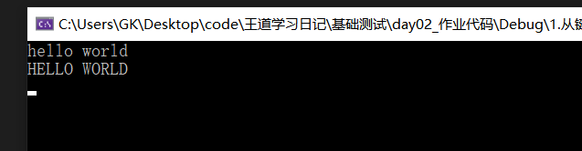
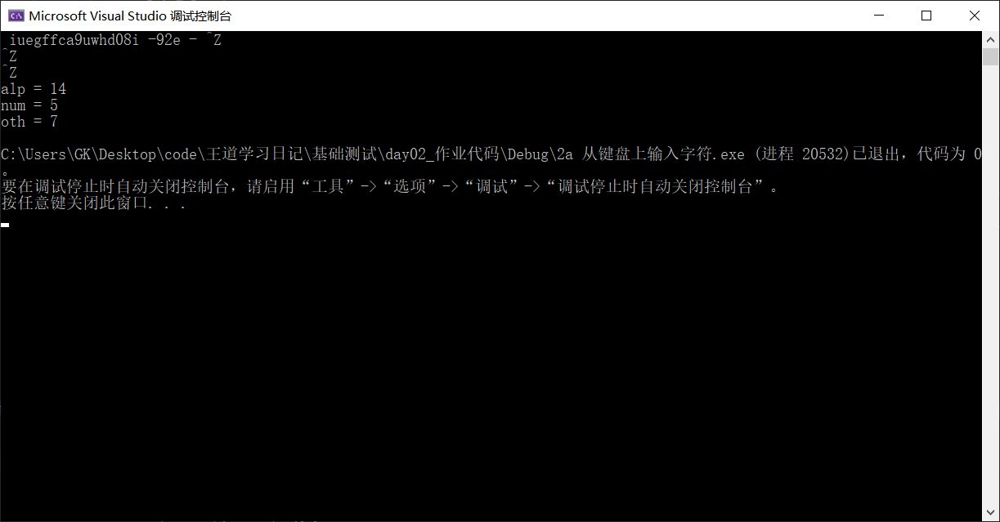
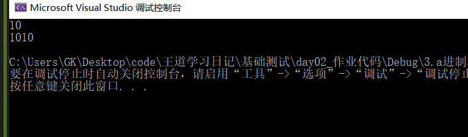
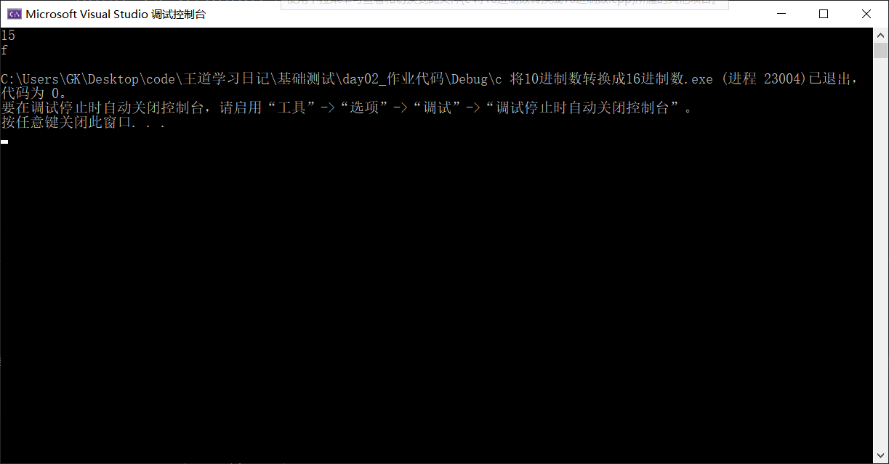
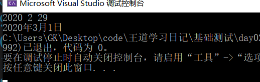

## 提高作业

#### 1.从键盘上输入字符，将小写字母转换成大写字母。输入“ctl + z” 结束

```c++
#define _CRT_SECURE_NO_WARNINGS
#include<iostream>     //不知道为啥按回车就直接结束了
#include<cstdio>       //没给我输入ctl + z的机会
using namespace std;   //可能这就是vs2019吧
int main() {
	char c;
	int ret;
	while (scanf_s("%c",&c)!=EOF){
		if (c != '\n') {
			printf("%c", c - 32);
		}
		else {
			printf("\n");
        }	
	}
}
```



2 从键盘上输入字符

a 分别统计一下其中字母，数字，其他字符的个数

```c++
#define _CRT_SECURE_NO_WARNINGS
#include<iostream>
#include<cstdio>
using namespace std;
int main() {
	char c;
	int i;
	int alp = 0, num = 0, oth = 0;
	while (scanf_s("%c", &c) != EOF) {
		if (c != '\n') {
			i = (int)c; //将输入的字符强制转换成整数
			if (i >= 65 && i <= 90) { //大写字母
				alp++;
			}
			else if (i >= 97 && i <= 122) {//小写字母
				alp++;
			}
			else if (i >= 48 && i <= 57) {//数字
				num++;
			}
			else { //其他
				oth++;
			}
		}
		else {
			printf("\n");
		}
	}
	cout << "alp = " << alp << endl;
	cout << "num = " << num << endl;
	cout << "oth = " << oth << endl;
}
```



b 将统计的字母，数字，其他字符的个数以柱状图的形式打印（按照数量关系排序）

 ```c++
//实在想不出来排序之后应该如何打印下面对应的字符 
 ```


#### 3 进制转换

- a 将10进制数转换成2进制数（使用字符数组存储）

  ```c++
  #define _CRT_SECURE_NO_WARNINGS
  #include<iostream>
  #include<cstdio>
  #include<vector>
  using namespace std;
  int main() {
  	int num, count = 0;
  	int a[1024];
  	scanf("%d", &num);
  	while (num>0){
  		a[count] = (num % 2);//除二取余
  		num /= 2;
  		count++;
  	}
  	for (count; count >= 0; count--) {
  		printf("%d", a[count]);
  	}
  	cout << endl;
  	return 0;
  }
  ```

  

- b 将2进制数（使用字符数组存储）转换成10进制数（使用整型存储）

  ```c++
  #define _CRT_SECURE_NO_WARNINGS
  #include<iostream>
  #include<cstdio>
  #include<vector>
  using namespace std;
  int main() {
  	int num =0, count = 0;
  	int c;
  	int a[100];
  	scanf("%d", &num);
  	while (num>0){
  		c = (num % 2);
  		a[count] = c;//除二取余
  		num /= 2;
  		count++;
  	}
  	for (count--; count >= 0; count--) { //倒序输出
  		cout << a[count];
  	}
  	cout << endl;
  	return 0;
  }
  ```

  

c 将10进制数转换成16进制数（使用字符数组存储）

```c++
#define _CRT_SECURE_NO_WARNINGS
#include<iostream>
#include<cstdio>
#include<vector>
using namespace std;
int main() {
	int num = 0, count = 0;
	int c;
	char a[100];
	scanf_s("%d", &num);
	while (num > 0) {    //除以16取余 
		c = (num % 16);
		if(c>9){
			a[count] = c + 'W';
		}
		else {
			a[count] = c + '0';
		}
		num /= 16;
		count++;
	}
	for (count--; count >= 0; count--) { //倒序输出
		cout << a[count];
	}
	cout << endl;
	return 0;
}
```



#### d 将16进制数（使用字符数组存储）转换成10进制数（使用整型存储）

```c++
#define _CRT_SECURE_NO_WARNINGS
#include<iostream>
#include<cstdio>
#include<cmath>
using namespace std;
int main() {
	int c;
	long int num = 0;
	char a[100] ;
	scanf("%s", &a);
	int l = strlen(a);
	for (int i = 0; i < l; i++) {//遍历数组
		if (a[i] > '0'&& a[i] <= '9') {
			c = a[i] - '0';;
		}
		else if(a[i] >= 'a' && a[i] <= 'f'){
			c = a[i] - 'a' + 10;
		}
		else {
			c = a[i] - 'A' + 10;
		}
		num += pow(16, c);
	}
	cout << num << endl;
	return 0;
}
```


#### 4.统计一个整型数字的二进制形式中有多少个1（注意正负数都要计算）

```c++
#include<iostream>    //开始是想负数二进制应该怎么判断
#include<cstdio>	  //想了半天没想出结果
using namespace std;  //还是直接写了个转换
void Count(int i);
int main() {
	int i;
	while (scanf_s("%d", &i) != EOF) {
		Count(i);
	}
}
void Count(int i) {
	int count = 0;
	while (i) {		//按位取 由于是二进制 所以各个位数的和就是1的个数
		count += i & 0x01;
		i >>= 1;
	}
	printf("%d", count);
}
```


#### 5.输入年月日，输出该日期的下一天的年月日

```c++
#include<iostream>
#include<cstdio>
using namespace std;
int date_designate(int year, int month, int day); //判断除开二月的所有
int main() {
	int year, month, day;
	cin >> year >> month >> day;
	if (year % 4 == 0 && year % 100 != 0 || year % 400 == 0) {//优先判断闰年
		if (month == 2 && day == 29) { //仅有二月份是不一样的 其他年份和别的一样
			month++;
			day = 1;
			cout << year << "年" << month << "月" << day << "日";
		}
		else { //闰年的其他月份和非闰年一样 
			date_designate(year, month, day);
		}
	}
	else {  //非闰年
		if (month == 2 && day == 28) {  //函数中未写判断二月 单独判断
			month++;
			day = 1;
			cout << year << "年" << month << "月" << day << "日";
		}
		else {
			date_designate(year, month, day);
		}
	}
}
int date_designate(int year, int month, int day) {
	if (month == 12 && day == 31) { //需要年++的情况
		year++;
		month = 1;
		day = 1;
	}
	else if (month == 1 || 3 || 5 || 7 || 8 || 10 && day == 31) {//大月中需要月++的情况
		month++;
		day = 1;
	}
	else if (month == 4 || 6 || 9 || 11 && day == 30) {//小月中需要月++的情况
		month++;
		day = 1;
	}
	else { //剩下的所有情况
		day++;
	}
	cout << year << "年" << month << "月" << day << "日"; //最后输出年月日
	return 0;
}
```




