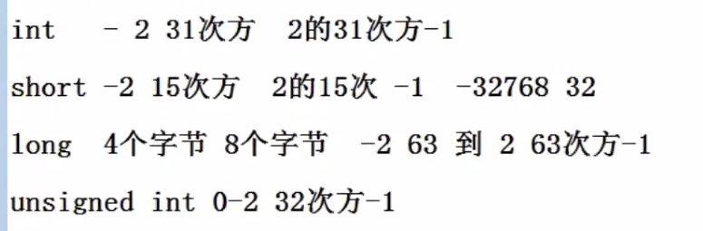
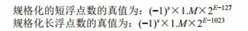
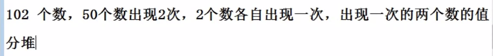
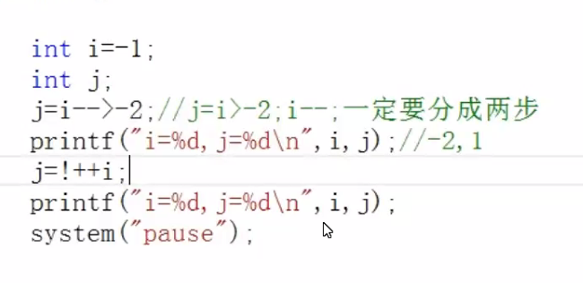

# day04

### Ep01

- ##### 补码   // 二进制加减法的实质是按位取反

  > - 对于有符号整形的编码方式
  > - 对对应的数按位取反再+1
  > - 一个正数最大为2^n
  > - 一个负数最大为-1(全为1的数)，最小为（首位是1剩下都是0）2^-1
  > - 小字节转换到大字节（正数补0 负数补1）  //补到day1 数据类型里
  > - 
  > - 

- ##### 浮点数规范

  > - 以32位浮点数为例（double 为8个字节 15-16个有效位数）
  > - 4个字节 6-7个有效数据
  > - 阶数：存指数的地方（为了运算方便用8位来存阶）
  > - 尾数：决定精度
  >
  > - 在浮点数加减的时候
  >   - 比较E 对阶（对齐小数点）
  >   - E的编码应方便比较大小（所以用8位来存阶）
  >   - 整体都+127
  > - 阶码位变多则范围变大
  > - 尾数变多则精度变大

- ##### char c

  > - \\n  到下一行
  >
  > - \\r  到当前行的行首
  >
  > - \\b 向前退一格
  >
  > - ```c++
  >   char c = 'A';
  >   c += 32;
  >   cout << c; //此时c为小写
  >   ```
  >
  > - 

-  ##### 位操作

  > - <<  左移 => 高位丢弃 低位补0
  >
  >   \>> 右移  => 正数（unsigned）：高位补0 低位丢弃
  >
  >   ​					负数 高位补1 （相当于减1除2）
  >
  > - 异或运算符
  >
  >   - 5，6，7，5，7
  >   - 把所有的数异或 可以找到只出现1次的数
  >
  > - ++/-- 
  >
  >   - 若++在前 则按顺序计算
  >   - 若++在后 则先计算优先级高的  再计算++

### Ep02 预习

- ##### 预习

  > - 位运算
  >   - a &（-a） lowbit算法
  >   - 自增自减 ++ --  前置/后置用法
  >   - 前置先++ 后传值    后置则先传值 后++
  > - 与 %%
  > - 或 ||
  > - 非 ！
  > - 异或（判读两数是否相等）
  > - 条件（？）相当于 if - else
  > - 循环（go to）

### Ep03 运算符

- ##### 按位运算          //有空**再看一遍**

  - 按位与   a&(-a) 直接取到最低位的1
  - 按位或
  - 按位异或
  - 

  - 

  - 异或运算

    - 任何数和自身异或得到0，任何数和0异或得到本身。

    - 满足交换律

       ```c++
      int i = 5,j = 7;
      i = i ^ j; 
      j = i ^ j; //此时 j = i ^ j ^ j=> j = i 
      i = i ^ j; //此时j的值已经是i 那么i ^ j;
      /*
      i = 5 ^ 7;
      j = 5 ^ 7 ^ 7;
      i = 5 ^ 7 ^ 5;
      ```

    - 必须有两个空间

    - 

    - 把所有数字异或起来  

- ##### 赋值运算

  

  - ```c++
    char a;
    while((a = getchar()) != EOF){ //加括号
        putchar(c);
    }
    
    ```

- ##### 条件运算符 ？

  - 相当于 if - else

  - ```c++
    max = a > b ? a : b;
    /*
    相当于 
    if (a>b) {max = a;
    }else {max = b;
    }
    /*
    三个数
    Max = a > ( b > c ? b : c) ? a : (b > c ? b : c);
    ```

- ##### 逗号运算符  // 优先级最低

  - 整体的值是最后的值 

  - ```c++
    a = (b,c);
    //=> a = c;
    ```

- ##### 自增自减

  - 前置 按照优先级进行运算

  - 后置 分解以后再进行运算

    - ```c++
      int main(){
          int i = -1;
          int j;
          j = i++;  // i =  0 j = 0;
          j = ++i;  // i = -1 j = 0; 
          /* 
          j = i++ > -1;  //=> 等价于j = i > -1;i++;
          后++和后--时候需要分步进行
      }
      ```

  - 

    - 此处 i 的值为-1  j 的值为0 （++的优先级和 ！优先级相同  从右至左顺序计算）
    - 函数传参是时候  禁止使用++/--  容易让人抠抠脑壳

  - ```c++
     sizeof  是一个关键字（运算符） 
     strlen() 是一个读取字符串长度的函数 
    ```


# Ep04 选择与循环

- ##### 选择

  > - 优先看 && 之类的短路运算符
  >
  > - 单目运算符高于双目运算符
  >
  > - 算术运算符优先级高于关系运算符
  >
  > - 关系运算符优先级高于逻辑与与逻辑或
  >
  > - if-else （略）、
  >
  > - swicth
  >
  >   - ``` c++
  >     switch(仅限整型和字符型 包括整型表达式){
  >         case(条件):语句;
  >             break;
  >         default:
  >             break;     
  >     }
  >     ```
  >
  >   - 
  >
  >   - d

- ##### 循环

  > - goto 无条件跳转语句
  >
  >   - 类似于汇编中的jmp
  >
  >   - 仅再本函数之间跳转
  >
  >   - ```c++
  >     #include<iostream>
  >     using namespace std;
  >     int main(){
  >         int i = 1;
  >         int sum = 0;
  >         lable:
  >         sum += i;
  >         i++;
  >         if(i<100){
  >             goto lable;
  >         }
  >         
  >         
  >     }
  >     ```
  >
  >   - 程序在卡在scanf时 是可以输入缓冲区的
  >
  >   - 在其他循环中 不会出现可以出现缓冲区
  >
  >   - 

