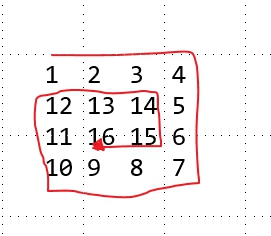

# 提高作业

### 1 给出两个可相乘的矩阵，打印出它们的乘积

- ```c++
  #include<iostream>   //两矩阵相乘
  #include<cstdio>	 //第一个矩阵的列数必须是等于第二个矩阵的行数。
  #include<cmath>		 //相乘的结果具有第一个矩阵的行数和第二个矩阵的列数
  using namespace std;
  int main() {
  	int c1, r1;          //第一个矩阵的行列数
  	int c2, r2;          //第二个矩阵的行列数
  	const int N = 1024;
  	int A[N][N];
  	int	B[N][N];
  	int C[N][N]; //存放矩阵用
  	cin >> r1 >> c1;
  	cin >> r2 >> c2;
  	for (int i = 0; i < r1; i++) {	//输入第一个矩阵
  		for (int j = 0; j < c1; j++) {
  			cin >> A[i][j];
  		}
  	}
  	for (int i = 0; i < r1; i++) {//输入第二个矩阵
  		for (int j = 0; j < c1; j++) {
  			cin >> B[i][j];
  		}
  	}
  	for (int i = 0; i < r1; i++) {     //新矩阵的行等于旧矩阵的列 
  		for (int j = 0; j < c1; j++) { //新矩阵的列等于旧矩阵的行
  			for (int m = 0; m < r1; m++) { //控制矩阵乘法
  				C[i][j] = C[i][j] + A[i][m] * B[m][j];
  			}
  		}
  	}
  	if (c1 != r2) {
  		cout << "Error" << endl;
  	}
  	else {
  		for (int i = 0; i < r1; i++) {     //输出矩阵乘法的值
  			for (int j = 0; j < c1; j++) {
  				cout << C[i][j];
  			}
  			cout << endl;
  		}
  	}
  	return 0;
  }
  ```

- 

### 2 蛇形遍历方阵，输入一个整数，按照图示的方式填充一个n*n的方阵

 

- ```c++
  //实在是想不出来怎么写 把自己的思路写在这里吧。希望老师指正
  //定义上下左右四个方向？如何定义？ (循环两次-1？)
  //先右走到4     (1~4)       4格 	  第一次走满4格
  //然后向7       (4~7)       3格
  //在向左走到10  (7~10)       3格
  //再向上回到12  (10~12)      2格
  //再右走到14    (12~14)      2格
  //向下走到15	(14~15)		1格
  //最后走到16	(15~16)		1格
  // 0的时候出循环？
  ```

- ```c++
  #include<iostream>
  #include<csdtio>
  using namespace std;
  int main()
  {
      int arr[100][100];
  int val=0;
  int n=3;
  for(int m=o,k=m-1;m<=k;++m,--k)
  {
      for(int i=m,j=m;j<=k;++j)
      {
          arr[i][j]=val++;
      }
      for(int i=m+1,j=k;i<=k;++i)
      {
         arr[i][j]=val++;
      }
      for(int i=k,j=k-1;j>=m;--j)
      {
          arr[i][j]=val++;
      }
      for(int i=k-1,j=m;i>=m+1;--i)
      {
          arr[i][j]=val++;
      }
  }
  for(int i=0;i<n;i++)
  {
      for(int j=0;j<n;j++)
      {
          printf("%4d",arr[i][j]);
      }
      cout<<endl;
  }
  }
  ```

- 