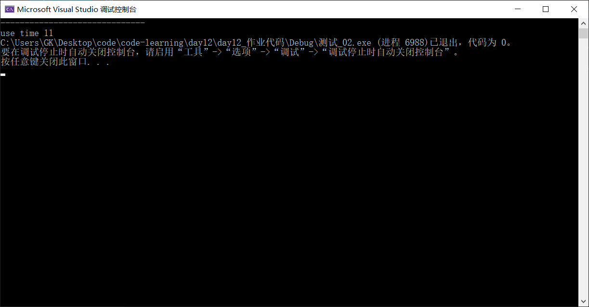

# 测试作业

### 1实现快速排序、选择排序、插入排序、希尔排序和冒泡排序

- 快速排序

  - ```c++
    //递归实现
    //头文件中应包含partition和void quickSort的声明
    //#define N xxxx; 
    //将xxxx换成需要排序的数组长度
    #include"myLibrary"
    int partition(int* arr, int left, int right)
    {
    	int i = left;
    	int k = left;
    	for (i = left; i < right; i++)
    	{
    		if (arr[right] > arr[i])
    		{
    			swap(arr[i], arr[k]);
    			k++;
    		}
    	}
    	swap(arr[k], arr[right]);
    	return k;
    }
    void quickSort(int* arr,int left, int right)
    {
    	int pivot;
        if(left<0||right>=N)
        {
            cout<<"这活我没法接，请输入正确的边界值"<<endl;
            return;
        }  
    	if (left<right) //递归出口
    	{
    		pivot = partition(arr, left, right);
    		quickSort(arr, left,pivot - 1);
    		quickSort(arr, pivot - 1, right);
    	}
    } 
    ```

  - ```c++
    //递归实现 单个函数
    //头文件中应包含void quickSort2的声明
    //#define N xxxx; 
    //将xxxx换成需要排序的数组长度
    #include"myLibrary"
    void quickSort2(int* arr, int left, int right)
    {
    	if (left >= right) return;//递归出口
    	int i, j, temp;
    	i = left;
    	j = right;
    	int pivot = arr[i];
    	while (i < j) 	//左右哨兵握手时候退出循环
    	{
    		while (i < j && arr[j] >= pivot)
    		{
    			j--;
    		}
    		while (i < j && arr[i] <= pivot)
    		{
    			i++;
    		}
    		if (i < j) //swap函数
    		{
    			temp = arr[i];
    			arr[i] = arr[j];
    			arr[j] = temp;
    		}
    	}
    	//重置哨兵值
  	arr[left] = arr[i];
    	arr[i] = pivot;
    	quickSort2( arr, left, i - 1);
    	quickSort2( arr,i-1, right);
    }
    
    
    ```
    
  - 

- 选择排序

  - ```c++
    //头文件中应包含selectSort的声明
    //剩余同上
    #include"myLibrary"
    void selectSort(int *Arr)
    {
        int Maxpots;
        for(int i=0;i<N-1;i++)
        {
            Minpots=i; //每次循环重置Maxpots的值
            for(int j=1;j<i;j++)
            {
                if(Arr[Minpots]>Arr[j])
                {
                    Minpots=j;
                }
                swap(Arr[i-1],Arr[Minpots]);
            }
        }
    }
    ```

- 插入排序

  - ```c++
    //头文件中应包含inSert的声明
    //剩余同上
    #include"myLibrary"
    void inSert(int* arr)
    {
    	int inSertValue = 0;
    	int j;
    	for (int i = 0; i < N; i++)
    	{
    		insertValue = arr[i];
    		for (j = i - 1; j >= 0; j--)
    		{
    			if (arr[j] > insertValue)
    			{
    				arr[j + 1] = arr[j];
    			}
    			else
    			{
    				break;
    			}
    		}
    		arr[j + 1] = insertValue; 
            //在找到插入位置之后再放入insertValue的值
    	}
    }
    ```

- 希尔排序

  - ```c++
    //头文件中应包含shellSort的声明
    //剩余同上
    #include"myLibrary"
    void shellSort(int* arr)
    {
    	int i, j, insertValue, gap;
    	for (gap = N >> 1; gap > 0; gap >>= 1)
    	{
    		for (int i = gap; i < N; i++)
    		{
    			insertValue = arr[i];
    			for (j = i - gap; j >= 0; j-=gap)
    			{
    				if (arr[j] > insertValue)
    				{
    					arr[j + gap] = arr[j];
    				}
    				else
    				{
    					break;
    				}
    			}
    			arr[j + gap] = insertValue; 
                //在找到插入位置之后再放入insertValue的值
    		}
        }
    }
    ```

- 冒泡排序

  - ```c++
    //头文件中应包含bubbleSort的声明
    //剩余同上
    #include"myLibrary"
    void bubbleSort(int *Arr)
    {
        for(int i=0;i<=N;i++)
        {
            for(int j=0;j<N-i;j++)
            {
                if(Arr[i]>Arr[i+1])
                {
                    swap(Arr[i],Arr[i+1]);
                }     
            }      
        }
    } //天都黑了啥时候冒好啊啊啊啊啊啊啊啊
    ```

  - 

### 


2排序2000万个数字（数字范围0~100000），比较希尔排序、快速排序和qsort的时间差异

- 快速排序：

- 希尔排序
- - 

- qsort

- - 

  

  

- 主函数
	
	- ```c++
	  #include"myLIbrary.h"
	  int compare(const void* p1, const void* p2);
	  int main()
	  {
	  	
	  	int* Arr = (int*)malloc(N * sizeof(int));
	  	srand(time_t(NULL));
	  	time_t start, end;
	  	for (int i = 0; i < N; i++)
	  	{
	  		Arr[i] = rand();
	  		//cout << Arr[i] << " ";
	  	}
	  	//cout << endl;
	  	cout << "------------------------------" << endl;
	  	start = time(NULL);
	  	//qsort(Arr, N, sizeof(int), compare);
	  	//shellSort(Arr);
	  	//selectSort(Arr); //我睡着了 真的
	  	quickSort(Arr, 0, N - 1);
	  	//quickSort2(Arr, 0, N - 1); //待定 调试信息：引发了异常: 读取访问权限冲突。
	  	end = time(NULL);
	  	printf("use time %d", (int)end - (int)start); 
	  	return 0;
	  }
	  int compare(const void* left, const void* right)
	  {
	  	int* p1 = (int*)left;
	  	int* p2 = (int*)right;
	  	return *p1 - *p2;
	  }
	  
	  ```

- 头文件

  - ```c++
    #define _CRT_SECURE_NO_WARNINGS
    #include<iostream>
    #include<cstdio>
    #include<cmath>
    #include<cstdlib>
    #include<string>
    #include <time.h>
    constexpr auto N = 20000000;
    using namespace std;
    void shellSort(int* arr);
    int partition(int* arr, int left, int right);
    void quickSort(int* arr, int left, int right);
    void quickSort2(int* arr, int left, int right);
    void selectSort(int* Arr);
    ```

- sort.cpp

  - ```c++
    #include "myLIbrary.h"
    void shellSort(int* arr)
    {
    	int i, j, insertValue, gap;
    	for (gap = N >> 1; gap > 0; gap >>= 1)
    	{
    		for (int i = gap; i < N; i++)
    		{
    			insertValue = arr[i];
    			for (j = i - gap; j >= 0; j -= gap)
    			{
    				if (arr[j] > insertValue)
    				{
    					arr[j + gap] = arr[j];
    				}
    				else
    				{
    					break;
    				}
    			}
    			arr[j + gap] = insertValue;
    			//在找到插入位置之后再放入insertValue的值
    		}
    	}
    }
    void selectSort(int* Arr)
    {
    	int Minpots;
    	for (int i = 0; i < N - 1; i++)
    	{
    		Minpots = i; //每次循环重置Maxpots的值
    		for (int j = 1; j < i; j++)
    		{
    			if (Arr[Minpots] > Arr[j])
    			{
    				Minpots = j;
    			}
    			swap(Arr[i - 1], Arr[Minpots]);
    		}
    	}
    }
    int partition(int* arr, int left, int right)
    {
    	int i = left;
    	int k = left;
    	for (i = left; i < right; i++)
    	{
    		if (arr[right] > arr[i])
    		{
    			swap(arr[i], arr[k]);
    			k++;
    		}
    	}
    	swap(arr[k], arr[right]);
    	return k;
    }
    void quickSort(int* arr, int left, int right)
    {
    	int pivot;
    	if (left < 0 || right >= N)
    	{
    		cout << "这活我没法接，请输入正确的边界值" << endl;
    		return;
    	}
    	if (left < right) //递归出口
    	{
    		pivot = partition(arr, left, right);
    		quickSort(arr, left, pivot - 1);
    		quickSort(arr, pivot - 1, right);
    	}
    }
    //void quickSort2(int* arr, int left, int right)
    //{
    //	if (left >= right) return;//递归出口
    //	int i, j, temp;
    //	i = left;
    //	j = right;
    //	int pivot;
    //	pivot = arr[left];
    //	while (i < j) 	//左右哨兵握手时候退出循环
    //	{
    //		while (i < j && arr[j] >= pivot)
    //		{
    //			j--;
    //		}
    //		while (i < j && arr[i] <= pivot)
    //		{
    //			i++;
    //		}
    //		if (i < j) //swap函数
    //		{
    //			temp = arr[i];
    //			arr[i] = arr[j];
    //			arr[j] = temp;
    //		}
    //	}
    //	//重置哨兵值
    //	arr[left] = arr[i];
    //	arr[i] = pivot;
    //	quickSort2( arr, left, i - 1);
    //	quickSort2( arr,i-1, right);
    //}
    //
    
    ```

  - 