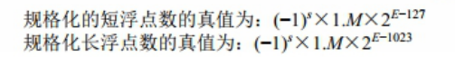

# Week 01 笔记

[TOC]


# day1 开营仪式 && 第一节课

### Ep01  开营仪式

+ 

  ##### 课程安排

  >- C语言基础 3 week
  >
  >- Linux操作系统 4 week
  >
  >- 网盘项目  1 week
  >
  >- C++ 基础  4 week
  >
  >- C++ 提高  1week
  >
  >- C++ 项目  2week

+ #####  当前特殊阶段课程安排

  > - 周一周二  &&  周四周五  3录播+1讲课 （原理+复习+作业）
  > - 周三 周六  2节课 1录播+1讲课 （整理笔记）

+ ##### 方向

  > **走一个方向，不要更换**
  >
  > 1. 游戏后端
  > 2. 服务器
  > 3. 安防
  > 4. 大数据
  > 5. ~~算法~~（研究生起步）

+ ##### 学习要求

  >1. 按时打卡
  >2. 预习 && 复习
  >3. 踏实学习 
  >4. 保持激情和态度
  >5. 按时作业
  >6. 不要熬夜补作业
  >7. 学习习惯

### Ep02  C语言从入门到脱发     //基础部分

+ ##### 写在前面→学习方法

  >- 记录笔记 截图 保持听课注意力
  >
  >- 抛弃幻想 踏实学习
  >
  >- 预习 复习 笔记
  >
  > - 预习：做好课堂效率
  >
  > - 复习：课上看老师的代码→自己笔记→小组（讲义）→作业
  >
  >   - 看录播 && 定期整理笔记

- ##### git使用：

  > - gitee管理代码：先pull在push
  >
  > - 遇事不决，删光克隆。
  >
  > - ~~说得好我选择用GitHub~~
  >
  > - ~~地铁站都比我努力~~
  >
  >   

+ ##### C阶段大纲：2/10 低难度但是很重要

  >- 变量 （数据类型 内存布局）运算符
  >
  >- 条件  循环
  >
  >- 数组  指针（偏移 转移）
  >
  >- 函数 （递归） 作用域
  >- 结构体  链表（初探数据结构）
  >
  >- 基本数据结构：栈 队列 二叉树
  >
  >- 排序[^1]和查找[^2]
  >
  >- **高级数据结构**：红黑树
  >
  >- 文件操作
  >
  >- 项目：学生管理系统  **IDE**

-   ##### C阶段学习要求

    >- 理解程序的执行过程：实质是内存变化的过程。
    >
    >- 使用程序调试 [^3]

+ ##### Linux部分： 5/10

  > - 计算机组成
  >
  >   - 硬件
  >
  >     > - cpu内存 
  >     > - IO设备
  >
  >   - 软件
  >
  >     - 系统软件
  >
  >       > - 操作系统：硬件设备在软件设备的映射
  >       > - 编译器
  >       > - 数据库
  >
  >     - 应用软件
  >
  > - 内容
  >
  >   - 内存管理
  >
  >     > 
  >
  >   - 文件系统
  >
  >     > 
  >
  >   - 网络编程
  >
  >     > .
  >
  > - 操作Linux系统
  >
  >   > - sheell 命令行
  >   >
  >   > - vim文本编辑器
  >   >
  >   > - gcc编译工具链
  >   >
  >   >   > 1. 静态库
  >   >   > 2. 动态库
  >   >   > 3. makefile工程编辑器
  >   >   > 4. gbd编辑器 
  >
  > - 文件操作 
  >
  >   - 即时聊天（IO多路复用）
  >
  > - 进程
  >
  >   > - 创建 
  >   > - 退出 
  >   > - 资源回收
  >
  > - 进程管理
  >
  >   > - 孤儿进程
  >   > - 守护进程
  >
  > - 进程间通信
  >
  >   > - 管道
  >   > - 共享内存
  >   > - 信号量
  >   > - 消息队列
  >   > - 信号
  >
  > - 线程 
  >
  >   > - 多线程
  >   > - 同步和互斥（处理并发）
  >   > - 线程安全
  >   > - 线程的取消和资源清理

+ ##### Linux进阶 网络编程

  > - 网络编程socket TCP/IP
  >
  > - 服务器框架
  >
  >   > - 池： 一次创建多次使用
  >   > - 进程池
  >   > - 线程池
  >
  > - 数据库Mysql 
  >
  >   - B-树  && B+树
  >
  > - 五种编程模型
  >
  >   - 处理多个文件的读写 不同思路
  >
  > - 性能优化和负载均衡
  >
  > - http服务器
  >
  > - 单元测试
  >
  > - 内存泄漏检测工作
  >
  > - 实战项目：百度网盘

- ##### C++    10/10

  [^1]: 冒泡\\选择\\插入\\希尔\\快排\\堆\\归并\\计数
[^2]: 二分查找 哈希查找
  [^3]: 断点/单步调试/日志文件
  
  

# day02

### Ep01 git使用 （VS部分）

- 先拉取再提交

- ~~rm -rf从删库到跑路~~

### Ep02课前预习

- ##### 变量

  > - 数据类型
  > - 整型型
  > - 浮点型
  > - 字符型
  > - 变量的名字

- ##### 常量

  > - 字面值常量：宏定义（使用方式）
  >
  > - C语言没有const int 类型
  >
  > - 内存布局（计组相关？）
  >
  > - 进制转换（详细）
  >
  > - 补码（负数）：按位取反+1
  >
  > - 大端法和小端法：在多于一个字节数据中的排序问题
  >
  > - 浮点型编码：IEEE754规范
  >
  > - 字符型编码：特殊的整型 ASCⅡ码
  >
  > - 编译过程

### Ep03 编译过程

- ##### 调试办法：设置断点 || 用F10单步调试(VS逐语句)  ||  F11进入函数||逐过程调试

- ##### 静态语言

  > - C C++ Java go 

- ##### 区别编译错误

  > - error双击时会直接跳转到错误行，链接错误不会。
  >
  > - 链接错误：看对应的函数符号，函数符号写错了。

- ##### 一个项目可有多个main.c

- ##### main.c----->main.obj（完成编译 待链接）---->main.exe(可运行)

- ##### 代码----> 编译---->链接--->运行

- ##### 程序运行

  > - 进程的地址空间
  >
  > |        |              |
  > | :----: | :----------: |
  > | 栈空间 | 变量存放空间 |
  > | 代码段 |   代码空间   |
  >
  > dd

### Ep04 数据类型运算符和表达式

- ##### 数据类型

  > - 基本型
  >
  >   > - 整型 `int`
  >   > - 字符型 `char`
  >   > - 实数型（浮点型） ·`float`  &&`double`
  >
  > - 构造类型
  >
  >   > - 数组类型   `X[]` 数组
  >   > - 结构类型   `struct`  结构体
  >   > - 联合类型    `union`
  >   > - 枚举类型    `enum`
  >
  > - 指针类型
  >
  > - 空类型 `void`

- ##### 常量

  > - 整型
  >
  > - 实型
  >
  > - 字符型
  >
  > - 字符串
  >
  > - ```c++
  >   #include<stdio.h>
  >   #define SUN 4+3
  >   int main()
  >   {
  >       int i = SUN * 2;  //本质是将上的宏定义公式替换
  >       cout << i<<endl;  // 4 + 3*2 
  >   }
  >   ```
  >
  > - 进制转换 辗转相除法

- ##### 变量

  > - 可以被改变的量

- ##### 命名方法

  > - 仅能用字母数字下划线
  > - 首字符不能是数字
  > - 区分大小写  注意命名规范

- ##### 内存布局

  > - 进制转换（详细）
  >
  > - 进制赋值（整理 在pdf中）
  >
  >   > - 赋值8进制：  0开头
  >   > - 赋值16进制：0x开头
  >
  > - 进制转换（整理 在pdf中）

- ##### 补码（负数）

  >- 原理：cpu只能做加法 负数用补码实现
  >- 负数为补码存储 为正数的取反加一
  >- e.g.   5=>0000 0101
  >  -   -5=>1111 1011
  >- 有符号和无符号（整理 在pdf中）
  >- 最高位来代表正负（符号位）

- ##### 有符号和无符号 

  > - int  -2^31 ~2^31-1
  > - unsigned int  （0~2^31-1）

- ##### 大端法和小端法

  > - 仅整型/浮点型存在大小端问题
  > - 高位在前就是大端，低位在前就是小端
  > - 无优劣 知道排序即可

- ##### 浮点型编码（整理 在pdf中）计算花时间

  > - 不可用==来判断  会出现转换值出错的现象
  >
  > - 字符型编码

### Ep04

- 数据类型

  > - 浮点型（在部分输出情况时会出现精度丢失）
  >
  > ```c++
  > #include<iostream>
  > int main(){
  > 	float a = 1.23456789e10;
  > 	//此处会造成精度丢失 应用double
  > 	b = a+20;
  > 	cout<<"a ="<< a << "b = "<<b<<endl；
  > 	return 0;
  > }
  > ```
  >
  > - 字符型 ：ASCⅡ表 0~127
  >
  >   > - 部分符号&&字符 
  >   >
  >   > - 大写~小写差32 
  >   >
  >   >   - 比如 大写的A为65 小写的a为97
  >   >
  >   >   - 转义字符
  >   >
  >   >     - \n	换行（C++ 用endl）
  >   >
  >   >     - \t	横向跳格
  >   >
  >   >     - \r	回车
  >   >
  >   >     - \\\	反斜杠
  >   >
  >   >     - \b	退格
  >   >
  >   >     - \0	空字符 区别 空类型（void）
  >   >
  >   >     - \ddd
  >
  > - 字符数组
  >
  >   - 需要多一个来塞结束符  

- 混合运算

  > - 短字节->长字节	不需要强制类型转换
  >
  > - 长字节->短字节	需要强制类型转换
  >
  > - 数值按照int运算
  >
  > - 移位运算符
  >
  > > - 数值在运算时候为四个字节运算
  > >
  > >   ```C++
  > >    char a,b,c;          0x93 二进制为 1001 0011 0x93
  > >   b = 0x93;                   左移为 0010 0110 0x26
  > >    	   //c = b <<1>>1;此时c为0x93   右移为 0001 0011 0x13
  > >     	   a = b<<1; //此时a为0x26
  > >    c = a>>1; //此时c0x13
  > >   ```
  >
  > - 防止运算时数值溢出：在计算之前进行强制类型转换
  > - 在混合多种数据时：等号两边的类型要自己用强制类型转换


# day 03

### Ep01 一些运算符

- ##### 缓冲区

  - 标准输入缓冲区 stdin 使用行缓冲的方式存储输入。
    - 用户的输入数据首先被暂存在临时缓冲区中，当用户键入回车键或临时缓冲区满后，stdin 才进行 I/O 操作，将数据由临时缓冲区拷贝至 stdin 中。C语言提供的输入输出函数如 scanf 、getchar 等则从上述缓冲区 stdin 中读取数据输入。

  - scanf 和 getchar 等函数会在 stdin 中读取数据，若上述缓冲区中已存在数据，则直接读取其中的数据，若上述缓冲区为空，则上述函数会挂起，等待数据缓冲的完成( 用户输入回车键或数据缓冲区满后， stdin 会进行数据缓冲，之后上述函数才能继续执行)。 
  - 用户一次输入的数据可能会超过 scanf 、getchar 等函数调用所需要的数据，那么所需数据被读取后，剩余的数据仍会存放在缓冲区中，之后的函数调用会直接读取 stdin 中已有的数据。只有当缓冲区为空后，scanf 等函数才会等待用户输入(实际应该是等待 stdin 的缓冲）。

- ##### 循环读取

  > - 在用%c读取时不会遗漏任何字符，包括\n

- ##### 在多类型混合输入时 scanf

  > - 通过scanf的返回值来判断匹配成功与否
  > - double需要用lf读取
  > - 在字符之前需要加空格

- ##### getchar（）~~getling()~~      快速读取一个字符 [^1]

  > - gerchar()读取
  > - putchar()

- ##### 将整数按照字符输出（较重要）

  > - 通过scanf读取 转换成字符串
  >
  > -  通过取余 得到位数
  >
  > - ```c++
  >   #include<iostream>
  >   int main(){
  >       int i,remainder;
  >       scanf_s("%d",&i);
  >       while(i){//不断取余 得到各个位数
  >          remainder = i%10;//用数字加上48用%c输出字符值
  >          printf("%c",remainder+48);
  >          i = i / 10
  >       }
  >       return 0;
  >   }
  >   ```
  >
  > - 不用第三个变量转换a和b的值
  >
  >   ```c++
  >   a = 10,b = 5;
  >   a = a + b; //a = (a + b) = 15
  >   b = a - b; //b = (a + b) - b =>a = 10 
  >   a = a - b; //a = (a + b) - a = 5
  >   ```
  >
  >   - ~~醒醒  溢出了~~
  >
  > - 比较分数的大小（数学问题）
  >
  >   > - e.g. 12/85  30/107 比较大小
  >   > - 12 * 107 - 85 * 30 <0 所以12/85 小于 30/107 

- ##### 关系运算符

  > - 关系运算符的优先级低于算术运算符。
  >
  > - < > = 略
  >
  > - ？ 相当于if-else语句
  >
  > - ```c++
  >   int a,b,c;
  >   c = a > b ? a:b;
  >   //等价于
  >   if(a>b) c = a;
  >   else c = b;
  >   ```
  >
  > - 

- ##### 短路运算

  > - ```c++
  >   j = 1;
  >   j == 0&&printf(xxxxx);//短路运算
  >   j == 1 || (i = j); //此处括号不运行 短路操作 i不会被执行
  >   cout << i <<endl;
  >   ```
  >
  >   

- ##### 位运算：左移，右移，按位取反，按位或，**按位异或**，按位与

  > - 左移：
  >
  >   - ```c++
  >     int i;
  >      	whlie(scanf(""%d",&i) !=EOF){
  >             i>>1;
  >             cout << i <<endl;
  >             }
  >     /*               
  >     ```
  >
  > - 右移：低位丢弃  高位补1
  >
  >   - 右移正数的时候 除2 负数的时候 减一除2
  >   - -1永远不会移成0 因为-1为
  >   - 1111111111   移动不影响值
  >   - 无符号数右移时，高位补0  低位丢弃
  >
  > - 

- ##### 字节换算

  > - 1字节 = 8位   1byte = 8 bit
  > - 1 KB = 1024字节
  > - 1 MB = 1024KB
  > - blablabla

- 

[^1]: getchar 补充

# day04

### Ep01

- ##### 补码   // 二进制加减法的实质是按位取反

  > - 对于有符号整形的编码方式
  > - 对对应的数按位取反再+1
  > - 一个正数最大为2^n
  > - 一个负数最大为-1(全为1的数)，最小为（首位是1剩下都是0）2^-1
  > - 小字节转换到大字节（正数补0 负数补1）  //补到day1 数据类型里
  > - 
  > - 

- ##### 浮点数规范

  > - 以32位浮点数为例（double 为8个字节 15-16个有效位数）
  > - 4个字节 6-7个有效数据
  > - 阶数：存指数的地方（为了运算方便用8位来存阶）
  > - 尾数：决定精度
  >
  > - 在浮点数加减的时候
  >   - 比较E 对阶（对齐小数点）
  >   - E的编码应方便比较大小（所以用8位来存阶）
  >   - 整体都+127
  > - 阶码位变多则范围变大
  > - 尾数变多则精度变大

- ##### char c

  > - \\n  到下一行
  >
  > - \\r  到当前行的行首
  >
  > - \\b 向前退一格
  >
  > - ```c++
  >   char c = 'A';
  >   c += 32;
  >   cout << c; //此时c为小写
  >   ```
  >
  > - 

-  ##### 位操作

   > - <<  左移 => 高位丢弃 低位补0
   >
   >   \>> 右移  => 正数（unsigned）：高位补0 低位丢弃
   >
   >   ​					负数 高位补1 （相当于减1除2）
   >
   > - 异或运算符
   >
   >   - 5，6，7，5，7
   >   - 把所有的数异或 可以找到只出现1次的数
   >
   > - ++/-- 
   >
   >   - 若++在前 则按顺序计算
   >   - 若++在后 则先计算优先级高的  再计算++

### Ep02 预习

- ##### 预习

  > - 位运算
  >   - a &（-a） lowbit算法
  >   - 自增自减 ++ --  前置/后置用法
  >   - 前置先++ 后传值    后置则先传值 后++
  > - 与 %%
  > - 或 ||
  > - 非 ！
  > - 异或（判读两数是否相等）
  > - 条件（？）相当于 if - else
  > - 循环（go to）

### Ep03 运算符

- ##### 按位运算          //有空**再看一遍**

  - 按位与   a&(-a) 直接取到最低位的1

  - 按位或

  - 按位异或

  - 

  - 

  - 异或运算

    - 任何数和自身异或得到0，任何数和0异或得到本身。

    - 满足交换律

      ```c++
      int i = 5,j = 7;
      i = i ^ j; 
      j = i ^ j; //此时 j = i ^ j ^ j=> j = i 
      i = i ^ j; //此时j的值已经是i 那么i ^ j;
      /*
      i = 5 ^ 7;
      j = 5 ^ 7 ^ 7;
      i = 5 ^ 7 ^ 5;
      ```

    - 必须有两个空间

    - 

    - 把所有数字异或起来  

- ##### 赋值运算

  

  - ```c++
    char a;
    while((a = getchar()) != EOF){ //加括号
        putchar(c);
    }
    
    ```

- ##### 条件运算符 ？

  - 相当于 if - else

  - ```c++
    max = a > b ? a : b;
    /*
    相当于 
    if (a>b) {max = a;
    }else {max = b;
    }
    /*
    三个数
    Max = a > ( b > c ? b : c) ? a : (b > c ? b : c);
    ```

- ##### 逗号运算符  // 优先级最低

  - 整体的值是最后的值 

  - ```c++
    a = (b,c);
    //=> a = c;
    ```

- ##### 自增自减

  - 前置 按照优先级进行运算

  - 后置 分解以后再进行运算

    - ```c++
      int main(){
          int i = -1;
          int j;
          j = i++;  // i =  0 j = 0;
          j = ++i;  // i = -1 j = 0; 
          /* 
          j = i++ > -1;  //=> 等价于j = i > -1;i++;
          后++和后--时候需要分步进行
      }
      ```

  - 

    - 此处 i 的值为-1  j 的值为0 （++的优先级和 ！优先级相同  从右至左顺序计算）
    - 函数传参是时候  禁止使用++/--  容易让人抠抠脑壳

  - ```c++
    sizeof  是一个关键字（运算符） 
    strlen() 是一个读取字符串长度的函数 
    ```


# Ep04 选择与循环

- ##### 选择

  > - 优先看 && 之类的短路运算符
  >
  > - 单目运算符高于双目运算符
  >
  > - 算术运算符优先级高于关系运算符
  >
  > - 关系运算符优先级高于逻辑与与逻辑或
  >
  > - if-else （略）、
  >
  > - swicth
  >
  >   - ``` c++
  >     switch(仅限整型和字符型 包括整型表达式){
  >         case(条件):语句;
  >             break;
  >         default:
  >             break;     
  >     }
  >     ```
  >
  >   - 
  >
  >   - d

- ##### 循环

  > - goto 无条件跳转语句
  >
  >   - 类似于汇编中的jmp
  >
  >   - 仅再本函数之间跳转
  >
  >   - ```c++
  >     #include<iostream>
  >     using namespace std;
  >     int main(){
  >         int i = 1;
  >         int sum = 0;
  >         lable:
  >         sum += i;
  >         i++;
  >         if(i<100){
  >             goto lable;
  >         }
  >         
  >         
  >     }
  >     ```
  >
  >   - 程序在卡在scanf时 是可以输入缓冲区的
  >
  >   - 在其他循环中 不会出现可以出现缓冲区
  >

# day05

### Ep01 预习

- ##### C是面向内存的语言

- ##### 数据类型（深入）

  > - 计算机构成
  >
  >   > - 内存
  >   >
  >   > - |      **内核**      |
  >   >   | :----------------: |
  >   >   |   **栈**（函数）   |
  >   >   | **堆**（动态申请） |
  >   >   |     **数据段**     |
  >   >   |     **代码段**     |
  >   >
  >   >   
  >
  > - 数据类型的实质
  >
  >   > - 内存空间有多大
  >   >
  >   > - 如何解释这段内存中的0/1
  >   >
  >   > - e.g.： 同一份内存空间同解释
  >   >
  >   >   - int类型
  >   >
  >   >   - 占4个字节（32位） 
  >   >
  >   >   - 用补码存储负数
  >   >
  >   >     
  >   >
  >   >   - unsigned int
  >   >
  >   >   - 占4个字节（32位） 
  >   >
  >   >   - 用原码储存（只有正数）
  >   >
  >   >   - ```c++
  >   >     usgigned int u = 0xffffffff
  >   >     printf("unsigned int = %u, int = %d\n",u,u);
  >   >     //结果为 unsigned int = 4294697295 , int = -1
  >   >     ```
  >   >
  >   > - 

- ##### 运算符

- ##### 条件结构、

- ##### 循环 （while&&do-while&&for&&goto）

  - 理解
  - whlie循环的含义：先满足条件就执行
  - do-while 先执行，再进行判断

- ##### 数组

  - 连续存放相同数据类型的定长集合
  - 申请数组时，分配空间在栈里（~~容易溢出~~）

- ##### 数组的一些问题

  - 在C里不检查数组越界
  - 拷贝时候只拷贝首地址（数组指针）
  - 数组的数组
    - 二维数组

### Ep02 循环

-  ##### while 

   - 死循环 

   > - while循环内没有使条件趋近于假的语句
   > - 不能在while循环后加分号

- ##### do-while

  > - 先进行循环体，再进行判断
  > - 一定要在while循环后加分号

- ##### for

  > - for(表达式1；表达式2；表达式3)
  >
  >   - 先计算1
  >   - 后判断2 为真则执行循环
  >   - 再计算表达式3
  >
  > - 所有语句都可省略 但是要在循环体内加上判断语句和递增语句
  >
  > - for括号后面加分号，会造成计算错误
  >
  >   //continue 本次循环，

- ##### continue

  > - 需要跳过某条件时 
  >   - 跳出**当次循环**1
  >   - continue后面的语句本次循环不再执行
  > - 当continue使用于while和do while循环时，注意不要跳过让循环趋近于假的语句。

### Ep03 数组（重点）

- ##### 一维数组的内存原理及使用

  > - 定义和使用
  >
  >   - 需要先初始化
  >
  >   - 有相同数据类型
  >   - 定长
  >   - C中无动态数组
  >   - 不能用变量定义数组大小
  >   - 数组下标从0开始
  >
  > - ```c++
  >   #define N 5
  >   int main ()
  >   int arr[N]={1,2,3,4,5};//4*5个字节
  >   //在内存当中连续储存
  >   ```
  >
  > - 访问越界
  >
  >   - stack around arr  栈使用访问越界
  >   - stack over flow  栈溢出
  >
  > - scanf和字符数组
  >
  >   - scanf 不能够检测字符数组输入长度 容易造成访问越界
  >
  > - 函数和数组
  >
  >   - 在传入数组的值的时候，不能同时传入数组长度 //本质是传指针进去。
  >   - 相当于函数也调用了原来的内存空间

- ##### 二维数组的原理及使用

  > - 数组【a】【b】
  >
  > - 数组的数组  sizeof之后为为a*b
  >
  > - 
  >
  > - 内存中也行线性储存的
  >
  > - ```c++
  >   int main() .
  >   int a[3][4]={1,3,5,7,2,4,6,8,9, 11, 1
  >   int b[4]={1,2,3, 4};
  >   int c[3][4]={{1}, {5, 9}};//可只对部分元素初始化
  >   printf(" a[2] [3]=%d\n", a[2][3]);
  >   return 0;
  >   }
  >   
  >   ```
  >
  > - 数组指针：
  >
  >   

- ##### 字符数组使用方法

  > - 存储字符串
  >
  > - 
  >
  > - scanf 读入的时候 
  >
  >   - 不需要取地址符（数组名就是数组的地址，不需要取地址的地址）
  >   - %s时 空格结束
  >
  > - gets和puts //容易访问越界
  >
  >   - 类似于C++的getline？
  >
  >   - ```c++
  >     int main(){
  >     	char c[50];
  >         get(c); //全按照字符型读入
  >         printf("%s\n",c); //等价于puts（c）
  >     }
  >     
  >     ```
  >
  >   - ```c++
  >     //连续读入字符串
  >     int main(){
  >     	char c[50];
  >         whlie(get(c)!=NULL){
  >             puts(c);
  >         }
  >         printf("%s\n",c); //等价于puts（c）
  >     }
  >     ```
  >
  > - fgets //会将 \n强制存进数组
  >
  >   - fgets（字符数组名,长度,stdin）
  >
  >   - ```c++
  >     int main(){
  >     	char c[50];
  >         fgets(C,sizeof(c),stdin)
  >         printf("%s\n",c); //等价于puts（c）
  >     }
  >     
  >     ```
  >
  >   - 

- ##### str等字符串系列函数的使用

  > - 
  >
  > - srtlen( ) //求长度
  >
  >   - ```c++
  >     int main(){
  >         char c[50];
  >         size_t len;
  >         while(fgets(c,sizeof(c),stdin)!=NULL){
  >         c[strlen(c)-1]=0;
  >         put(c);
  >         len = strlen(c);
  >         printf("%d\n",len);
  >         }
  >     }
  >     ```
  >
  > - strcopy（） 复制函数
  >
  >   - strcopy（目标，模板）； 模板  => 目标
  >   - 允许带空格的复制=，


# day 06

### Ep01 预习

- ##### 数组&&指针


### Ep02 数组Ⅱ

- ##### str等字符串系列函数的使用

  > - srtcpy复制函数
  >
  >   - strcpy(char *to, char *from)； from  => to
  >
  >   - 允许带空格的复制
  >
  >   - 容易造成访问越界 
  >
  >   - ```c++
  >     void myStrcopy(char to[],char from[]){
  >       int i = 0;
  >       while(from[i]){		//读到\0结束
  >           to[i]=from[i];
  >           i++;
  >       }
  >     to[i]=from[i]; //最后一次放\0
  >     }
  >     ```
  >
  > - strcmp 比较函数
  >
  >   - strcom(str1,str2)： 比较str1和str2的长度
  >
  >   - 返回值
  >
  >     |    less thyn 0     |    str1 is less than str2     |
  >     | :----------------: | :---------------------------: |
  >     |   **equal to 0**   |   **str1 is equal to str2**   |
  >     | **greater than 0** | **str1 is greater than str2** |
  >
  > - strcat 拼接函数
  >
  >   - strcat(str1,str2) ：将str1接到str2上
  >   - 拼到末尾强行会有结束符。
  >
  > - strn系列
  >
  >   - 只想复制/比较/拼接一部分的时候
  >
  >   - 可以手动控制
  >
  >   - 如果超出了规定长度  不会添加结束符
  >
  >   - 需要清空缓存区
  >
  >     - 用memset清空
  >     - memset（d,0,sizeof(d)）; 内存设置接口
  >     - 把d开始接下来sizeof(d)长度的字节都变成0
  >
  >   - srtncpy
  >
  >     > - srtncpy(char *to, const, char *from)
  >     >
  >     > - 将字符串from中至多count个字符复制到字符串to中。如果字符串from的
  >     >   长度小于count,其余部分用\0'填补。返回处理完成的字符串。
  >     >
  >     > - ```c++
  >     >   While(gets(c)!=NULL){
  >     >       memset（d,0,sizeof(d)）;
  >     >       strncpy(d,c,7);
  >     >       puts(d);      
  >     >   }
  >     >   ```
  >     >
  >     > - 
  >
  >   - strncmp
  >
  >     > - int strncmp( const char *str1, const char *str2, size_ t count ); 
  >     > - 功能:比较字符串str1和str2 中至多count个字符。
  >     > - 返回值和strcmp相同
  >
  >   - strncat
  >
  >     > - char *strncat( char *str1, const char *str2, size_tcount );
  >     > - 将字符串from中至多count个字符连接到字符串to中.会追加结束符
  >
  > - momcpy
  >
  >   > - strcpy不能用于整型数组
  >   >
  >   > - ```c++
  >   >   int main(){
  >   >       int a[5] = {1,2,3,4,5};
  >   >       int b[5];
  >   >       strcpy(b,a);//报错遇到\0会直接结束拷贝。在整数型中存在值等于\0的值(即整数0)
  >   >       memcpy（b,a,sizeof(a)）;// 可拷贝
  >   >       
  >   >   }
  >   >   ```

### Ep02 指针

- ##### 写在前面 数组的复习：

  > - 一维数组 需要初始化，
  >
  >   - int a[5]  sizeof (a) 20字节
  >   - 注意访问越界
  >
  > - 二维数组 int b [3] [4]
  >
  >   - sizeof (b) 48
  >   - sizeof (b[0])   16个字节 
  >   - sizeof (b[0] [1])   4个字节 
  >
  > - 数组在传递的时候  需要传递长度
  >
  > - 
  >
  > - 字符数组
  >
  >   - 在传递函数的时候仅传首地址（数组名）
  >
  >   - ```c++
  >     char c[10] = "hello";
  >     sizeof(c) = 10;
  >     change(c) = 4;
  >     void change(char []){
  >         sizeof (c); 
  >     }
  >     ```
  >
  >   - 

- ##### 指针

  - 指针的本质 ：间接访问

    - 直接访问和间接访问

    - ```c++
      int main(){
          int i=3;
          int *ipointer;
          printf("%d\n",i); //直接访问
          //我是断点 此处取地址 是一个四个字节的
          iPointer=&i;	//初始化 将指针指向i的地址
          printf("%d\n",*ipointer); //间接访问
      }
      ```

  - 取地址和取值操作符

    - 取地址 &  也叫引用通过该操作符我们可以获取一一个变量的地址
    - **取值**操作符为*，也叫解引用，通过该操作符我们可以拿到-一个地址对应位置的数据。如图5.1.2-1

  - 注意 

    - 指针使用之前需要初始化
    - 指针变量前面的“*”，表示该变量的类型为指针型变量。
    - 在定义指针变量时需要定义指针类型
    - 如果已执行了语句 `pointer_1 = &a`那么`&*pointer 1`的含义是什么

  - 用途 ：传递和偏移

    - 指针的传递

      - ```c++
        //void change(int j)
        void change(int *j)   
        {
            j = j / 2;
        }
        int main()
        {
            int i = 10;
            printf("before change i=%d\n",i);
            // change(i); //函数只传递值 不传递地址。change函数未传递i的地址。所以i的值不变
            change（&i）；//通过指针简介访问让函数拿到了i的地址，从而传出改变了i的指。
            printf("before change i=%d\n",i);
        }
        ```

      - 

  

