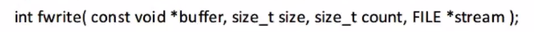

# day13

### Ep01 写在前面

- 链表的删除

  > - 判断链表是否为空 
  > - 判断是否是头节点
  >   - 如果是则直接将头节点的pNext赋值给头节 之后free
  >   - 如果删除结点后链表为空，设置尾指针为NULL
  > - 若不为头节点
  >   - 遍历链表，找到删除值后将前一个节点的pNext指针指向删除节点的下一个节点（pNext）
  >   - 判断删除结点地址值是否等于尾指针，如果相等，则说明删除的为尾节点，将尾指针指向前一个节点。（pPre）
  > - 若没有删除的值则打印没有发现删除节点的值

- 栈和队列

- 二叉树的层次建树 辅助队列

- 插入排序

  > - 认为0号元素自然有序，从一号元素开始插入
  > - 存储插入元素的值，从后往前依次拿有序序列元素值与插入元素值进行比较
  > - 如果有序序列大于插入元素值，则有序序列值后移一位，找到插入元素的位置
  > - 将插入元素值放入对应位置

- 快速排序

  > - 任意一个元素作为分割值（最后/第一个），将比分隔值小的放在分隔值的左边，大的放在右边，分分割值的位置确定，返回分隔值的下标。
  > - 将数组一分为二，前半部分继续分割，后半部分亦然，循环往复实现有序。

- 作业：学生

  ```c++
  typedef struct
  {
      int num
      char name[20];
  	float chinese;
  	float math;	
  	float eng;
  }student_t;
  int main()
  {
      student_t sArr[5];
      for(int i=0;i<5;i++)
      {
  scanf("%d%s%f%f%f",&sArr[i].num,sArr[i].name,&sArr[i].chinese,&sArr[i].math,&sArr[i].eng);
      }
      qsort (sArr,N,sizeof(Student_t), compareNum);
       for(int i=0;i<5;i++)
      {
           pritnf("%d %15s %5.2f,%5.2f,%5.2f %6.2f",sArr[i].num,sArr[i].name,sArr[i].chinese,sArr[i].math,sArr[i].eng,sArr[i].chinese+sArr[i].math+sArr[i].eng);
  
  }
  int compareNum(const void*pleft,const void*pright)
  {
      pstudent_t p1=(pstudent_t)pleft;
      pstudent_t p2=(pstudent_t)pright;
      return p1->num-p2->num;
      
  }
      int compareScore(const void*pleft,const void*pright)
  {
      pstudent_t p1=(pstudent_t)pleft;
      pstudent_t p2=(pstudent_t)pright;
      if(score....)
          return 1;
          else if
          {
              return -1;
          }
          else
          {
              return 0;
          }              
  }
  ```

  

### Ep 02 堆排序

- 堆heap

  > - 按层次建树的顺序的数组（必须是完全二叉树）
  > - 大根堆小根堆
  >   - 大根堆
  >     - 
  >   - 小根堆
  > - 堆排序的实现
  >   - 建堆过程：
  >   - 拿到最后一个父亲节点
  >   - 拿父亲节点和左右孩子中较大的比较
  >   - 如果发现小于孩子节点就进行交换，如果发生交换，则将发生交换的孩子节点作为新的父亲，依次重复进行，直到根节点。把堆调整为大根堆
  >   - 交换零号元素与数组最后-一个元素，然后将剩余元素重新调整为大根堆，循环往复，最后数组有序

- 调试原因

  > 1、指针偏移
  > 2、前面访问越界

- 稳定性

  > - 排序时候出现局部最优/原地tp
  > - 即交换的时候出现

- 计数排序

  > - 需要额外的数组储存排序的数值变换范围，该数组所有元素初始化为0。
  > - 遍历数组获取对应值后，将技术数组对应下标位置值+1，遍历完毕就得到数组中所有值出现的情况。
  > - 外层控制数值变化，内层将计数数组中对应数值出现的次数，依次填入原有数组

- n个无序数数组，让找出第K大的数

  > - 建立k个元素的小根堆，那么就可以拿顶部元素和n-k个元素依次比较。

- 去除重复元素  

  > - 位图 500m空间 一位一个数
  >
  > - 需要磁盘辅助存储  外部排序：建小根堆
  >
  > - 两台电脑找k（删除法） 假设每次找到的k\2部分第一次都比第二次大
  >
  >   - |   第一次    | 第二次  | 第三次 |
  >     | :---------: | :-----: | :----: |
  >     | n\2 找到k\2 | n\2 找  |        |
  >     | n\2 找到k\2 | n\2-k\2 |        |
  >     |             |         |        |
  >
  >     

# day14

### Ep01

- 调试相关：
  - 调试的时候先查看调用堆栈
  - 如果访问越界的位置可读可写则不会异常
  - 如果访问越界的位置不可读不可写则直接报错
  - 对于qsort ：检查compare类型转换，检查qsort入参

### Ep02

- hash查找

  > -  

### Ep03

- 

  - 空间复杂度为0(1)

  - memmove的实现

  - ```c++
    memmove(to,from){
        有重叠，还是复制COPY;
        判断to和from的位置
        
    }
    ```

### Ep04 红黑树

- 红黑树的特点

  > - 节点是红色||黑色
  > - 根是黑色
  > - 所有叶子节点都是黑色
  > - 每个红色节点都必须有两个黑色的叶子节点
  > - 从任意节点到其每个叶子节点的所有简单路径都包含着相同路径的黑色节点
  > - （从根节点到任何一个叶子节点的黑色节点数目是相等的）
  > - 从根到叶子的最长的可能路径不多于最短的可能路径的两倍长。

- 

### Ep05 复习内容

- 查找

  > + 二分查找
  >
  >   + 必须有序
  >   + 时间复杂度为`O(logn)`
  >
  > + 哈希查找
  >
  >   + 时间复杂度为`O(1)`
  >
  >   + 哈希的流程
  >
  >     + 确定哈希公式
  >
  >     - 创建一个空数组
  >     - 通过将元素传入哈希公式得到返回值，凭借返回值
  >
  >     + ```c++
  >       "当战"---> int hash(char*)
  >       ```
  >
  >     + 插入哈希数组，返回值作为数组下标ret∈（0~maxkey-1）
  >
  >     + 将带插入的数据传入哈希函数，得到返回值
  >
  >     + 检查数组内容

- 高级数据结构

  > - 二叉排序树
  >
  >   - 
  >
  >  - 二叉排序树树的旋转
  >
  >    - 左旋：根`->`左孩子
  >     -  项目实战/未命名.assets/image-20200331162619681-1585643232005.png)
  >
  >  - 右旋相反：根`->`右孩子
  >
  > - 红黑树（节点有颜色的二叉排序树）
  >
  >   - 对于任意一棵子树
  >
  >   - 左子树的最大值小于根节点小于右子树的最小值。
  >
  >   - 用人话来说就是左边最小中间次之右边最大
  >
  >   - ```c++
  >     1 2 3 
  >         1						1
  >          \						  \
  >            2						3	
  >              \					  /	
  >                3				2
  >     ```
  >
  >   - 给出相同的数据，有不同的排列结果
  >
  >   - 中序遍历结果相同
  >
  > - 红黑树的性质
  >
  >   - 节点必须是红||黑（节点必须有颜色）
  >   - 根节点必须是黑色
  >   - 每个红色节点必须有两个黑色的孩子
  >   - 两个红色节点不能连续
  >   - 根到叶子经历的黑色结点数要相同
  >
  > - 红黑树的插入问题
  >
  >   - 每次加入的节点都是红的
  >   - 按照二叉排序树的方式定位插入位置
  >   - 不需要旋转
  >     1. 父红叔红`->`父叔染黑爷染红（相当于在爷的位置插入新节点）
  >     2. 如果根是红`->`直接染黑
  >     3. 如果父是黑`->`不变
  >   - 根`->`直接染黑
  >   - 父为黑`->`直接不变
  >   - 父为红
  >     - 叔为红则父叔染黑爷染红（向上递归）
  >     - 叔为黑或不存在
  >       - 腰`->`裙子
  >       - 裙子`->`把多的向少的旋转&&爷爷染黑父和叔染红
  >
  > - 如何删除二叉排序树
  >
  >   - 如果是叶子节点，直接删除
  >   - 如果有孩子节点
  >     - (需要找到最接近节点值的叶子节点替换之后删除叶子）
  >     - 找到孩子的左子树左右边或者右子树最左边（最接近的值）
  >     - 用叶子节点覆盖源节点
  >     - 删除叶子
  >   - 仅有左或者右子树的结点：删除结点后，将它的左子树或者右子树整个移动到删除结点的位置。


# day15

### Ep01 文件操作

**手持两把锟斤拷，口中疾呼烫烫烫。脚踏千朵屯屯屯，笑看万物锘锘锘**


- 文件指存储在磁盘里的数据

- 在格式化的时候分配block

- 

- C语言文件读取与写入是通过将文件看成一个字符序列进行读入和写出的。所以读取与写入文件就用到了指针，而这个指针是一个特殊的指针，我们称为文件指针。

  ```c++
  //打开文件 
  #include<cstdio>
  #include<cstdlib>
  int main()
  {
      char c;
      int ret;
      FILE *fp;
      fp=fopen("file.txt","r+");
      //可以为相对路径，也可以是绝对路径
      if(NULL==fp)
      { //如果执行失败则会返回错误码，
        //perror的作用是返回上面函数的错误码。
          perror("fopen");
          goto error;
      }
      /*
      while((c=fgetc(fp)!=EOF)
      {
          putchar(c);
      }
      */
      c='H';
      ret = fputc(c,fp);//ret为返回值
      if(EOF==ret)
      {
          perror("fputc");
          goto error;
      }
      //已经存入缓冲区
  	//刷新缓冲区的时候将缓冲区写入文件
      fclose(fp);
      error:
  }
  ```

- 刷新缓冲区的情况

  - fclose
  - fflash(fp) 主动刷新
  - 写满了就会刷新缓冲区

- 如何用fgets读取一整行

  - ```c++
    fgets(buf.sizeof(buf),fp);
    whlie(memset(buf,0,sizeof(buf),
          fgets(buf.sizeof(buf),fp)!=NULL);
    ```

### Ep03

* fwrite&&fread

  > - 必须遵循，按什么格式写就按什么格式读
  >
  > - 
  >
  >   - 返回一个整型数
  >   - 
  >
  > - 
  >
  > - 
  >
  >   ```c++
  >   int main()
  >   {
  >       FILE *fp;
  >       char str[10]="10000";
  >       int val=10000;
  >       int ret;
  >       fp=fopen("file.txt","r+");
  >       if(NULL==fp)
  >       {
  >           perror("fopen");
  >           goto errot;
  >       }
  >       ret=fwrite(str,sizeof(char),stelen(str),fp);
  >       //ret=fwrite(&val,sizeof(int),1,fp);
  >       //写入整数
  >       //写入整数时，会将内存中的16进制换算成ASCⅡ码
  >      
  >       menset(str,0,sizeif(int));
  >       fread(str,sizeof(char));
  >       fclose(fp);
  >   error;
  >   }
  >   
  >   ```
  >
  > - 往文件中写入\n，存入磁盘的是\r\n。
  >
  > - 从文件中读出时，遇到\r\n，底层接口会自动转换为\n,
  >
  > - 偏移时，如果跨过了一个\n，要多偏移一位

# day16

### Ep01

- main函数的传参

  > - ```c++
  >   int main(int argc,char *argv)
  >   {
  >   	int i;
  >   	for(i=0;i<argc;i++)
  >   	{
  >   		puts(argv[i]);
  >   	}//输出为绝对路径
  >       fp=fopen(argv[1],"r+")
  >       if(NULL=fp)
  >       {
  >           perror("fopen");
  >           goto error;
  >       }
  >           while((c=fgetc(fp))!=EOF)
  >           {
  >               putcharc)
  >           }
  >       fclose(fp);
  >       error:
  >       system("pause");
  >   }
  >   ```

### Ep02 

- fpirntf

  > - 写到文件中，对比printf多了一个fp参数

- spritnf


### Ep03 复习

- 文件操作

  > - 计算机组成
  >
  >   - cpu：只能访问内存的数据
  >   - 内存：正在运行的文件，占用cpu
  >     - 容量小，断电易丢失数据
  >   - 外部设备
  >     - 磁盘：容量大，断点不丢失
  >     - IO设备和总线
  >     - 输入输出设备
  >
  > - ```mermaid
  >   graph LR
  >   A[内存] -->B[磁盘数据]
  >   C[CPU]-->A
  >       
  >       
  >       
  >   ```
  >
  > - 文件的分类
  >
  >   - 二进制&&ASCⅡ码
  >
  > - 文件的打开
  >
  >   - 打开权限
  >     - r只读
  >     - r+读写
  >       - 写入\n的时候，会储存\r\n
  >       - 注意fseek
  >     - rb+ 二进制读写
  >     - w只写但是会清空原文件
  >     - w+读写但是会清空源文件
  >   - FILE结构体（文件缓冲区）分配在用户态空间
  >   - base：基地
  >   - ptr：读写位置
  >   - end：结尾
  >   - size：偏移大小
  >   - 
  >   - 在开始读写的时候，ptr指针指向base
  >   - 每次读写的时候都偏移ptr指针
  >   - 通过fseek偏移指针来写入文件
  >   - （因为读取时ptr指针已经指向下一个字节）
  >   - size 当ptr偏移达到size时，ptr偏移就会返回EOF
  >   - 如何检查打开失败
  >     - 检查fopen的返回值，如果为NULL，则使用perror显示报错原因
  >
  > - 文件的关闭：fclose
  >
  > - 文件读写位置的偏移：fseek
  >
  >   - 基准点
  >     - SEEK_SET
  >     - SEEK_CUR
  >     - SEEK_END
  >   - 偏移量：可正可负
  >
  > - 文件的读取
  >
  >   - fgetc：
  >   - fgets：
  >   - fscanf：读取ASCⅡ码，保证读的内容为字符串
  >   - fread（指定读取数量，最常用）：读取二进制文件
  >
  > - 文件的写入
  >
  >   - fputc：
  >   - fputs：
  >   - fprintf：
  >   - fwrite（指定写入数量，常用）：
  >
  > - 命令行参数：main函数的形参
  >
  >   - `int main(int argc,char*argv[])`
  >   - 参数数量，参数数组
  >   - argc：输入的命令有xxx个单词，单词下标范围为`0~argc-1`

- 项目：学生管理系统

  > - 登陆
  >   - 提供用户交互
  >   - 打开账户文件进行比对（）
  >   - 设计账号信息，读取链表比对
  > - 学生信息的增删查改
  >   - 读取文件
  >   - 对链表进行增删查改

