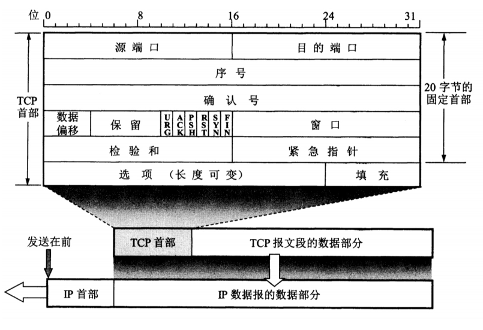
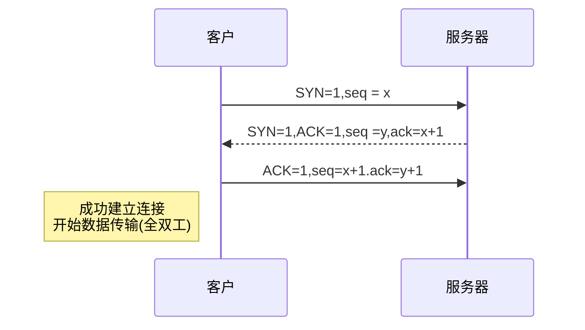
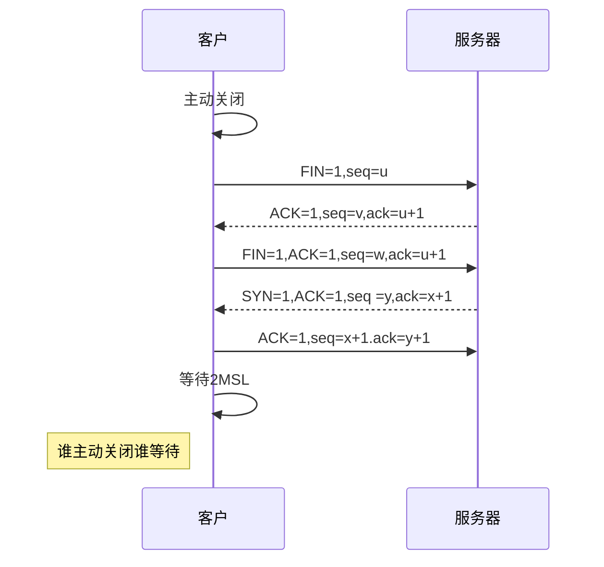
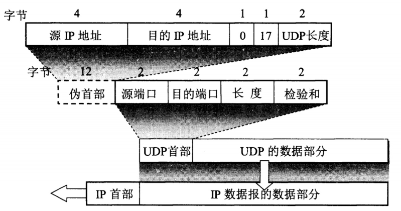
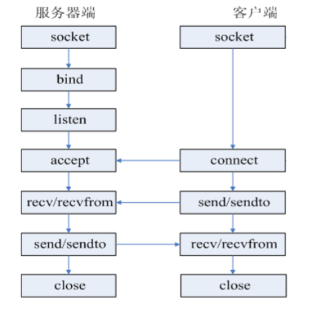
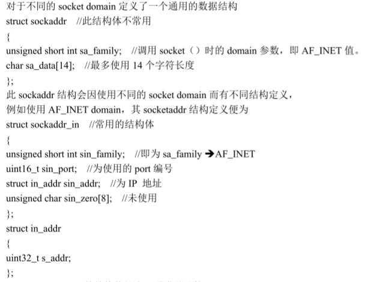
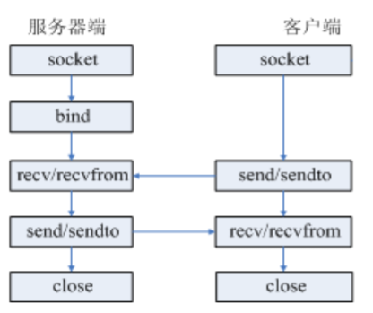

# Week07 笔记总结

[TOC]

------

## Ep01 网络协议

### 五层体系结构模型

- **物理层**：考虑的是怎样在传输媒体上传输数据比特流，而不是指具体的传输媒体。物理层的作用是尽可能屏蔽传输媒体和通信手段的差异，使数据链路层感觉不到这些差异。
- **数据链路层**：网络层针对的还是主机之间的数据传输服务，而主机之间可以有很多链路，链路层协议就是为同一链路的结点提供服务。数据链路层把网络层传来的分组封装成帧。
- **网络层**：为主机之间提供数据传输服务，而运输层协议是为主机中的进程提供服务。网络层把运输层传递下来的报文段或者用户数据报封装成分组。
- **运输层**：提供的是进程间的通用数据传输服务。由于应用层协议很多，定义通用的运输层协议就可以支持不断增多的应用层协议。运输层包括两种协议：传输控制协议 TCP，提供面向连接、可靠的数据传输服务，数据单位为报文段；用户数据报协议 UDP，提供无连接、尽最大努力的数据传输服务，数据单位为用户数据报。TCP 主要提供完整性服务，UDP 主要提供及时性服务。
- **应用层**：为特定应用程序提供数据传输服务，例如 HTTP、DNS 等。数据单位为报文。

------

### OSI（开放系统互联参考模型）标准模型

- ##### 物理层

  > - **功能**：负责为数据端设备**透明地传输原始比特流**，并且定义了数据终端设备和数据通信设备的物理和逻辑链接方法。传输单位是**比特**。
  > - **协议**：RJ45、CLOCK、IEEE802.3
  > - **设备**：中继器，集线器

- ##### 数据链路层

  > - **功能**:将网络层传下来的IP数据报组装成帧，并检测和矫正物理层产生的传输差错，使得链路对网络层显示一条无差错、可靠的数据传输线路。功能可以概括为成帧，差错控制、流量控制和传输管理
  > - **协议**：HDLC(高级数据链路控制协议),PPP,STP,SDLC,CSMA(载波监听多路访问)
  > - **设备**: 网桥，交换机

- ##### 网络层

  > - **功能**：负责在网络层上将数据**封装成数据报**，将数据报从源端传到目的端，同时进行**路由选择**，为分组交换网上的不同主机提供**通信服务**。关键问题是对分组进行选择，并实现流量控制、拥塞控制、差错控制和网际互联等功能。传输单位**数据报**。
  > - **协议**: IP,ICMP(因特网控制报文协议),IGMP(因特网组管理协议),ARP,RARP,OSPF(开放最短路径优先),IPX
  > - **设备**: 路由器

- ##### 传输层

  > - **功能**：负责主机中两个进程之间的通信，为端到端连接提供可靠的传输服务。为端到端连接提供流量控制、差错控制、服务质量、数据传输管理等服务。
  > - **协议**：TCP,UDP

- ##### 会话层

  > - **功能**：会话层允许不同主机上各个进程之间的**会话**，会话层利用传输层提供的端到端的服务，向表示层提供它的增值服务。这种服务主要是为表示层实体或用户进程**建立连接**并在连接上提供**有序**地传输数据。
  > - **协议**：SQL、RPC(远程调用协议)

- ##### 表示层

  > - **功能**:用于处理两个通信系统中交换信息的表示方式。如数据压缩，加密和解密等。
  > - **协议**：JPEG、MPEG、ASII

- ##### 应用层

  > **功能**：是TCP/IP的最高层，它是直接为应用进程服务的一层。当不同的应用进程数据通信或数据交换时，就去调用应用层的**不同协议实体**，让这些实体去调用TCP或者UDP层服务来进行网络传输。
  >
  > **协议**：FTP(21) TELNET(23) SMTP(25) DNS(53) TFTP(69) HTTP(80) SNMP(161),DHCP(动态主机配置协议)

------

### TCP/IP 分层

- **网络接口层（接收和发送数据报）**：负责将数据报发送到**网络介质**上，以及从网络上接收TCP/IP数据报，相当于OSI的物理层和数据层。
- **网际层（数据报封装和路由寻址功能）**：主要负责寻址和对数据报的封装以及重要的路由选择功能。
- **传输层**：**负责在应用进程之间的“端到端”的通信**，即从某个应用进程传输到另一个应用进程。
- **应用层**：是TCP/IP的最高层，它是直接为应用进程服务的一层。当不同的应用进程数据通信或数据交换时，就去调用应用层的**不同协议实体**，让这些实体去调用TCP或者UDP层服务来进行网络传输。

------

### OSI 和TCP/IP的区别

- OSI精确定义了服务、协议和接口，符合**面向对象**程序设计思想。而TCP/IP在这些概念上没有明确区分。

- OSI在产生协议之前没有偏向任何特定的协议，通用性良好，但如果设计没有太多经验就不知道将哪些功能放到哪一层。TCP/IP,首先出现协议，模型实际上是对已有协议的描述。因此不会出现协议不能匹配的模式。

- TCP/IP考虑了异构网的互联问题，而OSI只考虑用一种标准的公用数据网将各种不同系统互连。

- OSI在网络层支持无连接和面向连接的通信，但在传输层仅有面向连接通信。而TCP/IP则相反，在网际层仅有无连接服务，在传输层支持无连接和面向连接两种模式。

## Ep02 TPC/IP协议

### TCP报文段的首部格式

- **源端口和目的端口**。各占2字节。
- **序号**: TCP每个一个字节都是按顺序编号。
- **确认号**: 期望收到对方下一个报文段的第一个数据字节的序号。
- **数据偏移**：占用4字节，指出TCP报文段数据处距离TCP报文段的起始处有多远。
- **保留**: 占用6位，留以后使用。
- **紧急URG**: URG=1表示紧急，告诉系统有紧急数据，应尽快传送，而不按原来的排队顺序来传送。
- **确认ACK**：只有ACK=1时，确认号ack才有效。
- **推送PSH**: 希望立即能够收到对方的响应。
- **复位RST**：RST=1,表明连接中出现严重差错，必须释放连接，然后再重新建立运输连接。
- **同步SYN**: 在连接建立时用来同步序号。当SYN=1，ACK=0时表示连接请求报文段。如果对方同意则响应报文中使用SYN=1,ACK=1.
- **终止FIN**: 用来释放连接。
- **窗口**：占两字节，窗口值作为接收方让发送方设置发送窗口的依据。
- **校验和**：占2字节，校验和字段校验的范围包括首部和数据两部分。
- **紧急指针**：占两字节，只有URG=1时才有意义，紧急指针指出紧急数据的末尾在报文段中的位置。
- **选项**：长度可变，最长40字节
- 

------

### TCP对应的协议(数字为端口编号)

- **FTP(21)**：定义了**文件传输协议**，使用21端口。常说某某计算机开了FTP服务便是启动了文件传输服务。下载文件，上传主页，都要用到FTP服务。
- **ssh(22)**: 专为**远程登录会话**和其他网络服务提供安全性的协议
- **Telnet(23)**：(远程登陆协议)它是一种用于**远程登陆**的端口，用户可以以自己的身份远程连接到计算机上，通过这种端口可以提供一种基于DOS模式下的通信服务。如以前的BBS是-纯字符界面的，支持BBS的服务器将23端口打开，对外提供服务。
- **SMTP(25)**：定义了**简单邮件传送协议**，现在很多邮件服务器都用的是这个协议，用于发送邮件。如常见的免费邮件服务中用的就是这个邮件服务端口，所以在电子邮件设置-中常看到有这么SMTP端口设置这个栏，服务器开放的是25号端口。
- **POP3(110)**：它是和SMTP对应，POP3用于**接收邮件**。通常情况下，POP3协议所用的是110端口。也是说，只要你有相应的使用POP3协议的程序（例如Fo-xmail或Outlook），就可以不以Web方式登陆进邮箱界面，直接用邮件程序就可以收到邮件（如是163邮箱就没有必要先进入网易网站，再进入自己的邮-箱来收信）。
- **HTTP(80)协议**：是从Web服务器传输超文本到本地浏览器的传送协议

------

### TCP的三次握手




- **第一次握手**：客户机首先向服务器的TCP发送一个连接请求报文段，这个特殊的报文段不含应用层数据，其首部中同步位SYN被设置为1。另外，客户机会随机选择一个起始序号seq=x(连接请求报文不携带数据，但要消耗一个序号)；
- **第二次握手**：服务器的TCP收到连接请求报文段后，如果同意建立连接，就向客户机发回确认，并为该TCP连接分配TCP缓存和变量。在确认报文段中，SYN和ACK位都被设置为1，确认号字段值为ack=x+1,并且服务器随机产生起始序号seq=y. 确认包同样不包含应用层数据。
- **第三次握手**：当客户机收到确认报文段后，还要向服务器给出确认，并且也要给该连接**分配缓存和变量**。这个报文段的确认位ACK被设置为1，序号段被设置为seq=x+1,确认号字段ack=y+1. 该报文段可以携带数据，如果不携带数据则不消耗序号。

在TPC连接建立时，到通信双方中的任何一方主动关闭连接之前，TCP 连接都将被一直保持下去。因为TCP提供全双工通信，因此双方任何时候都可以发送数据

------

### 四次挥手



- **第一次挥手**：客户机打算关闭连接，就向其TCP发送一个连接释放报文，并停止再发送数据，主动关闭TCP连接。该报文段的结束标志位FIN被设置为1，seq=u,它等于前面已经发送过的数据的最后一个字节的序号加1。
- **第二次挥手**：服务器收到连接释放报文段后即发出确认，确认号是ack=u+1,序号为v,等于它前面已经发送过的数据的最后一个字节序号加1.此时客户机到服务器这个方向的连接就释放了，TCP处于半关闭状态。ACK=1，seq=v,ack=u+1
- **第三次挥手**：若服务器已经没有要向客户机发送的数据，就通知TCP释放连接，此时发出FIN=1，确认号ack=u+1,序号seq=w,已经发送过的数据最后一个字节加1。确认为ACK=1.(FIN=1, ACK=1, seq=w, ack=u+1)
- **第四次挥手**：客户机收到连接释放报文段后，必须发出确认。在确认报文段中，确认位ACK=1，序号seq=u+1,确认号ack=w+1. 此时连接还没有释放掉，必须经过时间等待计时器设置的时间2MSL(Max Segment Lifetime),后，客户机才进入连接关闭状态。(ACK=1,seq=u+1,ack=w+1)

------

### 相关问题

##### 为什么要三次握手？一次行不行？

> - 如果只采用一次的话，客户端不知道服务端是否已经收到自己发送的数据，则会不断地发送数据
>   - 为了保证服务端能收接受到客户端的信息并能做出正确的应答而进行前两次(第一次和第二次)握手
>   - 为了保证客户端能够接收到服务端的信息并能做出正确的应答而进行后两次(第二次和第三次)握手

##### 为什么要三次握手？两次次行不行？

> - 采用三次握手是为了防止失效的连接请求报文段再次传到服务器，因而产生错误
> - 因为TPC协议是建立在不可靠网络下的可靠协议。
> - 当出现网络不稳定时，虽然客户端以前发送的连接请求以到达服务方，但服务方的同意连接的应答未能到达客户端
> - 则客户方要重新发送连接请求，若采用二次握手，服务方收到客服端重传的请求连接后，会以为是新的请求，就会发送同意连接报文，并新开进程提供服务，这样会造成服务方资源的无谓浪费。

##### 为什么四次挥手，主动方要等待２MSL后才关闭连接

> - 保证TCP协议的全双工连接能够可靠关闭．
> - 主要为了确保对方能受到ACK信息.
>   - 如果Client直接CLOSED了，那么由于IP协议的不可靠性或者是其它网络原因，导致Server没有收到Client最后回复的ACK。
>   - 那么Server就会在超时之后继续发送FIN，此时由于Client已经CLOSED了，就找不到与重发的FIN对应的连接，最后Server就会收到RST而不是ACK，
>   - Server就会以为是连接错误把问题报告给高层。
>   - 所以，Client不是直接进入CLOSED，而是要保持2MSL
>   - 如果在这个时间内又收到了server的关闭请求时可以进行重传
>   - 否则说明server已经受到确认包则可以关闭.

##### TCP应用场景

> - 效率要求相对低，但对准确性要求相对高的场景。
> - 因为传输中需要对数据确认、重发、排序等操作，相比之下效率没有UDP高。
> - 举几个例子：文件传输（准确高要求高、但是速度可以相对慢）、接受邮件、远程登录。 NSQ底层通讯就采用TCP。

##### TCP的可靠性如何保证

> - 在TCP的连接中，数据流必须以正确的顺序送达对方。
> - TCP的可靠性是通过确认机制来保证安全的到达，即采用顺序编号、确认(ACA)超时重传等来实现的。
>   - TCP在开始传送一个段时，为准备重传而首先将该段插入到发送队列之中，同时启动时钟。
>   - 其后，如果收到了接受端对该段的ACK信息，就将该段从队列中删去。
>   - 如果在时钟规定的时间内，ACK未返回，那么就从发送队列中再次送出这个段。
>   - TCP在协议中就对数据可靠传输做了保障，握手与断开都需要通讯双方确认，数据传输也需要双方确认成功，在协议中还规定了：分包、重组、重传等规则
>   - 确保数据能够到达目的地

## Ep03 UDP协议

### UDP报文段首部格式

- **源端口**: 源端口号，在需要对方回信时选用，不需要时可用全0.
- **目的端口**: 目的端口号，在终点交付报文时必须使用
- **长度**: UDP用户数据报的长度，其最小值是8(仅有头部)。
- **校验和**: 检测UDP用户数据报在传输中是否有错。有错就丢弃



-----

### UDP对应的协议

- **DNS(53)**：用于域名解析服务，将域名地址转换为IP地址。DNS用的是53号端口。
- **RIP(520)**:路由信息协议，端口520
- **SNMP(161)**：简单网络管理协议，使用161号端口，是用来管理网络设备的。由于网络设备很多，无连接的服务就体现出其优势。
- **TFTP(69)(Trival File Transfer Protocal)**，简单文件传输协议，该协议在熟知端口69上使用UDP服务。

------

### UDP应用场景

> - 效率要求相对高，对准确性要求相对低的场景。
> - 举几个例子：QQ聊天、在线视频、网络语音电话（即时通讯，速度要求高，但是出现偶尔断续不是太大问题，并且此处完全不可以使用重发机制）、广播通信（广播、多播）。

## Ep04 socket

### 概念

Linux 中的网络编程是通过 socket 接口来进行的。socket 是一种特殊的 I/O接口，它也是一种文件描 述符。它是一种常用的进程之间通信机制，通过它不仅能实现本地机器上的进程之间的通信，而且通过 网络能够在不同机器上的进程之间进行通信。 

每一个 socket 都用一个半相关描述{协议、本地地址、本地端口}来表示；一个完整的套接字则用一个相关描述{协议、本地地址、本地端口、远程地址、远程端口}来表示。socket 也有一个类似于打开文 件的函数调用，该函数返回一个整型的 socket 描述符，随后的连接建立、数据传输等操作都是通过 socket来实现的

------

### socket类型

- 流式 socket（SOCK_STREAM） →用于TCP 通信 

  > - 流式套接字提供可靠的、面向连接的通信流；它使用 TCP 协议，从而保证了数据传输的正确性和顺序性

- 数据报 socket（SOCK_DGRAM） →用于UDP 通信 

  > - 数据报套接字定义了一种无连接的服务，数据通过相互独立的报文进行传输，是无序的，并且不保证是可靠、无差错的。它使用数据报协议 UDP

- 原始 socket（SOCKRAW）→用于新的网络协议实现的测试

  > - 原始套接字郧西底层协议如IP/ICMP进行直接访问，功能强大但是使用不便，主要用于一些协议的开发

-----

### socket 信息数据结构

````c
#include<netinet/in.h> 
struct sockaddr 
{
    unsigned short sa_family; 
    //地址族
    char sa_data[14];
    //14 字节的协议地址，包含该 socket的Ip地址和端口号
}; 
struct sockaddr_in 
{
    short int sin_family; 
    //地址族
    unsigned short int sin_port; 
    //端口号 
    struct in_addr sin_addr; 
    //IP 地址
    unsigned char sin_zero[8];
    //填充 0 以保持与 struct sockaddr 同样大小
}; 
struct in_addr 
{
    in_addr_t s_addr; //32 位 IPv4 地址，网络字节序
};

sin_family:AF_INET →IPv4 协议 
AF_INET6 →IPv6 协议
````

------

### socket编程--TPC协议的基本使用

- TCP 通信的基本步骤如下： 

  > - 服务端：socket---bind---listen---while(1){---accept---recv---send---close---}---close
  > - 客户端：socket----------------------------------connect---send---recv-----------------close
  > - 

- `int socket(int domain,int type,int protocol);`

  > - 生成一个套接口描述符
  > - `int domain`：使用网络协议，可以是IPv4/IPv6
  >   - AF_INET：IPv4 网络协议
  >   - AF_INET6：IPv6 网络协议
  > - `int type`：使用协议，可以是TCP或是UDP
  >   - TCP：SOCK_STREAM 
  >   - UDP：SOCK_DGRAM

- `int bind(int sockfd,struct sockaddr * my_addr,socklen_t addrlen);`

  > - 用来绑定一个端口号和 IP 地址，使套接口与指定的端口号和 IP 地址相关联
  > - `int sockfd`：为socket函数的返回值
  > - `struct sockaddr * my_addr`：为一个结构体指针变量
  >   - 
  > - `socklen_t addrlen`：结构体长度
  >   - 通常为`sizeof(stuct socketaddt)`
  > - 成功则返回0，失败返回-1

- `int listen(int sockfd,int backlog);`

  > - 使服务器的这个端口和 IP 处于监听状态，等待网络中某一客户机的连接请求,如果客户端有连接请求，端口就会接受这个连接
  > - `int sockfd`为前面 socket函数的返回值，即 sfd
  > - `int backlog`：指定同时能处理的最大连接要求，通常为 10 或者 5。最大值可设至 128
  > - 成功则返回 0，失败返回-1
  
- `int accept(int s,struct sockaddr * addr,socklen_t* addrlen);`

  > - 接受远程计算机的连接请求，建立起与客户机之间的通信连接。
  > - 服务器处于监听状态时， 如果某时刻获得客户机的连接请求，此时并不是立即处理这个请求，而是将这个请求放在等待队列中，当系统空闲时再处理客户机的连接请求
  > - `int s`为前面 socket 的返回值.即 sfd 
  > - `struct sockaddr * addr`为结构体指针变量，和 bind 的结构体是同种类型的，系统会把远程主机的信息（远程主机的地址和端口号信息）保存到这个指针所指的结构体中。
  > - `socklen_t* addrlen`表示结构体的长度，为整型指针
  > - 成功则返回新的 socket 处理代码 new_fd，失败返回-1

- `int recv(int sockfd,void *buf,int len,unsigned int flags);`

  > - 用新的套接字来接收远端主机传来的数据，并把数据存到由参数 buf 指向的内存空间
  > - `int sockfd`为前面 accept 的返回值.即 new_fd，也就是新的套接字。 
  > - `void *buf`表示缓冲区 
  > - `int len`表示缓冲区的长度
  > - `unsigned int flags`通常为 0
  > - 成功则返回实际接收到的字符数，可能会少于你所指定的接收长度。失败返回-1

- int send(int s,const void * msg,int len,unsigned int flags);

  > - 用新的套接字发送数据给指定的远端主机
  > - `int s`为前面accept 的返回值.即 new_fd 
  > - `const void * msg`一般为常量字符串 
  > - `int len`表示字符串 长度
  > - `unsigned int flags`通常为 0
  > - 成功则返回实际传送出去的字符数，可能会少于你所指定的发送长度。失败返回-1

- `int close(int fd);`

  > - 当使用完文件后若已不再需要则可使用 close()关闭该文件
  > - 并且 close()会让数据写回磁盘， 并释放该文件所占用的资源
  > - `int fd`为前面的 sfd,即new_fd
  > - 若文件顺利关闭则返回 0，发生错误时返回-1

- `int connect (int sockfd,struct sockaddr * serv_addr,int addrlen);`

  > - 客户端函数，用来请求连接远程服务器，将参数 sockfd 的 socket 连至参数 serv_addr 指定的服务器
  > - `int sockfd`为前面 socket 的返回值，即 sfd 
  > - `struct sockaddr * serv_addr`为结构体指针变量，存储着远程服务器的 IP 与端口号信息。
  > - `int addrlen`表示结构体变量的长度
  > - 成功则返回 0，失败返回-1

- 代码实现TCP文件聊天：

-----

### socket编程--UDP协议的基本使用

- UDP通信的基本步骤

  > - 服务端：socket---bind---recvfrom---sendto---close 
  > - 客户端：socket----------sendto---recvfrom---close
  > - 

- `int sendto(int sockfd, const void *msg,int len,unsigned int flags,const struct sockaddr *to, socklen_t tolen);`

  > - 类似TCP协议的send()函数
  > - `const struct sockaddr *to` 表示目地机的 IP 地址和端口号信息，
  > - `socklen_t tolen `常常被赋值为 sizeof (struct sockaddr)。
  > - sendto 函数也返回实际发送的数据字节长度或在出现发送错误时返回-1

- `int recvfrom(int sockfd,void *buf,int len,unsigned int flags,struct sockaddr *from,int *fromlen);`

  > - struct sockaddr *from是一个 struct sockaddr类型的变量，该变量保存连接机的IP地址及端口号。
  > - int *fromlen常置为 sizeof (struct sockaddr)。当 recvfrom()返回时，fromlen 包含实际存入 from中的数据字节数。
  > - 函数返回接收到的字节数或当出现错误时返回-1，并置相应的 errno

- 基于UDP协议的聊天程序：