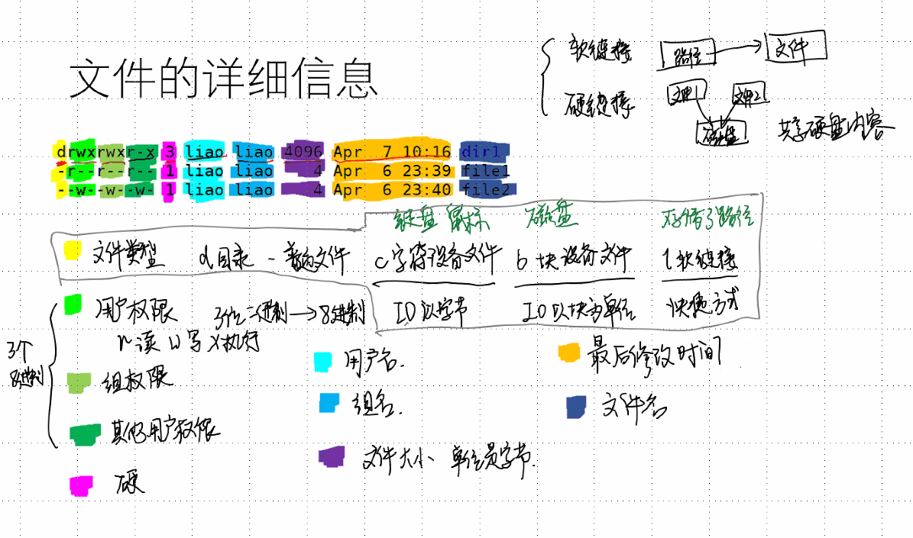
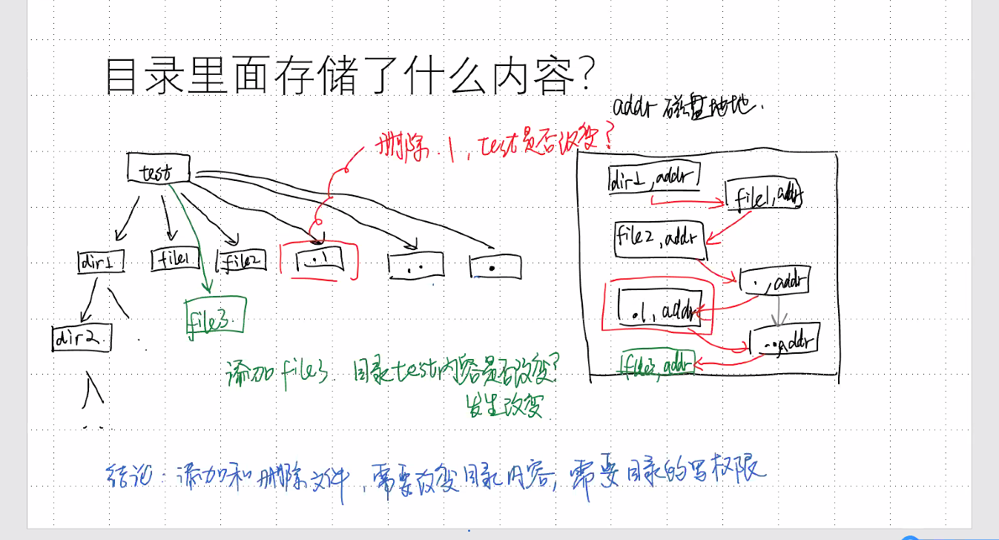

# day22

[TOC]

### Ep01 写在前面

- ##### 网络配置

  > - NAT模式
  >   - 切换自动
  >   - ping任意一个网站
  >   - 根据自动的IP网关和DNS配置静态IP
  > - 桥接模式
  >   - 同上

- ##### 用户命令

  > - 添加用户：`useradd -m 用户名 -s /bin/bash`
  > - 配置密码：`passwd`
  > - 切换用户：`su`
  > - 删除用户：`userdel -r`
  > - 退出当前用户：`exit`

### Ep02 Linux文件

- ##### 文件系统（虚拟文件系统 VFS）

  > - 根节点
  >
  > - Linux目录的含义
  >
  >   | 目录名 |                             含义                             |
  >   | :----: | :----------------------------------------------------------: |
  >   |  /bin  |              存放二进制文件，通常是一可执行程序              |
  >   |  /sys  |                           系统文件                           |
  >   |  /dev  |                           设备文件                           |
  >   |  /etc  |                      配置文件和启动脚本                      |
  >   | /home  |                    普通用户家目录的父目录                    |
  >   |  /lib  |                          系统库文件                          |
  >   | /proc  |        特殊的目录，面的内容是进程内容对文件系统的映射        |
  >   | /user  | 普通用户可以访问的文件，包括库文件、二 进制文件和代码文件等等 |
  >   |  /var  |                 存储变化很快的文件,比如日志                  |
  >
  > - 绝对路径：根目录👉目录1👉目录2👉文件
  >
  > - 相对路径：相对于当前目录的位置
  >
  > - 当前目录👉目录1👉目录2👉文件
  >
  > - pwd：
  >
  > - ~的含义：当前用户的家目录
  >
  > - cd：改变目录(change da)
  >
  >   - `cd -` （返回上一级）
  >   - `cd &cd~`（回到家目录）
  >   - `cd .`  (保持位置不变)
  >   - `cd .. `(回到父目录)
  >
  > - mkdir：创建目录
  >
  > - rmdir：删除目录
  >
  > - ls：显示目录下文件

- ##### 文件的详细信息             //补笔记

  > - 
  > - 硬链接：文件1和文件2共享磁盘的内容

- ##### **目录里面到底存了什么？**

  > - 
  > - ls -lh     (h==human readable)

### Ep03文件操作

- ##### 拷贝文件或者目录

  > - `cp 源文件 目标路径`：拷贝一份源文件到目标路径（覆盖同名文件
  > - `cp 源文件 目标文件 `：拷贝一份源文件取到目标文件，若目标文件不存在则直接创建（覆盖原文件）
  > - ubuntu不会提示覆盖行为
  > - 后缀
  >   - -f：强制拷贝（强制命令）
  >   - -i：弹出（Y/N）Y则拷贝（确认命令）
  >   - -r：拷贝目录和所有子文件（递归命令）

- ##### 剪切文件或者目录

  > - 使用方法和cp相同
  > - 将cp换成mu即可
  > - 重命名：mu 源文件 目标文件
  >   - 将源文件的名字修改成目标文件的名字
  > - 后缀
  >   - -f：强制剪切（强制命令）
  >   - -i：弹出（Y/N）Y则剪切（确认命令）
  >   - -r：剪切目录和所有子文件（递归命令）

- ##### 删除

  > - rm 文件名 文件路径 
  > - 不要再root用户下使用rm -r

- ##### tree：需要加载tree工具：`sudo apt install tree`

  > - tree (显示当前)
  >   - 
  > - tree 路径
  >   - 
  > - tree -h 显示大小
  >   - 
  >   - 

### Ep04 文件权限

- ##### 权限

  > - 三种权限
  >   - 读&&写&&执行（r w x）
  > - 用户分类
  >   - 用户
  >   - 组
  >   - 其他用户

- ##### chmod：修改权限的文字设定法

  > - `chmod [who][+1-1=] [mode]`
  >   - who :用户身份
  >     - u ：用户
  >     - g ：组
  >     - o ：其他
  >     - a：所有（不写＝所有）
  >   - [+-=]
  >     - +：增加
  >     - -：去除
  >     - =：指定
  >   - mode：权限（r：可读，w：可写，x：可执行）
  > - 语句可以多次执行，用逗号分隔。
  > - 
  > - 删除r权限
  >   - chmod -r
  >   - chmod a -r
  >   - chmod ugo -r

- ##### 数字设定法：8进制

  > - 掩码：如果二进制位为1则无效
  > - 读 写 执行 ：可以用一个三位二进制表示，并且一个三位二进制位一个8进制
  > - -rw -rw -r：6 6 4

### Ep05 文件的查找 Ⅰ

- ##### find：初探find

  > - `find 起始目录 查找条件 操作`
  > - 查找所有以起始目录为祖先的目录文件
  > - 按名字精确查找： find .name [文件名]
  > - 按名字模糊查找：
  >   - 通配符：
  >   - *匹配：0~多个任意字符
  >   - ？匹配：仅能匹配一个字符
  >   - [  ]范围匹配：需要按照ASCⅡ码的范围写
  > - finf . -gid    按组查找
  > - find . -uid  按用户查找
  > - find . -empty 查找空文件
  > - find . -prem xxx :按权限查找
  > - find . -size n[bckw] （n后面的[ ]表示单位）默认单位为block
  > - find . -type :按类型查找 d:目录 f:普通文件
  > - find . [acm]+min/time （+/-）  (min 分钟，time 天)
  >   - a：访问
  >   - c：状态
  >   - m：内容
  >   - min后无符号，表示某时刻
  >   - min-  从现在到min分钟之内
  >   - min+ min分钟之前a

