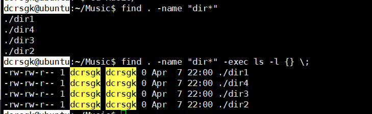
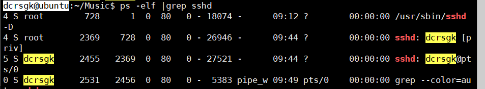
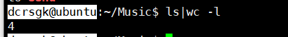
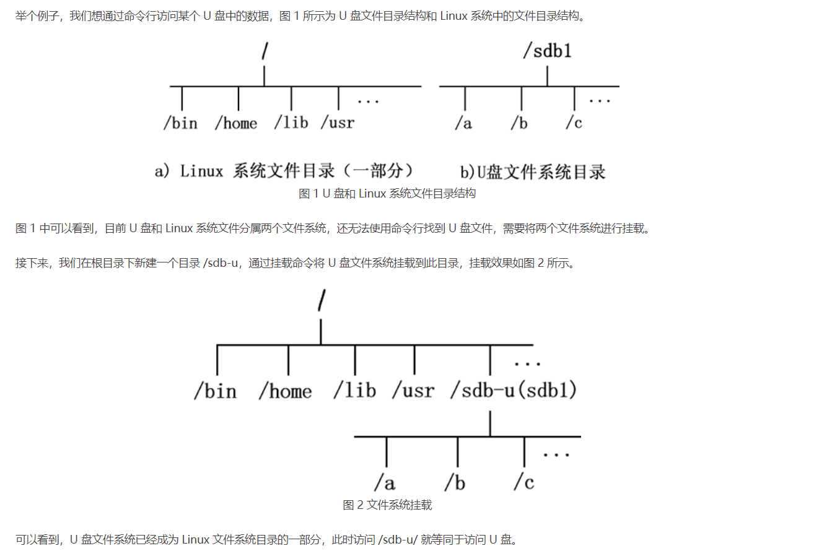
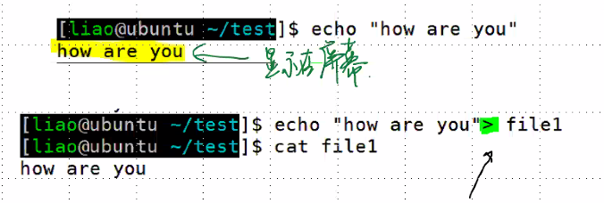
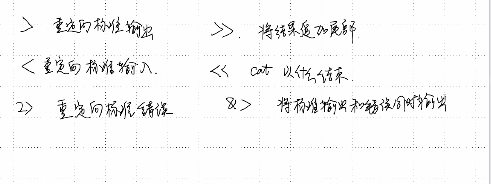
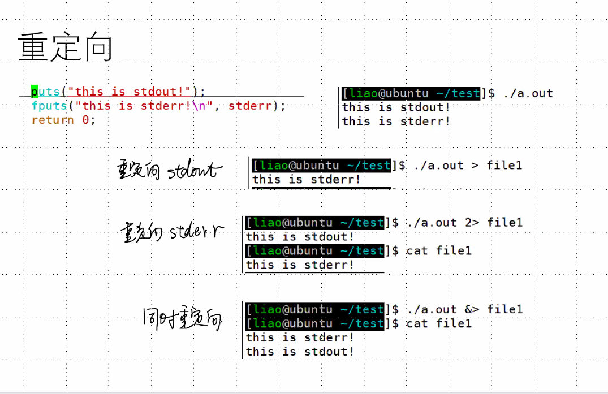

# day23

[TOC]

### Ep01 文件的查找 Ⅱ

- find Ⅱ ：find的组合操作

  > - find . -name "dir*" -exec 命令\;
  >   - 将find命令的结果作为参数传进exec的命令中
  >   - 其中的{}表示find的每一行
  >   - 

- 管道

  > - 将前一个命令的输出作为后面的输入，一次接受一个单词
  > - 
  > - ps -elf |grep sshdL:简单的管道的例子
  > - `-xargs` 多行命令拆成一个单词
  > - 统计当前有多少文件：ls|wc -l
  > - 
  > - 

- df命令

  > - df：repo reprot file system disk space usage
  > - 显示磁盘空间：注意Mounted on 为挂载
  > - 在Linux中，外部储存会直接导入根目录？
  > - 当在 Linux 系统中使用外部储存时，
  > - 只有将Linux本身的文件目录与硬件设备的文件目录合二为一。硬件设备才能为我们所用。合二为一的过程称为“挂载”
  >   - 

- du命令：深度查找

  > - du：estimate file space usage
  > - 显示当前目录占多少空间
  > - 可以通过加参数 --max-depth=1  调整参数，显示当前层的大小

- cat

  > - cat：Concatenate files and print on the standard output
  >
  > - 打印
  >
  > - `cat -b` ：标记所有非空行
  >
  > - `cat -n`：标记所有行
  >
  > - cat -s：将连续空行合并显示
  >
  > - `cat -E`：对每一行的结束显示$符
  >
  > - cat不加参数时等价于
  >
  >   - ```c++
  >     while(fgets()!=NULL)
  >     {
  >         puts(str);
  >     }
  >     //输入ctr+d结束
  >     ```

### Ep02 标准输入和输出

- 重定向 > <（箭头指向就是数据流向方向）

  > - `>`重定向：重定向标准输出
  >   - 即将原本显示在屏幕中的内容输出到文件中
  >   - 
  > - `>>`  ：将重定向的结果追加尾部
  >   - 即将原本显示在屏幕中的内容输出到文件尾部
  > - `<`  重定向：重定向标准输入
  >   - 
  > - `<< `：cat 以什么结束
  > - `2<`：重定向标准错误输出
  > - `&>`：将标准输出和错误同时输出
  > - 
  > - 
  > - 重定向标准输出
  >   - 
  >
  > - 重定向标准输入

- 创建空文件

  > - 重定向：echo -n > 文件名
  > - `touch` 改变修改时间&&如果文件不存在则创建新文件
  > - vim：vim 文件名

- 部分显示

  > - 显示部分10行（从头开始）：head
  > - 显示部分10行（从尾开始）：tail
  > - eg
  >   - 将操作后两百行放入file777中
  >   - `history |tail -n 200 > file777`
  >   - 

- more：按页打印 此时这里空格也是翻页

  > - b：上一页
  > - f：下一页
  > - q：退出
  > - h：帮助

- sort ：排序

  > - 排序文件内容

- uniq：删除连续重复信息

  > - 删除重复行

  - 结合sort &&uniq可以连续去重

    > - eg：将一个文件的内容去重并保存到新文件
    > - 

- 文件字数统计：wc

  > - wc 无参数时显示所有
  > - wc -l ：统计行数
  > - wc -w：统计单词
  > - wc -c：统计字节

- 编码：

  > - 由于Linux下用的UTF-8标准（3字节），会出现windows（2字节）和LInux编码不同的情况
  > - 用iconv转换
  > - iconv -f gb2321 -t utf-8 文件名 > 新文件名
  > - 需要重定向得到转换之后的结果

