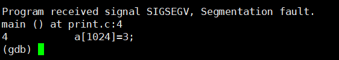
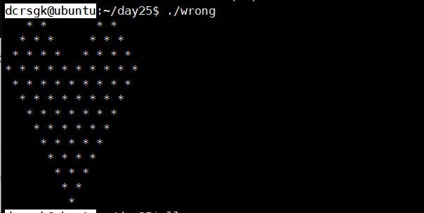

# 作业第四题和第五题

### 第四题

- b 命令：打断点
  - 
- c:  运行到下一个断点
  - 
- n:  单步调试
  - 
- s：单步调试并进入函数，源文件没函数OTZ
  - 
- info b：显示所有断点
  - 
- bt：调用堆栈
  - 
- p监视
  - 

- delete ：删除所有断点
  - 
- r：运行
  - 

### 第五题

- 段错误
  - 
  - core文件：它正常运行了啊啊啊啊啊啊啊
  - 

