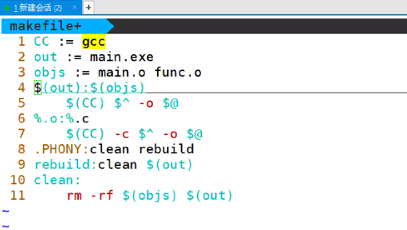

# day26 笔记

[TOC]


### Ep01 写在前面 记得去重听静态库

- 文件内容查找

  > - `grep`
  >   - 参数
  >     - `n`：行号
  >     - `E`：拓展规则
  >     - `F`：字面值匹配
  >     - `c`：显示匹配总数
  >     - `-i`：不区分大小写
  >   - 正则表达式
  >     - 匹配的基本单位：
  >       - 单个字符
  >       - 括号内部的内容
  >       - `|`：或
  >       - `\`控制字符
  >       - 转义字符
  >       - `.`：任意字符
  >       - `[ ]`：范围内字符
  >       - `{}`：字符长度
  >     - 基本单位的附加情况
  >       - `^`：出现在行首
  >       - `$`：出现在行尾
  >       - `i`：重复0~多次
  >       - `？`：重复0或1次
  >       - `+（x，y）`：x~y次

- SCP命令

  > - 上传：``scp 本地文件名 用户名@ip:路径``
  > - 下载：``scp 用户名@ip 本地路径``

- 查看帮助

  > - man命令名
  >   - -k：提示
  >   - -f：显示手册编号
  >   - man man：帮助的帮助

### Ep02 makefile

- 执行模式 

  > - 编译的概念
  >   - 广义：指代预处理+编译+汇编
  >   - 狭义：指代预处理之后的编译
  > - xxx.makefile：建立目标的联系
  >   - 根据修改时间判断是否执行
  > - 增量编译
  > - make：编译程序
  >   - main is up to date：
  > - 执行和修改时间有关

- 规则：

  > - 目标文件： 可以是 Object File, 也可以是可执行文件
  > - 依赖文件：生成目标文件所需要的文件或者目标
  > - 命令：- make需要执行的命令 (任意的shell命令), Makefile中的命令必须以 [tab] 开头
  > - 目标：依赖文件+[tab]+命令
  >   - 命令是否执行取决于目标与依赖文件的时间关系
  >   - 命令可以写多个
  > - 

- 伪目标

  > -  rebuild：不像真正的目标那样会生成一个目标文件.
  >
  > - ```makefile
  >   .PHONY: clean   <-- 这句没有也行, 但是最好加上
  >   clean:
  >       -rm -f *.o
  >   ```
  >
  >   

- 变量

  > - A=b和A:=b的区别
  >
  >   - A = b ：运行时替换
  >   - A := b：定义时替换
  >
  > - `$(A)`自定义变量
  >
  > - 变量的作用：进行字符串的替换
  >
  > - 预定义变量：可能会随着设备的变化而发生改变
  >
  >   - 写法和普通变量相同
  >
  >     | 变量名   | 功能           | 默认含义  |
  >     | -------- | -------------- | --------- |
  >     | **AR**   | **打包库文件** | **ar**    |
  >     | AS       | 汇编程序       | as        |
  >     | **CC**   | **C编译器**    | **cc**    |
  >     | CPP      | C++预编译器    | $(CC) -E  |
  >     | CXX      | C++编译器      | g++       |
  >     | **RM**   | **删除**       | **rm -f** |
  >     | ARFLAGS  | 库选项         | 无        |
  >     | ASFLAGS  | 汇编选项       | 无        |
  >     | CFLAGS   | C编译器选项    | 无        |
  >     | CPPFLAGS | C预编译器选项  | 无        |
  >     | CXXFLAGS | C++编译器选项  | 无        |
  >
  > - 自动变量（某单独规则内，不会随着设备的变化而发生改变）
  >
  >   - **$@：目标文件**
  >   - **$<：第一个依赖文件**
  >   - **$^：所有依赖文件**
  >   - $?：新文件（修改时间）
  >   - $(@D)：目标文件的目录部分F
  >   -  $(@F)：目标文件的文件部分

- 通配符：模式匹配

  > - 匹配字符：%
  >   - 
  >   - 
  > - \*：表示任意一个或多个字符
  > - ?  ：表示任意一个字符
  > - [...]：ex. [abcd] 表示a,b,c,d中任意一个字符, \[^abcd]表示除a,b,c,d以外的字符, [0-9]表示 0~9中任意一个数字
  > - ~ ：表示用户的home目录

- 内置函数：方便获取用户名

  > - `$(函数名 参数1，参数2)`
  >
  > - wildcard：对文件系统使用通配符
  >
  >   - ```makefile
  >     $(wilecard *.c) 
  >     #匹配所有.c文件
  >     ```
  >
  > - subst：替换函数，将from的替换到to，来源为text
  >
  >   - ```makefile
  >     $(subst from,to,text)
  >     
  >     ```
  >
  > - patswbst
  >
  >   - ```
  >     $(parsubst %.c ,%.o,text)
  >     ```
  >
  >   - 

- 循环结构

  > - ```makefile
  >   LIST = one two three
  >   all:
  >   	@for i in $(LIST); do echo $$i; done
  >   ```
  >
  > - 使用@避免打印代码
  
- 实例：

  > - 
  >
  > - 一个目录下有三个.c文件，每个文件对应
  >
  >   ```makefile
  >   CC = gcc
  >   srcs = $(wildcard *.c)
  >   #1.c 2.c 3.c 
  >   targets = $(patsubst %c,%,$(srcs))
  >   #1 2 3
  >   all:$(targets)
  >   	@for i in $(targets); do $(CC) -o $$i $$i.c; done
  >   .PHONY: clean
  >   rebuild:clean all
  >   clean:
  >   	-rm -f *.o
  >   ```
  >
  > - 

```makefile
CC :=gcc
out := main.exe
srcs := $()
```

