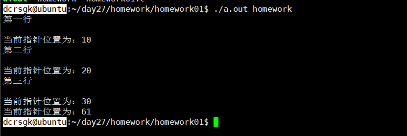
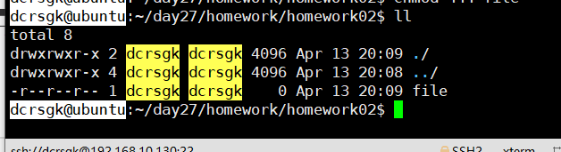
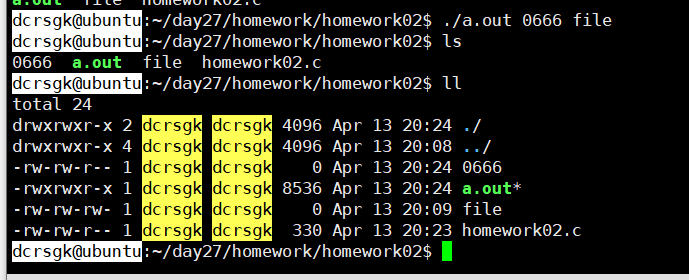
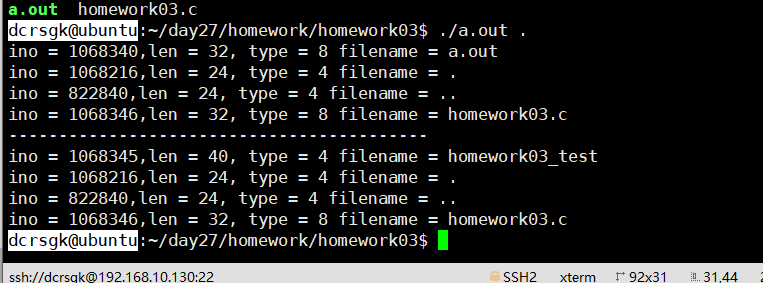
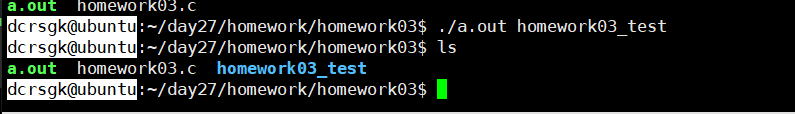
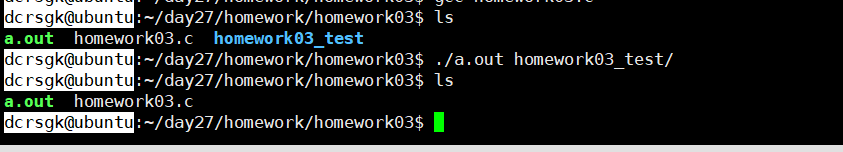

# day27作业

1、 文件里面存放了5行数据，使用追加模式打开文件，打印前3行，并写入一行，期间使用ftell打印当前位置

- 

2、 修改文件的权限，注意必须使用命令行参数

- 修改前

  - 

- 修改后

  - 

  

3、 打印当前目录，然后改变当前目录，再打印当前目录

- 打印当前目录
  -  
- 改变当前目录，再打印当前目录
  - 

4、 创建一个目录，然后删除掉它

- 创建一个目录
  - 
- 删除
  - 

5、传递一个路径名，还有一个文件名，搜索对应路径下是否有该文件，有就打印显示改文件的绝对路径

6、传递任意一个目录路径，能够显示该目录的ls -l的效果

 