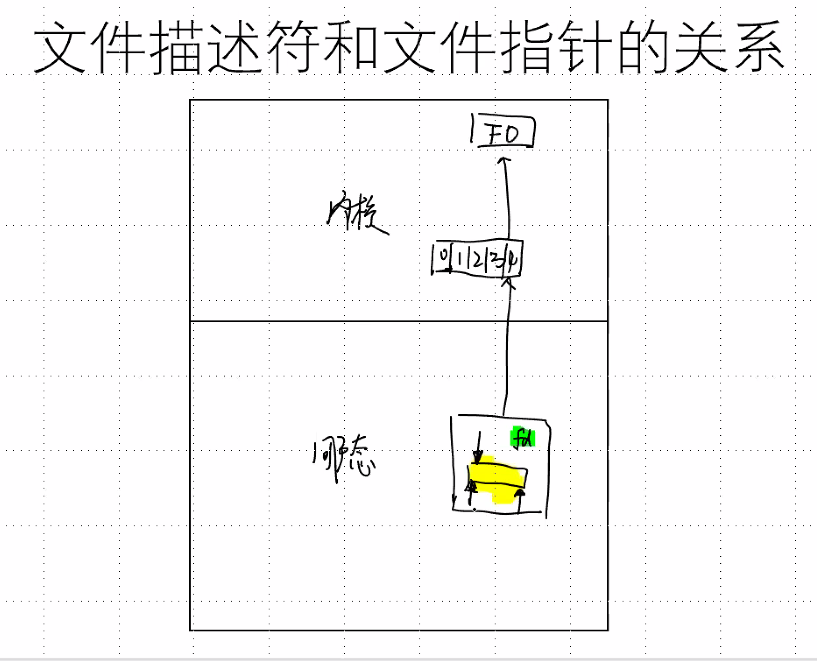
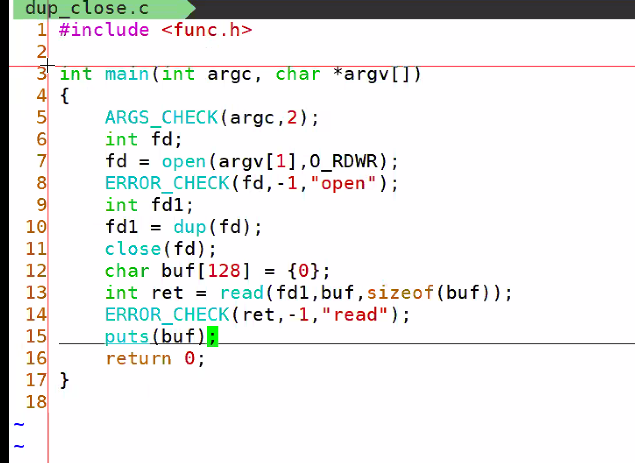
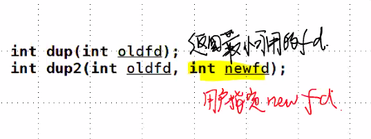
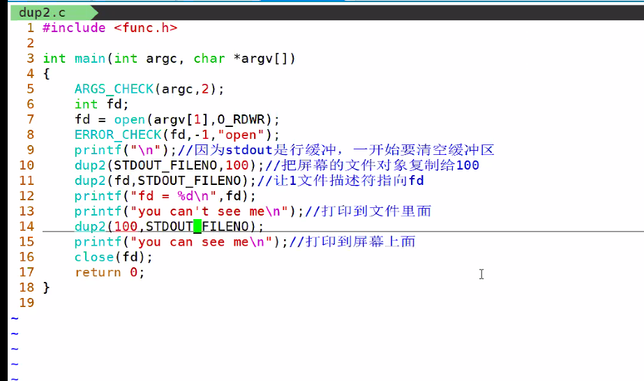

# day28 笔记

### Ep01 写在前面

- 实现tree命令
- 标准输入输出
- 文件描述符的复制 //下午重听
- 文件描述符和文件指针的转换 //下午重听
- IO多路转接模型

### Ep02 用C实现的tree命令

- ##### DFS：深度优先遍历

  > - 递归
  >
  > - 访问根节点，循环递归处理根的孩子
  >
  > - ```c++
  >   #include<stdio.h>
  >   #include<myLibrary.h>
  >   int DFSprint(char *path,int width)
  >   {
  >       DIR *dir = opendir(path);
  >       ERROR_CHECK(dir,NULL,"opendir");
  >       struct dirent *pDir;
  >       while(pDir = readdir(dir))
  >       {
  >           if(strcmp(pDir->d_name,".")==0 ||
  >             strcmp(pDir->d_name,".."==0)
  >              {
  >                  continue;
  >              }
  >           printf("%*s%s\n",width,"",pDir->d_name);
  >              //实现可变宽度
  >           spritnf(buf,"%s%s%s",path,"/",pDir->d_name);//实现字符串凭借
  >           if(pDir->d_type ==4)
  >              {
  >                  DFSprint( buf,width+4);
  >                  //dir1---->dir/dir1
  >              }
  >       }
  >       closedir(dir);
  >       return 0;
  >   }
  >   int main (int argc, char* argv[])
  >   {
  >       ARGS_CHECK(argc,2);
  >       puts(argv[1])；
  >       DFSprint(argv[1],0);
  >       return 0; 			
  >   }
  >   ```

### Ep02 文件描述符

- ##### 文件对象面向内核

  > - 内核中用一个数组存储文件描述符（为从0开始的非负整数）

- ##### 进程刚创建时，已经打开了三个文件对象（位于内核区）

  > - 标准输入：STDIN
  > - 标准输出：STDOUT
  > - 标准错误输出：STDERR

- ##### 缓冲区类型

  > - 全缓冲：
  >   - 当填满缓冲区后才进行实际 I/O操作。
  >   - 典型代表是对磁盘文件的读写。
  > - 行缓存：
  >   - 遇到某个特定符号才写入文件对象
  >   - 典型代表是标准输入(stdin)和标准输出(stdout)。
  > - 不缓冲：
  >   - 直接写回文件对象
  >   - 典型代表是标准错误文件 stderr

- ##### 不带缓冲的IO实现（无用户态的缓冲区）

  > - 打开：`int open (const char*path,int oflag,...);`
  >
  >   - int 即为文件描述符
  >
  >   - 失败时返回-1
  >
  >   - 头文件 //重听整理 
  >
  >   - `open.c`&`open_trunc.c`
  >     
  >     ```c
  >     .#include<
  >     #include<fcntl.h>
  >     int main(int argc ,char *argv[])
  >     {
  >         ARGC_CHECK(argc,2);
  >         int fd;
  >         fd = open(argv[1],0_RDWR);  //open.c
  >         fd = open(argv[1],0_RDWR|0_TRUNC);//open_trunc.c
  >         //打开并清空文件内容 相当于fopen的w模式 
  >         fd = open(argv[1],0_RDWR|0_CREAT,0666);//open_creat.c
  >         //会受文件掩码影响
  >         fd = open(argv[1],0_RDWR|0_CREAT|0_EXCL,0666);//open_excl.c
  >         //会受文件掩码影响
  >         ERROR_CHECK(fd,-1,"open");
  >         printf("fd = %d\n",);
  >         close(fd);
  >         return 0;
  >   }
  >     ```
  >     
  >   - flags和mode都是一组掩码的合成值，flags表示打开或者创建的方式，mode表示文件访问的权限
  >
  >   - flag的可选项为：
  >
  >   - |      掩码      | 含义                                                         |
  >| :------------: | ------------------------------------------------------------ |
  >     |  **O_RDONLY**  | 以**只读**的方式打开                                         |
  >     |  **O_WRONLY**  | 以**只写**的方式打开                                         |
  >     |     O_RDWR     | 以**读写**的方式打开                                         |
  >     |  **O_CREAT**   | 如果**文件不存在**则**创建文件**                             |
  >     |     O_EXCL     | **仅与O_CREAT连用**，如果文件错在则强制open失败（强制返回-1） |
  >     |  **O_TRUNC**   | **如果文件存在，将文件长度截成0**                            |
  >     |  **O_APPEND**  | 以**追加的方式打开文件**，每次调用write的时候都会将文件指针自动指向文件尾，用于多进程写入同一文件的情况。 |
  >     | **O_NONBLOCK** | **以非阻塞方式打开**，无论有无数据读取或者等待，都会立即返回进程之中 |
  >     |   O_NODELAY    | **以非阻塞方式打开**                                         |
  >     |   **O_SYNC**   | **同步打开文件**，只有在数据被真正写入物理设备设备后才返回   |
  >   
  > - 关闭：`int close(int fildes)`
  >
  >   - 成功则返回0，失败返回-1
  >
  > - 读：``ssize_t read(int fildes, void *buf, size_t nbyte);``
  >
  >   - `read.c`
  >
  >     - ```c
  >      #include<
  >       #include<fcntl.h>
  >       int main(int argc ,char *argv[])
  >       {
  >           ARGC_CHECK(argc,2);
  >           int fd;
  >           fd = open(argv[1],0_RDWR);
  >           ERROR_CHECK(fd,-1,"open");
  >           printf("fd = %d\n",);
  >           char buf[128]={0};
  >           int ret = read(fd,buf,sizeof(buf));
  >           printf("buf = %s,ret = %d\n",buf,ret);
  >           //全部打印
  >           close(fd);   
  >       }
  >       ```
  >       
  >     - 
  >   
  > - 写：`ssize_t write(int fildes,const void *buf,size_t nbyte;)`
  > 
  >   - `write.c`
  >
  >     ```c
  >    #include<fcntl.h>
  >     int main(int argc ,char *argv[])
  >    {
  >         ARGC_CHECK(argc,2);
  >        int fd;
  >         fd = open(argv[1],0_RDWR);
  >         ERROR_CHECK(fd,-1,"open");
  >         printf("fd = %d\n",);
  >     	int val = 10;
  >         int ret = write(fd,&val,sizeof(int));
  >         printf("write count %d\n",ret);
  >        	//写入任何数值
  >         //:%!xdd  用转换命令查看
  >         close(fd);
  >         return 0；
  >     }
  >     ```
  > 
  > - 读写效率
  > 
  >   - 系统调用：用户态切换到内核态
  >   - 缓冲区太小导致频繁系统调用导致代码效率低下
  
- ##### ftruncate：改变文件大小

  > - 实例：
  >
  >   - ```c
  >     #include<
  >     #include<fcntl.h>
  >     int main(int argc ,char *argv[])
  >     {
  >         ARGC_CHECK(argc,2);
  >         int fd;
  >         fd = open(argv[1],0_RDWR);
  >         ERROR_CHECK(fd,-1,"open");
  >         printf("fd = %d\n",);
  >         int ret = ftruncate(fd,3);
  >         ERROR_CHECK(ret,-1,"ftruncate");
  >         close(fd,-1,"open");
  >         //补不足或砍有余
  >         //不足的填充成0
  >     } 
  >     ```
  >   
  > - mmap：建立磁盘文件和内存的映射
  >
  >   - 直接交换内存和磁盘的数据，不通过cpu
  >
  >   - 要求文件有固定的大小
  >
  >   - ```c
  >    #include<sys/mman.h>  //头文件
  >     #include<fcntl.h>
  >     int main(int argc ,char *argv[])
  >     {
  >         ARGC_CHECK(argc,2);
  >         int fd;
  >         fd = open(argv[1],0_RDWR);
  >         ERROR_CHECK(fd,-1,"open");
  >         printf("fd = %d\n",);
  >     	char *p = (char*)mmap(NULL,5,PROT_READ|
  >     	PROT_WRITE,MAP_SHARED,fd,0);
  >         //5代表文件长度
  >         //fd：文件描述符
  >         ERROR_CHECK(ret,(char*)-1,"ftruncate");
  >         //较为复杂
  >         p[5] = '\0';
  >         printf("%s\n",p);
  >         p[0] = 'H';
  >         munmap(p,5);
  >         close(fd);
  >         return 0;
  >     }
  >        
  >     ```
  > 

### Ep03 文件空洞

- ##### lseek：

  > - ```c 
  >   int main(int argc ,char *argv[])
  >   {
  >       ARGC_CHECK(argc,2);
  >       int fd;
  >       fd = open(argv[1],0_RDWR);
  >       ERROR_CHECK(fd,-1,"open");
  >       printf("fd = %d\n",);
  >       int ret = lseek(fd,1024,SEEK_SET);
  >       //写入1024个长度的文件空洞
  >       printf("pos = %d\n",ret);
  >       char c  = 'H';
  >       write(fd,&c,sizeof(char));
  >       fclose(fd);
  >   }   
  >   ```

- ##### 文件描述符和文件指针的关系

  > - 
  >
  > - 使用文件指针打开的文件用途描述符也能访问
  >
  >   - ````c++
  >     int main(int argc ,char *argv[])
  >     {
  >         ARGC_CHECK(argc,2);
  >         int fd;
  >         fd = fopen(argv[1],"rb+"); 
  >         //使用FILE（文件结构体）打开文件
  >         char str[] = "from read\n";
  >         write(3,str,strlen(str));
  >         //使用文件描述符进行读写
  >         fclose(fp);
  >         return 0;
  >     }
  >     ````
  >
  > - 文件描述符和文件指针的转换
  >
  >   - fdopen：根据文件描述符创建合适的文件缓冲区
  >
  >     ```c
  >     int main(int argc ,char *argv[])
  >     {
  >         ARGC_CHECK(argc,2);
  >     	//int fd = open(argv[1],0,0_RDWR);
  >         //ERROR_CHECK(fd,-1,"open 5");
  >         FILE *fp = fdopen(fd,"rb+");
  >         ERROR_CHECK(fp,NULL,"fdopen 7");
  >         int fd fileno(fp);
  >         char buf[128] = {0};
  >         //printf("before close fd = %d\n",fd);
  >         //close(fd);
  >         //printf("before close fd = %d\n",fd);
  >         char *p = fgets(buf,sizeof(buf));
  >         //读取一行存入buf
  >         ERROR_CHECK(p,NULL,"fgets 11");
  >         printf("buf = %s\n",buf);
  >     	return 0;
  >     }    
  >     ```
  >   
  >- 
  >   
  >```c
  >     int main(int argc ,char *argv[])
  >     {
  >           ARGC_CHECK(argc,2);
  >     	//int fd = open(argv[1],0,0_RDWR);
  >         //ERROR_CHECK(fd,-1,"open 5");
  >           FILE *fp = fdopen(fd,"rb+");
  >           ERROR_CHECK(fp,NULL,"fdopen 6");
  >           int fd fileno(fp);
  >           char buf[128] = {0};
  >           read(fd,buf,sizeof(buf));
  >           printf("buf = %s/n",buf);
  >     }
  > ```
  
- ##### 文件描述符的复制

  > - `dup.c`
  >
  > - ```c
  >   //初始的文件描述符从3开始
  >   int mian(int argc,char*argv[])
  >   {
  >       ARGC_CHECK(argc,2);
  >       int fd;
  >       fd = open(argc[1],O_RDWR);
  >       ERROR_CHECK(fd,-1,"open Error");
  >       printf("fd = %d\n",fd);
  >       //打印文件描述符，此时为3
  >       //在开始运行的时候就分配了3个文件描述符
  >       //0：STDIN
  >       //1：STDOUT
  >       //2：STDERR
  >       close(fd);
  >   }
  >   ```
  >
  >   
  >
  > - 

### Ep04 标准输出

- ##### dup：返回最小可用的fd

  > - 引用计数
  >
  > - 
  >
  > - 当引用计数>1时候，删除fd不受影响
  >
  > - 当引用计数=1时候，释放文件对象
  >
  > - ```c
  >   int main(int argc ,char *argv[])
  >   {
  >       ARGC_CHECK(argc,2);
  >       int fd = open(argv[1],0,0_RDWR);
  >       ERROR_CHECK(fd,-1,"open 5");
  >       int fd1;
  >       fd1 = dup(fd);
  >       close(fd);
  >       char buf[128] = {0};
  >       
  >       
  >       
  >   ```

- 


- ##### stdio

  > - ```c
  >   int main()
  >   {
  >       write(1,"hello",5);
  >       //类似printf 效果相同
  >       //printf("hello");
  >       return 0;
  >   }
  >   ```

- ##### 重定向输出

  > - dup_stdout：文件输出重定向
  >
  >   ```c
  >   int main(int argc ,char *argv[])
  >   {
  >       ARGC_CHECK(argc,2);
  >       int fd = open(argv[1],0,0_RDWR);
  >       ERROR_CHECK(fd,-1,"open");
  >       printf("\n");
  >       //因为stdout是行缓冲，需要清空缓冲区
  >       //
  >       close(STOOD_FILENO);
  >       int fd1; 
  >       fd1 = dup(fd);
  >       printf("fd1 = %d\n",fd1);
  >       //fd1 == 1;
  >       printf("can you see me?");
  >       //
  >       close(fd);
  >    	return 0;   
  >   }
  >   ```
  >
  > \

- ##### dup2

  > - 
  >
  > - ```c++
  >   int main(int argc ,char *argv[])
  >   {
  >       ARGC_CHECK(argc,2);
  >       int fd = open(argv[1],0,O_RDWR);
  >       ERROR_CHECK(fd,-1,"open");
  >       printf("\n");
  >       //因为stdout是行缓冲，需要清空缓冲区
  >       dup2(STDOUT_FILENO,100);
  >       //将屏幕文件对象复制给100
  >       dup2(fd,STDOUT_FILENO);
  >       //让文件描述符指向fd
  >       printf("fd = %d\n",fd);
  >       printf("you can't see me");
  >       //打印到文件
  >       dup2(100,STDOUT_FILENO);
  >   	printf("you can see me");
  >       //打印到屏幕
  >       close(fd);
  >    	return 0;   
  >   }
  >   ```

### Ep05 有名管道：named pipe/FIFO

- ##### 前言：信息传递的三种方式

  > - | 传输方式 | 含义                               |
  >   | -------- | ---------------------------------- |
  >   | 全双工   | 双方可以同时向另一方发送数据       |
  >   | 半双工   | 双方可以向另一方发送数据，不能同时 |
  >   | 单工     | 只能一方向另一方发送数据           |
  >
  >   

- ##### 管道

  > - 管道是一种半双工
  >
  > - 管道不能存储数据
  >
  > - 管道不能打开
  >
  > - 后缀为.pipe
  >
  > - 创建管道：mkfifo 1.pipe
  >
  > - 使用cat 打开管道的读端，用echo打开管道的写端
  >
  > - 如果只打开一端，则会阻塞程序，只有建立好管道之后才会继续进程
  >
  > - C实现管道的读端和写端
  >
  >   - `open("1.pipe" O_RDONLY);//打开读端`
  >
  >   - `open("1.pipe",O_WRONLY)//打开写端`
  >
  >   - ```c
  >     //打开管道的读端
  >     int main(int argc, char *argv[])
  >     {
  >         ARGC_CHECK(argc,2);
  >         int fdr = open(argv[1],0_RDONLY);
  >         ERROR_CHECK(fdr,-1,"open 4");
  >         printf("fdr = %d\n",fdr);
  >         char buf[128]={0};
  >         read(fdr,buf,sizeof(buf));
  >         printf("buf = %s\n",buf);
  >      	return 0；   
  >     }
  >     //
  >     ```
  >
  >   - ```c
  >     //打开管道的写端
  >     int main(int argc, char *argv[])
  >     {
  >         ARGC_CHECK(argc,2);
  >         int fdw = open(argv[1],0_WRONLY);
  >         //写 
  >         ERROR_CHECK(fdr,-1,"open 4");
  >         char buf[128]="hello world";
  >         write(fdr,buf,sizeof(buf));
  >         printf("buf = %s\n",buf);
  >         return 0；   
  >     }
  >     ```
  >
  > - 实现全双工的管道：双端队列思想
  >
  >   - 建立两条管道实现全双工，以下的弊端是需要先读取才能收到信息。
  >
  >   - char1.c
  >
  >   - ```c
  >     int main(int argc, char *argv[]){
  >         ARGC_CHECK(argc,3);
  >         int fdr = open(argv[1],O_RDONLY);
  >         //1.pipe读端
  >         int fdw = open(argv[1],O_WRONLY);
  >         //2.pipe写端
  >         ERROR_CHECK(fdr,-1,"open 4");
  >         printf("i am char1 fdr %d fwd = %d",fdr,fdw);
  >         char buf[1024] = {0};
  >     	while(1)
  >         {
  >             memset(buf,0,sizeof(buf));
  >             read(STDIN_FILENO,buf,sizeof(buf));
  >             //从键盘读取，以换行结尾
  >             write(fdw,buf,strlen(buf)-1);
  >             memset(buf,0,sizeof(buf));
  >             read(fdr,buf,sizeof(buf));
  >             //从管道中读取
  >             puts(buf);
  >         }
  >         char buf[128]={0};
  >         read(fdr,buf,sizeof(buf));
  >         printf("buf = %s\n",buf);
  >      	return 0； 
  >     }
  >     ```
  >
  >   - char2.c
  >
  >   - ```c
  >     int main(int argc, char *argv[]){
  >         ARGC_CHECK(argc,3);
  >         int fdr = open(argv[1],O_WRONLY);
  >         //1.pipe的写端
  >         int fdw = open(argv[2],O_OPONLY);
  >         //2.pipe的读端
  >         ERROR_CHECK(fdr,-1,"open 4");
  >         printf("i am char2 fdr %d fwd = %d",fdr,fdw);
  >         char buf[1024] = {0};
  >     	while(1)
  >         {
  >             memset(buf,0,sizeof(buf));
  >             read(STDIN_FILENO,buf,sizeof(buf));
  >             //从键盘读取，以换行结尾
  >             write(fdw,buf,strlen(buf)-1);
  >             memset(buf,0,sizeof(buf));
  >             read(fdr,buf,sizeof(buf));
  >             //从管道中读取
  >             puts(buf);
  >         }
  >         char buf[128]={0};
  >         read(fdr,buf,sizeof(buf));
  >         printf("buf = %s\n",buf);
  >      	return 0； 
  >     }
  >     ```
  >
  > - 建立两条管道实现全双工Ⅱ
  >
  >   - 


