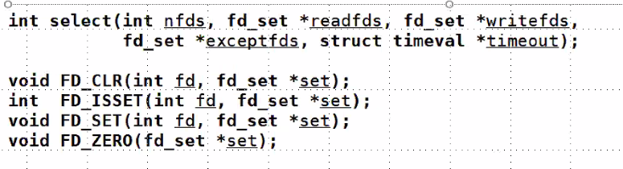
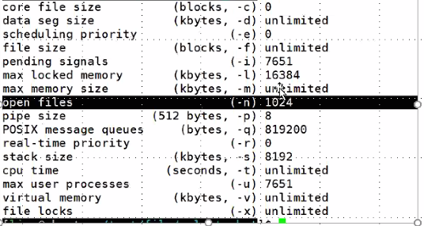

# day29 笔记

### Ep01 写在前面

### Ep02 ：IO多路复用

- 什么是IO多路复用
  > - 需要IO时候需要阻塞态进程
  >   - gets/getchar
  >   - fread/fscanf
  >   - read
  >   - pipe：建立读写端的时候阻塞
  > - 服务器端编程经常需要构造高性能的IO模型，常见的IO模型有四种：
  >   - 同步阻塞IO（Blocking IO）：即传统的IO模型。
  >   - 同步非阻塞IO（Non-blocking IO）：默认创建的socket都是阻塞的，非阻塞IO要求socket被设置为NONBLOCK。注意这里所说的NIO并非Java的NIO（New IO）库。
  >   - IO多路复用（IO Multiplexing）：即经典的Reactor设计模式，有时也称为异步阻塞IO，Java中的Selector和Linux中的epoll都是这种模型。
  >   - 异步IO（Asynchronous IO）：即经典的Proactor设计模式，也称为异步非阻塞IO。

- **select接口**
  > - 
  >
  >   - int nfds：最大文件描述符+1
  >   - fd_set *readfds：输入
  >   - fd_set *wrotefds：输出
  >   - fd_set *excepfds：异常
  >   - struct timeval：最长等待时间（超时时间）
  >
  > - 将所有需要等待的文件描述符放在同一个集合内（fd_set ）
  >
  >   - 创建一个fd_set 的变量
  >   - 先使用FD_ZERO清空set（初始化？）
  >   - 循环使用fd_set将文件描述符加入set
  >
  > - 调用select（信箱）程序进入阻塞态
  >
  > - 当set中有文件描述符可用的时候，直接解除阻塞
  >
  >   - 调用FD_ISSET检查文件描述符是否可以
  >   - 若可用则进行读取
  >
  > - 代码示例
  >
  >   - `read.c`
  >
  >     ```c
  >     int main(int argc,char*argv)
  >     {
  >         ARGS_CHECK(argc,3);
  >         int fdr = open(argv[1],O_RDONLY);
  >         fd_set rdrset;
  >         //读取集合
  >         FD_ZERO(&rdset);
  >         //清空rdset
  >         FD_SET(fdr,&rdset);
  >         //将fdr加入监听
  >         FD_SET(STDIN_FILENO,&rdset);
  >         //将标准输入加入监听
  >         select(fdr+1,&rdset,NULL,NULL,NULL);
  >         //使用select等待
  >         char buf[128] = {0};
  >         if(FD_ISSET(fdr,&rdset))
  >         {
  >             printf("message from pipe\n");
  >             read(fdr,buf,sizeof(buf));
  >             printf("buf = %s\n",buf);
  >         }
  >         if(FD_ISSET(STDIN_FILENO,&rdset))
  >         {
  >             printf("message from STDIN\n");
  >             read(fdr,buf,sizeof(buf));
  >             printf("buf = %s\n",buf);
  >         }
  >         return 0;
  >     }
  >     ```
  >
  >   - write.c
  >
  >   - ```c
  >     int main(int argc,char*argv)
  >     {
  >         ARGS_CHECK(argc,3);
  >         int fdw = open(argv[1],O_RDONLY);
  >         puts("sleep 5 secend.");
  >         sleep(5);
  >         puts("wake up");
  >         write(fdw,"hello")
  >         fd_set rdrset;
  >     ```
  >
  > - 循环使用select（即时聊天的实现）
  >
  >   - `select_char1.c`
  >
  >     ```c
  >     int main(int argc,char*argv)
  >     {
  >         ARGS_CHECK(argc,3);
  >         int fdr = open(argv[1],O_RDONLY);
  >         int fdw = open(argv[2],O_WDONLY);
  >         //chat1
  >         puts("char1")
  >         fd_set rdrset;
  >         //读取集合
  >         while(1)
  >         {
  >         	FD_ZERO(&rdset);
  >        	 	//清空rdset
  >         	FD_SET(fdr,&rdset);
  >         	//将fdr加入监听
  >        	 	FD_SET(STDIN_FILENO,&rdset);
  >         	//将标准输入加入监听
  >         	select(fdr+1,&rdset,NULL,NULL,NULL);
  >         	//使用select等待
  >         	char buf[128] = {0};
  >         	if(FD_ISSET(fdr,&rdset))
  >         	{
  >             	printf("message from pipe\n");
  >                 memset(buf,0,sizeof(buf));
  >                 //重置buf的值
  >            	 	read(fdr,buf,sizeof(buf));
  >             	printf("buf = %s\n",buf);
  >        		 }
  >         	if(FD_ISSET(STDIN_FILENO,&rdset))
  >         	{
  >             	printf("message from STDIN\n");
  >             	read(fdr,buf,sizeof(buf));
  >                 printf("buf = %s",buf);
  >                 write(fdw,buf,strlen(buf)-1);
  >                 //忽略换行符
  >             }
  >             return 0;
  >         }
  >     	return 0；
  >     }
  >     
  >     ```
  >
  >   - `select_char2.c`
  >
  >     ```c
  >     int main(int argc,char*argv)
  >     {
  >         ARGS_CHECK(argc,3);
  >         int fdw = open(argv[2],O_WDONLY);
  >         int fdr = open(argv[1],O_RDONLY);
  >         //chat2
  >         puts("char2")
  >         fd_set rdrset;
  >         //读取集合
  >         while(1)
  >         {
  >         	FD_ZERO(&rdset);
  >        	 	//清空rdset
  >         	FD_SET(fdr,&rdset);
  >         	//将fdr加入监听
  >        	 	FD_SET(STDIN_FILENO,&rdset);
  >         	//将标准输入加入监听
  >         	select(fdr+1,&rdset,NULL,NULL,NULL);
  >         	//使用select等待
  >         	char buf[128] = {0};
  >         	if(FD_ISSET(fdr,&rdset))
  >         	{
  >             	printf("message from pipe\n");
  >                 memset(buf,0,sizeof(buf));
  >                 //重置buf的值
  >            	 	read(fdr,buf,sizeof(buf));
  >             	printf("buf = %s\n",buf);
  >        		 }
  >         	if(FD_ISSET(STDIN_FILENO,&rdset))
  >         	{
  >             	printf("message from STDIN\n");
  >             	read(fdr,buf,sizeof(buf));
  >                 printf("buf = %s",buf);
  >                 write(fdw,buf,strlen(buf)-1);
  >                 //忽略换行符
  >             }
  >         }
  >     	return 0；
  >     }
  >     
  >     ```
  >
  > - timeout：内核等待指定的描述字中就绪的时间长度
  >
  >   - **返回值**：失败-1 超时0 成功>0
  >
  >   - 处理select的返回值
  >
  >   - 
  >
  >   - `chat1_update：`
  >
  >     ```c
  >     int main(int argc,char*argv)
  >     {
  >         ARGS_CHECK(argc,3);
  >         int fdr = open(argv[1],O_RDONLY);
  >         int fdw = open(argv[2],O_WDONLY);
  >         //chat1
  >         puts("char1")
  >         fd_set rdrset;
  >         //读取集合
  >          char buf[128] = {0};
  >         struct timeval timeout;
  >         while(1)
  >         {
  >             bzero(&timeout,sizeof(timeout));
  >             //将timeout清零  	
  >             timeout.
  >             FD_ZERO(&rdset);
  >        	 	//清空rdset
  >             FD_SET(fdr,&rdset);
  >         	//将fdr加入监听
  >        	 	FD_SET(STDIN_FILENO,&rdset);
  >         	//将标准输入加入监听
  >         	int ret = select(fdr+1,&rdset,NULL,NULL,&timeout);
  >         	//使用select等待
  >             if(ret >0)
  >             {
  >                 if(FD_ISSET(fdr,&rdset))
  >                 {
  >                     printf("message from pipe\n");
  >                     memset(buf,0,sizeof(buf));
  >                     //重置buf的值
  >                     read(fdr,buf,sizeof(buf));
  >                     printf("buf = %s\n",buf);
  >        		 	}
  >         		if(FD_ISSET(STDIN_FILENO,&rdset))
  >                 {
  >                     printf("message from STDIN\n");
  >                     read(fdr,buf,sizeof(buf));
  >                     printf("buf = %s",buf);
  >                     write(fdw,buf,strlen(buf)-1);
  >                     //忽略换行符
  >        	         }
  >         	}
  >             else
  >             {
  >                 puts("time out");
  >             }
  >         }
  >     	return 0；
  >     }
  >     ```
  >
  >   - 
  >
  >   - `chat2_update.c`
  >
  >     ```c
  >     int main(int argc,char*argv)
  >     {
  >         ARGS_CHECK(argc,3);
  >     	int fdw = open(argv[1],O_WDONLY);
  >         int fdr = open(argv[2],O_RDONLY);
  >     
  >         //chat2
  >         puts("char2")
  >         fd_set rdrset;
  >         //读取集合
  >         char buf[128] = {0};
  >         struct timeval timeout;
  >         while(1)
  >         {
  >             bzero(&timeout,sizeof(timeout));
  >             //将timeout清零  	
  >             timeout.
  >             FD_ZERO(&rdset);
  >        	 	//清空rdset
  >             FD_SET(fdr,&rdset);
  >         	//将fdr加入监听
  >        	 	FD_SET(STDIN_FILENO,&rdset);
  >         	//将标准输入加入监听
  >         	int ret = select(fdr+1,&rdset,NULL,NULL,&timeout);
  >         	//使用select等待
  >             if(ret >0)
  >             {
  >                 if(FD_ISSET(fdr,&rdset))
  >                 {
  >                     printf("message from pipe\n");
  >                     memset(buf,0,sizeof(buf));
  >                     //重置buf的值
  >                     read(fdr,buf,sizeof(buf));
  >                     printf("buf = %s\n",buf);
  >        		 	}
  >         		if(FD_ISSET(STDIN_FILENO,&rdset))
  >                 {
  >                     printf("message from STDIN\n");
  >                     read(fdr,buf,sizeof(buf));
  >                     printf("buf = %s",buf);
  >                     write(fdw,buf,strlen(buf)-1);
  >                     //忽略换行符
  >        	         }
  >         	}
  >             else
  >             {
  >                 puts("time out");
  >             }
  >         }
  >     	return 0；
  >     }
  >     ```
  >
  > - fdset：固定大小的位图，每一位代表是否在fd_set内
  >
  >   - 大小和open files（最多可以打开的文件数）有关
  >
  >     
  >
  >   - 
  >
  > - bzero：同理memset（不需要写0的menset）
  >
  >   - bzero()；
  >
  > - select的退出：
  >
  >   - 当写端关闭的时候：即read读取到EOF的时候，会直接返回0
  >
  >   - 由于返回0，则会直接进去读端（一直读到0），select会认为未阻塞进程，陷入死循环
  >
  >   - 解决方法：详见33行
  >
  >   - ```c
  >     int main(int argc,char*argv)
  >     {
  >         ARGS_CHECK(argc,3);
  >         int fdr = open(argv[1],O_RDONLY);
  >         int fdw = open(argv[2],O_WDONLY);
  >         //chat1
  >         puts("char1")
  >         fd_set rdrset;
  >         //读取集合
  >          char buf[128] = {0};
  >         struct timeval timeout;
  >         while(1)
  >         {
  >             bzero(&timeout,sizeof(timeout));
  >             //将timeout清零  	
  >             timeout.
  >             FD_ZERO(&rdset);
  >        	 	//清空rdset
  >             FD_SET(fdr,&rdset);
  >         	//将fdr加入监听
  >        	 	FD_SET(STDIN_FILENO,&rdset);
  >         	//将标准输入加入监听
  >         	int ret = select(fdr+1,&rdset,NULL,NULL,&timeout);
  >         	//使用select等待
  >             if(ret >0)
  >             {
  >                 if(FD_ISSET(fdr,&rdset))
  >                 {
  >                     printf("message from pipe\n");
  >                     memset(buf,0,sizeof(buf));
  >                     //重置buf的值
  >                     int read_ret = read(fdr,buf,sizeof(buf));
  >                     //加入判断
  >                     if(ret == 0)
  >                     {
  >                         puts("char is broken\n");
  >                     }
  >                     printf("buf = %s\n",buf);
  >        		 	}
  >         		if(FD_ISSET(STDIN_FILENO,&rdset))
  >                 {
  >                     printf("message from STDIN\n");
  >                     
  >                     int read_ret2 = read(fdr,buf,sizeof(buf));
  >                     if(read_ret2 == 0)
  >                     {
  >                          puts("char is broken\n");
  >                     }
  >                     printf("buf = %s",buf);
  >                     write(fdw,buf,strlen(buf)-1);
  >                     //忽略换行符
  >        	         }
  >         	}
  >             else
  >             {
  >                 puts("time out");
  >             }
  >         }
  >     	return 0；
  >     }
  >     ```
  >
  >   - 当读端先关闭的时候：会触发一个SIG_PIPE信号
  >   
  > - Ctrl+c和Ctrl+d
  >
  >   - Ctrl+c：终止进程
  >   - Ctrl+d：输入EOF
  >   
  > - 写集合
  >   
  >   - 当管道满的时候，写入操作阻塞
  >   
  >   - 此时可以用select监听
  >   
  >   - 一旦有空间就不再阻塞
  >   
  >   - wirte_set.c
  >   
  >     ```cpp
  >     int main(int argc,char*argv)
  >     {
  >         ARGS_CHECK(argc,2);
  >         int fdr = open(argv[1],O_RDWR);
  >         //同时打开，不会阻塞
  >         int fdw = open(argv[1],O_RDWR);
  >         fd_set rdSet;
  >         fd_set wrSet;
  >         while(1)
  >         {
  >             FD_ZERO(&rdSet);
  >             FD_ZERO(&wrSet);
  >             //清空管道读写
  >             FD_SET(fdr,&rdSet);
  >             FD_SET(fdw,&wrSet);
  >             //添加管道
  >             select(fdw+1,&rdSet,&weSet,NULL,NULL);
  >             //加入监听
  >             if(FD_ISSET(fdr,&rdSet))
  >             {
  >                 char buf{256} = {0};
  >                 read(fdr,buf,sizeof(buf));
  >                 puts(1buf);
  >                 sleep(1);
  >                  
  >             }
  >             if(FD_ISSET(fdr,&wrSet))
  >             {
  >                 write(fdw,"helloworld",10);
  >                 sleep()
  >             }
  >         }
  >     ```

