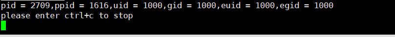

# day30 作业

[TOC]

### 01 什么是进程？进程和程序有哪些差异？

- 进程：是一个程序执行一次的过程，是一个动态的过程
- 程序：是保留在磁盘上的指令的有序集合。是一个静态的过程。

### 02 为什么要引入进程？

- 内核使用进程来控制CPU和其他系统的调用

### 03 编写程序，打印当前进程pid，父进程pid，真实用户ID，真实组ID，有效用户ID，有效组ID

- ```c
  #include <myLibrary.h>
  int main()
  {
      pid_t pid;
      pid_t ppid;
      pid = getpid();
      ppid = getppid();
      printf("pid = %d,ppid = %d,uid = %d,gid = %d,euid = %d,egid = %d\n",
             pid,ppid,getuid(),getgid(),geteuid(),getegid());
      puts("please enter ctrl+c to stop");
      while(1);
      return 0;
  }
  ```

- 

### 04 A用户编写一个程序，用来往file文件中写入内容hello，然后编译后，增加s权限，这时B用户执行该程序，能够往file文件中写入hello。

- ```c
  #include <myLibrary.h>
  
  int main(int argc,char*argv[])
  {
      ARGS_CHECK(argc,2);
      int fd;
      fd = open(argv[1],O_RDWR);
      ERROR_CHECK(fd,-1,"open Error,7");
      char val[]={"power overwhelming\n"};
      int ret;
      ret = write(fd,&val,sizeof(val));
      ERROR_CHECK(ret,-1,"write Error,11");
      close (fd);
      return 0;
  }
  ```

- 