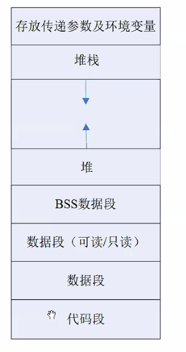
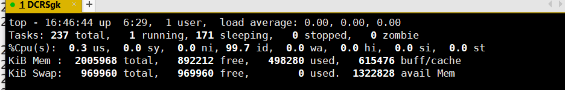

#  day30 笔记：Linux系统编程

### Ep01写在前面 大概5周

- 操作系统

- 计算机网络

- BFS

- 偏向实战：手动多写代码

- 进程 2天u

- 进程间通信 3~4天

  > - IPC：inter progress communication
  > - 管道：有名管道无名管道
  > - 系统IPC：共享内存，消息队列，信号量
  > - 信号：理解异步机制 1天

- 线程：2~3天

  > - 线程的概念，线程和进程的关系，线程和进程的区别
  > - 线程的创建，退出，等待，取消
  > - 线程的资源清理
  > - 线程之间的关系（同步和互斥）

- 网络编程 7天

  > - 网络协议 1天
  > - tcp/ip模型 OSI **传输层协议 TCP和UDP** 应用层 报文格式 **三次握手 四次挥手**
  > - socket编程 3~4天
  >   - tcp方式，udp方式聊天程序 传输文件小程序
  >   - 5种IO模型 阻塞 非阻塞 同步异步 unix网络编程 select epoll
  >   - 进程池和线程池（项目基础） 2~3天

- 数据库 2天

  > - MySQl 安装 语法
  > - 链接数据库
  > - B树和B+树 

- 其他 2~3天

  > - libevent 事件通知库
  > - valgrind 内存泄漏检测工具
  > - 性能优化 负载均衡 横向扩展
  > - HTTP协议
  > - 软件测试 单元测试 测试用例

- Linux项目：网盘

  > - 1-5期  一个星期

### Ep02 进程

- 什么是进程？如何描述？
- 进程标识
- 进程身份
- 进程状态
  - 执行态
  - 就绪态
  - 等待态
- 进程结构
- 用户进程和内核进程


### Ep02 进程

- 什么是进程

  > - 进程是一个程序一次执行的过程，是一个动态过程
  > - 在Linux中，用struck task_struct储存进程（进程控制块）

- 进程的并发：对于单核cpu而言，一次只能有一个进程运行，但是同一时间段可以有多个进程

- 进程标识：为了保证进程的唯一性，进程用进程ID（标识号）来做进程标识

  > - PID：进程ID
  >
  > - PPID：父进程ID
  >
  > - ```c
  >   int main()
  >   {
  >       pid_t pid;
  >       pid_t ppid;
  >       pid = getpid();
  >       ppid = getppid();
  >       printf("pid = %d,ppid = %d",pid,ppid);
  >       while(1);
  >       return 0;
  >   }
  >   ```
  >
  > - init进程的pid = 1，ppid为0，为初始进程

- 进程的用户ID和组ID

  > - ```c
  >   int main()
  >   {
  >       printf("uid:%d gid:%d,euid:%d egid:%d \n",getuid(),getgid(),geteuid(),getegid());
  >       while(1);
  >       return 0;
  >   }
  >   ```
  >
  > - 默认情况下，
  >
  >   - 真实用户ID和有效用户ID相同
  >   - 一般情况下，有效用户ID等于实际用户ID，
  >   - 有效用户组ID等于实际用户组ID。
  >
  > - 当设置-用户-ID（SUID）位设置
  >
  >   - 有效用户ID等于文件的所有者的uid，而不是实际用户ID
  >
  > - 如果设置了设置-用户组-ID（SGID）位
  >
  >   - 有效用户组ID等于文件所有者的gid，而不是实际用户组ID。
  >
  > - 真实用户ID：真正执行程序的用户ID
  >
  > - 有效用户ID：
  >
  > - `writefile.c` 创造一个当前用户的文件
  >
  >   - ```c
  >     int main()
  >     {
  >         printf("uid:%d gid:%d,euid:%d egid:%d \n",getuid(),getgid(),geteuid(),getegid());
  >         int fd = open("file",O_RDWR);
  >         ERROR_CHECK(fd,-1,"open Error,4");
  >         writr(fd,"hello",5);
  >         while(1);
  >         return 0;
  >     }
  >     ```
  >
  >   - 切换用户之后不可执行
  >
  >   - 用 u+s 提升权限之后，其他用户便可执行文件
  >
  > - 权限提升：
  >
  >   - u+s：（对可执行文件有效）当其他用户执行程序的时候，进程的有效用户ID编程可执行程序的拥有者身法。
  >   - g+s：（对可执行文件有效）当其他用户执行程序的时候，进程的有效用户ID编程可执行程序的组身法。
  >   - o+t：粘滞位 对目录有效，修改目录下文件权限仅能由拥有者删除
  >     - 对目录而言，可执行权限意味着仅可以读取目录内容
  >     - 对目录可写才可以修改目录/在目录下创建文件
  >     - （目录的本质是链表）

- 进程的状态

  > - 执行态：进程正在运行（占用CPU）
  > - 就绪态：进程未运行，仅需等待CPU时间片即可执行
  > - 等待态：进程未运行，除CPU之外还有别的条件需要满足
  > - ps -elf：显示所有进程
  > - ps -aux：显示所有进程并显示CPU和内存的占用率
  > - top：从高到低显示CPU使用率
  >   - up：运行时间，load average ：平均负载 5/10/30
  >   - 其他自己看，懂的都懂
  >   - 
  > - 运行状态
  >   - R：运行态
  >   - S：睡眠态（就绪态）
  >   - T：暂停状态
  >   - Z：僵尸状态（僵尸进程）

