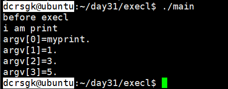
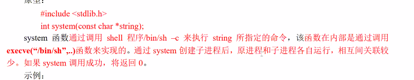
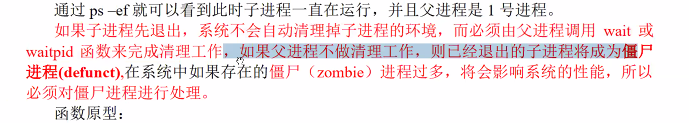
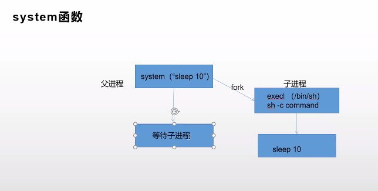
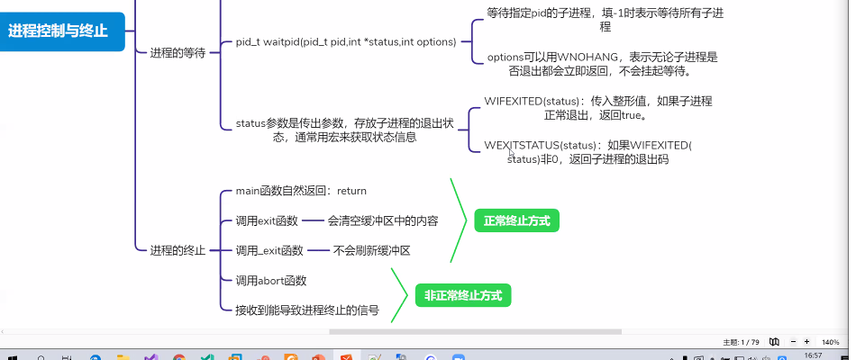

# day31


### Ep01 昨日重现

- ##### 进程和程序的区别

  > - 程序是静态的，是啊保持在磁盘上的指令集合
  > - 进程是动态的，是正在运行的程序，包含进程的创建调度消亡的过程

- ##### 进程是如何描述的

  > - 操作系统原理：通过控制进程块PCB描述进程
  > - 在Linux中用 struct task_struct来描述进程

- ##### 进程标识

  > - 进程ID：getpdi() 
  > - 父进程：getppid()
  > - 此处get的值为一个pid_t类型文件，但是输出占位符可以用%d

- ##### 程序运行的身份

  > - 便于进程的权限控制，内核检查的是有效ID，而不是真实ID
  > - 真实用户ID：getuid，有效用户ID：getuid
  > - 真实组ID：getgid，有效组ID：getegid
  > - 权限提升：u+s（获得用户权限）/g+s（获得组权限）
  >   - chmod u+s/g+s [可执行程序]
  >   - 假设 [可执行程序] 为用户A的文件，如果此时是B在执行，则有效用户ID是B
  >   - 经过权限提升之后，用户B在运行程序的时候，有效ID是A的ID
  > - 粘滞位：chmod o+t dir
  >   - 给日录增加粘滞位后，每个用尸在dir日录下只能删除自己创建的文件，其他用户创建的文件没有权限删除

- ##### 进程的状态

  > - 根据进程的状态可以分为：运行态，就绪态，等待态
  > - 进程结构：每个进程都有独立的进程地址空间（虚拟地址），进程和进程之间互不影响
  > - 进程管理：
  >   - ps：查看系统中的进程
  >   - top：动态显示系统中的进程
  >   - kill：向进程发送信号
  >   - 进程的常见状态：(根据当前系统划分)
  >   - R（运行），S（睡眠），T（暂停）Z（僵尸）
  >   - 此时这里的R状态统计就绪态和运行态进程（本质是统计一段时间的时间片，只要被分配到时间片就认为进程在运行）

### Ep02 Linux下的进程管理


- nice：按照用户指定的优先级运行，值越大，优先级越低

- renice：改变优先级

  > - renice -n [优先级] -p [pid]
  > - 静态优先级为0~139，动态优先级为100~139
  > - 0为最高优先级

- 调度算法

  > - 实时调度算法：
  >   - SCHED_FIFO：先进先出
  >   - SCHED_RR：时间片轮转
  > - 非实时调度算法
  >   - SCHED_NORMAL：不同优先级都能分配到时间片

### Ep03 fork函数

- ##### 原型

  > - ```c
  >   #include<unistd.h>
  >   pid_t fork(viod);
  >   ```
  >
  > - 在已存在的进程中创建一个新进程，新进程为子进程，原进程为父进程，一次返回两个值，父进程发返回值是子进程的进程号，子进程发返回值为0（出错为-1）
  >
  > - ```c
  >   int main()
  >   {
  >       pid_t retPid;
  >       retPid = fork();
  >       //对于父进程，fork返回子进程的pid
  >       //对于子进程，fork返回0
  >       //此时fork分裂成两个进程判断，
  >       //父进程走if
  >       //子进程走了else
  >       if(retPid>0)
  >       {
  >           printf("i am father\n");
  >           printf("Pid = %d\n",getpid());
  >           printf("child id = %d\n",retPid);
  >           while(1);
  >           return 0;
  >       }
  >       else
  >       {
  >           printf("i am child\n");
  >           printf("Pid = %d\n",getpid);
  >           printf("PPid = %d\n",getppid());
  >           while(1);
  >           return 0;
  >       }
  >   }
  >   ```
  >
  
- ##### 对于子进程的栈空间的数据 代码见堆空间下的代码注释注释

  > - 只有需要修改时候才给子进程分配真正的物理空间，如果没有修改操作则直接共享父进程的物理地址（虚拟地址）
  >
  > - 堆空间：同理
  >
  >   - ```c
  >     int main()
  >     {
  >         pid_t retPid;
  >         retPid = fork();
  >         //int i = 3
  >         char *p = (char*)malloc(20);
  >         strcpy(p,"hello");
  >         if(retPid>0)
  >         {
  >             printf("i am father\n");
  >             printf("Pid = %d\n",getpid());
  >             printf("child id = %d\n",retPid);
  >             //printf("i=%d\n",i);
  >             //i+=3;
  >             //printf("i=%d\n",i);
  >             //此时i的结果为3 6
  >             //对父进程的修改不会影响子进程
  >             //在修改的时候就分配新的物理空间给子进程
  >             printf("p=%s\n",p);
  >             p[0]='H';
  >             printf("p=%s\n",p);   
  >             while(1);
  >             return 0;
  >         }
  >         else
  >         {
  >             printf("i am child\n");
  >             printf("Pid = %d\n",getpid);
  >             printf("PPid = %d\n",getppid());
  >             //printf("i=%d\n",i);
  >             //此时i的结果为3
  >             //此时分配了新的地址空间给子进程
  >             printf("p=%s\n",p);   
  >             while(1);
  >             return 0;
  >         }
  >     }
  >     ```
  
- ##### 对于文件

  > - 在创建子进程的时候，虽然有独立的文件描述符，但是是共享同一个fork之前的文件对象
  >
  > - 在fork之前打开的文件共享一个文件对象(dup机制)
  >
  > - 在fork之后打开的文件是各自独立的文件对象
  >
  >   - ```c
  >     //cat file的结果为hello world或者world hello
  >     //子进程和父进程的执行速度有关
  >     int main()
  >     {
  >         pid_t retPid;
  >         //int fd=open("file",O_RDWR);
  >         //此处打开的是同一个文件对象
  >         retPid = fork();
  >         if(retPid>0)
  >         {
  >             int fd=open("file2",O_RDWR);
  >             printf("i am father\n");
  >             printf("Pid = %d\n",getpid());
  >             printf("child id = %d\n",retPid);
  >             lseek(fd,5,SEEK_SET);
  >             write（fd,"hello",5);
  >             //偏移影响子进程
  >             while(1);
  >             return 0;
  >         }
  >         else
  >         {
  >             int fd=open("file2",O_RDWR);
  >             printf("i am child\n");
  >             printf("Pid = %d\n",getpid);
  >             printf("PPid = %d\n",getppid());
  >            write(fd,"nihao",5);
  >             while(1);
  >            return 0;
  >         }
  >      }
  >     ```

### Ep04 exec函数族

- ecec*函数族原型

  > - ```c
  >   int execl(const char*path,const char*arg,...)
  >   ```
  >
  > - path为包括执行文件的全路径名
  >
  > - arg是可执行文件的命令行参数
  >
  > - 失败则返回-1
  >
  > - 用第一个参数指定的程序覆盖现有的进程空间，也就是说exec函数之后不会执行之后的代码

- 代码实例

  > - `print.c`
  >
  >   - 编译成print
  >
  >     ```c
  >     int main(int argc,char*argv[])
  >     {
  >         printf("i am print\n");
  >         for(int i=0;i<argc,i++)
  >         {
  >             printf("argv[%d]=%s",i,argv[i]);
  >         }
  >         return 0;
  >     }
  >     ```
  >
  > - `main.c`
  >
  >   - 编译之后，在mian程序里调用print程序
  >
  >     ```c
  >     int main(int argc,char*argv)
  >     {
  >         int ret;
  >         printf("before execl\n"); 
  >         ret = execl("./print","myprint","1","3","5",NULL);
  >         printf("after execl\n");    
  >         return 0;
  >     }
  >     ```
  >
  >   - 执行结果为：
  >
  >   - 

### Ep04 system函数：

- 原型

  > - 
  >
  >   ```c
  >   #include<stdlib.h>
  >   int system(const char*string);
  >   ```
  >
  > - 传参为字符串，成功过则返回0
  >
  > - 效率低 不建议使用
  >
  > - 实质是一种shell脚本指令。但是效率奇低

### Ep05进程的控制与终止

- 进程的控制// 重听一遍

  > - 阻塞：正在进行的进程由于发生某事件而暂时无法继续执行时，便放弃处理机而处于暂停状态，亦即进程的执行受到阻塞。
  > - 孤儿进程   //补充笔记
  >   - 如果父进程先于子进程退出，子进程则成为孤儿进程，此时子进程会被接管
  > - 僵尸进程：已经结束了但是没完全结束 //补充笔记
  >   - 

- 进程的终止

  > - main函数的自然返回（正常终止
  > - 调用exit函数（正常终止
  > - 调用\_exit函数（正常终止
  > - 调用about函数（不正常终止，本质是是终止信号）
  > - 接受到能导致进程终止的信号ctrl+C（异步终止）
  > - wait：会等待所有i进程，但是等待任何一个子进程退出就会终止进程
  > - exit：退出时会清理IO缓冲区
  > - _exit：直接退出
  > - 一般用文件描述符的都是没有缓冲的，有FILE*的都是有缓冲的。

### Ep06 今日总结

- nice/renice：按优先级/改变进程优先级
- kill：进程信号传递
- fork函数：复制进程，fork返回两次fork之后便继续向下执行COW（写时复制
- system函数
  - 
- 孤儿进程：父进程先结束，子进程成为孤儿进程，自动被init进程接管
- 僵尸进程：子进程先结素，系统不会自动清理子进程的资源，必须由父进程调用wait函数完成i清理工作，如果父进程未及时清理，则会变成僵尸进程
- 进程的等待
  - pid_t wait(int*status)
    - 随机等待一个退出的子进程，返回等待子进程的pid，如果没有子进程则一直挂起等待
  - pid_t waitpid(pid_t pid,int*status,int options)
    - 等待指定pid的子进程，若未-1则标识所有子进程
    - options可以用WNOHANG，标识无论是否由子进程退出都会直接返回，

