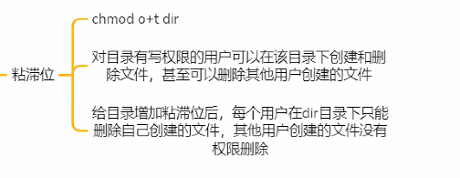
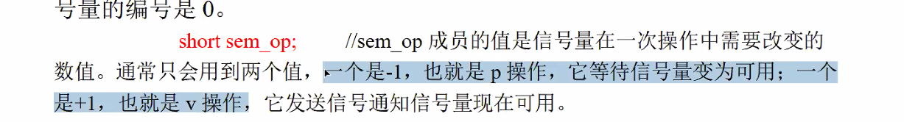

# day32 笔记

### Ep01 写在前面

- 进程的概念

  > - 进程是程序的一-次执行过程,是操作系统分配资源和调度的基本单位。
  > - 进程和程序的区别
  >   - 程序是静态的，是保存在磁盘上的指令集合
  >   - 进程是动态的，是正常运行的程序，包括进程的创建，调度，消亡
  > - 进程的描述
  >   - 操作系统：进程控制块PCB
  >   - Linux：用task_struct描述进程
  > - 进程标识
  >   - 进程ID：pid（gitpid()
  >   - 父进程标识：ppid(getppid()

- 进程的运行身份

  > - 便于进程的控制权限，内核检查的是有效id而不是真实id
  > - 真实用户id getuid 有效用户id：geteuid
  > - 真实组id getgid，有效组id：geiegid
  > - 权限提升：chmod u+s/g+s [可执行程序名]
  >   - 假设可执行程序是用户A执行的文件，当B在运行可执行程序的时候，有效用户id是B的
  >   - 权限提升之后，用户B在运行的时候有效用户id是拥有者的id，即A的id
  > - 

- 进程结构和进程状态

  > - 进程状态：运行/就绪/等待
  >   - 运行：分配到cpu，正在运行
  >   - 就绪：仅差cpu分配时间片
  >   - 等待：除cpu外还缺其他资源就绪
  > - 进程结构：每个进程都有独立的进程地址空间（有时候是虚拟地址）进程和进程之间互不影响
  > - 进程管理
  >   - `ps`：查看系统中的进程
  >     - `-elf`：查看所有
  >     - `-aux`：查看所有并显示cpu占用率
  >   - top：动态显示系统中的进程
  >     - 根据cpu占比从高到低统计，3s一刷，可用回车手动刷新
  >   - kill：向进程发送信号
  >     - -9：结束信号
  >     - 
  >   - 在Linux中，常见四种进程状态：
  >   - R（运行），S（睡眠），T（暂停），Z（僵尸）

- 进程的创建

  > - fork:通过复制父进程的方式创建子进程
  >   - `int fork()`
  >   - 在父进程中fork返回子进程的pid
  >   - 子进程中fork返回值为0
  >   - 写时复制：只有在需要写入的时候，数据才会被复制（赋予真正的物理地址）
  >     - 
  > - execl
  >   - `int execl("const char*","path.const char*",)`
  >   - 
  >   - 
  > - system
  >   - 
  >   - 
  > - 
  >   - 

- 进程的控制和终止

  > - 孤儿进程
  >   - 父进程先结束，子进程成为孤儿进程，自动被init接管
  > - 僵尸进程
  >   - 
  > - 进程的等待
  >   - `pid_t wait(int *status)`
  >     - 这里的`int *status`表示传出参数，存放子进程的退出状态
  >     - 随机等待一个退出的子进程，返回子进程的pid，如果没有则一直挂起等待
  >     - 属于阻塞的方法
  >   - `pid_t waitpid(pid_t pid,int *status,int options)`
  >     - 这里的`int *status`表示返回码，可以通过   解读
  >     - 等待指定pid的子进程，填-1的时候标识所有子进程
  >     - options可以用WNOHANG，表示无论子进程是否退出都会立即返回，不会挂起等待（仅有这种方式属于非阻塞方式）
  >   - 用宏获取信息status信息
  >     - WIFEXITED(status)：传入整形值，如果正常退出则true
  >     - WEXITST
  > - 进程的中止
  >   - main函数自然返回：return（正常终止）
  >   - 调用exit函数：会刷新缓冲区内容（正常终止）
  >   - 调用_exit函数：不会刷新缓冲区，直接结束（正常终止）
  >   - 调用abort函数：本质也是传入信号（非正常终止）
  >   - 接受能导致进程终止的信号（非正常终止）
  >     - `ctrl+c/ctrl+\`
  >   - 

- 守护进程

  > - 也称为后台服务进程，没有控制终端，独立于会话和控制终端运行
  > - 与运行环境隔离，包括描述符，控制终端，会话，进程组，工作目录和权限掩码。
  > - 编写规程
  >   - 创建子进程，父进程退出，子进程被init接管
  >   - 用setsid()在子进程中创建新的会话，摆脱原进程组、原会话和原控制终端的控制
  >   - 改变当前工作目录，重设文件权限掩码，关闭不需要的文件描述符

### Ep02守护进程：deamon进程

- 什么是守护进程

  > - 也叫后台进程，是一种脱离终端脱离会话的进程
  > - 脱离终端的目的：避免被终端输入的指令打断同时也避免在终端上显示信息。
  > - 

终端

- 会话

  > - 进程的集合
  >
  > - 首进程为shell进程
  >
  > - gitsid.c
  >
  >   - ```c
  >     int main()
  >     {
  >         printf("sid =%d",getsid(0));
  >     }
  >     ```
  >
  >   - 

- 进程组

  > - 多个进程组合成进程组
  > - `Ctrl+c`是对进程组发指令
  > - `setpgid`：建立新的进程组

- 创建守护进程

  > - 创建子进程，父进程退出（让子进程单独一个进程组）
  >
  > - 在子进程中建立新的会话：使用系统函数`setsid()`
  >
  > - 改变当前目录为根目录：`chdir("/");`
  >
  >   - fork继承的是父进程的当前目录
  >   - 进程在运行的是当前目录不能被卸载
  >   - 需要改为根目录
  >
  > - 重设文件掩码`umak`设置成000
  >
  > - 关闭不需要的文件描述符
  >
  > - 手动写一个
  >
  >   - ```c
  >     int main()
  >         if(fork())
  >         {
  >             exit(0);
  >             //直接孤儿，不要解释了
  >         }
  >     	setsid();
  >         chdir("/");
  >         umask(0);
  >         for(int i=0;i<3;i++)
  >         {
  >             close(1);
  >         }
  >         while(1)
  >         {
  >             sleep(1);
  >         }
  >     ```

### Ep03 下周重点

- 管道（常用

  > - 有名管道
  >   - 详见文件章节
  > - 无名管道
  >   - 只能在亲缘关系进程见通信（父子/兄弟进程）
  >   - 半双工
  >   - 是特殊的文件，可以用read，write，只能存在内存中
  >   - 

- 进程间通信

  > - 

- 共享内存

  > -

- **信号**（较难）接口多

  > -

- 信号量和消息队列（理解

  > - 消息队列：类似快递，和管道
  > - 信号量：pv操作
  >   - 
  >   - 