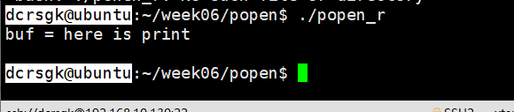
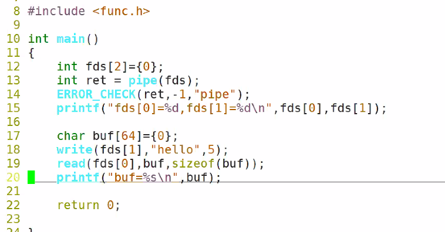
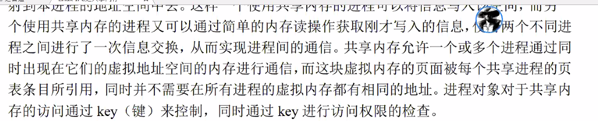
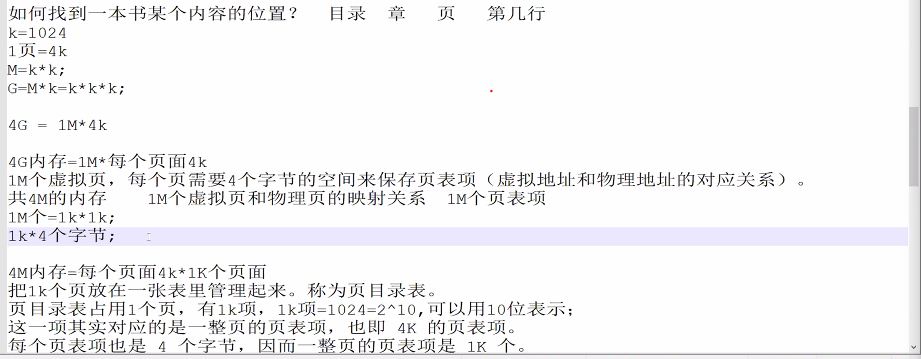

# day33 笔记

### Ep01 写在前面

- 再次复习进程，见day32的写在前面
- 多复习守护进程~~（重点）~~
- 进程间通信：管道&共享内存

### Ep02 管道

- 标准流管道 popen

  > - 函数原型
  >
  >   ```c
  >   FILE *popen(const char*comman,const char*openmode);
  >   //启动一个新进程，并且新进程也原进程之间有一条管道进行通信
  >   ```
  >
  >   - `command` 字符串是要运行的程序名
  >   - open_mode必须是`"w"/"r"`类型
  >   - 函数发牛一个FIFE*文件流指针，可以通过stdio函数，比如`fread`来读取文件输出。
  >   - 如果为`"w"` 调用程序就可以用`fwrite`向被调用程序发送数据，被调用程序可以在自己的标准输入上读取这些数据
  >
  > - `popen_r.c`
  >
  >   ```c
  >   int main()
  >   {
  >       FILE *fp;
  >       fp = popen("./peint","r");
  >       //重定向print的输出，当作此文件的输入
  >       char buf[64]={0};
  >       fread(buf,sizeof(char),sizeof(buf));
  >       printf("buf = %s\n",buf);
  >       pclose(fp);
  >       return 0;
  >   }
  >   ```
  >
  > - `print.c`
  >
  >   ```c
  >   int main()
  >   {
  >       printf("i am print");
  >       return 0;
  >   }
  >   ```
  >
  >   - 
  >
  > - `popen_w.c`
  >
  >   ```c
  >   int main()
  >   {
  >       FILE *fp;
  >       //以"w"的方式启动新的进程
  >       //fwrite写给文件流fp的数据会传递新进程的标准输入
  >       fp = popen("./read","w");
  >       fwrite("hello read",sizeof(char),10,fp);
  >       pclose(fp);
  >   }
  >   ```
  >
  > - `read.c`
  >
  >   ```c
  >   int main()
  >   {
  >       char buf[128]={0};
  >       read(0,buf.sizeof(buf));
  >       printf("here is read\n");
  >       printf("%s",buf);
  >   }
  >   ```

- 无名管道：

  > - 原型：
  >
  >   ```c
  >   #include<unistd.h>
  >   int pipe(int fds[2]);
  >   //此处2为数组大小
  >   ```
  >
  >   - 在程序中用一对文件描述符表示，其中一个文件描述符为读，一个为写，fds[0]是读，fds[1]是写。
  >
  > - 无名管道的特点
  >
  >   - 只能在亲缘关系进程间通信（父子/兄弟）
  >   - 半双工（有固定的读写端）
  >   - 是特殊的文件，可以用read/write等，
  >   - 无名管道仅存在在内存中
  >
  > - 
  >
  > - 代码实现：`pipe.c`
  >
  >   ```c
  >   int main()
  >   {
  >       int fds[2]={0};
  >       int ret = pipe(fds);
  >       ERROR_CHECK(ret,-1,"pipe Error,4");
  >       printf("fds[0]=%d,fds[1]=%d",)
  >   }
  >   
  >   ```
  >
  > - 
  >
  > - `pipe_fork.c`：通过管道完成的进程间通信
  >
  >   ```c
  >   int main()
  >   {
  >       int fds[2]={0};
  >       int ret = pipe(fds);
  >       ERROR_CHECK(ret,-1,"pipe Error,4");
  >       char buf[64]={0};
  >       if(fork())
  >       {
  >           printf("here is father process\n");
  >           char message = {"hello child,here is father process"};
  >           write(fds[1],message,strlen(message));
  >       }
  >       else
  >       {
  >        	printf("here is child pricess\n");
  >           read(fds[0],buf,sizeof(buf));
  >           pritnf("the message form father:");
  >           printf("%s\n",buf);
  >       }
  >       return 0;
  >   }
  >   ```

### Ep03：基于systemⅤ的共享内存

- `ipcs`：查看消息队列/共享内存/信号集合

- 原型

  > - ```c
  >   #include<sys/types.h>
  >   #include<sys/ipc.h>
  >   key_t ftok(const char*pathname，int proj_id);
  >   int shmget(key_t key,int size,int shmflg);
  >   void *shmat(int shmid,const void*shmaddr,int shmflg);
  >   int shmdt(const void*shmaddr);
  >   int shmctl(int chmid,int cmd,struct shmid_ds *buf);
  >   ```

- `key_t ftok(const char*pathname，int proj_id);`

  > 
  >
  > ```c
  > #include<sys/types.h>
  > #include<sys/ipc.h>
  > key_t ftok(const char*pathname，int proj_id);
  > //路径和大小
  > int shmget(key_t key,int size,int shmflg);
  > //创建/打开一段共享内存段，给内存段由函数的第一个参数位移创建
  > //key的值可以是
  > //shmflg可以是IPC_CREAT和IPC_EXCL
  > //返回值为shmid（共享内存id）失败则为-1；
  > void *shmat(int shmid,const void*shmaddr,int shmflg);
  > //映射共享内存
  > //shmid：是shmget的返回值
  > int shmdt(const void*shmaddr);
  > //
  > int shmctl(int chmid,int cmd,struct shmid_ds *buf);
  > //删除共享内存
  > //cmd是命令语句：常用IPC_SHAT,IPC_SET,IPC_RMID
  > //IPC_RMID更为常用，为删除共享内存段
  > //buf是一个结构体指针，结构体内是共享内存的信息
  > //结算的时候，是以程序判定的
  > //仅有程序结束才完整删除
  > //标记删除，dest
  > ```
  >
  > - `ftok.c`
  >
  >   ```c
  >   int mian(int argc,char*argv[])
  >   {
  >       key_t key = ftok(argv[1],argv[2]);
  >       //此处输入一个路径值，可以用
  >       //(.)->当前目录
  >       //(..)->上一目录
  >       //1可以自定义大小
  >       //成功则返回一个针对当前路径和大小的唯一的key
  >       //失败则返回-1
  >       printf("key=%d\n",key);
  >   }
  >   ```

  

- `int shmget(key_t key,int size,int shmflg);`

  > - 创建/打开一段共享内存段，给内存段由函数的第一个参数唯一创建
  >
  > - `key_t key`
  >
  >   - 是一个与共享内存段相关联关键字
  >   - 可以如果事先已经存在一个与指定关键字关联的共享内存段，则直接返回该内存段的标识，表示打开，如果不存在，则创建一个新的共享内存段
  >   - key 的值既可以用ftok函数产生，也可以是`IPC_ PRIVATE` (用于创建-一个只属于创建进程的共享内存，主要用于父子通信) 。表示总是创建新的共享内存段
  >
  > - `int size`：表示共享内存的大小，注意此处以字节为单位
  >
  > - `int shmflg`：是掩码合成值，可以是IPC_CREAT和IPC_EXCL
  >
  >   - `IPC_CREAT`：表示如果不存在该内存段，则创建它
  >   - `IPC_EXCL`：表示如果该内存段存在，则函数返回(-1)
  >
  > - 返回值为shmid（共享内存id）失败则为-1；
  >
  > - `shmget.c`
  >
  >   ```c
  >   int main()
  >   {
  >       int shmid = shmget(1000,1<<20,IPC_CHEAT);
  >       ERROR_CHECK(shmid,-1,"shmid Error");
  >       printf("shmid = %d\n",shmid);
  >       //shmget返回共享内存id
  >       int *p = (int*)shmat(shmid,NULL,0);
  >       //映射文件
  >       ERROR_CHECK(p,(int*)-1,"shmat Error~");
  >       //需要强转int*类型
  >       p[0]=4396;
  >       return 0;
  >   }
  >   ```
  >
  >   `shmget_r.c`
  >
  >   ```c
  >   int main()
  >   {
  >       int shmid = shmget(1000,1<<20,IPC_CHEAT);
  >       ERROR_CHECK(shmid,-1,"shmid Error");
  >       printf("shmid = %d\n",shmid);
  >       //shmget返回共享内存id
  >       int *p = (int*)shmat(shmid,NULL,0);
  >       //映射文件
  >       ERROR_CHECK(p,(int*)-1,"shmat Error~");
  >       printf("shm data=%d\n"p[0]);
  >       //从共享内存中读取（仅读取）
  >       //次数打印结果为上一个程序中的10
  >       return 0;
  >   }
  >   ```
  >
  >   
  >
  > - 

- 原理

  > - 

### Ep04 内存映射的实质

- 虚拟地址和物理地址

  > - 虚拟地址
  > - 物理地址

- 从虚拟地址到物理地址

  > - 
  > - //多理解 晚上二倍速回看

### Ep05 内存页

- 写时分配（只要要真正写入的时候才拿到物理地址访问数据）
- 需要访问两次内存

- 资源竞争

### Ep06 明日

- 信号量
- 消息队列