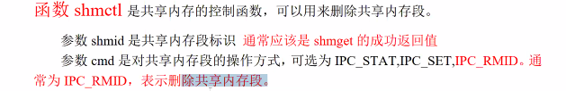
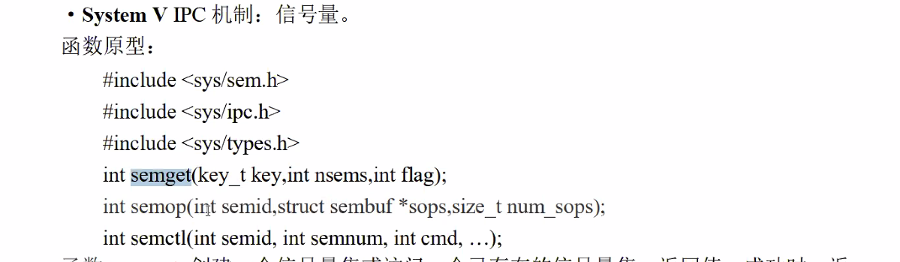
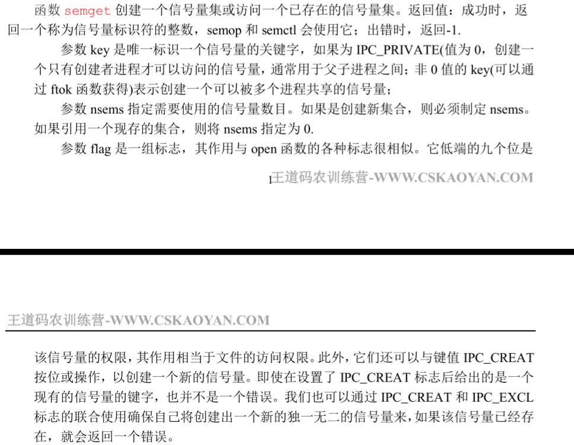
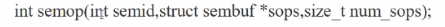
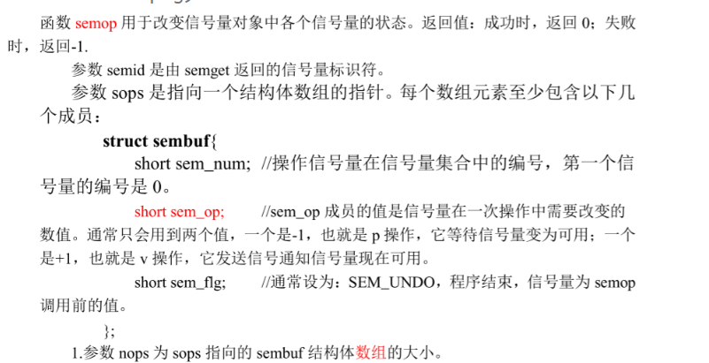
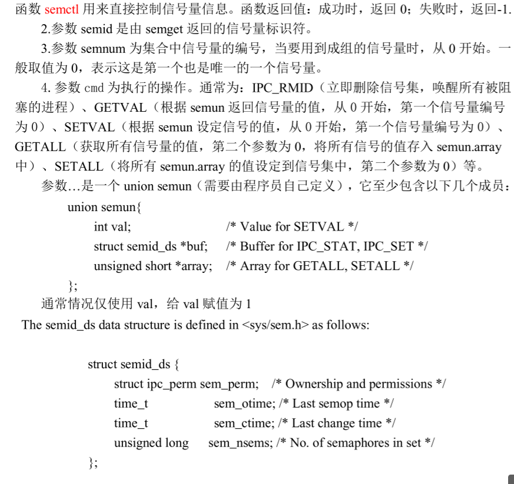
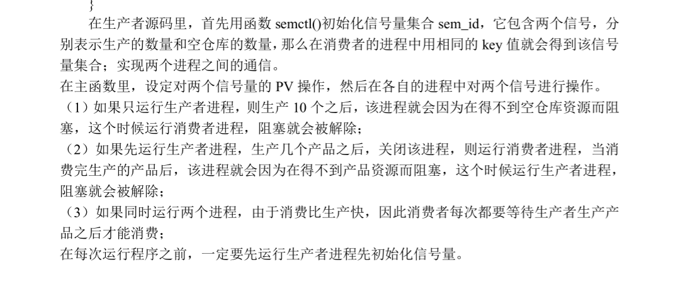
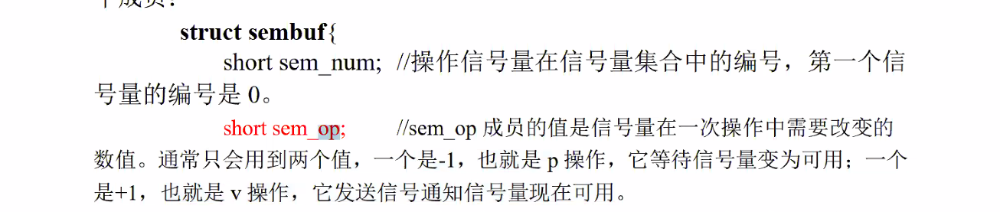
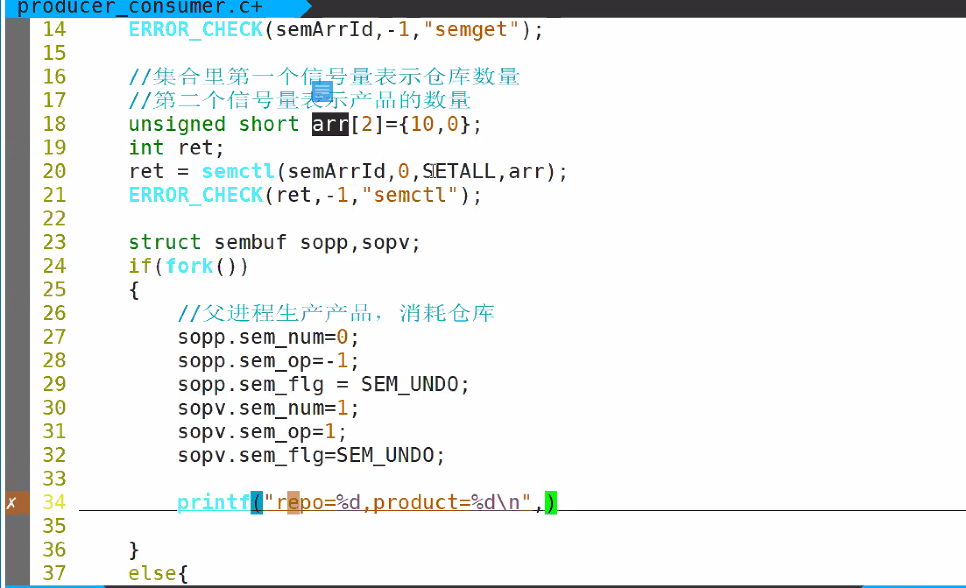

# day34 笔记 //记得晚上重听day33下午的内容

### Ep01 昨日重现

- 管道

  > - 标准流管道：
  >   - 读取原本打印到屏幕上的便准输出
  > - 无名管道
  >   - 调用pipe系统调用创建无名管道，fd[2]
  >   - fd[0]：固定读端，实质是文件描述符
  >   - fd[1]：固定写端，实质是文件描述符
  >   - 通过fork实现父子进程的通信
  > - fifo管道
  >   - 创建一个管道文件
  >   - 等同于之前的`.pipe`
  >   - 需要两个管道才能实现 进程间通信

- 共享内存

  > - ftok：创建一个关键字，可以用此关键字关联一个共享内存段
  > - shmget：创建/打开一段共享内存，该内存由
  > - shmat：类似molloc
  > - shmdt：解除了当前进程对共享内存的映射
  > - 
  > - 参数buf

- 虚拟地址

  > - 如何用虚拟地址找到对应的物理地址
  >   - 以32为为例：32=10+10+12
  >   - 前十为表示章节数
  >   - 第二个十位表示页表项
  >   - 两个十位找到具体页
  >   - 后十二位表示页内偏移

- TLB快表

  > - ​                                                                                                                                                                                                                   

- 信号量


### Ep02 信号量 //整理图

- 原型

  > - 

- 并行和并发

  > - 并行：同一时刻可以有多个进程使用资源。
  > - 并发：同一时刻只能有一个进程使用资源，但是一段时间内可以有多个进程使用资源。

- `semget(key_t key,int nsems,int flags);`

  > - 信号量

- 

  > - 

- 

  > - 



### Ep03 信号量的实现

- semget.c

  > - `semget.c`
  >
  >   ```c
  >   int main()
  >   {
  >       int semArrId = semget(1000,1,IPC_CREAT|0660);
  >       ERROR_CHECK(semArrId,-1,"semget Error,3");
  >           //创建信号量
  >           
  >    
  >   }
  >   ```
  >
  > - ```c
  >   int main()
  >   {
  >       int semArrId = semget(1000,1,IPC_CREAT|0660);
  >       ERROR_CHECK(semArrId,-1,"semget Error,3");
  >       int ret;
  >       ret = semctl(semArrId,0,SETVAL,1);
  >       ERROR_CHECK(ret,-1,"semctl Error,3");
  >       printf("ret = %d\n"ret);
  >   }
  >   ```
  >
  > - `semctl_stat.c`
  >
  > - ```c
  >   int main()
  >   {
  >       int semArrId = semget(1000,1,IPC_CREAT|0660);
  >       ERROR_CHECK(semArrId,-1,"semget Error,3");
  >       
  >       struct semid_ds stat;
  >       memset(&stat,0,sizeof(stat));
  >       
  >       int ret;
  >       ret = semctl(semArrId,0,IPC_STAT,&stat);
  >       ERROR_CHECK(ret,-1,"");
  >       printf("sem_nsems = %d,perm = %o\n",stat.sem_nese,stat.sem_perm.mode);
  >       stat.sem_perm.mode = 0666;
  >       //修改权限
  >       ret = semctl(semArrId,0,IPC_SET,&stat);
  >       printf("sem_nsems = %d,perm = %o\n",stat.sem_nese,stat.sem_perm.mode);
  >       //用法类似共享内存
  >       
  >           
  >           
  >   ```

- PV操作：通过信号量来进行累加，不会出现进程间冲突的情况

  > - 
  >
  > - pv操作为一个源语，中途不可被打断
  >
  > - ```c
  >   #include<time.h>
  >   //clock()函数打点算，可以根据程序耗时来分析锁的公平性
  >   //下课优化代码 
  >   //clock tick time;
  >   int shmid = shmget(1000,1<<20,IPC_CREAT|0600);
  >   int semArrId = semget(7777,1,IPC_CREAT|0600);
  >   ERROR_CHECK(semArrId,-1,"smget Error,");
  >   int ret = semctl(semArrId,0,SETVAL,1);
  >   int *p = (int*)shmat(shmid,NULL,0);
  >   p[0]=0;
  >   
  >   if(fork())
  >   {
  >       for(int i = 0;i<N;i++)
  >       {
  >           semop(semArrid,&sopp,1);
  >           //加锁
  >           p[0] += 1;
  >           semop(semArrid,&sopv,1);
  >           //解锁
  >       }
  >       wait(NULL);
  >       //等待子进程
  >       printf("total = %d",p[0])
  >   }
  >   else
  >   {    
  >       for(int i = 0;i<N;i++)
  >       {
  >           semop(semArrid,&sopp,1);
  >           p[0] += 1;
  >           semop(semArrid,&sopv,1);
  >       }
  >   }
  >   ```
  >
  >   设置锁的时候要考虑锁的公平性
  >
  > - 

- 仓库

  > - ```c
  >   if(fork)
  >   {
  >       while(1)
  >       {
  >           sleep(1);
  >           sopp.sem_num = 0;
  >           sopp.sem_op = -1;
  >           sopp.sem_flg = SEM_UNDO;
  >           sopv.sem_num = 1;
  >           sopv.sem_op = 1;
  >           sopv.sem_flg = SEM_UNDO;
  >           printf("producer repo = %d,product = %d\n",semctl(semArrId,0,GETVAl),semctl(semArrId,1,GETVAl));
  >           semop(semArrId,&sopp,1);
  >           //占用了一个仓库
  >           printf("producer repo = %d,product = %d\n",semctl(semArrId,0,GETVAl),semctl(semArrId,1,GETVAl));
  >           semop(semArrId,&sopv,1);
  >           //生产了一个产品
  >           printf("producer repo = %d,product = %d\n",semctl(semArrId,0,GETVAl),semctl(semArrId,1,GETVAl));
  >       }
  >   }
  >   else
  >   {
  >       while(1)
  >       {
  >           
  >       
  >       	sopp.sem_num = 1;
  >           sopp.sem_op = -1;
  >           sopp.sem_flg = SEM_UNDO;
  >           sopv.sem_num = 0;
  >           sopv.sem_op = 1;
  >           sopv.sem_flg = SEM_UNDO;
  >           printf("comsumer repo = %d,product = %d\n",semctl(semArrId,0,GETVAl),semctl(semArrId,1,GETVAl));
  >           semop(semArrId,&sopp,1);
  >           //消耗了一个产品
  >           printf("comsumer repo = %d,product = %d\n",semctl(semArrId,0,GETVAl),semctl(semArrId,1,GETVAl));
  >           semop(semArrId,&sopv,1);
  >           //释放了一个仓库  
  >           printf("comsumer repo = %d,product = %d\n",semctl(semArrId,0,GETVAl),semctl(semArrId,1,GETVAl));
  >       }
  >   }
  >   ```
  >
  > - 
  >
  > - 
  >
  > - 