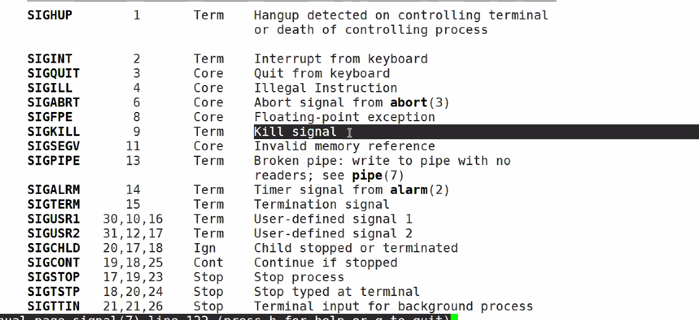

# day35 笔记


- ### 下午自习任务

  >- [ ] 
  >- [x] 看数据结构
  >- [x] 看组原（大小页和虚拟页）：
  >  - [ ] 链接：https://pan.baidu.com/s/1wHCgaKSBK64tIO64zpuEhQ 
  >    提取码：xv9l
  >- [ ] 双倍刷题 ~~双倍快乐~~ no

### Ep01

### Ep02 消息队列

- | 名称     | 特点                                   |      |
  | -------- | -------------------------------------- | ---- |
  | 管道     | 消息和消息之间无边界，是一个临时缓冲区 |      |
  |          |                                        |      |
  | 消息队列 | 消息和消息之间有边界                   |      |

- 特点

  > - 一个队列的集合，存放消息用，进程间可以互相存取。
  > - 可以多对多，多对一，一对多
  > - 消息和消息之间有边界

- 原型

  > - 函数原型
  >
  >   ```c
  >   #include<sys/types.h>
  >   #include<sys/ipc.h>
  >   #include<sys/msg.h>
  >   int msgget(key_t key,int msgflg);
  >   int msgsnd(int msqid,const void *msgp,size_t msgsz,int msgflg);
  >   ssize_t msgrcv(int msqid,const void *msgp,size_t msgsz,long msgtyp,int msgflg);
  >   int msgctl(int msqid,int cmd,struct msqid_ds *buf);
  >   ```

- `int msgget(key_t key,int msgflg);`

  > - 
  >
  > - 创建/访问一个消息队列，成功返会id，失败则为-1
  >
  > - `msgget.c`
  >
  >   ```c
  >   int main()
  >   {
  >       int msgid = msgget(1000,IPC_CREAT|0600);
  >       ERROR_CHECK(msgid,-1,"msget Error,3");
  >   }
  >   ```
  >
  > - 

- `int msgsnd()&int msgrcv` 

  > - 
  >
  > - 
  >
  > - `msgsnd.c`
  >
  >   ```c
  >   struct msgbuf{
  >       long mtype;
  >       char mtext[64];
  >       //此处仅可以自定义大小
  >   };
  >   int main(int argc,char* argv[])
  >   {
  >       int msgid = msgget(1000,IPC_CREAT|0600);
  >       ERROR_CHECK(msgid,-1,"msget Error,3");
  >       struct msgbuf msg;
  >       memset(&msg,0,siezif(msg));
  >    vu   msg.mtype = aito(int argc);
  >       strcpy(msg.mtext,argv[2]);
  >       int ret;
  >       ret = msgsnd(msgid,&msg,strlen(msg.mtext),0);
  >       //发送的具体长度，
  >       ERROR_CHECK(rey,-1,"msgsnd Error,15");
  >       printf("type = %ld,text = %s\n",msg.mtype,msg.mtext);
  >       return 0;
  >   }
  >   ```
  >
  > - `msgrcv.c`
  >
  >   ```c
  >   struct msgbuf{
  >       long mtype;
  >       char mtext[64];
  >       //此处仅可以自定义大小
  >   };
  >   int main(int argc,char* argv[])
  >   {
  >       int msgid = msgget(1000,IPC_CREAT|0600);
  >       ERROR_CHECK(msgid,-1,"msget Error,3");
  >       struct msgbuf msg;
  >       memset(&msg,0,siezif(msg));
  >   
  >       int ret;
  >       ret = msgrcv(msgid,&msg,sizeof(msg.mtext),atoi(argv[1]),0);	  
  >       //指定消息队列编号
  >       //当mtype的值：
  >       //为0则为消息队列中的第一个消息
  >       //即按照队列接受顺序读取
  >       //为负数则为消息队列中小于|mtype|的最小的类
  >       //即按照≤|mtype|的顺序，编号越小优先级越高
  >       ERROR_CHECK(rey,-1,"msgsnd Error");
  >       printf("type = %ld,text = %s\n",msg.mtype,msg.mtext);
  >   }
  >   ```
  >
  > - 删除：-ipcs -q +id
  >
  > - 是否标记删除？

- 删除

  > - 删除信号量时，可以直接删除信号量，之后所有等待信号量上的进程都会被唤醒
  > - 父子进程分别是生产者和消费者，子进程先被结束，父进程P操作阻塞

### Ep03  信号

- 信号代表着一个进程

- 软件模拟的软中断，signal

- 信号编码：通过信号编码的方式传递信号

  > - 

- 信号的默认行为

  > - 所有信号都有唤醒进程的功能
  > - 对应    不能直接kill -9进程需要发送特别的信号 SIGUSER1，在处理函数里进行信号的有序退出
  > - 

- 信号的产生：信号来自内核

  > - 用户：通过终端输入
  > - 内核：当程序执行出错的时候，内核会产生信号
  > - 进程：一个进程可以通过系统调用kill给另一个进程发送信号，进程可以通过信号和另一个进程进行通信
  >
  > 因为进程的某个操作产生的信号成为同步信号；像用户输入之后产生的信号教转异步信号

- 信号的处理行为

  > - 接受默认处理：接收默认处理的进程通常会导致进程本身消亡
  > - 忽略信号：进程可以通过代码，显示地忽略某个信号的处理。例如: signal(SIGINT,SIG_ IGN); 
  > - 捕捉信号并处理：进程可以事先注册信号处理函数，当接收到信号时，由信号处理函数自动捕捉并且处理信号。

- signal信号处理机制

  > - 原型：
  >
  > - ```c
  >   #include<signal.h>
  >   typedef void(*sighandler_t)(int); //函数指针
  >   sighandler_t signal(int signumm,sighander_t handler); 
  >   ```
  >
  > - signum 表示要捕捉的信号（9号信号不能捕捉）
  >
  >   - 确保了进程可以结束（最终办法仅elf查看信号id，kill -9 结束信号）
  >
  > - 第二个为一个函数指针，表示对信号捕捉的函数，也可以是SING_DFL（表示交给系统缺省处理）或是SIG_IGN（表示忽略信号不做任何处理）
  >
  > - 如果函数调用成功则返回该信号处理函数的地址，否则则返回SIG_ERR
  >
  > - 
  >
  > - `signal.c`
  >
  >   ```c
  >   void sigFunc(int signum)
  >   {
  >       printf("sig %d is coming\n",signum);
  >   }
  >   int main()
  >   {
  >       signal(SIGINT,sigFunc);
  >       signal(SIGQUIT,sigFunc);
  >       while(1);
  >       return 0;
  >       //此时输入Ctrl+c 输出sig 2 is coming
  >       //SIGINT在编码中为2号信号
  >       //输入CTRL+\退出
  >   }
  >   ```
  >
  > - 