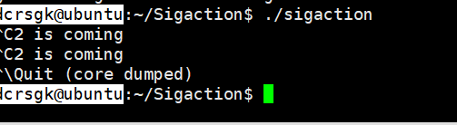
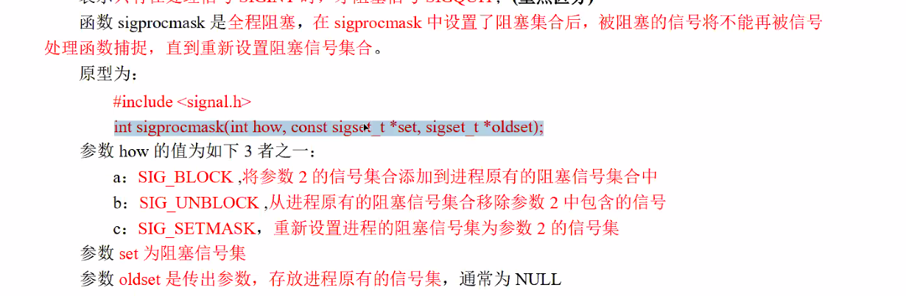
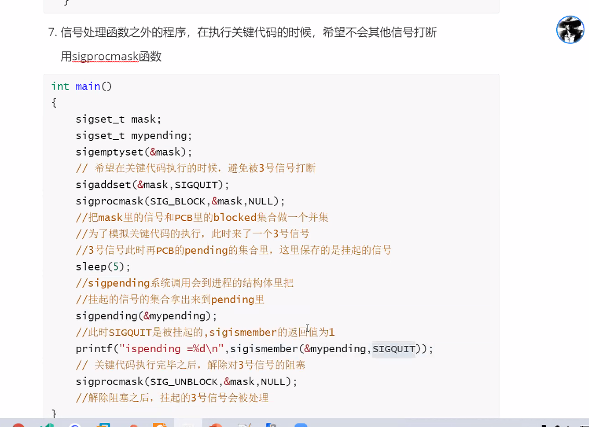
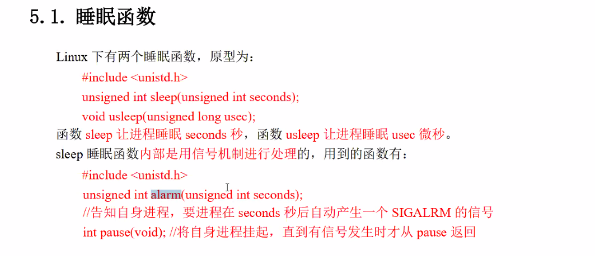
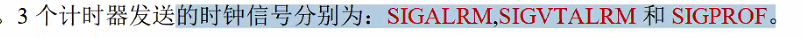
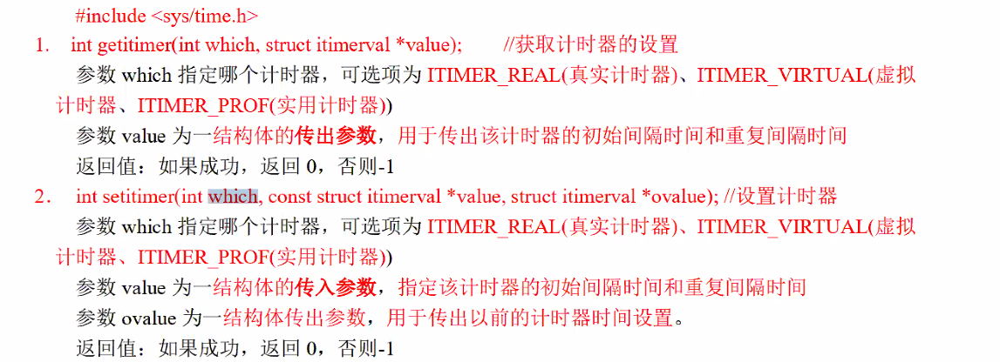

# day36 笔记

 

### Ep01 进程间通信复习

- 管道

  > - 流管道
  >   - 输入输出流重定向
  > - 无名管道
  >   - 只能在有亲缘关系的进程间使用（父子/兄弟）
  >   - 半双工，有固定的读端(fds[0])和写端(fds[1])
  >   - 是特殊的文件，可以用read，write读写管道，程序结束后消失
  >   - 先关闭管道读端再写管道时，写管道的进程会收到SIGPIPE信号，导致进程终止
  > - 命名管道
  >   - 创造管道文件，文件会一直存在，不会随进程结束而消失

- 共享内存

  > - 创建共享内存：`int shmget(key,size,flags)`
  > - 将共享内存映射到进程的地址空间`void *shmat(shmid,NULL,0)`
  > - 解除映射`int shmdt(const void *addr)`
  > - 控制共享内存：`shmctl();`
  >   - IPC_RMID：删除共享内存
  >   - IPC_STAT：获取共享内存信息
  >   - IPC_SET：修改共享内存信息
  > - 命令：
  >   - `ipcs`：查看创建的共享内存
  >   - `ipcrm -m shmid`：删除共享内存
  >   - shmid为共享内存id
  >   - 共享内存的删除是标记删除，只有当最后连接共享内存的进程解除映射之后，才会真正的删除这段共享进程
  > - 进程虚拟地址到物理地址的转换：多数为写时复制
  >   - 页目录>>页表项>>页内偏移（对于32位系统仅有3级）
  >   - TLB：快表，加快映射速度
  >     - 本质是因为cpu速度和内存速度差别过大
  >     - 将频繁访问的数据存入TLB（速度和cpu差不多）中，不造成cpu时间片的浪费
  >   - 当虚拟页和物理页的映射关系没有建立，并且要访问这段内存时，会发生缺页异常，需要调页。
  >   - 建立映射关系，可以通过使用大页，减少缺页异常。
  > - mmap方式实现共享内存
  >   - MAP_SHARED
  >   - 速度快，可以多对多
  >   - 用法类似通告版

- 信号量

  > - 分类（一个与多个）
  >   - 单个信号量：可以看作是二进制开关：相当于锁
  >     - 对同一个数各加一千万
  >     - 若不加锁则会两个进程竞争导致所得数小于两千万
  >   - 多个信号量：计数信号量→信号量的值代表资源数量，限制资源可以被多少进程访问
  > - 创建/获取信号量集合：int semget
  > - semop：改变信号量状态
  >   - P操作：对信号量-1，释放资源 本质可以看作加锁
  >   - V操作：对信号量+1  本质可以看作解锁
  > - semctl：信号量的控制
  >   - SETVAL：设置单个信号量的值
  >   - SETALL：设置全部信号量的值（此时需要一个指针类型存储设置值）
  >   - GETVAL：得到单个信号的值
  >   - GETALL：得到所有信号的值（此时需要一个指针类型存储获得值）
  >   - IPC_RMID：删除信号量的值

- 消息队列

  > - 消息队列的创建：`int msget(key,flag);`
  >
  > - 添加消息：`int msgsnd(msgid,msgp,size,flag);`
  >
  > - 获取消息：`int msgrcv(msgic,msgp,size,msgtype,flag);`(可选NOWAIT参数，即不等待直接读取)
  >
  >   - flsg参数：常用为0，或者IPC_NOWAIT，若此时队列满再调用msgsnd或者队列空的是hi调用msgrcv将直接返回错误
  >
  >   - msgp为一个可变长度结构体，原型为
  >
  >     ```c
  >     struct msgbuf{
  >         long mtype;
  >         char mtext[64];
  >         //此处仅可以自定义大小
  >     };
  >     ```
  >
  >   - 消息类型：即msgtype的三种选项
  >
  >   - msgtype = 0：接受信号队列中的第一个信息
  >
  >   - msgtype ＞0：接受指定序列号的第一个消息
  >
  >   - msgtype ＜ 0：接受类型小于等于msgtype绝对值的第一个最低类型消息
  >
  >   - 消息队列编号中，无0号队列
  >
  > - 消息队列控制函数：`int msgctl(msgid,cmd,buf);`
  >
  >   - 其中cmd常用为：IPC_RMID
  >   - 表示删除消息队列
  >   - buf常用NULL
  >
  > - 特点：使用方便，灵活，将任务异步运行

- 信号

  > - 

### Ep02 sigaction处理信号

- 原型

  > - 函数原型
  >
  >   ```c
  >   #include<signal.h>
  >   int sigaction(int signum,const struct sigaction *act,struct sigaction *oldact);
  >   ```
  >
  > - signum：为一个需要捕捉的信号
  >
  > - act是一个结构体
  >
  > - oldact是一个传出参数，函数调用成功之后，oldact里面包含以前对signum的处理方法，通常为NULL
  >
  > - 调用成功则为0，失败则为-1
  >
  > - `struct sigaction结构体`
  >
  >   ```c
  >   struct sigaction{
  >   	void(*sa_handler)(int);
  >       //老类型的信号处理指针
  >       void(*sa_sigaction)(int,siginfo_t *,void*);
  >       //新类型的信号处理指针
  >       sigset_t sa_mask;
  >       //将要被阻塞的信号集合
  >       int sa_flags;
  >       //信号处理方式掩码👉SA_SIGINFO
  >       void(*sa_restorer)(void);
  >       //保留 不要使用
  >   };
  >   ```
  >
  > - 代码实现
  >
  > - ```c
  >   void sigFunc(int signum,siginfo_t* pINfo,void *p)
  >   {
  >       printf("%d is coming\n",signum);
  >   }
  >   int main()
  >   {
  >       struct signation act;
  >       bzero(&act,sizeof(act));
  >       
  >       act.sa_falgs = SA_SIGINFO;
  >       act.sa_sigaction = sigFunc;
  >       int ret;
  >       ret = sigaction(SIGINT,&act,NULL);
  >       ERROR_CHECK(ret.-1,"sigaction Error");
  >       while(1);
  >       return 0;
  >   }
  > ```
  >   
  >   ​	
  >   

- sigaction的信号处理机制

  > - 传入参数：传给参数，函数内部只能用，不能修改
  >
  > - 传出参数：传给函数时是空白的，函数内部做修改，函数外部就可以拿到修改的值
  >
  > - 传入传出参数：传给函数的值，函数内部做修改，函数外部就可以拿到修改的值
  >
  > - 中断优先级，中断嵌套。
  >
  >   - 进程再信号处理函数中，再来一个相同信号，会先执行完当前信号处理函数，再去响应新到的同类信号。	
  >   - 进程再信号处理函数中，再来一个不同信号，则会相应新的信号。
  >   - 用sigaction和signal注册信号效果相同
  >
  > - 结构体`stgset_t`跟`fd_set`类似，每一位代表一个信号，当对应位是0时则表示无信号产生，是1时则表示有该信号产生
  >
  > - 进程阻塞在一些系统调用，比如read的时候，此时来了个信号。
  >
  >   - 如果是`sigaction`注册的信号，会优先处理信号，处理完信号之后，正在阻塞的系统调用不会再阻塞，而是直接返回-1
  >   - 如果是`signal`注册的信号，也会优先处理信号，但是处理完信号之后，会继续会到系统调用，继续阻塞。
  >   - 可以用SA_RESTAR将`sigaction`改成和`signal`一样的行为
  >
  > - 再一个信号被阻塞之后，在解除阻塞之前，该信号发送了多次，但是解除阻塞的时候，内核只会向进程发送一个信号，而不管在其阻塞期间有多少个信号产生。因为在Linux中不会对信号进行排队。
  >
  > - sig_read
  >
  >   ```c
  >   void sigFunc(int signum,siginfo_t* pINfo,void *p)
  >   {
  >       printf("before sleep %d is coming\n",signum);
  >       sleep(3);
  >       printf("after sleep %d is coming\n",signum);  
  >   }
  >   int main()
  >   {
  >       if(signal(SIGINT,sigFunc) == SIG_ERR)
  >       {
  >           printf("signal failed\n");
  >           return -1;
  >       }
  >       signal(SIGINT,sigFunc);
  >       char buf[64] = {0};
  >       int ret;
  >       ret = read(0,buf,sizeof(buf));
  >       printf("ret = %d,buf = %s\n"ret,buf);
  >       
  >   }
  >   ```
  >
  > - `sig_two.c`
  >
  >   - 
  >   - 执行效果
  >
  > - 当一个信号被阻塞之后，在解除阻塞之前，该信号发生了多次，但是解除阻塞的时候，内核只会向进程发送一个信号而已，而不管在其阻塞期间有多少个信号产生，因为linux并不会对信号进行排队。
  >
  > - 这里用到了打断read输入的中断处理，必须要加参数SA_RESTART，对于signal 函数而言，它安装的信号处理函数，系统默认会自动重启被中断的系统调用，而不是让它出错返回
  >
  > - 对于sigaction函数而言，必须要自己指定SA_RESTART实现重启功能，如果不指定则会read失败，提示read的时候中断发生
  >
  >   - 即恢复的时候read直接返回-1


### Ep03 信号的阻塞

- 信号的嵌套：

  > - 在信号执行过程中传入新的信号，会直接中断目前执行的信号，执行新的信号，等待新信号执行完毕之后再继续执行旧信号
  >
  > - 此处程序
  >
  >   - ```c
  >     
  >     ```
  >
  >   - 
  >
  >   - 

- sa_mask参数

  > - 可以在信号处理函数内不被其他信号打断
  >
  > - 通过信号，可以执行服务程序，结束/中断进程。在执行一些重要程序的时候为了防止被传入信号打断，需要加上sa_mask参数。防止被打断
  >
  > - 
  >
  > - 在内核中
  >
  > - 
  >
  > - 代码实现
  >
  >   ```c
  >   
  >   ```

- sigprocmask

  > - 执行之前先用block加锁，执行完毕之后用unblock解锁
  >
  > - 
  >
  > - 在信号处理函数之内，不希望被打断
  >
  >   - `sigprocmask.c`
  >
  >   ```c
  >   int main()
  >   {
  >       sigget_t mask;
  >       sigemptiset(&mask);
  >       sigaddset(&mask,SIGQUIT);
  >       sigprocmask(SIG_BLOCK,&mask,NULL);
  >       //关键代码
  >       sleep(5);
  >       sigpromask(SIG_UNBLOCK,&mask,NULL);
  >       while(1);
  >   }
  >   ```
  >
  > - 

### Ep04 kill命令

- 原型

  > - 函数原型
  >
  >   ```c
  >   #include<sys/types.h>
  >   #include<signal.h>
  >   int kill(pid_t pid,int sig);
  >   ```
  >
  > - `pid`为将要接受信号的进程pid
  >
  > - 可以通过`getpid()`函数还给自身发送信号
  >
  > - 还可以发送信号给指定进程，此时pid有
  >
  > - `pid` > 0：将信号发给ID为pid的进程
  >
  > - `pid` == 0：将信号发送给与发送进程属于同一个进程组的所有进程
  >
  > - `pid ` == -1：将信号发送给该进程有权限发送的系统里的所有进程
  >
  > - `pid` < 0：将信号发送给进程组ID等于pid绝对值的所有进程
  >
  > - `sig` 为将要发送的信号
  >
  > - 成功则返回0，失败则返回-1
  >
  > - 代码实现kill发送信号2给父子进程
  >
  > - ```c
  >   int main()
  >   {
  >       if(fork())
  >       {
  >           while(1)
  >       }
  >       else
  >       {
  >       	int ret;
  >       	ret = kill(0,2);
  >       }
  >   }
  >   ```
  >
  > - 传参的形式发送kill
  >
  >   - ```c
  >     int main(int argc,char*argv[])
  >     {
  >         int ret;
  >         ret = kill(argv[1],2);
  >         ERROR_CHECL(ret,-1,"kill Error");
  >         
  >     }
  >     ```

### Ep05计时器和时钟处理

- sleep原型

  > - 

- 时钟处理

  > - 真实计时器：计算程序运行的真实时间
  >   - 从程序开始到程序结束
  > - 虚拟计时器：计算程序运行在用户态的时间
  > - 使用计时器：程序处于用户态和处于内核态所消耗的时间和
  >
  > 

- 计数器使用：

  > - 
  >
  > - ```c
  >   void sigFunc()
  >   {
  >       
  >   }
  >   ```
  >
  > - 

  

  


### Ep06 Linux多线程

- 进程线程的对比
- 各自优缺点
- 线程分类
- 线程的创建退出
- 线程的取消
- 线程的终止清理函数
- 