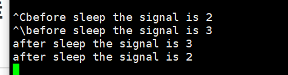
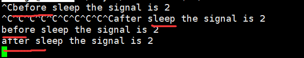
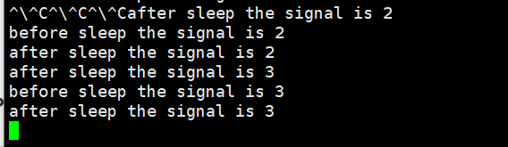
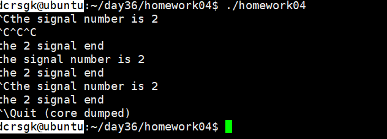
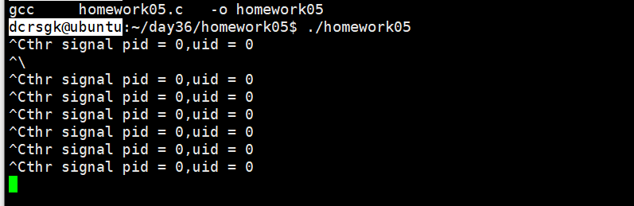
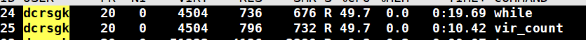
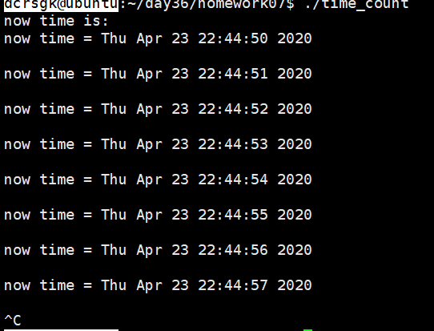
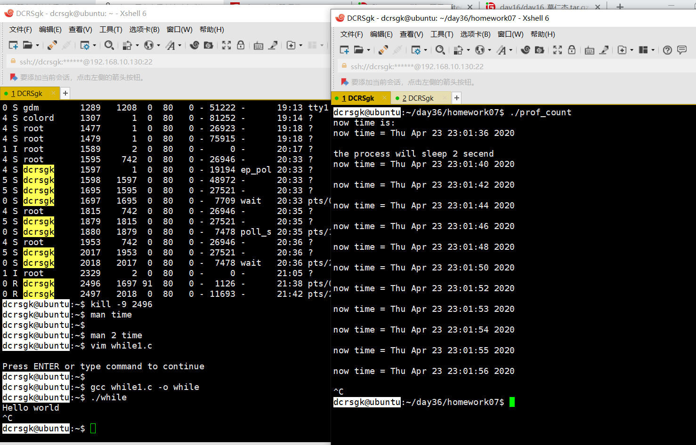
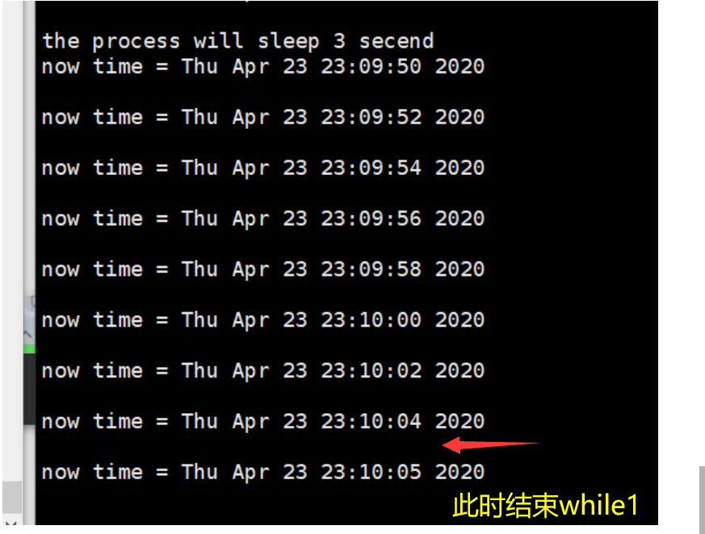

### 1、signal设置信号处理行为，演示不同信号到来时，后来的信号会打断原有信号的信号处理函数效果

- 在处理信号2的过程中来了信号3，此时则会先执行信号3，等信号3执行完毕再执行信号2
  - 

### 2、signal设置信号处理行为，演示相同信号到来时，无法打断本信号的效果

+ 在处理信号2的过程中来了信号2，不影响当前信号的执行
+ 

### 3、sigaction实现信号不断重入的执行效果(来回打断的效果)

- 

### 4、sigaction实现2号信号，屏蔽3号信号的执行效果，同时在2号信号的信号处理流程中，判断   3号信号是否被挂起

- 

### 5、通过sigaction，打印发送信号的发送者的pid和uid。

- 

### 6、通过sigprocmask阻塞2号信号，睡眠5秒后，解除阻塞，2号信号得到执行；在睡眠后，解除阻塞之前，通过sigpending检测是否有信号挂起

- sigprocmask没听懂 周末补上

### 7、使用真实计时器，实用计时器，虚拟计时器，统计程序执行时间，在实用计时器及虚拟计时器设定计时后，先睡眠，再让程序处于while（1）

- 竞争时间可以查看cpu占用率
- 
- 真实计时器：
  - 
- 实用计时器
  - 在运行时用while1抢时间片造成运行时间变长
  - 
- 虚拟计时器
  - 

