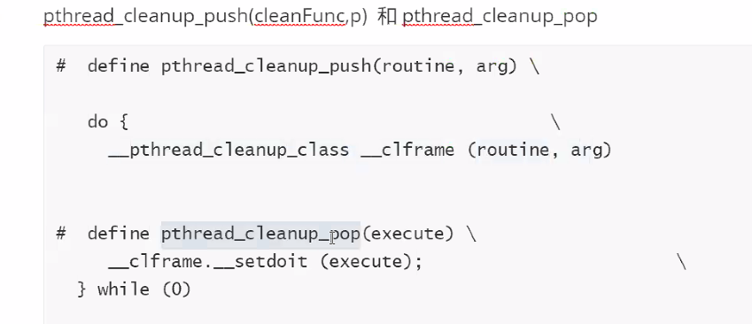

# day37

### Ep01 昨日重现

- ##### 信号的概念

  > - 信号代码某一事件的发生，信号是硬件中断的软件模拟（软中断）
  > - kill -l：查看所有信号

- ##### 信号的产生

  > - 
  > - 

- ##### 信号的相应时机

  > - d
  > - 

- ##### 信号的处理

  > - 默认的处理方式
  >   - 终止信号
  >   - 忽略信号
  >   - 终止进程并产生core文件
  >   - 暂停进程运行
  >   - 继续进程运行
  > - 忽略信号：9/19号信号不能被忽略
  >   - 9号：终止进程
  >   - 19号：调试进程
  > - 捕捉信号并设置对应处理方式
  >   - 9/19号信号不能被捕捉

- ##### 信号的处理

  > - signal信号处理机制
  >   - `signal(signum,sigFunc)`
  >   - 注册信号捕捉函数
  >   - sigFunc是函数指针
  > - sigaction信号处理机制
  >   - `sigactio(signum,sigact,oldact);`
  >   - SA_RESETHAND：信号处理函数设置为一次性执行
  >   - SA_NODEFER：信号处理函数可以不断重复，不会丢失
  >   - SA_RESTART：进程阻塞再系统调用，处理完信号之后系统调用不会返回失败
  >   - SA_SIGINFO：表示使用新的类型的信号处理函数指针

- ##### 信号的阻塞

  > - 在信号处理函数中阻塞其他信号
  >   - 通过`sigaction`结构体中的`sa_mask`，把需要屏蔽的信号加入到`sa_mask`中
  > - 在信号处理函数之外阻塞信号，保护关键代码
  >   - `sigpricmask`
  >   - SIG_BLOCK：添加
  >   - SIG_UNBLOCK：移除
  >   - SIG_SETMASK：重新设置(相当于覆盖)
  >   - 可以通过sigprocmask的第三个参数把原来的屏蔽信号的集合拿出来，解除信号的阻塞之后，再把原信号集还原回去。
  > - 信号被阻塞并未消失，而是处于pending状态，当解除阻塞之后，还是会按照规则执行信号处理
  > - 

* ##### 计时器与信号

  > - 睡眠函数
  >   - sleep：按秒
  >   - usleep：按微妙
  > - alarm(secends)函数
  >   - 在secend秒之后产生一个SIGALRM信号， 将进程唤醒
  > - 时钟处理
  >   - 真实计时器
  >   - 实用计时器
  >   - 虚拟计时器
  >   - 
  > - 

- 作业实现

  > - 自定义信号顺序退出
  >
  > 

### Ep02 线程

- 线程和进程

  > - 线程：是程序执行和cpu调度的最小单元
  > - 进程：是操作系统分配资源的基本单位

- 进程和线程对比

  > - 线程	
  >   - 创建开销小，切换快
  >   - 线程跟同进程中的其他线程共享空间，不利于资源的管理和保护
  >   - 一旦一个线程出错会影响其他线程
  > - 进程
  >   - 创建开销大，切换慢
  >   - 一个进程出错不影响其他进程

- 线程分类

  > - 
  > - 用户级线程：
  > - 核心级线程
  >
  > 一个用户级线程可以对应一个/多个核心级线程，也就是一对一/一对多模型

- 线程创建（Linux实现）

- 

  > - 函数库内的所有函数失败都返回错误码，需要用strerror来读取错误码
  >
  > - 一般词用pthread线程库实现线程的访问和控制
  >
  > - `pthread_create`：创建线程
  >
  >   - 成功返回0 失败返回错误码
  >
  > - 函数原型
  >
  >   ```c
  >   #include<pthread.h>
  >   int pthread_create()
  >   void pthread_exit()
  >   pthread_t pthread_self()
  >   
  >   ```
  >
  > - 
  >
  > - 
  >
  > - ```c
  >   void *threadFunc(void *)
  >   {
  >       printf("child thread is ready\n");
  >       return NULL;
  >   }
  >   int mian()
  >   {
  >       pthread_t thid;
  >       int ret;
  >       ret = pthread_create(&thid,NULL,threadFunc,NULL);
  >       THREAD_ERROR_CHECK(ret,"pthread_create Error");
  >       //子线程和父线程执行顺序不定，
  >       //手动加延迟：
  >       //usleep(100);
  >       printf("ret = %d",ret);
  >       printf("main thread after create\n");
  >       pthread_join(thid,NULL);
  >       printf("after join\n");
  >       //等待子进程
  >       //添加14/15行之后进程结果固定
  >       while(1);
  >       //此处需要等待子线程分配时间片再结束进程
  >       //不然主线程结束之后所有进程都结束，子线程来不及分配时间片
  >       //导致子线程无法执行
  >       //结果为如下三种情况
  >   }
  >   ```
  >
  >   - 运行结果为
  >   - 打印两次child
  >     - 
  >   - 打印一次
  >   - 为什么会有两次打印：
  >   - 子进程执行的时候
  >   - 

- 线程的空间

  > - 线程栈空间：
  >
  >   ```c
  >   void *threadFunc(void *p)
  >   {
  >       printf("child thread create val = %d\n",*(int*)p);
  >       //void*型指针转换为int*型
  >       //int*型再解引用
  >       return NULL;
  >   }
  >   int mian()
  >   {
  >       pthread_t thid;
  >       int isStack = 3;
  >       int ret;
  >       ret = pthread_create(&thid,NULL,threadFunc,&isStack);
  >       //ret = pthread_create(&thid,NULL,threadFunc,(void*)isStack);
  >       //直接传isStack的值
  >       THREAD_ERROR_CHECK(ret,"pthread_create Error");
  >   	isStack = 6;
  >       //这里需要考虑执行顺序
  >       //主线程速度远超过子线程
  >       //此时来不及接受3的值，就已经改变了isStack的值
  >       //传入的同样是一样的地址
  >       ret = pthread_create(&thid,NULL,threadFunc,&isStack);
  >       printf("ret = %d",ret);
  >       printf("main thread after create\n");
  >       pthread_join(thid,NULL);
  >       printf("after join\n");
  >   }
  >   ```
  >
  > - 线程堆空间：
  >
  >   ```c
  >   void *threadFunc(void *p)
  >   {
  >       printf("child thread create val = %s\n",(char*)p);
  >       //void*型指针转换为char*型指针
  >       //%p打印指针本身的地址
  >       return NULL;
  >   }
  >   int mian()
  >   {
  >       pthread_t thid;
  >       char *p = (char*)malloc(20);
  >       strcpy(p,"hello");
  >       int ret;
  >       ret = pthread_create(&thid,NULL,threadFunc,p);
  >       THREAD_ERROR_CHECK(ret,"pthread_create Error");
  >      	
  >       //usleep(100);
  >       printf("ret = %d",ret);
  >       printf("main thread after create\n");
  >       pthread_join(thid,NULL);
  >       printf("after join\n");
  >       return 0;
  >   }
  >   ```
  >
  > - pexit.c(线程的退出)
  >
  >   ```c
  >   void funC()
  >   {
  >       printf("this is funC\n");
  >       //pthread_exit(NULL);
  >       //直接退出子线程，不执行下面的after。。
  >       //exit(0);
  >       //此时直接退出 不打印主线程的main join
  >       //表示进程的退出
  >       //退出之后结束所有线程
  >       return;
  >   }
  >   
  >   
  >   void *threadFunc(void *p)
  >   {
  >       printf("child thread create val = %s\n",(char*)p);
  >      	funC();
  >       printf("after funC\n");
  >       return NULL;
  >   }
  >   int mian()
  >   {
  >       pthread_t thid;
  >       int isStack
  >       int ret;
  >       ret = pthread_create(&thid,NULL,threadFunc,&isStack);
  >       THREAD_ERROR_CHECK(ret,"pthread_create Error");
  >      	
  >    
  >       pthread_join(thid,NULL);
  >       printf("after join\n");
  >       return 0;
  >   }
  >   ```
  >
  > - join.c
  >
  >   ```c
  >   void *threadFunc(void *p)
  >   {
  >       printf("child thread create val = %s\n",(long)p);
  >   	pthread_exit(0)
  >   }
  >   int mian()
  >   {
  >       pthread_t thid;
  >       int isStack = 3
  >       int ret;
  >       ret = pthread_create(&thid,NULL,threadFunc,&isStack);
  >       THREAD_ERROR_CHECK(ret,"pthread_create Error");
  >      	long threadRetVal;
  >       
  >       ret = pthread_join(thid,(void**)&threadRetVal);
  >       //&取地址：转换成一级指针
  >       //(void**)：将一级指针强转成一个void类型的二级指针
  >       THREAD_ERROR_CHECK(ret,"pthread_join Error");
  >       printf("main thread join end child ret = %ld\n",threadRetVal);
  >    
  >       pthread_join(thid,NULL);
  >       printf("after join\n");
  >       return 0;
  >   }
  >   ```

- ##### 线程的取消 //晚上重新看课件 记得man一下 pthread_cancel

  > - 线程也可以被其他线程终止，在Linux中的说法为一个线程被另一个线程取消
  >
  > - 代码实现
  >
  >   ```c
  >   void *threadFunc(void*)
  >   {
  >       printf("child thread is ready\n");
  >       while(1);
  >       //等待主线程给终止信号
  >       return NULL;
  >   }
  >   int main()
  >   {
  >       pthread_t thid;
  >       int ret;
  >       ret = pthread create(&thid,NULL,threadFunc,NULL);
  >       ret = pthread_cancel(thid);
  >       pthread_join(thid,NULL);
  >       printf("after join threadRet = %ls\n",threadRet); 
  >       return 0;
  >   }
  >   ```

- push和pop

  > - 