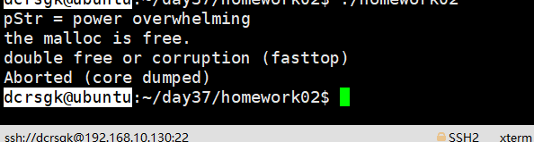

### 1、创建一个子线程，传入数值1，在子线程中能够获取并打印，子线程退出，返回数值主线程通过pthread_join获取等待子线程结束并获取子线程的退出值并打印

- 

### 2、创建一个子线程，子线程申请内存，通过清理函数进行free，子线程停留在read标准输入，主线程cancel子线程，子线程能够通过清理函数free对应的malloc的内存

- 

----------------------------------------------------------------------------------------
### 附加作业（其他作业都完成了再写）：

### 应用前面的进程间通信知识，实现四窗口聊天

- 