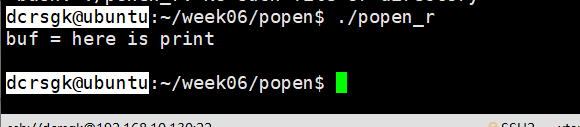
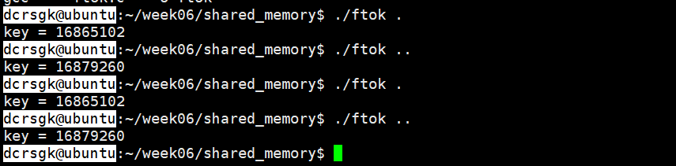
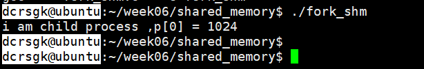

# Week06 笔记 day33~day38

[TOC]


### Ep01 管道

##### 标准流管道 popen

> - 函数原型
>
>   ```c
>   FILE *popen(const char*comman,const char*openmode);
>   //启动一个新进程，并且新进程也原进程之间有一条管道进行通信
>   ```
>
>   - `command` 字符串是要运行的程序名
>   - open_mode必须是`"w"/"r"`类型
>   - 函数发牛一个FIFE*文件流指针，可以通过stdio函数，比如`fread`来读取文件输出。
>   - 如果为`"w"` 调用程序就可以用`fwrite`向被调用程序发送数据，被调用程序可以在自己的标准输入上读取这些数据
>
> - 代码实现
>
>   - `popen_r.c`
>
>     ```c
>     int main()
>     {
>         FILE *fp;
>         fp = popen("./peint","r");
>         //重定向print的输出，当作此文件的输入
>         char buf[64]={0};
>         fread(buf,sizeof(char),sizeof(buf));
>         printf("buf = %s\n",buf);
>         pclose(fp);
>         return 0;
>     }
>     ```
>
>   - `print.c`
>
>     ```c
>     int main()
>     {
>         printf("i am print");
>         return 0;
>     }
>     ```
>
>   - 运行结果
>
>   - 
>
>   - `popen_w.c`
>
>     ```c
>     int main()
>     {
>         FILE *fp;
>         //以"w"的方式启动新的进程
>         //fwrite写给文件流fp的数据会传递新进程的标准输入
>         fp = popen("./read","w");
>         fwrite("hello read",sizeof(char),10,fp);
>         pclose(fp);
>     }
>     ```
>
>   - `read.c`
>
>     ```c
>     int main()
>     {
>         char buf[128]={0};
>         read(0,buf.sizeof(buf));
>         printf("here is read\n");
>         printf("%s",buf);
>     }
>     ```
>
>   - 运行结果
>
>   - 
>
>     

##### 无名管道

> - 函数原型
>
>   ```CQL
>   #include<unistd.h>
>   int pipe(int fds[2]);
>   //此处2为数组大小
>   ```
>
>   - 在程序中用一对文件描述符表示
>   - 其中一个文件描述符为读，一个为写，fds[0]是读，fds[1]是写。
>   - 创建成功则为0，否则返回-1
>
> - 无名管道的特点
>
>   - 只能在亲缘关系进程间通信（父子/兄弟）
>   - 半双工（有固定的读写端）
>   - 是特殊的文件，可以用read/write等，
>   - 无名管道仅存在在内存中
>   - 进程终止后自动消失
>
> - 代码实现
>
>   - `pipe.c`
>
>     ```C
>     int main()
>     {
>         int fds[2]={0};
>         int ret = pipe(fds);
>         ERROR_CHECK(ret,-1,"pipe Error,4");
>         printf("fds[0]=%d,fds[1]=%d\n",fds[0],fds[1]);
>     	return 0;
>     }
>     ```
>
>   - 
>
>   - 因为进程一开始的时候就创建了`STDIN`，`STDOUT`，`STDERR`三个文件描述符，所以文件描述符从3开始
>
>   - `pipe_fork.c`：通过管道完成的进程间通信
>
>     ```c
>     int main()
>     {
>         int fds[2]={0};
>         int ret = pipe(fds);
>         ERROR_CHECK(ret,-1,"pipe Error,4");
>         char buf[64]={0};
>         if(fork())
>         {
>             printf("here is father process\n");
>             char message = {"hello child,here is father process"};
>             write(fds[1],message,strlen(message));
>         }
>         else
>         {
>          	printf("here is child pricess\n");
>             read(fds[0],buf,sizeof(buf));
>             pritnf("the message form father:");
>             printf("%s\n",buf);
>         }
>         return 0;
>     }
>     ```
>
>   - 运行结果

### Ep02：基于systemⅤ的共享内存

为什么共享内存是最快的IPC？

> - 

##### `ipcs`：查看消息队列/共享内存/信号集

> -  `ipcs -m` ：输出有关共享内存(shared memory)的信息
> -  `ipcs -q` ：输出有关信息队列(message queue)的信息
> -  `ipcs -s` ：输出有关“信号量”(semaphore)的信息

##### `ipcrm [ -M key | -m id | -Q key | -q id | -S key | -s id ]`

> - `ipcrm -M`：用`shmkey`删除共享内存
> -  `ipcrm -m`：用`shmid`删除共享内存
> -  `ipcrm -Q`：用`msgkey`删除消息队列
>
> - `ipcrm -q`：用`msgid`删除消息队列
> - `ipcrm -S`：用`semkey`删除信号量
> - `ipcrm -s`：用`semid`删除信号量

##### 函数原型

> - ```c
>   #include<sys/types.h>
>   #include<sys/ipc.h>
>   key_t ftok(const char*pathname，int proj_id);
>   //路径和大小
>   int shmget(key_t key,int size,int shmflg);
>   //创建/打开一段共享内存段，给内存段由函数的第一个参数位移创建
>   //key的值可以是
>   //shmflg可以是IPC_CREAT和IPC_EXCL
>   //返回值为shmid（共享内存id）失败则为-1；
>   void *shmat(int shmid,const void*shmaddr,int shmflg);
>   //映射共享内存
>   //shmid：是shmget的返回值
>   int shmdt(const void*shmaddr);
>   //
>   int shmctl(int chmid,int cmd,struct shmid_ds *buf);
>   //删除共享内存
>   //cmd是命令语句：常用IPC_SHAT,IPC_SET,IPC_RMID
>   //IPC_RMID更为常用，为删除共享内存段
>   //buf是一个结构体指针，结构体内是共享内存的信息
>   //结算的时候，是以程序判定的
>   //仅有程序结束才完整删除
>   //共享内存的删除是标记删除
>   ```

##### `key_t ftok(const char*pathname，int proj_id);`

> - `const char *pathname`：路径
>
> - `int proj_id`：大小
>
> - `fork.c`
>
>   ```c
>   int mian(int argc,char*argv[])
>   {
>       key_t key = ftok(argv[1],argv[2]);
>       //此处输入一个路径值，可以用
>       //(.)->当前目录
>       //(..)->上一目录
>       //可以自定义大小
>       //成功则返回一个针对当前路径和大小的唯一的key
>       //失败则返回-1
>       printf("key=%d\n",key);
>   }
>   ```
>
>   - 运行结果：

##### `int shmget(key_t key,int size,int shmflg);`

> - 创建/打开一段共享内存段，给内存段由函数的第一个参数唯一创建
>
> - `key_t key`
>
>   - 是一个与共享内存段相关联关键字
>   - 可以如果事先已经存在一个与指定关键字关联的共享内存段，则直接返回该内存段的标识，表示打开，如果不存在，则创建一个新的共享内存段
>   - key 的值既可以用ftok函数产生，也可以是`IPC_ PRIVATE` (用于创建-一个只属于创建进程的共享内存，主要用于父子通信) 。表示总是创建新的共享内存段
>
> - `int size`：表示共享内存的大小，注意此处以字节为单位
>
> - `int shmflg`：是掩码合成值，可以是IPC_CREAT和IPC_EXCL
>
>   - `IPC_CREAT`：表示如果不存在该内存段，则创建它
>   - `IPC_EXCL`：表示如果该内存段存在，则函数返回(-1)
>
> - 返回值为shmid（共享内存id）失败则为-1；
>
> - 代码实现：
>
>   - `shmget.c`
>
>     ```c
>     int main()
>     {
>         int shmid = shmget(1000,1<<20,IPC_CHEAT);
>         //1000为一个关键字，可自定义
>         //1<<20为1mb大小
>         ERROR_CHECK(shmid,-1,"shmid Error");
>         printf("shmid = %d\n",shmid);
>         //shmget返回共享内存id
>         return 0;
>     }
>     ```
>
>   - 运行结果
>
>   - 

##### `void *shmat(int shmid,const void*shmaddr,int shmflg);`

> - 将共享内存段映射到进程空间的某一地址(使用共享内存的前提)
>
> - `int shmid`：为共享内存的段标识，一般为shmget的返回值
>
> - `const void*shmaddr`：指定的是共享内存链接到当前进程中的地址位置
>
>   - **通常为NULL**，表示让系统决定共享内存的地址
>
> - `int shmflg`：为表示符，通常是0
>
> - 如果调用成功则返回0，失败则返回-1
>
> - 代码实现：
>
>   - `shmget_w.c`
>
>     ```c
>    int main()
>     {
>         int shmid = shmget(1000,1<<20,IPC_CHEAT);
>         ERROR_CHECK(shmid,-1,"shmid Error");
>         printf("shmid = %d\n",shmid);
>         printf("here is write\n");
>         //shmget返回共享内存id
>         int *p = (int*)shmat(shmid,NULL,0);
>         //映射文件
>         ERROR_CHECK(p,(int*)-1,"shmat Error~");
>         //需要强转int*类型
>         p[0]=4396;
>         return 0;
>     }
>     ```
> 
>   - `shmget_r.c`
>
>     ```
>    int main()
>     {
>         int shmid = shmget(1000,1<<20,IPC_CHEAT);
>         ERROR_CHECK(shmid,-1,"shmid Error");
>         printf("shmid = %d\n",shmid);
>         //shmget返回共享内存id
>         int *p = (int*)shmat(shmid,NULL,0);
>         //映射文件
>         ERROR_CHECK(p,(int*)-1,"shmat Error~");
>         printf("shm data = %d",p[0]);
>         return 0;
>     }
>     ```
> 
>   - 运行结果：

##### `int shmdt(const void*shmaddr);`

> - 解除当前进程对共享内存的映射，即分离共享内存段和当前进程空间
>
> - 共享内存的分离并不是删除共享内存，只是让共享内存在当前不可用
>
> - `const void*shmaddr`：指定的是共享内存链接到当前进程中的地址位置
>
>   - **通常为NULL**，表示让系统决定共享内存的地址
>
> - 代码实现
>
>   - `shmdt.c`
>
>     ```c
>     int main()
>     {
>         int shmid = shmget(1000,1<<20,IPC_CHEAT);
>         ERROR_CHECK(shmid,-1,"shmid Error");
>         printf("shmid = %d\n",shmid);
>         printf("here is write\n");
>         //shmget返回共享内存id
>         int *p = (int*)shmat(shmid,NULL,0);
>         //映射文件
>         ERROR_CHECK(p,(int*)-1,"shmat Error~");
>         //需要强转int*类型
>         p[0]=4396;
>         shmdt(ret);
>         while(1);
>         return 0;
>     }
>     ```
>
>   - 运行结果
>
>   - 
>
>   - 此时程序未结束，但是共享内存段和进程空间已经分离，在当前进程不可用

##### `int shmctl(int chmid,int cmd,struct shmid_ds *buf);`

> - 删除共享内存
>
> - `int chmid`：共享内存id
>
> - `int cmd`是命令语句：常用IPC_SHAT,IPC_SET,IPC_RMID
>
>   - IPC_RMID更为常用，为删除共享内存段
>
> - `struct shmid_ds *buf`是一个结构体指针，结构体内是共享内存的信息
>
> - 结算的时候，是以程序判定的
>
> - 仅有程序结束才完整删除
>
> - 共享内存的删除是标记删除
>
> - 代码实现：
>
>   - `shmctl_rm.c`
>
>     ```c
>     int main()
>     {
>         int shmid = shmget(1000,1<<20,IPC_CHEAT);
>         ERROR_CHECK(shmid,-1,"shmid Error");
>         printf("shmid = %d\n",shmid);
>         printf("here is write\n");
>         //shmget返回共享内存id
>         int *p = (int*)shmat(shmid,NULL,0);
>         //映射文件
>         ERROR_CHECK(p,(int*)-1,"shmat Error~");
>         //需要强转int*类型
>         p[0]=4396;
>         shmdt(ret);
>         shmctl(shmid,IPC_RMID,NULL);
>         while(1);
>         return 0;
>     }
>     ```
>
>   - 

##### 子进程和共享内存

> - 子进程和父进程在访问共享内存的时候，应先定位共享内存，再进行共享内存的操纵
>
> - 而且必须在fork之前完成初始化操作
>
>   - `fork_shm.c`
>
>     ```c
>     int main()
>     {
>         int shmid;
>         shmid = shmget(1000,1<<20,IPC_CREAT|0600);
>         int *p;
>         p = (int*)shmat(shmid,NULL,0);
>         if(fork())
>         {
>             p[0] = 1024;
>             wait(NULL);
>             //等待子进程
>         }
>         else
>         {
>             printf("i am child process ,p[0] = %d\n",p[0]);
>         }
>         return 0;
>     }
>     ```
>
>   - 结果：

##### 初试并发问题

> - 并发：两程序各自独立，操作同一资源
>
> - 并行：两程序各自独立，操作不同资源
>
> - 应对高并发：需要负载均衡(工作方向)，分流不同服务器
>
> - 此时子进程和父进程同时都需要访问p[0]（共享内存）
>
>   - 造成父子进程之间竞争p[0]这一资源
>   - 导致并发问题的出现，使得结果不到2000w
>
> - `shm_add.c`：两进程各加1000w
>
>   ```c
>   #define N 10000000
>   int main()
>   {
>       int shmid;
>       shmid = shmget(1000,1<<20,IPC_CREAT|0600);
>       int *p;
>       p = (int*)shmat(shmid,NULL,0);
>       if(fork())
>       {
>           for(int i = 0;i<N;i++)
>           {
>               p[0] += 1;
>           }
>           wait(NULL);
>           //等待子进程
>           printf("p[0] = %d",p[0]);
>       }
>       else
>       {
>           for(int i = 0;i<N;i++)
>           {
>               p[0] += 1;
>           }
>       }
>       return 0;
>   }
>   ```
>
>   - 结果：

##### 虚拟地址和共享内存的关系

> - 进程虚拟地址到物理地址的转换：多数为写时复制(lazy模式)
>   - 页目录>>页表项>>页内偏移（对于32位系统仅有3级）
>   - TLB：快表，加快映射速度
>     - 本质是因为cpu速度和内存速度差别过大
>     - 将频繁访问的数据存入TLB（速度和cpu差不多）中，不造成cpu时间片的浪费
>   - 当虚拟页和物理页的映射关系没有建立，并且要访问这段内存时，会发生缺页异常，需要调页。
>   - 建立映射关系，可以通过使用大页，减少缺页异常。
>   - 缺页异常的处理：`shmat`函数的shmflg参数可以是大页
>   - 
> - mmap方式实现共享内存
>   - MAP_SHARED
>   - 速度快，可以多对多
>   - 用法类似通告版

##### IPC_PRIVATE：私有方式创建共享内存

> - 仅有亲缘关系的可以访问
>
> - shmget_pravate.c
>
>   ```c
>   int main()
>   {   
>       int shmid = shmget(IPC_PRIVATE,4096,IPC_CREAT);
>       ERROR_CHECK(shmid,-1,"shmid Error,5");
>       printf("shmid = %d\n",shmid);
>       int *p = (int*)shmat(shmid,NULL,0);
>       return 0;
>   }
>   ```
>

### Ep03 基于systemⅤ信号量

##### 原型

> - 函数原型
>
>   ```c
>   #include<sys/sem.h>
>   #include<sys/types.h>
>   #include<sys/ipc.h>
>   int semget(key_t key,int nsems,int flags);
>   int semop(int semid,struct sembuf*sops,size_t num_sops);
>   int semctl(int semid,int semmnum,int cmd,...);
>   ```
>
> - 并行和并发
>
>   - 并行：同一时刻可以有多个进程使用资源。
>   - 并发：同一时刻只能有一个进程使用资源，但是一段时间内可以有多个进程使用资源。
>
> - 分类（一个与多个）
>
>   - 单个信号量：可以看作是二进制开关：相当于锁（pv操作）
>     - 对同一个数各加一千万
>     - 若不加锁则会两个进程竞争导致所得数小于两千万
>   - 多个信号量：计数信号量→信号量的值代表资源数量，限制资源可以被多少进程访问

##### `semget(key_t key,int nsems,int nsems);`

> - `key_t key`：是一个唯一标识信号量的关键字，如果为IPC_PRIVATE(值为0，创建一个只有创建者进程菜能访问的信号量，常用于父子进程之间)；非0的key值可以通过fork函数得到，表示创建一个可以被多个进程共享的信号量
>
> - `int nsems`：是指定要使用的信号量数目，如果是创建新的集合，则必须指信号量的数目，如果引用一个现成的集合，nsems的值固定为0
>
> - `int nsems`：是一个标识，作用和open函数的标识符类似，标识文件权限
>
>   - 还可以和IPC_CREAT合用创建一个新的信号量
>
> - 成功则返回一个信号量标识符整数（可被semop和semctl使用）出错则返回-1
>
> - 代码实现
>
>   - semget.c
>
>     ```c
>     int main()
>     {
>     	int semArrId = semget(1000,1,IPC_CREAT|0600);
>         ERROR_CHECK(semArrId,-1,"semget Error");
>     }
>     ```
>
>   - 效果：创建了一个信号量,nsems表示个数

##### `int semctl(int semid,int semmnum,int cmd,...);`

> - `int semid`：一般为semget的返回值，
>
> - int semmnum：表示集合信号量的编号
>
>   - 一般是0，表示第一个信号量。
>   - 当要用到成组的信号量时，从0开始。即，多个信号量的时候表示信号量的编号
>
> - int cmd：控制信号量的命令
>
>   - SETVAL：设置单个信号量的值
>   - SETALL：设置全部信号量的值（此时需要一个指针类型存储设置值）
>   - GETVAL：得到单个信号的值
>   - GETALL：得到所有信号的值（此时需要一个指针类型存储获得值）
>   - IPC_RMID：删除信号量的值
>
> - 代码实现：
>
>   - ```c
>     int main()
>     {
>         key_t information = 7777;
>         int semArrId = semget(information,7,IPC_CREAT|0600);
>         ERROR_CHECK(semArrId,-1,"semget Error,5");
>         //IPC_CREAT
>         //创建信号量
>         struct semid_ds stat;
>         memset(&stat,0,sizeof(stat));
>         int ret;
>         ret = semctl(semArrId,0,IPC_STAT,&stat);
>         ERROR_CHECK(ret,-1,"semctl Error,12");
>         printf("sem_nsems=%ld,per=%o\n",stat.sem_nsems,stat.sem_perm.mode);
>         //IPC_STAT
>         //读取一个信号量集的数据结构semid_ds，
>         //并将其存储在semun中的buf参数中   
>         stat.sem_perm.mode = 0666;
>         //修改权限666
>         ret = semctl(semArrId,0,IPC_SET,&stat);
>         ERROR_CHECK(ret,-1,"set Error,21");
>         printf("the stat was changed,new stat is:\n");
>         printf("sem_nsems=%ld,per=%o\n",stat.sem_nsems,stat.sem_perm.mode);
>         //IPC_SET
>         //设置信号集中的ipc_prem，取值取自semun中的buf参数中
>         
>         ret = semctl(semArrId,0,GETVAL);
>         ERROR_CHECK(ret,-1,"getval Error,28");
>         printf("getval is %d\n",ret);
>         //GETVAL
>         //返回信号量集中的一个单个的信号量的值
>         
>         int valSet = 777;
>         semctl(semArrId,0,SETVAL,valSet);
>         ERROR_CHECK(ret,-1,"setval Error,35");
>         //SETVAL
>         //设置信号量集中的一个单独的信号量的值
>         //此处设置信号的值为777
>         //下面用getval打印
>             
>         int valGet;
>         valGet = semctl(semArrId,0,GETVAL);
>         ERROR_CHECK(valGet,-1,"getval Error,44");
>         printf("the valset is %d\n",valGet);
>         //GETVAL
>         //读取信号集合中一个单独信号的值
>         //此处获取的为上面设置的信号3的值777
>         
>         unsigned short allSet[7] = {1,2,3,4,5,6,7};
>         ret = semctl(semArrId,0,SETALL,allSet);
>         ERROR_CHECK(ret,-1,"setall Error,52");
>         //SETALL
>         //设置信号集合中所有信号的值
>         
>         unsigned short allGet[7];
>         ret = semctl(semArrId,0,GETALL,allGet);
>         ERROR_CHECK(ret,-1,"getall Error,59");
>         //GETALL
>         //获取信号中所有信号的值
>         for(int i=0;i<7;i++)
>         {
>             printf("allGet[%d]=%d\n",i,allGet[i]);
>         }
>         //打印值
>     
>         ret = semctl(semArrId,0,IPC_RMID);
>         ERROR_CHECK(ret,-1,"rm Error,69");
>         printf("rm success\n");
>         return 0;
>     } 
>     ```
>     
>   - 运行结果：

##### `int semop(int semid,struct sembuf*sops,size_t num_sops);`

> - 用于改变信号量的状态
>
> - **关键应用：PV操作**
>
> - `int semid`：为semget返回的信号量标识符
>
> - `struct sembuf*sops`：为一个结构体指针，具体如下
>
>   - ```c
>     struct sembuf
>     {
>         short sem_num;
>         //操作信号量在信号集合中的编号，从0开始
>         short sem_op;
>         //pv操作的标识符，p操作为-1，v操作为1
>         //p操作：等待信号量变为可用
>         //v操作：发信号通知信号量现在可用
>         short sem_flg;
>         //通常为SEM_UNDO,程序结束，信号量为semop调用前的值
>     }
>     ```
>
> - `size_t num_sops`：sops表示sembuf结构体的数组大小
>
> - 成功返回0，失败返回-1
>
> - 代码实现：关键用法：PV操作
>
>   - `semop_pv.c`
>
>     ```c
>     #define N 10000000
>     int main()
>     {
>     	int shmid = shmget(1000,1<<20,IPC_CREAT|0600);
>     	int semArrId = semget(7777,1,IPC_CREAT|0600);
>     	ERROR_CHECK(semArrId,-1,"smget Error,");
>     	int ret = semctl(semArrId,0,SETVAL,1);
>     	ERROR_CHECK(ret,-1,"semctl Error,8");
>         int *p = (int*)shmat(shmid,NULL,0);
>     	p[0]=0;
>     	struct sembuf sopp,sopv;
>         
>         sopp.sem_num = 0;
>         sopp.sem_op = -1;
>         sopp.sem_flg = SEM_UNDO;
>     
>         sopv.sem_num = 0;
>         sopv.sem_op = 1;
>         sopv.sem_flg = SEM_UNDO;
>         
>     	if(fork())
>     	{
>     	    for(int i = 0;i<N;i++)
>     	    {
>             semop(semArrId,&sopp,1);
>             //加锁
>             p[0] += 1;
>             semop(semArrId,&sopv,1);
>             //解锁
>         }
>     	    wait(NULL);
>     	    //等待子进程
>     	    printf("total = %d\n",p[0]);
>     	}
>     	else
>     	{    
>     	    for(int i = 0;i<N;i++)
>     	    {
>     	        semop(semArrId,&sopp,1);
>     	        p[0] += 1;
>     	        semop(semArrId,&sopv,1);
>     	    }
>     	}
>     	return 0;
>     } 
>     
>     ```
>
>   - 
>
>   - 真的！！太慢了！！啊！！！
>
>   - 慢的原因：每次+1都要进行一次pv操作，共计2000w次

### Ep04 基于信号量的生产者消费者模型（重要：此处为单生产者和单消费者模式）

> - 解决思路：对于生产者，如果缓存是满的就去睡觉。
>
> - 消费者从缓存中取走数据后就叫醒生产者，让它再次将缓存填满
>
> - 若消费者发现缓存是空的，就去睡觉。
>
> - 下一轮中生产者将数据写入后就叫醒消费者
>
> - 因为只有生产者和消费者两个进程，正好是这两个进程存在着互斥关系和同步关
>
> - 那么需要解决的是互斥和同步PV操作的位置。使用“进程间通信”，“信号量”semaphore就可以完美解决唤醒的问题
>
> - 生产者消费者直接通信（区别卖票问题）
>
> - 代码实现：
>   
>   - ```c
>     #define N 10000000
>     int main()
>     {
>     	int shmid = shmget(1000,1<<20,IPC_CREAT|0600);
>     	int semArrId = semget(7777,1,IPC_CREAT|0600);
>     	ERROR_CHECK(semArrId,-1,"smget Error,");
>     	int ret = semctl(semArrId,0,SETVAL,1);
>     	ERROR_CHECK(ret,-1,"semctl Error,8");
>         int *p = (int*)shmat(shmid,NULL,0);
>     	p[0]=0;
>     	struct sembuf sopp;
>         struct sembuf sopv;   
>         sopp.sem_num = 0;
>         sopp.sem_op = -1;
>         sopp.sem_flg = SEM_UNDO;
>         sopv.sem_num = 0;
>         sopv.sem_op = 1;
>         sopv.sem_flg = SEM_UNDO;
>         //申请共享内存，信号量 pv操作结构体并经行初始化
>     	if(fork())
>     	{
>     	    for(int i = 0;i<N;i++)
>     	    {
>                 semop(semArrId,&sopp,1);
>                 //加锁
>                 p[0] += 1;
>                 semop(semArrId,&sopv,1);
>                 //解锁
>         	}
>     	    wait(NULL);
>     	    //等待子进程
>     	    printf("total = %d\n",p[0]);
>     	}
>     	else
>     	{    
>     	    for(int i = 0;i<N;i++)
>     	    {
>     	        semop(semArrId,&sopp,1);
>     	        p[0] += 1;
>     	        semop(semArrId,&sopv,1);
>     	    }
>     	}
>     	return 0;
>     } 
>     ```
>     
>   - 

### Ep05 消息队列（message queue）原型

> - 函数原型
>
>   ```c
>   #include<sys/types.h>
>   #include<sys/ipc.h>
>   #include<sys/msg.h>
>   int msgget(key_t key,int msgflg);
>   int msgsnd(int msqid,const void *msgp,size_t msgsz,int msgflg);
>   ssize_t msgrcv(int msqid,const void *msgp,size_t msgsz,long msgtyp,int msgflg);
>   int msgctl(int msqid,int cmd,struct msqid_ds *buf);
>   ```
>

### Ep06  信号

- 信号代表着一个进程的中断？

- 软件模拟的软中断，signal/sigaction机制

- 信号编码：通过信号编码的方式传递信号

  > - 

- 信号的默认行为

  > - 所有信号都有唤醒进程的功能
  > - 对应    不能直接kill -9进程需要发送特别的信号 SIGUSER1，在处理函数里进行信号的有序退出
  > - 

- 信号的产生：信号来自内核

  > - 用户：通过终端输入
  > - 内核：当程序执行出错的时候，内核会产生信号
  > - 进程：一个进程可以通过系统调用kill给另一个进程发送信号，进程可以通过信号和另一个进程进行通信
  >
  > 因为进程的某个操作产生的信号成为同步信号；像用户输入之后产生的信号教转异步信号

- 信号的处理行为

  > - 接受默认处理：接收默认处理的进程通常会导致进程本身消亡
  > - 忽略信号：进程可以通过代码，显示地忽略某个信号的处理。例如: signal(SIGINT,SIG_ IGN); 
  > - 捕捉信号并处理：进程可以事先注册信号处理函数，当接收到信号时，由信号处理函数自动捕捉并且处理信号。

### Ep07 signal信号处理机制

- 原型

  > - 

### Ep08 sigaction信号处理机制