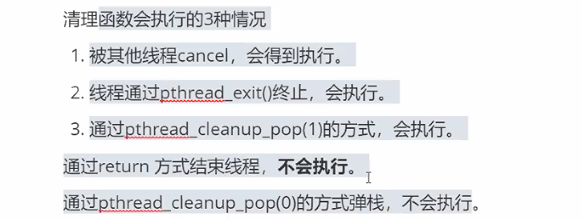

# day38 笔记

### Ep01 昨日重现

进程间通信作业：

定义结构体，约定进程协议

用信号量给共享内存加锁

- 线程的概念

  > - 
  > - 线程和进程
  > - 线程和进程的功能对比
  > - 子线程和主线程：
  > - 线程的分类
  > - NPTL线程库函数
  >   - 失败返回错误码，需要用strerror(ret)来打印错误信息
  >   - 编译的时候需要加上pthread

- 线程的创建

  > - 
  >
  > - 代码实现
  >
  >   ```c
  >   
  >   ```
  >
  > - 
  >
  > - 

- 线程的退出和等待

  > - 先回忆一下进程的退出和等待
  >
  >   - 子进程退出
  >
  >     ```c
  >     //传参是int类型
  >     exitW(int status);
  >     ```
  >
  >   - 父进程退出
  >
  > - 线程的退出和等待
  >
  >   - 
  >
  > - 
  >
  > - 
  > - 
  > - 
  > - 代码实现：

- 线程的取消

  > - pthread_cancel：线程的取消
  >   - 
  > - 线程的资源清理（主要清理锁）
  >   - 

- 线程的清理

- 

### Ep02 线程的清理

- dd

  > - ```c
  >   
  >   void cleanFunC(void *p)
  >   {
  >       printf("i am cleanFunc\n");
  >   }
  >   void cleanUpFunC2(void *p)
  >   {
  >       printf("i am cleanFunc 2\n");
  >   }
  >   void *threadFunc(void *p)
  >   {
  >       char *pStr = (char*)malloc(20); 
  >   }
  >   int main()线程的同步和互斥
  >   ```

### Ep03 线程的同步和互斥

- 线程的互斥

  > - 静态方式
  >   - 
  > - 动态方式
  >   - 

- 锁操作

  > - 加锁/解锁/测试加锁
  >
  > - 加锁两次：
  >
  >   ```c
  >   int mian()
  >   {
  >       pthread_mutex_t mutex;
  >       pthread_mutex_init (&mutex,NULL);
  >       //初始化锁 初始化锁为未锁定状态
  >       pthread_mutex_lock(&mutex);
  >       //线程加锁
  >       printf("lock success\n");
  >       
  >       pthread_mutex_lock(&mutex);
  >       //此时再加锁则会阻塞线程
  >       //为sleep状态
  >       printf("you can't see me\n");
  >       pthread_mutex_unlock(&mutex);
  >       pthread_mutex_destory(&mutex);
  >   }
  >   ```
  >
  > - 
  >
  > - 子线程和主线程分别加锁
  >
  >   ```c
  >   void *threadFunc(void* p)
  >   {
  >       pthread_mutex_t *pMutex = (pthread_mutex_t*)p;
  >       //
  >       pthread_mutex_lock(pMutex);
  >       printf("child lock success\n");
  >       pthread_mutex_unlock(&pMutex);
  >       pthread_exit(NULL);
  >   }
  >   
  >   
  >   int mian()
  >   {
  >       pthread_t thId;
  >      
  >       pthread_mutex_t mutex;
  >       pthread_mutex_init (&mutex,NULL);
  >       //初始化锁 初始化锁为未锁定状态
  >       pthread_create(&thId,NULL,threadFunc,&mutex);
  >       
  >       pthread_mutex_lock(&mutex);
  >       //线程加锁
  >       printf("main lock success\n");
  >       
  >       sleep(1);
  >       //假设锁内有关键代码
  >       
  >       pthread_mutex_unlock(&mutex);
  >       pthread_join(thId,NULL);
  >       //等待子线程
  >       pthread_mutex_destory(&mutex);
  >   }
  >   ```
  >
  > - add 100000
  >
  >   ```c
  >   #define N 1000000
  >   typedef struct data
  >   {
  >       int val;
  >       pthread_mutex_t mutex;
  >   }Data_t;pData_t;
  >   void *threadFunc(void* p)
  >   {
  >   	pData_t pData = (pData_t)p;
  >   	
  >       int *pVal = (int*)p;
  >   	for(int i = 0;i<N;i++)
  >       {
  >           pthread_mutex_lock(&pDAta->mutex);
  >           //对pData里的加锁
  >           pData->val+=1;
  >           //表示对共享资源的访问
  >           pthread_mutex_unlock(&Data->mutex);
  >       }
  >       pthread_exit(NULL);
  >   }
  >   
  >   int mian()
  >   {
  >       pthread_t thId;
  >      
  >       pthread_mutex_t mutex;
  >       Dada_t data;
  >       data.val = 0;
  >       pthread_mutex_init (&dada.mutex,NULL);
  >       //初始化锁 初始化锁为未锁定状态
  >       pthread_create(&thId,NULL,threadFunc,&data);
  >       //此处需要定义结构体
  >       pthread_mutex_lock(&mutex);
  >       //线程加锁
  >       printf("main lock success\n");
  >       
  >   	for(int i = 0;i<N;i++)
  >       {
  >           pthread_mutex_lock(&data.mutex);
  >           //加锁 类似p操作
  >           data.val+=1;
  >           //表示对共享资源的访问
  >           pthread_mutex_unlock(&data.mutex);
  >           //解锁 类似v操作
  >       }
  >       pthread_mutex_unlock(&mutex);
  >       pthread_join(thId,NULL);
  >       //等待子线程
  >       pthread_mutex_destory(&mutex);
  >   }
  >   ```
  >
  > - 嵌套锁
  >
  >   - 
  >   - 代码实现：自己写//
  >
  > 

