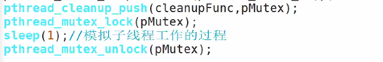

# day39 笔记

### Ep01 线程的同步和互斥

+ 线程的互斥 //补充 线程笔记

  > - ps -elLf 查看线程 
  >
  > - 
  >
  > - pthread_cancle_lock.c
  >
  > - 
  >
  >   ```c
  >   #define N 3000000
  >   typedef struct dada
  >   {
  >       int val;
  >       pthread_mutex_t mutex;
  >   }Data_t,*pData_t;
  >   void cleanupFunc(void *p)
  >   {
  >       pData_t pData = (pData_t)p;
  >       pthread_mutex_unlock(&pData->mutex);
  >   }
  >   void pthreadFunc(void*p)
  >   {
  >       pData_t pData = (pData_t)p;
  >       //pssh(cleanupFunc,pData->mutex);
  >       pthread_mutex_lock(&pData->mutex);
  >       sleep(1);
  >       pthread_mutex_unlock(&pData->mutex);
  >       //pop(cleanupFunc,pData->mutex);
  >       //此处未释放子线程的锁
  >       //会造成一个子进程已经结束，但是未释放锁
  >       //另一个子进程等待锁，但是进程已经结束无法释放锁
  >       //造成死锁
  >       
  >       
  >       pthread_exit(NULL);
  >   }
  >   
  >   int main()
  >   {
  >       pthread_t thId1;
  >       pthread_t thId2;
  >       pthread_mutex_t mutex;
  >       pthread_mutex_inti(&mutex,NILL);
  >       pthread_create(&thId1,NULL,threadFunc，&mutex);
  >       pthread_create(&thId1,NULL,threadFunc，&mutex);
  >       
  >       pthread_cancel(thId1);
  >       pthread_cancel(thId2);
  >       long threadRet = 0;
  >       pthread_join(thid1,(void**)&threadRet);
  >       priuntf("thread1 Ret = %ld",threadRet);
  >       
  >       pthread_join(thid2,(void**)&threadRet);
  >       priuntf("thread2 Ret = %ld",threadRet);
  >   }
  >   ```
  >
  > - 锁的公平性：
  >
  > - ```c
  >   #define N 20
  >   typedef struct dada
  >   {
  >       int tickets;
  >       pthread_mutex_t mutex;
  >   }Data_t,*pData_t;
  >   
  >   
  >   void *threadFunc1(void *p)
  >   {
  >       pData_t pData = (pData_t)p;
  >       
  >       while(1)
  >       {
  >           
  >           pthread_mutex_t pMutex = (&pData->mutex);
  >           pthread_mutex_lock(&pData->mutex);
  >           printf("window 1 start tickets; %d",pData->tickets);
  >           if(pData->tickets>0)
  >           {
  >           	pData->ticket --;
  >           	printf("window 1 sale a ticket; %d",pData->tickets);
  >       	}
  >           else
  >           {
  >           	printf("window 1 sale, end\n");
  >           }
  >           pthread_mutex_unlock(&pData->mutex);
  >       }
  >   }
  >   
  >   
  >   void *threadFunc2(void *p)
  >   {
  >       pData_t pData = (pData_t)p;
  >       while(1)
  >       {
  >           printf("window 2 start tickets; %d",pData->tickets);
  >           if(pData->tickets>0)
  >           pthread_mutex_t pMutex = (&pData->mutex);
  >           pthread_mutex_lock(&pData->mutex);
  >           pData->ticket --;
  >           printf("window 2 sale a ticket; %d",pData->tickets);
  >           pthread_mutex_unlock(&pData->mutex);
  >       }else{
  >           printf("window 2 sale, end\n");
  >       }
  >   }
  >   int main()
  >   {
  >       pthread_t thId1;
  >       pthread_t thId2;
  >       
  >       Data_t data;
  >       data.tickets = 20;
  >       pthread_create(&thId1,NULL,threadFunc1,&data);
  >       pthread_create(&thId2,NULL,threadFunc1,&data);
  >       pthread_cancel(thId1);
  >       pthread_cancel(thId2);
  >       long threadRet = 0;
  >       pthread_join(thid1,(void**)&threadRet);
  >       priuntf("thread1 Ret = %ld",threadRet);
  >       
  >       pthread_join(thid2,(void**)&threadRet);
  >       priuntf("thread2 Ret = %ld",threadRet);
  >       
  >   }
  >   ```
  >
  > - 

+ 等待锁：重听

  > - 

### Ep02 线程的同步

- 条件变量

  > - 条件变量是利用线程间共享的全局变量进行同步的一种机制
  > - 主要包括两个动作:
  >   - 一个线程等待条件变量的条件成立而挂起
  >   - 一个线程使条件成立(给出条件成立信号)。
  > - 为了防止竞争，条件变量的使用总是和一一个互斥锁结合在一起。
  > - 所以传参时候传条件变量和一把互斥锁，
  > - 条件变量表示要等待的资源是否就绪。
  >   - 资源未就绪就表示条件不成立
  >   - 资源就绪之后表示条件成立
  >   - 互斥锁是保护资源的，当线程在等待条件变量成立的时候需要先释放锁

- 条件变量的创建和注销

  > - 静态创建NULL
  >
  >   - 使用PTHREAD_COND_INITIALIZER常量
  >   - `pthread_cond_t cond = PTHREAD_COND_INITIALIZER `
  >
  > - 动态创建
  >
  >   - 调用pthread_cond_init函数，函数原型：
  >
  >   - ```c
  >     int pthread_cond_init(pthread_cond_t *cond,pthread_condattr_t *cond_attry);
  >     ```
  >
  >   - `pthread_condattr_t *cond_attry`：常为NULL
  >
  >   - 代码实现：
  >
  >   - `.c`
  >
  >     ```c
  >     typedef struct DATA
  >     {
  >         pthread_mutex_t mutex;
  >         pthread_cond_t cond;
  >         
  >     }Data_t,*pData_t;
  >     
  >     void *threadFunC(viod *p)
  >     {
  >         pData_t pData = (pData_t)p;
  >         printf("child alive\n");
  >         pthread_mutex_lock(&pData->mutex);
  >         printf("child lock success\n");
  >         
  >         pthread_cond_wait(&pData->cond,&pData->mutex);
  >         printf("child awake\n");
  >         pthread_mutex_unlock(&pData->mutex);
  >     }
  >     
  >     
  >     int main()
  >     {
  >         pthread_t thId;
  >         Data_t data;
  >         pthread_mutex_init(&data.mutex,NULL);
  >         pthread_cond_init(&data.cond,NULL);
  >         pthread_creat(&thId,NULL,threadFunC,
  >                       &data);
  >         pthread_join(thId,NULL);
  >         //等待子进程
  >         
  >     }
  >     ```
  >
  > - 注销：

- 条件变量构建的生产者消费者模型：

  > - 两个线程：窗口买票
  >
  > - 一个线程：一定时间内放出一定的票，充当生产者
  >
  >   - ```
  >     void *
  >     ```
  >
  >   - 


(1)可重入概念只和函数访问的变量类型有关，和是否使用锁没有关系。

(2)线程安全，描述的是函数能同时被多个线程安全的调用，并不要求调用函数的结果具有可再现性。 也就是说，多个线程同时调用该函数，允许出现互相影响的情况，这种情况的出现需要某些机制比 如互斥锁来支持，使之安全。 

(3)可重入函数是线程安全函数的一种，其特点在于它们被多个线程调用时，不会引用任何共享数据。 

(4)线程安全是在多个线程情况下引发的，而可重入函数可以在只有一个线程的情况下来说。 

(5)线程安全不一定是可重入的，而可重入函数则一定是线程安全的。 

(6)如果一个函数中有全局变量，那么这个函数既不是线程安全也不是可重入的。 (7)如果将对临界资源的访问加上锁，则这个函数是线程安全的，但如果这个重入函数若锁还未释放 则会产生死锁，因此是不可重入的。 

(8)线程安全函数能够使不同的线程访问同一块地址空间，而可重入函数要求不同的执行流对数据的操作互不影响使结果是相同的。