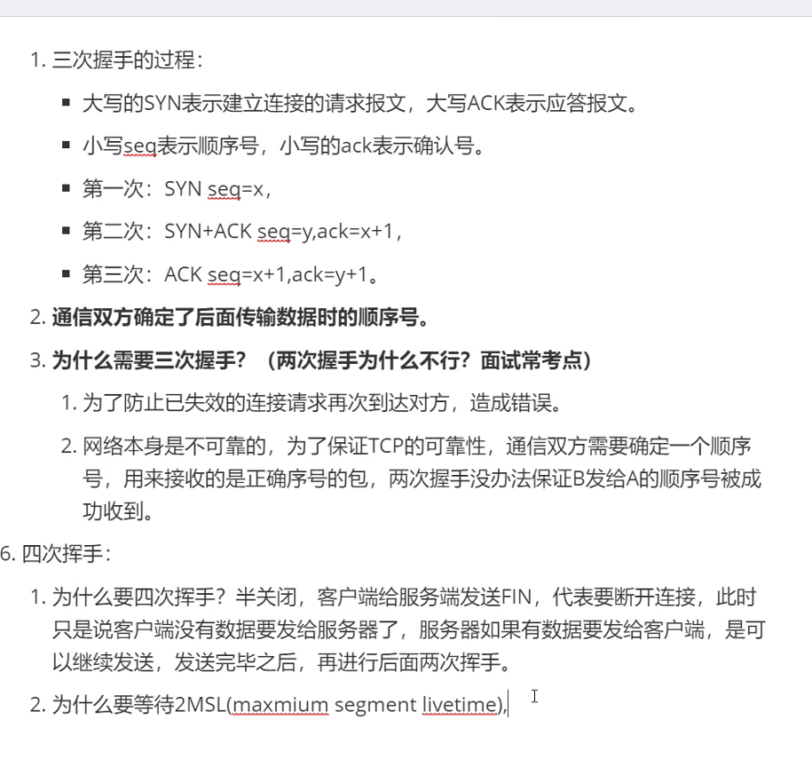
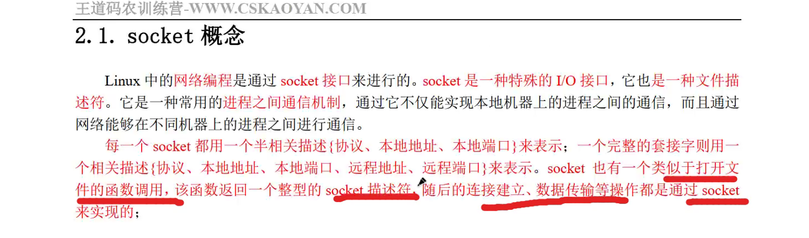
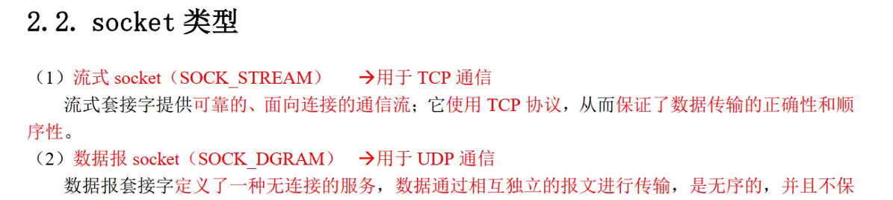
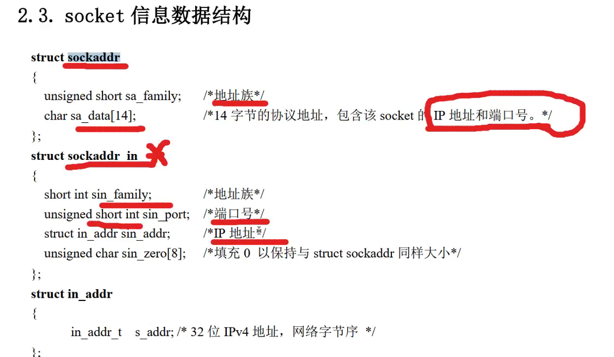
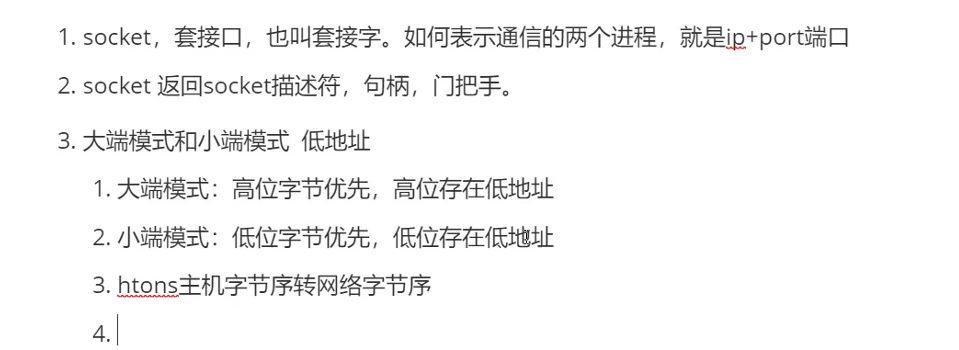
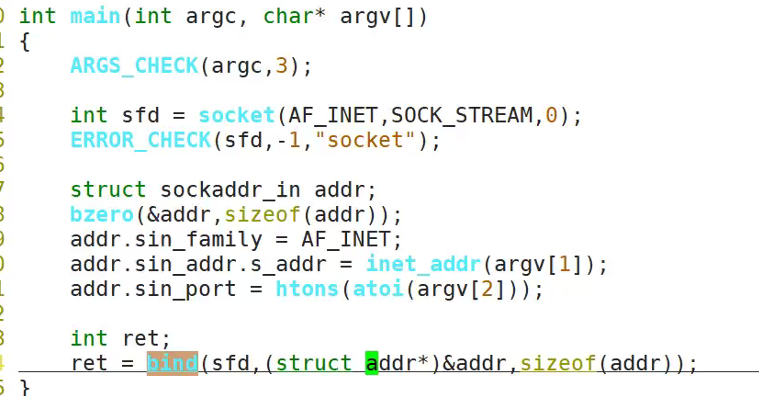

# day42 笔记

### 三次握手

### 四次挥手



### Ep02 网络编程

- socket：套接口

  > - 一种特殊的IO接口，也是一种文件描述符。是一种常用的进程间通信机制

- socket类型

  > - 

- 函数原型

  > - 

- 大端模式和小端模式

  > - 
  > - 大端模式：高位字节优先，高位存在高位置
  > - 小端模式：低位字节优先，低位存在低地址
  > - htons：主机字节序转网络字节序

- socket

  > - 
  >
  > - 
  >
  > - tcp_client.c(客户端程序)
  >
  >   ```c
  >   //corker connect
  >   
  >   int main(int argc,char*argv[])
  >   {
  >       int sfd = shoket(AF_INET_STREA<,0);
  >      	
  >       struct sockaddr_in addr;
  >       bzero(&addr,sizeof(addr));
  >       addr.sin_family = AF_INET;
  >       addr.sin_addr.s_addr = inet_addr(argv[1]);
  >       
  >       int ret;
  >       ret = connect(sfd,(struct sockaddr*)&addr,sizeof(addr));
  >       char buf[1024] = {0};
  >       recv
  >   }
  >   ```
  >
  > - 