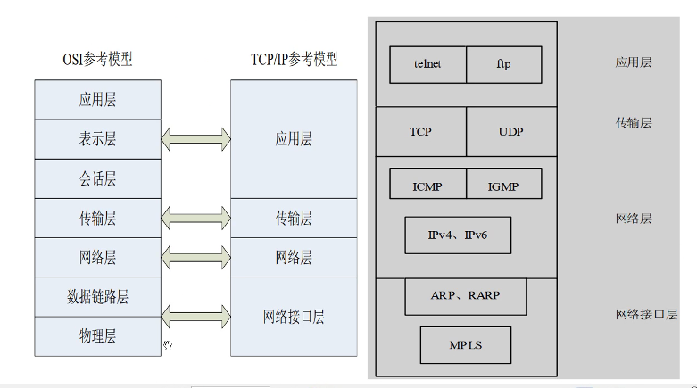
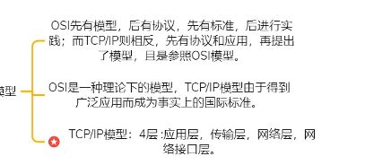
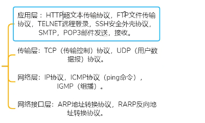
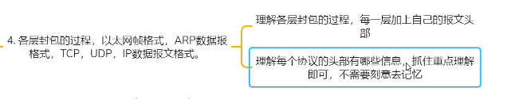
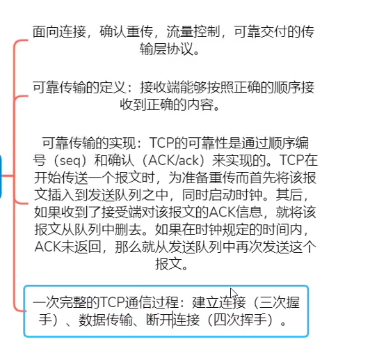
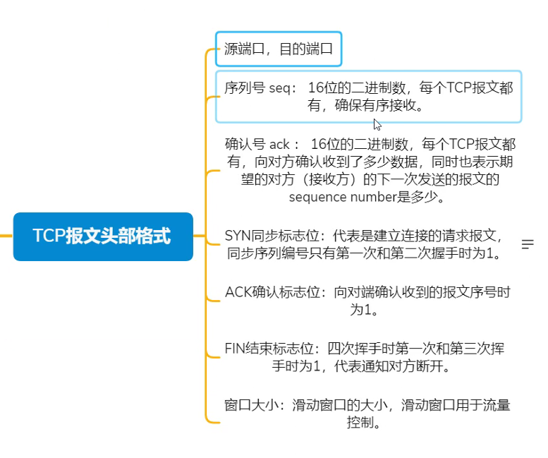
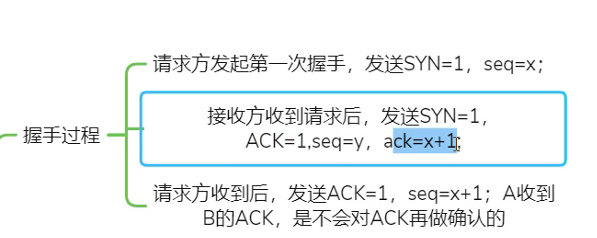
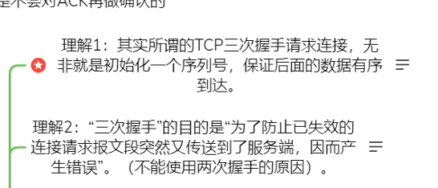
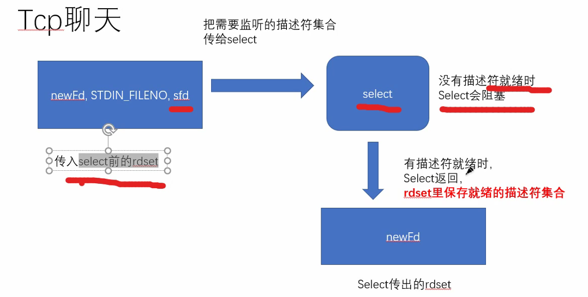

# day43 笔记

### Ep01 网络协议复习

- 什么是网络协议

  > - 通信双方必须遵循的通信规则的集合，它规定了通信时信息必须采用的格式和这些格式的意义。
  > - 网络上两台计算机之间的通信实际上的计算机上两个进程间的通信。ip地址+ 端口号
  > - 大多数网络都采用分层的体系结构，每一层都建立在它的下层之上,向它的上一层提供一定的服务,而把如何实现这-服务的细节对上一层加以屏蔽



- 

  > - open system Interconnect：开放式系统互联
  >   - **OSI模型**：7层应用层，表示层，会话层，传输层，网络层，数据链路层，物理层
  >   - 第三层统称通信子网，为联网而符加的通信设备，完成的是数据传输的功能
  >   - 高三层统称资源子网，相当于操作系统，完成数据的处理，承上启下
  >   - OSI引进了服务，接口，协议，分层的概念
  >   - TCP/IP协议借鉴了OSI模型建立了TCP/IP模型

- TCP/IP协议

  > - 

- 常用网络协议

  > - 

- 各层封包的过程

  > - 


- dd

  > - 

- TCP报文的头部格式

  > - 

- 三次握手和四次挥手

  > - 握手过程
  >   - 
  >   - 禁止套娃，不会确认纯粹的ACK包
  > - 为什么需要三次握手
  >   - 
  >   - 导致第二次握手丢失时，出现死锁

### Ep02

- d

  > - little.c
  >
  >   ```c
  >   int main()
  >   {
  >       short port = 0x1234;
  >       char *p = (char*)&port;
  >       if(*p == 0x12)
  >       {
  >           printf("big endian\n");
  >           pritnf("%x\n",*p);
  >       }
  >       else is(*p == 0x34)
  >       {
  >           printf("little endian\n");
  >           pritnf("%x\n",*p);
  >       }
  >   
  >   }
  >   ```
  >
  > - 
  >
  > - 
  >
  > 