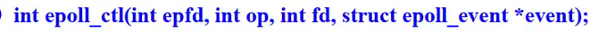

# day44 笔记

### Ep01 写在前面

### Ep02 epoll多路复用

- 函数原型

  > - 
  > - 

- int epoll_create(int size);

  > - int size：一般为1
  >   - 旧时用hashmap实现，现在用红黑树，不需要填size
  > - 
  > - 返回值相等于epoll的一个描述符（后续操作都是基于返回值完成的）

- 

  > - 注册epoll事件，以及描述符
  >
  > - 添加一次，一直生效
  >
  > - 
  >
  > - int epfd：为epoll_create的返回值
  >
  > - int op：表示动作，用宏定义表示
  >
  >   - EOPLL_CTL_ADD：注册一个文件描述符到epfd中
  >   - EOPLL_CTL_MOD：修改已注册的监听事件
  >   - EOPLL_CTL_DEL：从epfd中删除一个文件描述符
  >
  > - int fd：为需要监听的文件描述符
  >
  > - struct epoll *event：一个结构体，告诉内核需要记录事件的和描述符，原型如下
  >
  >   - ```c
  >     struct epoll_event
  >     {
  >         _uint32t events;
  >         //事件(Epoll events)
  >         epoll_data_t data;
  >         //描述符(User data variable)
  >     };
  >     ```
  >
  >   - events可以是宏定义，具体如下：
  >
  >   - EPOLLIN ：表示对应的文件描述符可以读（包括对端 SOCKET 正常关闭）
  >
  >   - EPOLLOUT：表示对应的文件描述符可以写； 
  >
  >   - EPOLLPRI：表示对应的文件描述符有紧急的数据可读（这里应该表示有带外数据到来） 
  >
  >   - EPOLLERR：表示对应的文件描述符发生错误 
  >
  >   - EPOLLHUP：表示对应的文件描述符被挂断 
  >
  >   - EPOLLET： 将 EPOLL 设为边缘触发(Edge Triggered)模式，这是相对于水平触发(Level Triggered)来说 的。 
  >
  >   - EPOLLONESHOT：只监听一次事件，当监听完这次事件之后，如果还需要继续监听这个 socket 的话，需要再次把这个 socket 加入到 EPOLL 队列里
  >
  > - 注意：边缘触发和水平触发
  >
  >   - 水平触发：
  >     - 关系缓冲区内数据，如果有数据，描述符就是就绪的
  >     - 有数据就会被触发
  >   - 边缘触发：
  >     - 有新数据到达才会触发
  >     - 有新数据到达的是才会清空缓冲区(具体大小和buf有关)
  >     - 降低epoll_wait的触发次数
  >     - 需要配合非阻塞编程使用
  >
  > - 

- `epoll_wait(int epfd,struct epoll_event *events,int maxevents,int timeout);`

  > - 作用类似select
  > - 等待事件的产生，类似于 select()调用。
  > - `epoll_event *event`：用来从内核得到事件的集合，
  > - `int maxevents`：告知内 核这个 events 有多大，这个maxevents 的值不能大于创建 epoll_create()时的 size，
  > - `int timeout`：是超时时间（毫秒，0 会立即返回，-1 将不确定，也有说法说是永久阻塞）
  > - 该函数返回需要处理的事件数目，如返回 0 表示已超时。

- 非阻塞编程

  > - 通过设置描述符的状态来进行非阻塞编程

- epoll和select的区别？

  > - 

