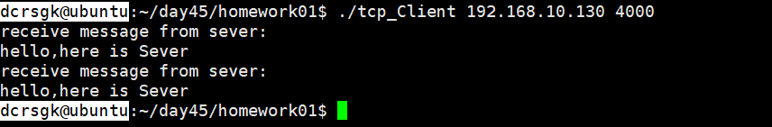

### 1、练习recv，第四个参数MSG_DONTWAIT和MSG_PEEK，感受recv的效果。

- 

### 2、理解epoll的知识，边缘触发和水平触发，epoll和select的区别？

- 水平触发：
  - 关系缓冲区内数据，如果有数据，描述符就是就绪的
  - 有数据就会被触发
- 边缘触发：
  - 有新数据到达才会触发
  - 有新数据到达的是才会清空缓冲区(具体大小和buf有关)
  - 需要配合非阻塞编程使用

- select大妈 每一个女生下楼, select大妈都不知道这个是不是你的女神, 她需要一个一个询问, 并且select大妈能力还有限, 最多一次帮你监视1024个妹子

- epoll大妈不限制盯着女生的数量, 并且也不需要一个一个去问 那么如何做呢? epoll大妈会为每个进宿舍楼的女生脸上贴上一个大字条,上面写上女生自己的名字, 只要女生下楼了, epoll大妈就知道这个是不是你女神了, 然后大妈再通知你. 

### 3、五种IO模型有哪些？理解，同步和异步的概念。

- **阻塞IO**
- 给女神发一条短信, 说我来找你了, 然后就默默的一直等着女神下楼, 这个期间除了等待你不会做其他事情, 属于备胎做法. 
- **非阻塞IO**
- 给女神发短信, 如果不回, 接着再发, 一直发到女神下楼, 这个期间你除了发短信等待不会做其他事情, 属于专一做法. 
- **IO多路复用**

  - 找一个宿管大妈来帮你监视下楼的女生, 这个期间你可以些其他的事情. 例如可以顺便看看其他妹子,玩玩王者荣耀, 上个厕所等等. IO复用又包括 select, poll, epoll 模式. 那么它们的区别是什么?

    1. select大妈 每一个女生下楼, select大妈都不知道这个是不是你的女神, 她需要一个一个询问, 并且select大妈能力还有限, 最多一次帮你监视1024个妹子
  2. poll大妈不限制盯着女生的数量, 只要是经过宿舍楼门口的女生, 都会帮你去问是不是你女神
    3. epoll大妈不限制盯着女生的数量, 并且也不需要一个一个去问 那么如何做呢? epoll大妈会为每个进宿舍楼的女生脸上贴上一个大字条,上面写上女生自己的名字, 只要女生下楼了, epoll大妈就知道这个是不是你女神了, 然后大妈再通知你. 

  - 上面这些IO模型有一个共同点就是, 当女神走出宿舍门口的时候, 你已经站在宿舍门口等着女神的, 此时你属于阻塞状态
- **信号驱动IO**
  - 没听懂 但是应该类似IO多路复用，待验证
- **异步IO**
  - 你告诉女神我来了, 然后你就去王者荣耀了, 一直到女神下楼了, 发现找不见你了, 女神再给你打电话通知你, 说我下楼了, 你在哪呢? 这时候你才来到宿舍门口. 此时属于逆袭做法

- 同步/异步关注的是消息通知的机制

- 阻塞/非阻塞关注的是程序（线程）等待消息通知时的状态。

> 