# Week03 笔记

[TOC]

# day21 笔记

### Ep01写在前面

- 悟已往之不谏，知来者之可追

### linux学习指南

> - 
> - linux环境
>
>   - 历史
>   - 结构
>   - 登陆和其他
> - linux命令
>
>   - shell命令
> - 操作系统
>   - 如何配置用户
>
>     - ubuntu
>   - git
> - 文件系统
>   - 概况
>   - 目录
>   - 文件的增删查改
> - 文件权限
>   - 查找文件：按文件名&&按文件内容
>   - 压缩解压
> - 远程拷贝
>  - vim文本编辑器
>    - 
> - 编译调试工具
>   - GCC：编译工具
>   - GDB：调试工具
>   - 库文件
>   - Makefile：工程项目管理器
> - 系统编程：操作系统
>   - 文件操作：基本的增删查改&&**IO模型之多路复用**
>   - 进程
>   - 线程
>   - 网络编程
>   - 服务器框架
>   - MySQL数据库：底层&&B树
> - 杂七杂八
>   - 性能检测工具
>   - 性能调优：负载均衡
>   - HTTP服务器
>   - 五种IO模型
> - 项目02：百度网盘（1~6个版本）
>   - 难度不同，量力而为
>   - 一二期：团队合作
>   - 三四五六：个人独立完成

### Ep02 虚拟机和Xshell的配置

- 配置网络

  > - 虚拟机的网络设置应为NAT模式
  > - 查看网络信息用`ctrl`+`alt`+`T`  打开终端，ping一个网站（`ctrl`+`c`停止）
  > - 调整成静态方便配置Xshell

- 配置Xshell

  - 安装ssh
  - 配置Xshell
  - 打开之前先ping虚拟机ip，本机为`192.168.10.130
  - 优点：可以在windows下操作，并且可以避免图形化占据资源

### Ep03 Linux历史

- Linux是一个自由开放源码的类UNIX系统。所以我们在说Linux之前，先说说UNIX
  - UNIX的历史：略
  - UNIX的结构：内核，系统调用，应用层
    - 内核：操作硬件和环境
      - 硬件：进程&&内存&&文件
      - 环境：系统调用
    - shell：命令解释器
    - library routines：公共函数库
  - 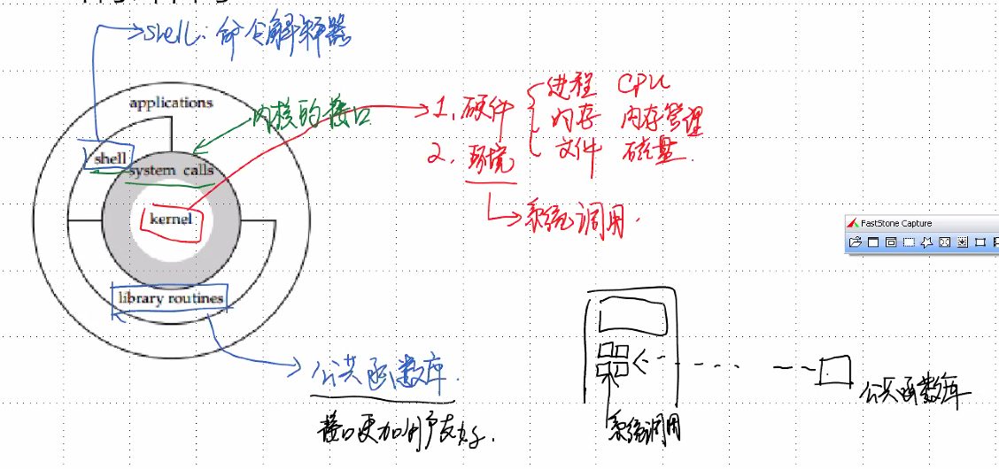
  - POSIX标准：统一系统调用的接口
  - 内核版本`$`
  - 查看用户信息`$cat /etc/passwd`
  - 查看版本信息`$cat /etc/issue`

### Ep04 用户相关命令

- 用户

  > - root用户
  >   - 所有功能
  >   - 命令提示符为`#`
  > - 普通用户
  >   - 部分功能
  >   - 命令提示符为`$`
  > - 切换用户

- `passwd`：password

  > - 给用户配置口令
  > - 修改&&配置用户密码
  > - 需要`sudo`提高权限
  > - `cat /etc/passwd`
  > - 

- `su`：switch user

  > - 切换用户，如果无参数则切换到根用户
  > - `su [其他用户名]`
  > - 从根用户切换到其他用户不需要密码

- 用户和组

  > - 组：用户的集合，方便共享组内资源

- 退出用户

  > -  栈结构储存 先su的后最后退出
  > -  `exit`

- 注意：对于Linux，没有消息就是最好的消息

- 添加用户

  > - `useradd -m 用户名`
  > - 对于`useradd+用户名`而言，会创建一个bin/bash文件
  > - bin/sh鶸于bin/bash
  > - useradd -m 用户名 -s bin/bash

- 删除命令

  > - `userdel+用户名`       不会删除家目录。
  > - `userdel -r 用户名` 同时删除家目录
  > - 需要彻底退出账号（栈储存）
  > - 即待删除的账号不能在用户登陆栈中

### Ep05 Ubuntu 的安全设计

- ssh登陆的时候只能通过普通用户登陆
- ssh协议：secure shell 加密传输


### Ep06 git使用

- 使用之前需要添加`user.name`&&`user.email`

  - ```nginx
    git config user.name  	//查看user.name
    git config user.email 	//查看user.email
    
    git config --global user.name "用户名"
    //双引号可加可不加，但是空格一定要加
    git config --global user.email "用户邮箱"
    ```

- `clone`命令

  - 克隆远程的仓库到本地  一般接地址也可以接命名文件夹

  - ```nginx
    git clone +仓库地址.git 
    git clone +仓库地址.git ~/.文件夹名
    //克隆地址是 仓库地址 的仓库到本地的 文件夹名 文件夹
    ```

- `git pull origin master`

- 相当于pull，先pull再push

- `git add +文件名`

  - 添加文件进提交请求

- `git commit -m “提交信息”`

  - 相当于提交信息

- `git push origin master`

  - push
  - 

- 此处如果要推送到别的分支 修改分支名

- linux文件系统：文件树 

  > - 根目录
  >   - 整个Linux系统只有一个根目录所有的目录文件都是根目录的子孙
  > - 家目录
  >   - 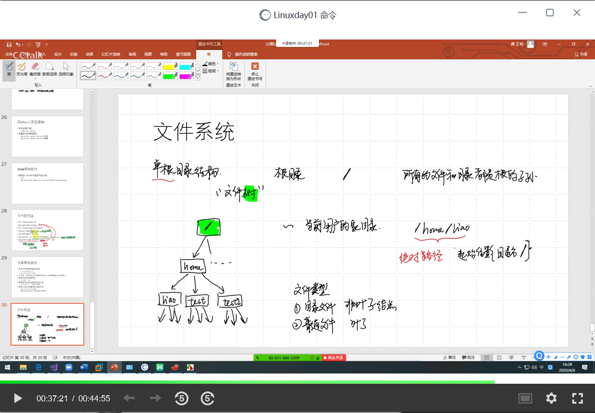
  > - 绝对路径
  > - 相对路径

# day22

### Ep01 写在前面

- ##### 网络配置

  > - NAT模式
  >   - 切换自动
  >   - ping任意一个网站
  >   - 根据自动的IP网关和DNS配置静态IP
  > - 桥接模式
  >   - 同上

- ##### 用户命令

  > - 添加用户：`useradd -m 用户名 -s /bin/bash`
  > - 配置密码：`passwd`
  > - 切换用户：`su`
  > - 删除用户：`userdel -r`
  > - 退出当前用户：`exit`

### Ep02 Linux文件

- ##### 文件系统（虚拟文件系统 VFS）

  > - 根节点
  >
  > - Linux目录的含义
  >
  >   | 目录名 |                             含义                             |
  >   | :----: | :----------------------------------------------------------: |
  >   |  /bin  |              存放二进制文件，通常是一可执行程序              |
  >   |  /sys  |                           系统文件                           |
  >   |  /dev  |                           设备文件                           |
  >   |  /etc  |                      配置文件和启动脚本                      |
  >   | /home  |                    普通用户家目录的父目录                    |
  >   |  /lib  |                          系统库文件                          |
  >   | /proc  |        特殊的目录，面的内容是进程内容对文件系统的映射        |
  >   | /user  | 普通用户可以访问的文件，包括库文件、二 进制文件和代码文件等等 |
  >   |  /var  |                 存储变化很快的文件,比如日志                  |
  >
  > - 绝对路径：根目录👉目录1👉目录2👉文件
  >
  > - 相对路径：相对于当前目录的位置
  >
  > - 当前目录👉目录1👉目录2👉文件
  >
  > - pwd：
  >
  > - ~的含义：当前用户的家目录
  >
  > - cd：改变目录(change da)
  >
  >   - `cd -` （返回上一级）
  >   - `cd &cd~`（回到家目录）
  >   - `cd .`  (保持位置不变)
  >   - `cd .. `(回到父目录)
  >
  > - mkdir：创建目录
  >
  > - rmdir：删除目录
  >
  > - ls：显示目录下文件

- ##### 文件的详细信息             //补笔记

  > - 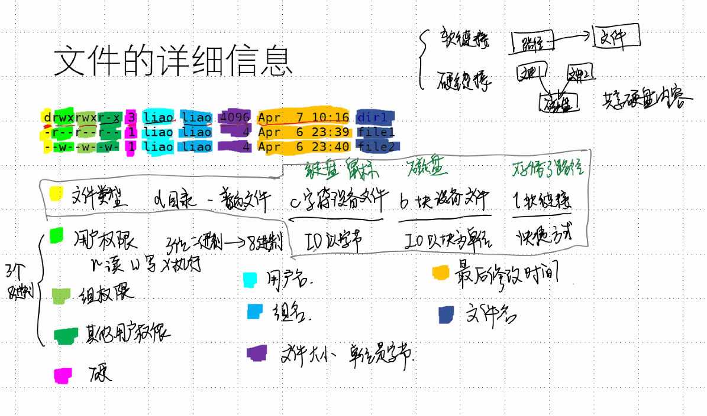
  > - 硬链接：文件1和文件2共享磁盘的内容

- ##### **目录里面到底存了什么？**

  > - 
  > - ls -lh     (h==human readable)

### Ep03文件操作

- ##### 拷贝文件或者目录

  > - `cp 源文件 目标路径`：拷贝一份源文件到目标路径（覆盖同名文件
  > - `cp 源文件 目标文件 `：拷贝一份源文件取到目标文件，若目标文件不存在则直接创建（覆盖原文件）
  > - ubuntu不会提示覆盖行为
  > - 后缀
  >   - -f：强制拷贝（强制命令）
  >   - -i：弹出（Y/N）Y则拷贝（确认命令）
  >   - -r：拷贝目录和所有子文件（递归命令）

- ##### 剪切文件或者目录

  > - 使用方法和cp相同
  > - 将cp换成mu即可
  > - 重命名：mu 源文件 目标文件
  >   - 将源文件的名字修改成目标文件的名字
  > - 后缀
  >   - -f：强制剪切（强制命令）
  >   - -i：弹出（Y/N）Y则剪切（确认命令）
  >   - -r：剪切目录和所有子文件（递归命令）

- ##### 删除

  > - rm 文件名 文件路径 
  > - 不要再root用户下使用rm -r

- ##### tree：需要加载tree工具：`sudo apt install tree`

  > - tree (显示当前)
  >   - 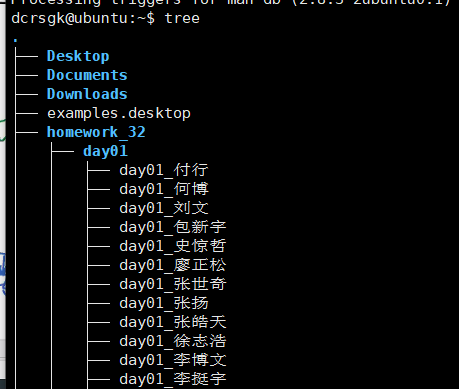
  > - tree 路径
  >   - 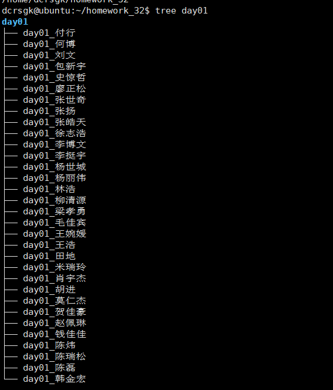
  > - tree -h 显示大小
  >   - 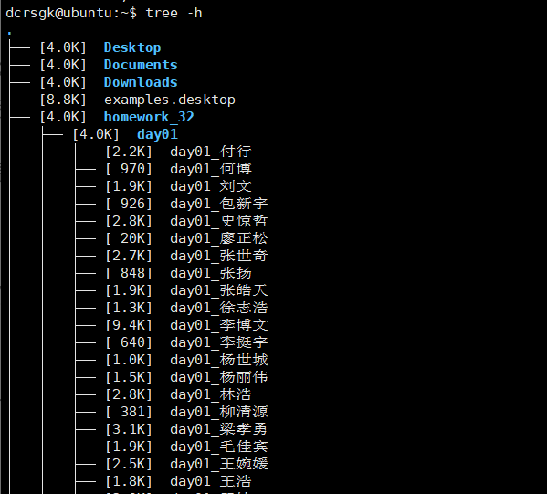
  >   - 

### Ep04 文件权限

- ##### 权限

  > - 三种权限
  >   - 读&&写&&执行（r w x）
  > - 用户分类
  >   - 用户
  >   - 组
  >   - 其他用户

- ##### chmod：修改权限的文字设定法

  > - `chmod [who][+1-1=] [mode]`
  >   - who :用户身份
  >     - u ：用户
  >     - g ：组
  >     - o ：其他
  >     - a：所有（不写＝所有）
  >   - [+-=]
  >     - +：增加
  >     - -：去除
  >     - =：指定
  >   - mode：权限（r：可读，w：可写，x：可执行）
  > - 语句可以多次执行，用逗号分隔。
  > - 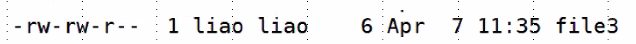
  > - 删除r权限
  >   - chmod -r
  >   - chmod a -r
  >   - chmod ugo -r

- ##### 数字设定法：8进制

  > - 掩码：如果二进制位为1则无效
  > - 读 写 执行 ：可以用一个三位二进制表示，并且一个三位二进制位一个8进制
  > - -rw -rw -r：6 6 4

### Ep05 文件的查找 Ⅰ

- ##### find：初探find

  > - `find 起始目录 查找条件 操作`
  > - 查找所有以起始目录为祖先的目录文件
  > - 按名字精确查找： find .name [文件名]
  > - 按名字模糊查找：
  >   - 通配符：
  >   - *匹配：0~多个任意字符
  >   - ？匹配：仅能匹配一个字符
  >   - [  ]范围匹配：需要按照ASCⅡ码的范围写
  > - finf . -gid    按组查找
  > - find . -uid  按用户查找
  > - find . -empty 查找空文件
  > - find . -prem xxx :按权限查找
  > - find . -size n[bckw] （n后面的[ ]表示单位）默认单位为block
  > - find . -type :按类型查找 d:目录 f:普通文件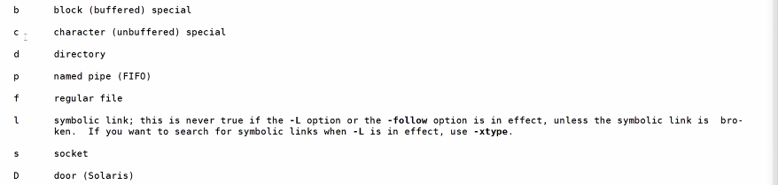
  > - find . [acm]+min/time （+/-）  (min 分钟，time 天)
  >   - a：访问
  >   - c：状态
  >   - m：内容
  >   - min后无符号，表示某时刻
  >   - min-  从现在到min分钟之内
  >   - min+ min分钟之前a

# day23

### Ep01 文件的查找 Ⅱ

- find Ⅱ ：find的组合操作

  > - find . -name "dir*" -exec 命令\;
  >   - 将find命令的结果作为参数传进exec的命令中
  >   - 其中的{}表示find的每一行
  >   - 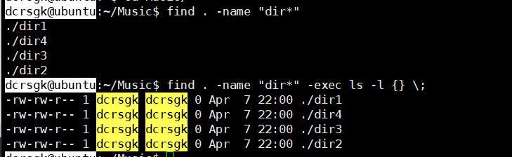

- 管道

  > - 将前一个命令的输出作为后面的输入，一次接受一个单词
  > - 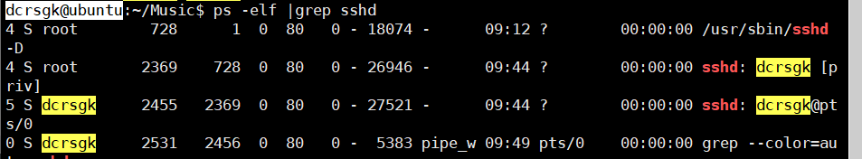
  > - ps -elf |grep sshdL:简单的管道的例子
  > - `-xargs` 多行命令拆成一个单词
  > - 统计当前有多少文件：ls|wc -l
  > - 
  > - 

- df命令

  > - df：repo reprot file system disk space usage
  > - 显示磁盘空间：注意Mounted on 为挂载
  > - 在Linux中，外部储存会直接导入根目录？
  > - 当在 Linux 系统中使用外部储存时，
  > - 只有将Linux本身的文件目录与硬件设备的文件目录合二为一。硬件设备才能为我们所用。合二为一的过程称为“挂载”
  >   - 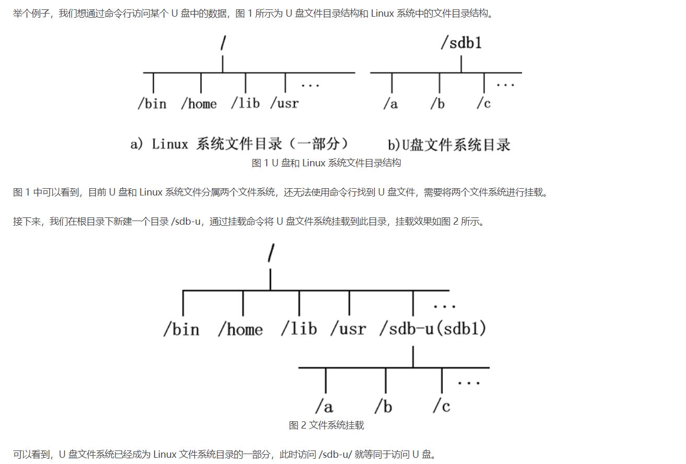

- du命令：深度查找

  > - du：estimate file space usage
  > - 显示当前目录占多少空间
  > - 可以通过加参数 --max-depth=1  调整参数，显示当前层的大小

- cat

  > - cat：Concatenate files and print on the standard output
  > - 打印
  > - `cat -b` ：标记所有非空行
  > - `cat -n`：标记所有行
  > - cat -s：将连续空行合并显示
  > - `cat -E`：对每一行的结束显示$符

### Ep02 标准输入和输出

- 重定向 > <

  > - `>`重定向：重定向标准输出
  >   - 即输出到文件中
  >   - 
  > - `>>`  ：将结果最追加尾部
  >   - 
  > - `<`  重定向：重定向标准输入
  >   - 
  > - `<< `：cat 以什么结束
  > - `2<`：重定向标准错误输出
  > - `&>`：将标准输出和错误同时输出
  > - 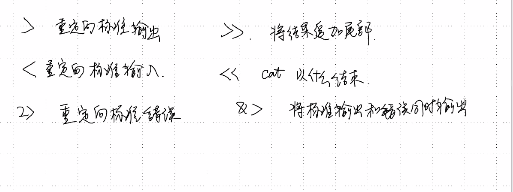
  > - 
  > - 重定向标准输出
  >   - 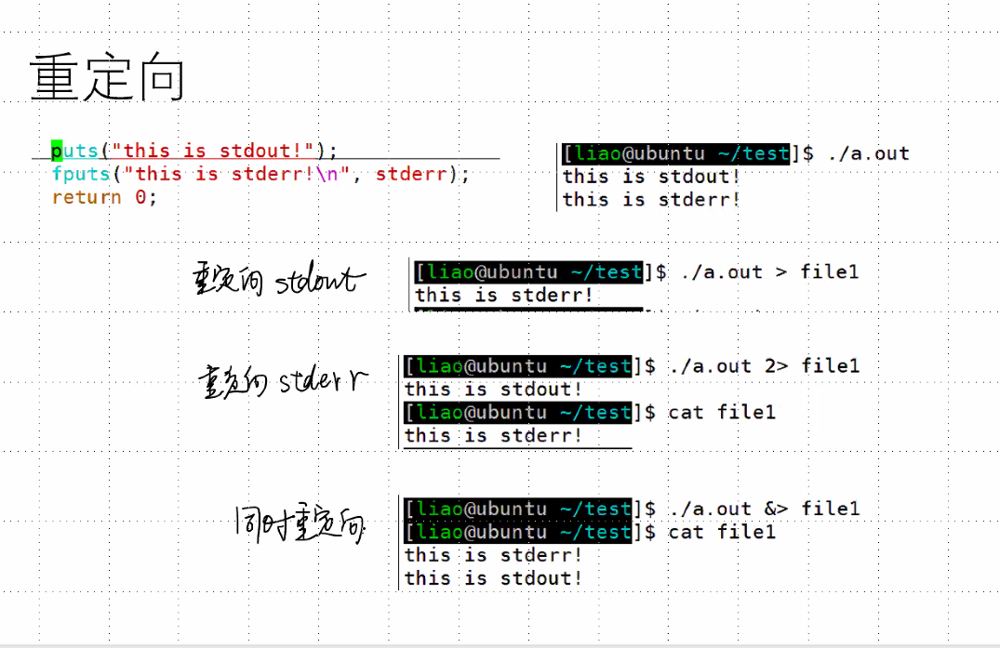
  >
  > - 重定向标准输入

- cat命令

  > - cat不加参数时等价于
  >
  >   - ```c++
  >     while(fgets()!=NULL)
  >     {
  >         puts(str);
  >     }
  >     //输入ctr+d结束
  >     ```

- 创建空文件

  > - 重定向：echo -n > 文件名
  > - `touch` 改变修改时间&&如果文件不存在则创建新文件
  > - vim：vim 文件名

- 部分显示

  > - 显示部分10行（从头开始）：head
  > - 显示部分10行（从尾开始）：tail
  > - eg
  >   - 将操作后两百行放入file777中
  >   - `history |tail -n 200 > file777`
  >   - 

- more：按页打印 此时这里空格也是翻页

  > - b：上一页
  > - f：下一页
  > - q：退出
  > - h：帮助

- sort ：排序

  > - 排序文件内容

- uniq：删除连续重复信息

  > - 删除重复行

  - 结合sort &&uniq可以连续去重

    > - eg：将一个文件的内容去重并保存到新文件
    > - 

- 文件字数统计：wc

  > - wc 无参数时显示所有
  > - wc -l ：统计行数
  > - wc -w：统计单词
  > - wc -c：统计字节

- 编码：

  > - 由于Linux下用的UTF-8标准（3字节），会出现windows（2字节）和LInux编码不同的情况
  > - 用iconv转换
  > - iconv -f gb2321 -t utf-8 文件名 > 新文件名
  > - 需要重定向得到转换之后的结果

# day24 笔记


### Ep01 写在前面： Linux命令总结

- 用户

  > - 配置密码：`passwd`
  > - 切换用户：`su`   `exit`
  >   - 无参数则直接进入root用户
  >   - 退出则直接用`exit`
  > - 添加用户：`useradd`
  >   - `-m`：配置家目录
  >   - `-s`：配置命令解释器
  > - 删除用户：`userdel`
  >   - `-r`：删除目录

- 文件

  > - 目录操作
  >   - 查看当前工作目录：`pwd`
  >   - 改变当前工作目录：`cd+目录名`
  >   - 查看目录连接的文件：`ls`
  >     - `-a`：显示所有信息
  >     - `-l`：查看目录所有可见文件的属性
  >     - `-h`：human readable
  >   - 创建目录：`mkdir`
  >   - 删除空目录：`rmdir`
  >     - 只能删除空目录
  >   - 树状目录显示：`tree`
  >     - 
  > - 
  > - 文件
  >   - 删除：`rm`
  >     - `-r`：删除文件夹以名字下所有子目录（递归删除）
  >     - `-f`：强制删除
  >   - 拷贝：`cp`
  >   - 移动：`mv [文件名] /[]
  > - 权限相关：-r/-w/-x（读写修改）
  >   - 改变权限：`chmod`
  >   - 权限的影响
  >     - 增删一个文件：和目录的读写权限修改有关
  >     - 查找一个文件：目录的读权限和执行
  >     - 拷贝一个文件：目录的读权限和执行

- 查找

  > - `find`：find
  >   - 起始目录
  >     - 
  >   - 查找条件
  >     - `-name`
  >     - `-gid/-uid/（-user/-group）`：按用户/组查找
  >     - `-empty`：查找空文件
  >     - `-perm`：按权限查找
  >     - `-size`：按大小查找（默认单位为block）
  >     - `-type`：按类型查找（普通文件为f）
  >     - `-amin/-cmin/-mmin`（`-atime/-ctime/-mtime`：）
  >       - 按访问时间
  >       - 按文件内容创建时间
  >       - 按文件更改时间来查找文件
  >       - n：距离现在恰好n时刻
  >       - -n：距离现在小于n
  >       - +n：距离现在大于n
  >   - `*`/`？`/`[ ]`
  >     - `*`：任意字符
  >     - `？`：单个字符
  >     - `[ ]`:字符范围
  >   - 与或非运算
  >     - `-a`：与
  >     - `-o`：或
  >     - `！`：非
  >   - `-exec`：对查找的结果进行后续处理
  >     - `\;`：命令i金额为
  >     - `{}`：变量，存放查找结果

- 磁盘空间查询

  > - `du`：文件&目录
  >   - --max-depth=1

- 文件读写

  > - `cat`：
  >   - 没有参数：按行输入内容，按行输出结果（复读机），`Ctrl+d`结束。
  >   - `cat<<xxx`
  >     - e.g.：`cat<<1`：此时这个1相当于`Ctrl+d`
  >       - 
  >   - `cat+文件名`：打印文件内容
  > - `file`：查看文件类型
  > - 部分显示
  >   - `tail`：从尾显示
  >   - `hear`：从头显示
  >   - `more/less`：
  >     - f：下一页
  >     - b：前一页
  >     - q：退出
  >     - h：帮助
  > - `sort`：排序文件内容
  > - `uniq`：删除连续重复行
  > - `wc`：字数统计
  >   - -c：字符数
  >   - -l：行数
  >   - -w：单词数
  > - `iconv`：编码方式转换
  >   - -f：来源
  >   - -t：输出

- 重定向

  > - `man sh`：查看相关帮助
  > - 重定向符号：箭头的指向就说数据的流向
  >   - `<`：输出重定向（把前面输出的东西输入到后边的文件中，会清除文件原有的内容）
  >   - `>`：输入重定向（输入重定向用于改变命令的输入，后面指定输入内容，后面跟文件名）
  >   - `>>`：追加输出重定向（把前面输出的东西追加到后边的文件尾部，不会清除文件原有的内容）》
  > - 文件描述符
  >   - 0：stdin（标准输入）：使用<或<<。数据流从右向左
  >   - 1：stdout（标准正常输出）：使用>或>>。数据流从左向右
  >   - 2：stderr（标准错误输出）：吗使用2>或2>>。数据流从左向右


### Ep02

- grep：指定格式打印，将文件中符合格式的打印出来

  > - 选项
  >
  >   - -F：每个模式作为固定的字符串对待
  >   - -c：只显示匹配行的数量。（只显示总数）
  >   - -i：比较式不区分大小写。
  >   - -n：在输出前加上匹配串所在的行号。（显示符号）
  >
  > - **格式：grep的文本格式（正则表达式）**
  >
  >   - 正则表达式：字符串的生成规则
  >
  >     - e.g.
  >
  > - 基本单位
  >
  >   - `.`&&`[ ]`：
  >   - `.`匹配任意单个字符，但不匹配换行符
  >     - `[]` 用来指定一个字符集。 使用连字符来指定字符集的范围。
  >   - a~z~0~1~A~Z：匹配字符
  >
  > - 前缀&&后缀（补充在基本单位的前面||后面）
  >
  >   - \*：基础单位*（基本单位出现0次或一次）
  >     - ? ：基础单位？（基本单位出现0次或一次）
  >     - ^：基本单位^（基本单位出现在行首）
  >     - $：基本单位$（基本单位出现在行尾）
  >     - 需要匹配任意字符：`.*`
  >
  > - grep和find的联合使用
  >
  >   - 先用find找文件，在用grep找内容
  >
  >   - eg：
  >
  >   - ```0.0
  >     $ find . -name "*.[ch]" |xargs grep -nE "main"
  >     ```

- alias：别名

  > - b

- hisroty：历史命令记录

  > - 可加more翻页

- man：帮助

  > - 需要添加具体帮助选项

- 如何一次输入使用多个命令：使用`;`

  > - `cmd1;cmd2`先执行cmd1，在执行cmd2

### Ep03 管道：pipe line

- 原理

  > - 多个控制命令通过|链接、
  > - 将上一个命令的标准输出作为下一个命令的标准输入

- **xargs**

  > - 作用：
  >   - 将管道内的文件分成单行的输出
  >   - 将每一行的结果作为cmd2的最后一个参数
  > - 

### Ep04 命令

- 命令替换

  > - 先运行cmd2，再将结果作为cmd1的参数
  >
  >   ```
  >   $ cmd1 `cmd2`
  >   $ cmd1 $(cmd2)
  >   ```

- 打包和压缩        //摸鱼 重听

  > - `tar [主选项+辅助选项] 目标文档 源文件/目录`
  >   - 主选项
  >     - c：创建
  >     - r：追加
  >   - 辅助选项
  >     - f：使用包文件
  >     - v：显示文件
  >     - z：用gzip算法压缩
  >     - -d：解压
  >     - -v：显示文件

- scp命令  //摸鱼 重听

  > - 使用之前须判断自己id是否可用
  > - //摸鱼 重听

- 密钥管理

  > - 

### Ep05 vim[^1]

- 完全脱离鼠标

- 大多数使用vim

- 普通模式

  > - 转换编辑模式，a/A/i/I
  >
  > -  hjkl 对应上下左右
  >
  > - 删除
  >
  >   - 删除等价于剪切
  >
  >   ```php
  >   d$/^
  >   删除头部 删除尾部
  >   ```
  >
  > - `p`：粘贴
  >
  > - `yy`：复制一行（用p粘贴）
  >
  >   - nyy：复制n行
  >
  > - `u`：撤销
  >
  > - w：往后移动一个光标
  >
  >   - ctrl+r 撤销撤销
  >   - ctrl+d：向下
  >   - ctrl+u：向上
  >   - ctrl+f：向前翻页
  >   - ctrl+b：向后翻页
  >   - gg：回到文件头部
  >
  > - 查找和替换
  >
  >   - `/[寻找目标]`寻找某个词（）
  >   - `:s/[修改目标]/[修改内容]`：只对单文件生效
  >     - `:s/[修改目标]/[修改内容]/ig`：当行全部替换
  >     - `:s/[修改目标]/[修改内容]/i`：忽略大小写
  >     - `:x,y s/[修改目标]/[修改内容]/ig`：修改x~y行的数据
  >     - `:%s/[修改目标]/[修改内容]/ig`：全文件全部修改
  >     - 这里的修改目标和修改内容均支持正则表达式
  >
  > -  按V为可视化模式，按ctrl+v可以使用数选模式
  >
  >    - 数选模式之后，按i+//+esc
  >
  > - `%!xxd`：将文件转换成二进制
  >
  > - `w`：保存

- 输入(编辑)模式

  > - 转换到命令模式：esc
  > - 剩余的没差

- 切换ctrl+w+w

- 多窗口：

[^1]: 
[^1]:


# day25 笔记

### Ep01 写在前面 记得去重听压缩和scp

- pid


### Ep02 批量替换文件

- shell上批量替换

  > - `sed "s/[修改目标]/[修改内容]/g"+文件名 `
  >   - 只显示修改结果，不修改实际内容
  > - 批量替换：
  >   - `sed "s/[修改目标]/[修改内容]/g " *.c`
  >   - `find . -name "*.c" |xargs sed "s/[修改目标]/[修改内容]/g "`利用fing命令和管道
  > - 保存修改：`sed "s/[修改目标]/[修改内容]/g"+文件名 -i `

- 文件的对比

  > - `vimdiff [文件名1] [文件名2]`
  > - 尽可能的多匹配公共部分

- vim配置文件

  > - vimrc

### Ep03：编译工具：gcc工具链（SDK）

- 编译工具：gcc工具链（SDK）

  > - 程序的编译过程
  >
  >   - 预处理：将所有的#include头文件以及宏定义替换成其真正的内容
  >     - 处理之后仍是代码文件，后缀为.i
  >   - 编译：将经过预处理之后的程序转换成特定汇编代码的过程
  >     - 处理后为汇编代码，后缀为.s文件
  >   - 汇编：汇编过程将上一步的汇编代码转换成机器码
  >     - 处理之后为二进制文件，后缀为.o
  >   - 链接：链接过程将多个目标文以及所需的库文件(.so等)链接成最终的可执行文件。
  >     - 确定 .o文件的地址
  >
  > - 函数首先分配栈帧
  >
  > - 变量都转换成地址
  >
  > - 函数调用是使用其他函数的代码
  >
  > - 循环是用跳转实现的
  >
  > - 看汇编需要注意：
  >
  >   - 找自己看得懂的查
  >   - 分块看 找变量的地址
  >
  > - gcc参数
  >
  >   - |  参数   |                 含义                 |
  >     | :-----: | :----------------------------------: |
  >     |   -E    |     预处理（生成后缀为.i的文件）     |
  >     |   -S    | 编译成汇编文件（生成后缀为.s的文件） |
  >     | -o 目标 |           生成文件到目标内           |
  >     |   $as   | 汇编文件转换成二进制的目标文件（.o） |
  >     |   $nm   |          查看二进制的符号表          |
  >     |    %    |                 链接                 |
  >     | gcc -c  |            快速生成.o文件            |
  >
  > - 其他编译选项
  >
  >   - |  编译选项   |                  功能                  |
  >     | :---------: | :------------------------------------: |
  >     | -I [目录名] | 指定头文件的目录（编译时）方便调整文件 |
  >     |   -D 宏名   |    相当于再代码头部添加一个#define     |
  >     |    -Wall    |            **打开编译警告**            |
  >     |   -O[123]   |              控制优化级别              |

### Ep04 库

- 静态库

  > - 链接的时候将库文件打包到程序里面
  > - 优点
  >   - 容易部署
  > - 劣势
  >   - 难以升级
  >   - 体积大
  > - 生成静待库
  >   - `gcc -c [文件名]` →此时生成一个[文件名].0的文件
  >   - `ar crsv lib[文件名].a [文件名].0`：打包，文件名为库的名字。生成一个.a文件
  >   - 将静态库复制到库路径中：`cp lib[文件名].a /usr/lib`
  >   - `gcc -o mian mian.c -l[库名称] `：链接，在编译的时候加上名称

- 动态库

  > - 链接的时候将得到库文件的位置，在运行的时候再加载到程序里面
  >
  > - 优点
  >   - 易升级
  >   - 体积小
  > - 劣势
  >   - 不容易部署
  >   - 体积大
  > - 定义并链接动态库
  >   -   `gcc -c [库名].c -fpic`
  >   -   ``gcc -shared -o lib[库名].so add.o`
  > - 查看依赖的动态库：`ldd`
  > - //动态库版本更新：重听

### Ep05 GDB调试器

- 使用要求

  > - 程序编译时需要加上-g操作 
  >
  > - 调试快捷键：
  >
  >   - | 操作          | 功能                                |
  >     | ------------- | :---------------------------------- |
  >     | **l/list**    | **显示代码**                        |
  >     | **r/run**     | **运行**                            |
  >     | **b/break**   | **打断点（加数字显示在x行打断点）** |
  >     | **info b**    | **显示所有断点**                    |
  >     | s/step        | 单步调试并且进入函数                |
  >     | finish        | 退出当前函数                        |
  >     | n/next        | 单步调试                            |
  >     | c/continue    | 运行到下一个断点                    |
  >     | delete        | 删除所有断点                        |
  >     | bt/backtrance | 调用堆栈                            |
  >     | p             | 监视：                              |
  >
  >   - set args ：设置命令行参数
  >
  >   - show args ：查看命令行参数
  >
  >   - bt查看堆栈
  >
  > - 段错误和core文件
  >
  > - 段错误：编译没问题但是在执行的过程中会出现比如访问越界，
  >
  >   - 
  >
  >   

# day26 笔记


### Ep01 写在前面 记得去重听静态库

- 文件内容查找

  > - `grep`
  >   - 参数
  >     - `n`：行号
  >     - `E`：拓展规则
  >     - `F`：字面值匹配
  >     - `c`：显示匹配总数
  >     - `-i`：不区分大小写
  >   - 正则表达式
  >     - 匹配的基本单位：
  >       - 单个字符
  >       - 括号内部的内容
  >         - `|`：或
  >       - `\`控制字符
  >         - 转义字符
  >       - `.`：任意字符
  >       - `[ ]`：范围内字符
  >       - `{}`：字符长度
  >     - 基本单位的附加情况
  >       - `^`：出现在行首
  >       - `$`：出现在行尾
  >       - `i`：重复0~多次
  >       - `？`：重复0或1次
  >       - `+（x，y）`：x~y次

- SCP命令

  > - 上传：``scp 本地文件名 用户名@ip:路径``
  > - 下载：``scp 用户名@ip 本地路径``

- 查看帮助

  > - man命令名
  >   - -k：提示
  >   - -f：显示手册编号
  >   - man man：帮助的帮助

### Ep02 makefile

- 执行模式 m'n

  > - 编译的概念
  >   - 广义：指代预处理+编译+汇编
  >   - 狭义：指代预处理之后的编译
  > - xxx.makefile：建立目标的联系
  >   - 根据修改时间判断是否执行
  > - 增量编译
  > - make：编译程序
  >   - main is up to date：
  > - 执行和修改时间有关

- 规则：

  > - 目标文件： 可以是 Object File, 也可以是可执行文件
  > - 依赖文件：生成目标文件所需要的文件或者目标
  > - 命令：- make需要执行的命令 (任意的shell命令), Makefile中的命令必须以 [tab] 开头
  > - 目标：依赖文件+[tab]+命令
  >   - 命令是否执行取决于目标与依赖文件的时间关系
  >   - 命令可以写多个
  > - 

- 伪目标

  > -  rebuild：不像真正的目标那样会生成一个目标文件.
  >
  > - ```makefile
  >   .PHONY: clean   <-- 这句没有也行, 但是最好加上
  >   clean:
  >       -rm -f *.o
  >   ```
  >
  >   

- 变量

  > - A=b和A:=b的区别
  >
  >   - A=b：运行时替换
  >   - A:=b：定义时替换
  >
  > - `$(A)`自定义变量
  >
  > - 变量的作用：进行字符串的替换
  >
  > - 预定义变量：可能会随着设备的变化而发生改变
  >
  >   - 写法和普通变量相同
  >
  >     | 变量名   | 功能           | 默认含义  |
  >     | -------- | -------------- | --------- |
  >     | **AR**   | **打包库文件** | **ar**    |
  >     | AS       | 汇编程序       | as        |
  >     | **CC**   | **C编译器**    | **cc**    |
  >     | CPP      | C++预编译器    | $(CC) -E  |
  >     | CXX      | C++编译器      | g++       |
  >     | **RM**   | **删除**       | **rm -f** |
  >     | ARFLAGS  | 库选项         | 无        |
  >     | ASFLAGS  | 汇编选项       | 无        |
  >     | CFLAGS   | C编译器选项    | 无        |
  >     | CPPFLAGS | C预编译器选项  | 无        |
  >     | CXXFLAGS | C++编译器选项  | 无        |
  >
  > - 自动变量（某单独规则内，不会随着设备的变化而发生改变）
  >
  >   - **$@：目标文件**
  >   - **$<：第一个依赖文件**
  >   - **$^：所有依赖文件**
  >   - $?：新文件（修改时间）
  >   - $(@D)：目标文件的目录部分F
  >   - $(@F)：目标文件的文件部分

- 通配符：模式匹配

  > - 匹配字符：%
  >   - 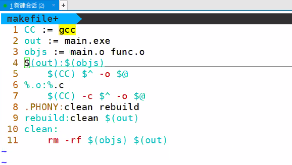
  >   - 
  > - \*：表示任意一个或多个字符
  > - ?  ：表示任意一个字符
  > - [...]：ex. [abcd] 表示a,b,c,d中任意一个字符, \[^abcd]表示除a,b,c,d以外的字符, [0-9]表示 0~9中任意一个数字
  > - ~ ：表示用户的home目录

- 内置函数：方便获取用户名

  > - `$(函数名 参数1，参数2)`
  >
  > - wildcard：对文件系统使用通配符
  >
  >   - ```makefile
  >     $(wilecard *.c) 
  >     #匹配所有.c文件
  >     ```
  >
  > - subst：替换函数，将from的替换到to，来源为text
  >
  >   - ```makefile
  >     $(subst from,to,text)
  >     
  >     ```
  >
  > - patswbst
  >
  >   - ```
  >     $(parsubst %.c ,%.o,text)
  >     ```
  >
  >   - 

- 循环结构

  > - ```makefile
  >   LIST = one two three
  >   all:
  >   	@for i in $(LIST); do echo $$i; done
  >   ```
  >
  > - 使用@避免打印代码

- 实例：

  > - 
  >
  > - 一个目录下有三个.c文件，每个文件对应
  >
  >   ```makefile
  >   CC = gcc
  >   srcs = $(wildcard *.c)
  >   #1.c 2.c 3.c 
  >   targets = $(patsubst %c,%,$(srcs))
  >   #1 2 3
  >   all:$(targets)
  >   	@for i in $(targets); do $(CC) -o $$i $$i.c; done
  >   .PHONY: clean
  >   rebuild:clean all
  >   clean:
  >   	-rm -f *.o
  >   ```
  >
  > - 

```makefile
CC :=gcc
out := main.exe
srcs := $()
```

