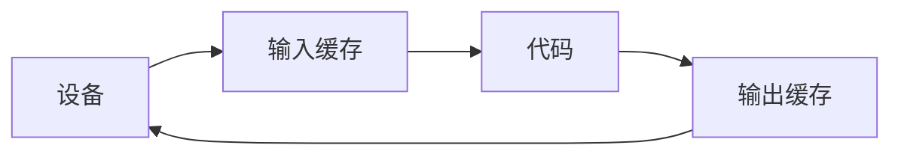

## 基础作业

#### 1先放入标准输入缓冲区的内容是先被读取还是后被读取？

- 先放入的先读取 直到缓冲区溢出或者没有数据为止

#### 2 scanf的%d和%c对于标准输入缓冲区当中的空白有什么区别？

- %c会读取缓冲区内所有的字符数据数据包括：空白字符 && 换行符 。
- %d读入可选有符号\\无符号的十进制整数。不会读入空白字符。

#### 3 scanf函数的返回值是什么类型？它的具体含义是什么？

- 返回值为int类型，表示成功读入的数据项数。如果出错则会返回EOF。

#### 4 putchar和getchar等价于什么形式的scanf和printf？

- putchar：相当于只输出一个字符的printf。

  > 如printf("%c",'A') 相当于 putchar('A')

- getchar：相当于只读入一个字符的scanf，但是在连续读入的时候会读取缓冲区里的空白字符和换行符。

#### 5 如何使用关系表达式判断某一个年是不是闰年？（不能使用括号表达式）

- year%4 == 0 && year %100 != 0 || year % 400 ==0

#### 6 整数左移一位相当于做了什么运算？右移一位呢？（注意区分正负、奇偶）

- 对于左移而言：相当于进行了乘以2的运算

- 对于右移而言：正数补0，负数补1。相当于正数做了除二的运算，负数做了减一再除2的运算。

#### 7 无符号整型和有符号数的右移有区别吗？ //看完再议

- 对于有符号整数而言（有符号整数有整数之分）

  - 高位补0，低位丢弃

  - 正数：除二
  - 负数：减一之后再除二

- 无符号右移时，高位补最高有效位的值，低位丢弃。