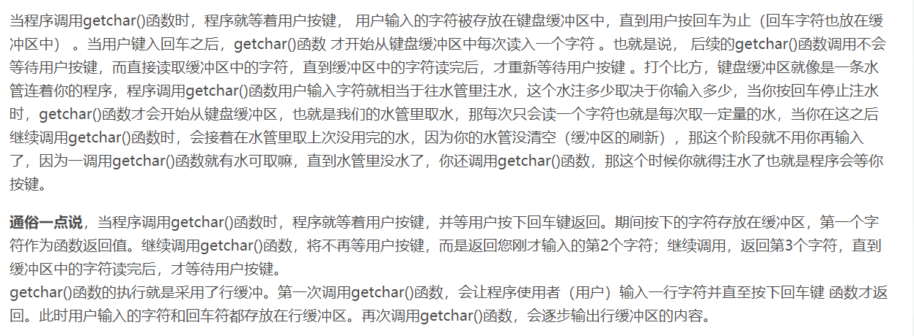

# day 03

### Ep01

- ##### 缓冲区

  - 标准输入缓冲区 stdin 使用行缓冲的方式存储输入。
    - 用户的输入数据首先被暂存在临时缓冲区中，当用户键入回车键或临时缓冲区满后，stdin 才进行 I/O 操作，将数据由临时缓冲区拷贝至 stdin 中。C语言提供的输入输出函数如 scanf 、getchar 等则从上述缓冲区 stdin 中读取数据输入。

  - scanf 和 getchar 等函数会在 stdin 中读取数据，若上述缓冲区中已存在数据，则直接读取其中的数据，若上述缓冲区为空，则上述函数会挂起，等待数据缓冲的完成( 用户输入回车键或数据缓冲区满后， stdin 会进行数据缓冲，之后上述函数才能继续执行)。 
  - 用户一次输入的数据可能会超过 scanf 、getchar 等函数调用所需要的数据，那么所需数据被读取后，剩余的数据仍会存放在缓冲区中，之后的函数调用会直接读取 stdin 中已有的数据。只有当缓冲区为空后，scanf 等函数才会等待用户输入(实际应该是等待 stdin 的缓冲）。

- ##### 循环读取

  > - 在用%c读取时不会遗漏任何字符，包括\n

- ##### 在多类型混合输入时 scanf

  > - 通过scanf的返回值来判断匹配成功与否
  > - double需要用lf读取
  > - 在字符之前需要加空格

- ##### getchar（）~~getling()~~      快速读取一个字符 [^1]

  > - gerchar()读取
  > - putchar()

- ##### 将整数按照字符输出（较重要）

  > - 通过scanf读取 转换成字符串
  >
  > -  通过取余 得到位数
  >
  > - ```c++
  >   #include<iostream>
  >   int main(){
  >       int i,remainder;
  >       scanf_s("%d",&i);
  >       while(i){//不断取余 得到各个位数
  >          remainder = i%10;//用数字加上48用%c输出字符值
  >          printf("%c",remainder+48);
  >          i = i / 10
  >       }
  >       return 0;
  >   }
  >   ```
  >
  > - 不用第三个变量转换a和b的值
  >
  >   ```c++
  >   a = 10,b = 5;
  >   a = a + b; //a = (a + b) = 15
  >   b = a - b; //b = (a + b) - b =>a = 10 
  >   a = a - b; //a = (a + b) - a = 5
  >   ```
  >
  >   - ~~醒醒  溢出了~~
  >
  > - 比较分数的大小（数学问题）
  >
  >   > - e.g. 12/85  30/107 比较大小
  >   > - 12 * 107 - 85 * 30 <0 所以12/85 小于 30/107 

- ##### 关系运算符

  > - 关系运算符的优先级低于算术运算符。
  >
  > - < > = 略
  >
  > - ？ 相当于if-else语句
  >
  > - ```c++
  >   int a,b,c;
  >   c = a > b ? a:b;
  >   //等价于
  >   if(a>b) c = a;
  >   else c = b;
  >   ```
  >
  > - 

- ##### 短路运算

  > - ```c++
  >   j = 1;
  >   j == 0&&printf(xxxxx);//短路运算
  >   j == 1 || (i = j); //此处括号不运行 短路操作 i不会被执行
  >   cout << i <<endl;
  >   ```
  >
  >   

- ##### 位运算：左移，右移，按位取反，按位或，**按位异或**，按位与

  > - 左移：
  >   - ```c++
  >     	int i;
  >       	whlie(scanf(""%d",&i) !=EOF){
  >              i>>1;
  >              cout << i <<endl;
  >              }
  >      /*               
  >      ```
  >   
  > - 右移：低位丢弃  高位补1
  >
  >   - 右移正数的时候 除2 负数的时候 减一除2
  >   - -1永远不会移成0 因为-1为
  >   - 1111111111   移动不影响值
  >   - 无符号数右移时，高位补0  低位丢弃
  >
  > - 

- ##### 字节换算

  > - 1字节 = 8位   1byte = 8 bit
  > - 1 KB = 1024字节
  > - 1 MB = 1024KB
  > - blablabla

- 

[^1]:getchar 补充

