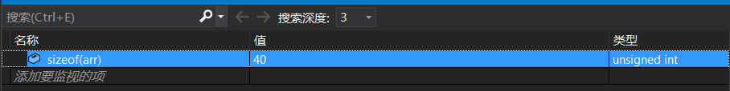

# 基础作业

### 1 使用三种循环形式，判断一个整数是不是质数

- while形式

  - ```c++
    bool isprime (int m){
    	int j = 2;
    	while ( j > m-1) {
    		if (m % j == 0) {
    			return false;
    			break;
    		}
    		j++;
    	}
    	return true;
    }
    ```

- do-while 形式

  - ```c++
    bool isprime(int m) {
    	int j = 2;
    	do{
    	if (m == 2 || m == 3) {
    		return true;
            break;
    		}	
    	}
    		else if (m % j == 0) {
    			return false;
    			break;
    		}
    		j++;
    	} while (j > m );
    	return ture;
    }
    ```

- for形式

  - ```c++
    bool isprime(int m) {
    	bool i = true;
    	if (m == 2 || m == 3) {
    		return true;
    	}
    	for (int i = 0; i <= sqrt(m); i++){
    		if (m % i == 0) {
    			return false;		
    		}
    	}
    	return true;
    }
    ```

2 下列代码实现了什么效果？

 

- 打印一次 only once 
  - do-while 循环是做一遍循环再进行判断语句，所以最少都会执行一遍。

### 3 int arr[10];请问arr数组的大小是多大

- int arr[10] //为一个含有10个int类型的数组，大小为40
  - 

### 4 一个大小为n的数组，请问下标的范围是多少？

- 下标范围为[0~n-1]，数组从0号下标开始计数

### 5 在函数内部申请一个char数组，请问这个数组最大能有多大（说出数量级即可）？

- 2^32

### 6 如何初始化一个全为0的数组

- ```c++
  int arr[10] = { 0 };
  ```

### 7 

### 这两个sizeof表达式的结果有什么区别？

- 第一个结果为4：仅仅表示传入函数的数组指针大小
- 第二个结果为40：表示函数内实际额数组大小

### 8 为什么传递数组的时候，必须要额外传递一个长度的参数？

- 因为传递数组时传递的是其实是指向数组的指针

### 9 对于一个二维数组int arr[M] [N]，如何计算下标为i和j的元素的地址呢？所以你能不能理解为什么传递二维数组的时候，不能省略第二个维度？

- 因为数组在内存里是连续储存的，所以对于一维数组而言只要求出数组指针的大小在加上期间的元素的长度就是对应数组下标的地址
- 对于二维数组而言也是一样在内存中连续储存，所以对应的地址为
  - 对于 int M [a] [b],对下标为i和j的元素的地址为
  - （数组下标为[ 0 ] [ 0]的地址）+ 4 * （a * i+b * j）

### 10 C风格的字符串以什么元素结尾？

- 以\0结尾

### 11 假如一个字符串的最后一个字母是’\n’，如何去除这个’\n’?

- 再用strlen函数找到最后一个的下标用空格字符覆盖

### 12 为什么说gets和scanf的%s模式是不安全的？而fgets是安全的？

- 因为gets和scanf容易访问越界
- fgets直接规定了字符数组的具体长度 不会出现访问越界 

### 13 使用fgets函数时，如果缓冲区内容的长度大于最大读取长度时，会发生什么？

- 会直接结束（提前一位结束）
- 因为fgets会强制读取\n

### 14 使用表格整理str系列函数，包含函数名，使用方法，效果等内容

- | 函数名  |    使用方法     |                             效果                             |
  | :-----: | :-------------: | :----------------------------------------------------------: |
  | strlen  |    strlen(c)    |                返回数组p的长度（忽略空字符）                 |
  | strcopy | strcopy(p1，p2) |                         复制p2到p1中                         |
  | strcmp  |  strcmp(p1,p2)  | 比较p1和p2，如果p1==p2 则返回0。如果p1>p2，则返回一个正值。如果p1<p2，则返回一个负值 |
  | strcat  |  strcat(p1,p2)  |                   将p2符加到p1之后，返回p1                   |

  