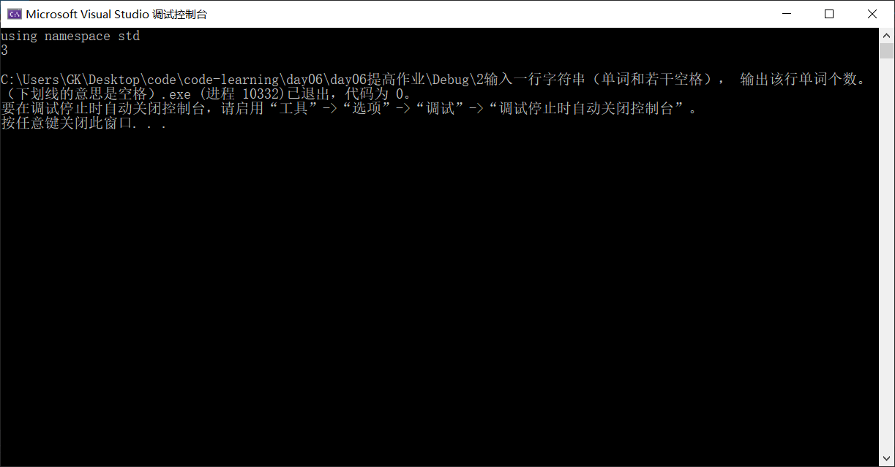
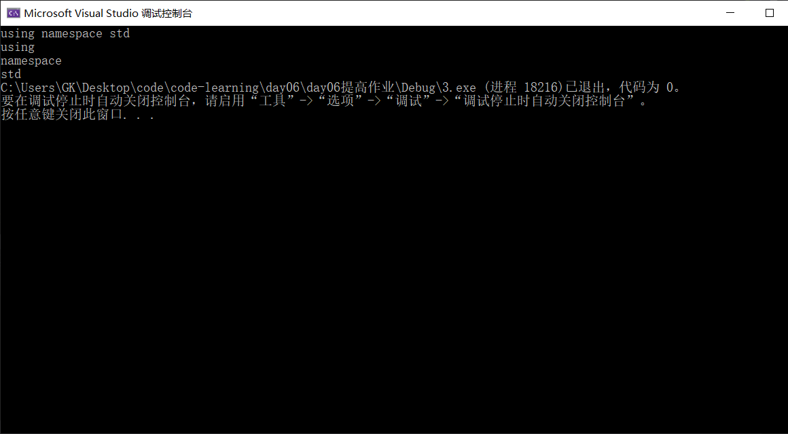

# 测试作业

- ### 实现mystrcpy(), mystrcmp(), mystrcat(), mystrlen();

  - mystrcpy()

    - ```c++
      void myStrcpy(char* to[],char* from[])
      {
        int i = 0;
        while(from[i])
        {		
            to[i]=from[i];
            i++;
        }
      to[i]=from[i]; //最后一次放\0
      }
      ```

  - mystrcmp()

    - ```c++
      int myStrcmp(char* str1[],char* str2[])
      {
        int i = 0;
        s = strlen(str1)<strlen(str2)?str1:str2;
        while(s--){
            if(str1[i]>str2[i]) return 1;
            else if(str1[i]<str2[i]) return -1;
            else continue;
            i++;
        }
      }
      ```

  -  mystrcat()

     - ```c++
       void mystrcat(char*str1[],char*str2[])
       {
           int cd [strlen(str1)+strlen(str2)-1];
           int i = 0;
           for(int i=0;i<strlen(str1)-1;i++) //第一次忽略字符串1的\0
           {
               cd[i] = str1[i];
           }
           while(str2[i]){ //第二次直接读完 读到\0结束
               cd[strlen(str1)+i] = str2[i];
           }
           return cd[c+d];
       }
       ```

  - mystrlen()

    - ```c++
      int mystrlen(char c[])
      {
          int i = 0；
          whlie(c[i++]);
          return i-1;
      }
      ```

### 2输入一行字符串（单词和若干空格）， 输出该行单词个数。（下划线的意思是空格）

##### Input：____hello_________world_ how___are___you___\n

##### Output:  5

- ```c++
  #include<iostream>
  #include<cstdio>
  #include<string>
  using namespace std;
  int main() {
  	const int N = 1024;
  	char c;
  	int i = 0;
  	int word = 0;
  	int count = 0;
  	char a[N] = { 0 };
  	gets_s(a);
  	while (c = a[i++]) {
  		if (c == ' ') { //如果读取到空格则结束
  			word = 0;
  		}
  		else if (word == 0) { //读取到非空格则开始计数
  			count++;
  			word = 1;
  		}
  	}
  	cout << count << endl;
  	return 0;
  }
  
  ```

- 

### 3输入一行字符串（单词和若干空格），输出该行单词（每个单词一行）

##### Input：____hello_________world_ how___are___you___\n

##### Output:  hello

#####    			 world

##### how

##### are

##### you


- 如果输入含有特殊符号 则直接用ACSⅡ表来判断是否应该打出？

- ```c++
  #include<iostream>
  #include<cstdio>
  #include<string>
  using namespace std;
  int main() {
  	const int N = 1024;
  	char c;
  	int i = 0;
  	int word = 0;
  	char a[N] ;
  	gets_s(a);
  	while (c = a[i++]) {
  		if (c != ' ') {	  //没读到空格就持续输出
  			cout<< c;
  			word = 1;
  		}
  		else if (c == ' '&&word ==1) { //读到下个空格的时候换行。并重置word的值（表示完整打印完一个单词）
  			word = 0;	
  			cout << endl;
  		}
  		else {  //如果一开始就是空格则continue
  			continue;
  		}
  	}
  	return 0;
  }
  ```

- 


