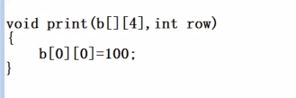

# day 06

### Ep01 预习

- ##### 数组&&指针

  > 

### Ep02 数组Ⅱ

- ##### str等字符串系列函数的使用

  > - srtcpy复制函数
  >
  >   - strcpy(char *to, char *from)； from  => to
  >   - 允许带空格的复制
  >   - 容易造成访问越界 
  >
  >   - ```c++
  >     void myStrcopy(char to[],char from[]){
  >       int i = 0;
  >       while(from[i]){		//读到\0结束
  >           to[i]=from[i];
  >           i++;
  >       }
  >     to[i]=from[i]; //最后一次放\0
  >     }
  >     ```
  >
  > - strcmp 比较函数
  >
  >     - strcom(str1,str2)： 比较str1和str2的长度
  >
  >     - 返回值
  >
  >         |    less thyn 0     |    str1 is less than str2     |
  >         | :----------------: | :---------------------------: |
  >         |   **equal to 0**   |   **str1 is equal to str2**   |
  >         | **greater than 0** | **str1 is greater than str2** |
  >
  > - strcat 拼接函数
  >
  >     - strcat(str1,str2) ：将str1接到str2上
  >     - 拼到末尾强行会有结束符。
  >
  > - strn系列
  >
  >     - 只想复制/比较/拼接一部分的时候
  >
  >     - 可以手动控制
  >
  >     - 如果超出了规定长度  不会添加结束符
  >
  >     - 需要清空缓存区
  >
  >         - 用memset清空
  >         - memset（d,0,sizeof(d)）; 内存设置接口
  >         - 把d开始接下来sizeof(d)长度的字节都变成0
  >
  >     - srtncpy
  >
  >         > - srtncpy(char *to, const, char *from)
  >         >
  >         > - 将字符串from中至多count个字符复制到字符串to中。如果字符串from的
  >         >   长度小于count,其余部分用\0'填补。返回处理完成的字符串。
  >         >
  >         > - ```c++
  >         >   While(gets(c)!=NULL){
  >         >       memset（d,0,sizeof(d)）;
  >         >       strncpy(d,c,7);
  >         >       puts(d);      
  >         >   }
  >         >   ```
  >         >
  >         > - 
  >
  >     - strncmp
  >
  >         > - int strncmp( const char *str1, const char *str2, size_ t count ); 
  >         > - 功能:比较字符串str1和str2 中至多count个字符。
  >         > - 返回值和strcmp相同
  >
  >     - strncat
  >
  >         > - char *strncat( char *str1, const char *str2, size_tcount );
  >         > - 将字符串from中至多count个字符连接到字符串to中.会追加结束符
  >
  > - momcpy
  >
  >     > - strcpy不能用于整型数组
  >     >
  >     > - ```c++
  >     >   int main(){
  >     >       int a[5] = {1,2,3,4,5};
  >     >       int b[5];
  >     >       strcpy(b,a);//报错遇到\0会直接结束拷贝。在整数型中存在值等于\0的值(即整数0)
  >     >       memcpy（b,a,sizeof(a)）;// 可拷贝
  >     >       
  >     >   }
  >     >   ```

### Ep02 指针

- ##### 写在前面 数组的复习：

  > - 一维数组 需要初始化，
  >
  >   - int a[5]  sizeof (a) 20字节
  >   - 注意访问越界
  >
  > - 二维数组 int b [3] [4]
  >
  >   - sizeof (b) 48
  >   - sizeof (b[0])   16个字节 
  >   - sizeof (b[0] [1])   4个字节 
  >
  > - 数组在传递的时候  需要传递长度
  >
  > - 
  >
  > - 字符数组
  >
  >   - 在传递函数的时候仅传首地址（数组名）
  >
  >   - ```c++
  >     char c[10] = "hello";
  >     sizeof(c) = 10;
  >     change(c) = 4;
  >     void change(char []){
  >         sizeof (c); 
  >     }
  >     ```
  >
  >   - 

- ##### 指针

  - 指针的本质 ：间接访问

    - 直接访问和间接访问

    - ```c++
      int main(){
          int i=3;
          int *ipointer;
          printf("%d\n",i); //直接访问
          //我是断点 此处取地址 是一个四个字节的
          iPointer=&i;	//初始化 将指针指向i的地址
          printf("%d\n",*ipointer); //间接访问
      }
      ```

  - 取地址和取值操作符

    - 取地址 &  也叫引用通过该操作符我们可以获取一一个变量的地址
    - **取值**操作符为*，也叫解引用，通过该操作符我们可以拿到-一个地址对应位置的数据。如图5.1.2-1

  - 注意 

    - 指针使用之前需要初始化
    - 指针变量前面的“*”，表示该变量的类型为指针型变量。
    - 在定义指针变量时需要定义指针类型
    - 如果已执行了语句 `pointer_1 = &a`那么`&*pointer 1`的含义是什么

  - 用途 ：传递和偏移

    - 指针的传递

      - ```c++
        //void change(int j)
        void change(int *j)   
        {
            j = j / 2;
        }
        int main()
        {
            int i = 10;
            printf("before change i=%d\n",i);
            // change(i); //函数只传递值 不传递地址。change函数未传递i的地址。所以i的值不变
            change（&i）；//通过指针简介访问让函数拿到了i的地址，从而传出改变了i的指。
            printf("before change i=%d\n",i);
        }
        ```

      - 

  

