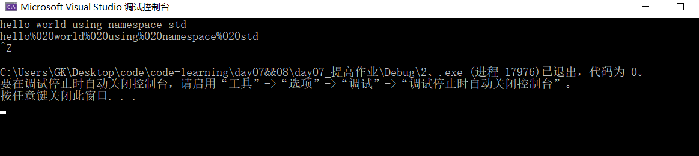
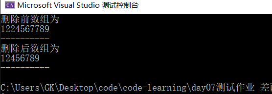
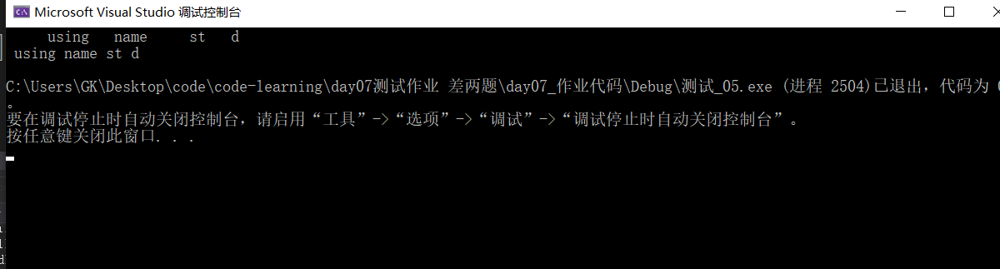

# 测试作业

### 1将包含字符数字的字符串分开,使得分开后的字符串前一部分是数字后一部分是字母。例如“h1ell2o3” -> “123hello”

- 不知道错在哪里，反复调试调试不出来

- ```c++
  #define _CRT_SECURE_NO_WARNINGS
  #include<iostream>
  #include<cstdio>
  #include<string>
  #include<vector>
  using namespace std;
  void judge(char* c);
  int main() 
  {
  	const int N = 1024;
  	char str[N] ; //存放用数组
  	int count = 0;
  	while (gets_s(str) != NULL) 
  	{
  		judge(str);
  	}
  }
  void judge(char* c)
  {
  	char *temp = c;
  	char num[1024];
  	char alp[1024];
  	int count = 0;
  	for(int i =0;i<strlen(c);i++)
  	{
  		if (*temp >='0'|| *temp <= '9')
  		{
  			num[count++] = c[i];
  		}
      }
  	for (int i = 0; i < strlen(c); i++)
  	{
  			num[count++] = c[i];
  	}
  	
  	printf("%s", num);
  	memset(c, 0, sizeof(c));
  }
  ```

- 

### 2将 字 符 串 中 的 空 格 替 换 成 “%020” ， 例 如

### “hello world how ”->

### “hello%020%020%020world%020%020%020how%020%020%020%020”

- ```c++
  #define _CRT_SECURE_NO_WARNINGS
  #include<iostream>
  #include<cstdio>
  #include<string>
  #include<vector>
  using namespace std;
  void replace(char* c);
  int main() 
  {
  	const int N = 1024;
  	char str[N];
  	while (gets_s(str) != NULL)
  	{
  		replace(str);
  	}
  	return 0;
  }
  void replace(char* c)
  {
  	char* temp = (char*)malloc((strlen(c)));
  	strcpy(temp, c);
  	int i = 0;
  	while(*temp != '\0')
  	{
  		if (*temp == ' ')
  		{
  			c[i++] = '%';
  			c[i++] = '0';
  			c[i++] = '2';
  			c[i++] = '0';
  		}
  		else
  		{
  			c[i++] = *temp;
  		}
  		temp++;
  	}
  	c[i] = '\0';
  	printf("%s\n", c);
  }
  ```

- 

### 3删除字符串中指定的字符。 例如 “abcdaefaghiagkl“ 删除‘a’,以后： “bcdefghigkl”

- 不知道为啥调试一直有问题 疯狂按ctrl+z没结果

- ```c++
  #define _CRT_SECURE_NO_WARNINGS
  #include<iostream>
  #include<cstdio>
  #include<string>
  #include<vector>
  using namespace std;
  void strike_out(char* c,char n);
  int main()
  {
  	const int N = 1024;
  	char str[N];
  	char n;
  	while (gets_s(str)!=NULL)
  	{
  		scanf("%c", &n);
  		strike_out(str,n);
  	}
  	return 0;
  }
  void strike_out(char* c, char n)
  {
  	char* temp = (char*)malloc((strlen(c)));
  	strcpy(temp, c);
  	int i = 0;
  	while (*temp != '\0')
  	{
  		if (*temp == 'n')
  		{
  			c[i++] = *temp; //如果找到则直接跳到下一个
  		}
  		temp++;
  	}
  	c[i] = '\0';
  	printf("%s\n", c);
  }
  ```

### 4删除有序数组中的重复元素

- ```c++
  #define _CRT_SECURE_NO_WARNINGS
  constexpr auto N = 10;
  #include<iostream>
  #include<cstdio>
  #include<string>
  #include<vector>
  using namespace std;
  int main()
  {
  	int Arr[N] = { 1,2,2,4,5,6,7,7,8,9 };	
  	cout << "删除前数组为" << endl;
  	for (int i = 0; i < N; i++)
  	{
  		cout << Arr[i];
  	}
  	cout << endl;
  	cout << "----------" << endl;
  	cout << "删除后数组为" << endl;
  	for (int i = 0; i < 10; i++)
  	{
  		int j = i + 1;
  		if (Arr[i] == Arr[j])
  		{
  			i = j;
  			j++;
  		}
  		cout << Arr[i];
  	}
  	cout << endl;
  	cout << "----------" << endl;
  	return 0;
  }
  
  ```

- 

- 

### 5删除句子当中的多余空格，使得单词与单词之间只有一个空格

- ```c++
  #include<iostream>  
  #include<cstdio>
using namespace std;
  constexpr auto N = 1024;
  int main()
  {
      int i;
      char a[N];
      gets_s(a);
      for (i = 0; a[i] != '\0';) {
          if (a[i] == ' ') {          //如果是空格输出一个空格
              cout<<" ";
              while (a[i] == ' ') i++; //向后继续循环到不是空格为止
          }
          else {                      //如果字符不是空格直接输出
              cout<<a[i];
              i++;
          }
      }
      cout << endl;
      return 0;
  }
  ```
  
- 

