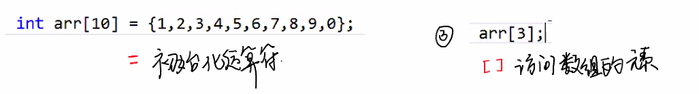
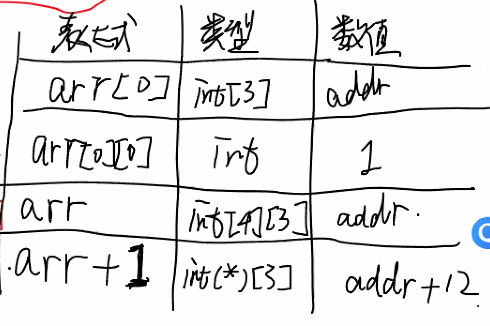
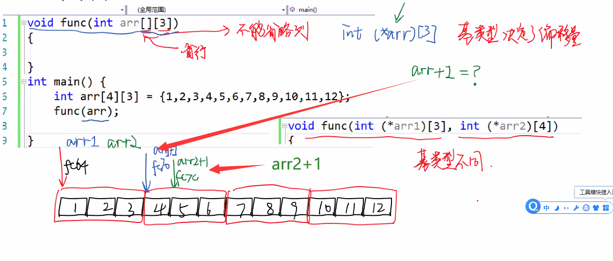
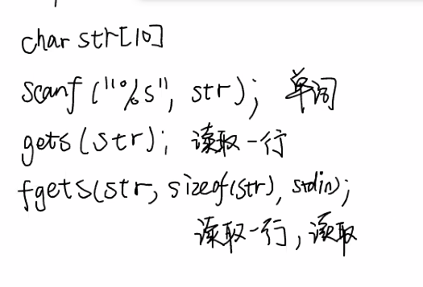
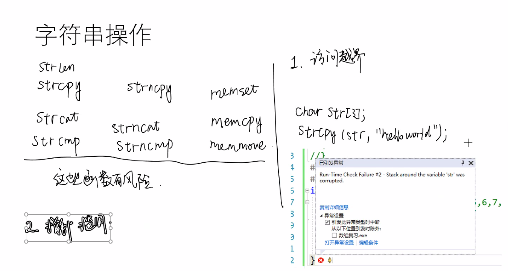
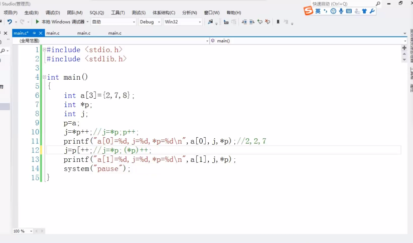
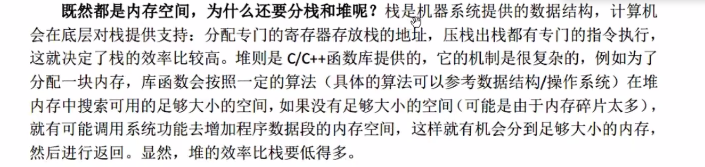
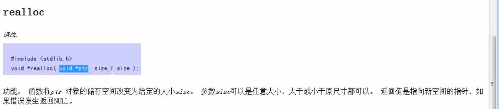

# day07&&08

### Ep01 复习指针和数组

- ##### 数组

  > - **定义**：实际分配了内存空间
  >
  > - **声明**：通知编译器名字可用
  >
  > - 在数组名做加减运算时：会以元素类型为基类型的指针（加/减一个元素）【对于二维数组来说是直接加一行】
  >
  > - 具有相同数据类型的变量（元素）的集合（数组）
  >
  > - 储存在栈上，在内存中连续存储。
  >
  > - 存储特征
  >
  >   - 不能太大
  >   - 只需知道数组名（首地址）就可以求出整个数组的地址
  >   - 数组名+n（下标）*`sizeof`数据类型
  >
  > - 数组的使用
  >
  >   
  >
  > - 数组的传递
  >
  >   > - 对于函数而言，数组的传递是用指针实现的，传入的是数组的首地址（数组名）
  >
  > - 指针数组VS数组指针
  >
  >   - 指针数组=全为指针的 `int *arr[10]` ，每个元素都是指针
  >   - 数组指针=指向数组的指针`int(*p)[10]`，一个指针变量，指向数组。
  >
  > - 二维数组
  >
  >   - 
  >   - 
  >   - 二维数组本质为一个一维数组，传递时指针的偏移根据基类型决定

- ##### 字符串

  > - char类型的字符数组 以\\0结尾（内存中的0）
  >- 字符串字面值常量存放在代码段而不是数据段
  > - `scanf("%s",str)`=> 读取以一个单词，遇到空格结束。
  >- 
  > - 
  >
### Ep02指针

- ##### 指针滥用

  > - 指针指向的位置不可写（比如存在字符串常量里）
  > - 

- ##### 指针类型

  > - 基于指针指向的变量类型
  > - 指针在使用之前必须初始化 即
  >   - 指针必须指向已经分配的空间

- ##### 指针的传递

  > - 函数调用原理
  >
  > - |       **内核**       |
  >   | :------------------: |
  >   | **栈**（函数储存处） |
  >   |        **堆**        |
  >   |  **数据段&&代码段**  |
  >   
  > - 主调函数传递地址给被调函数
  >
  > - 被调函数用解引用来修改结束值
  >
  > - 如果函数传递出来的数据需要修改主函数的值，则应用指针传递数据（传递地址）

### Ep03

- ##### 指针Ⅱ
  
  > - 在被调函数内要改变原函数的值，则要用指针传递变量
  >
  > - 指针的偏移
  >
  >   - 服务于数组
  >
  >   - 可以通过指针的偏移来访问数组中的元素
  >
  >   - 指针的基类型决定指针偏移的程度
  >
  >   - 将堆指针的加减称之为指针的偏移
  >
  >   - 加就是向后偏移，减就是向前偏移
  >
  >   - ```c++
  >     int main()
  >     {
  >         const int N=5;
  >         int a[N]={1,2,3,4,5};
  >         //数组名储存的是数组的起始地址
  >         int *p;
  >         p=a;   //初始化指针 
  >     		   //此处不需要取地址符
  >         	   //因为数组名=数组首地址=第一个元素的地址
  >     	for(int i=0;i<5;i++)
  >         {
  >             printf("%3d",*(p+i));
  >             //p = &a[4];  //逆序输出
  >             //printf("%3d",*(p-i));
  >         }
  >         printf("\n");
  >         
  >         
  >         
  >     }
  >     
  >     ```
  >
  >   - ```c++
  >     void print(int *p)
  >     {
  >         for(int i=N;i<5;i++)
  >         {
  >             printf("%3d",*(p+i));
  >         }
  >         
  >     }
  >     int main()
  >     {
  >         const int N=5;
  >         int a[N]={1,2,3,4,5};
  >         int *p;
  >         p=a;   //初始化指针 
  >     }		
  >     ```
  >
  
 - 指针的自增自减运算符

   > - ```c++
   >   int main(){
   >       int a[3]={2,7,8};
   >       int *p;
   >       int j;
   >       p = a;
   >       j=*p++; //j=*p;*p++;
   >       printf("a[0]=%d,j=%d,*p=%d\n",a[0],j.*p);
   >       // 2，2，7
   >       j=(*p)++; //先进行j=*p运算 在对(*p)++ 
   >       printf("a[0]=%d,j=%d,*p=%d\n",a[0],j.*p);
   >       // 2，7，7
   >       
   >   }
   >   ```
   >
   > - 
  >
  >   - 
  >
  >   -  

- void型指针

  > - 传入时需要强制类型转换成char型

- 动态数组

  > - ```c++
  >   int main()
  >   {
  >       int needSize;
  >       char *pStart;
  >       scanf("%d",&needSize);
  >       pStart=(char*)malloc(needSize);
  >       strcpy(pStart,"Hello");
  >       puts(pStart);
  >       free(pStart);//要把free后的指针置为NULL
  >       pStart=NULL;
  >       
  >   }
  >   ```
  >
  > - 
  >
  > - 栈空间和堆空间的差异实例
  >
  >   - ```c++
  >     char *printStack()
  >     {
  >         char c[] = "I am printStack";
  >         puts(s);
  >         return c;
  >     }
  >     char *printMalloc
  >     {
  >         char *p=(char*)malloc(20);
  >         strcpy(p,"I am printMalloc");
  >         puts(p);
  >         return p;
  >     }
  >     int main()    
  >     {
  >         char *p;
  >         p=printStack;
  >         put(p);//打印会乱码,
  >                 //函数调用完毕之后会自动释放栈空间
  >         p=printMalloc;
  >         put(p); //打印不会乱码，对于堆来说只要不free都是属于堆的空间。
  >         free(p);
  >         p = NULL;
  >     }
  >     ```

- 用C实现vector

  > 
  >
  > - ```c++
  >   #include<cstdio>
  >   #include<string>
  >   #define CAPACITY 20
  >   int main()
  >   {
  >       char *p=(char*)malloc(CAPACITY);
  >       char c;
  >       int i=0,cap=CAPACITY;
  >       while(scanf("%c",&c)!EOF)
  >       {
  >           if(i==CAPACITY-1)
  >           {
  >               cap=2*cap;
  >               p=(char*)realloc(p,cap);
  >           }
  >           p[i]=c;
  >           i++;
  >       }
  >       p[i]=0;
  >       puts(p);
  >       free(p);
  >   }
  >   ```
  >
  > - 

- 字符指针&&字符数组初始化

  > - ```c++
  >   int main()
  >   {
  >       char *p='hello';
  >       char c[20]="hello";
  >       c[0]='H';
  >       //p[0]='H';//字符串常量区不可写
  >       p="how are u";
  >       //c="how are u";//因为c是常量
  >   
  >   }
  >   ```
  >
  > - strc