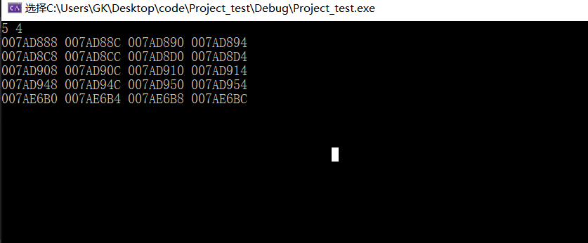

# 基础作业

### 1 使用malloc创建一个整型二维数组

- ```c++
  #include<iostream>
  #include<string>
  #include<cstdlib>
  constexpr auto N = 1024;;
  using namespace std;
  int main()
  {
      int row ;
      int col ;
      int** p;
      cin >> row >> col;
      p = (int**)malloc(sizeof(int*) * row);
      for (int i = 0; i < row; i++)                             
      {
          p[i] = (int*)malloc(sizeof(int*) * col); 
          for (int j = 0; j < col; j++) 
          {
              cout << &p[i][j] << " ";
          }
          cout << endl;
      }
      for (int i = 0; i < row;i++)  //由于每行申请  所以释放的时候也要按行释放
      {
          free(p[i]);
          p[i] = NULL;
      }
  }
  ```



### 2 整理二维数组和二级指针的使用场景

- 二维数组
  - 使用字符串数组的时候
- 二级指针 
  - 分配动态二维数组的时候
  - 交换指针排序时 
  - 传递需要改变的指针变量的时候

### 3 在以往代码中随便找一个，使用函数指针来替代函数调用

- 函数指针

- ```c++
  #define _CRT_SECURE_NO_WARNINGS
  #include<iostream>
  #include<cstdio>
  #include<string>
  #include<vector>
  using namespace std;
  void replace(char* c);
  int main() 
  {
  	const int N = 1024;
  	char str[N];
  	while (gets_s(str) != NULL)
  	{
  		void(*)p=replace;
          p(str);
          //replace(str);
  	}
  	return 0;
  }
  void replace(char* c)
  {
  	char* temp = (char*)malloc((strlen(c)));
  	strcpy(temp, c);
  	int i = 0;
  	while(*temp != '\0')
  	{
  		if (*temp == ' ')
  		{
  			c[i++] = '%';
  			c[i++] = '0';
  			c[i++] = '2';
  			c[i++] = '0';
  		}
  		else
  		{
  			c[i++] = *temp;
  		}
  		temp++;
  	}
  	c[i] = '\0';
  	printf("%s\n", c);
  }
  ```