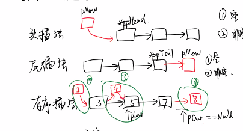

# week02 复习课Ⅱ

### Ep01 链表

- 链表的节点声明

  > - ```c++
  >   struct node{
  >       int val;
  >       struct node *pnext;
  >   }
  >   ```
  >
  > - ```mermaid
  >   graph LR
  >   A[链表A数据] -->|指针A|B[链表B数据]
  >       B -->|指针B|C[链表C数据]
  >       C -->|指针C|D[链表D数据]
  >       F[链表]
  >   ```

- 链表的增删查改

  > - 插入列表
  >
  >   - 头插法
  >
  >     > - ```c++
  >     >   pNew.pNext=*pphead;
  >     >   *pphead = pNew ;
  >     >   ```
  >     >
  >     > - 判空
  >     >
  >     > - 新的数的指针域指向头节点的数据域
  >     >
  >     > - 新节点成为新的头节点
  >
  >   - 尾插法
  >
  >     > - ```c++
  >     >   (*pptail).pNext=pNew;
  >     >   *ppTail = pNew ;
  >     >   ```
  >     >
  >     > - 判空
  >     >
  >     > - 尾节点的指针指向新节点数据域
  >     >
  >     > - 新节点成为新的尾节点
  >
  >   - 有序插入
  >
  >     > - 判空
  >     >
  >     > - 1. 若新数据小于头节点的数据
  >     >
  >     > - ```c++
  >     >   pNew->val<*pphead;
  >     >   ```
  >     >
  >     > - 则头插法
  >     >
  >     > - 如果大于头节点的数据
  >     >
  >     > - 则遍历链表
  >     >
  >     > - 2. 找到比新数据更大的位置
  >     >
  >     > - ```c++
  >     >   pCur->val>pNew->val;
  >     >   pPre->pNext=pNew;
  >     >   pNew->pNext=pCur;
  >     >   ```
  >     >
  >     > - 进行头插法
  >     >
  >     > - 3. 若未找到
  >     >
  >     > - 则进行尾插法
  >
  > - 

- 链表的删除

  > - 若链表为空
  >
  >   - 直接返回
  >
  > - 若要删除的为头节点
  >
  >   - ```c++
  >     (*pphead)=pCur->next;
  >     ```
  >
  >   - 删除完还需判断是否需要修改尾指针
  >
  > - 若删除的不为头节点
  >
  >   - ```c++
  >     pPre->pNext=pCur->pNext;
  >     ```
  >
  >   - 删除完还需判断是否需要修改尾指针
  >
  >   - ```c++
  >     if pCur=*pptail;
  >     *pptail=pPre;
  >     ```
  >
  > - 若找不到，则直接返回

### Ep02 栈和队列

- 栈

  > - 特点：先进后出
  > - 只能对栈顶操作
  >   - 压栈
  >     - 头插法
  >   - 弹栈
  >     - 头部删除法
  > - 顺序栈：一般不用
  > - 后缀表达式/括号匹配/函数调用
  > - 将递归函数转化为非递归
  > - DFS

- 循环队列

  > - 先进先出
  > - front/rear
  >   - front == rear即队列为空
  >   - 放入rear，rear==front时即为满
  >   - front：队头下标
  >   - rear：下次入队的数组下标
  > - 插入元素时，移动rear
  > - 入队（rear+1）%MAX
  > - 出队（front+1）%MAX
  > - 用途
  >   - 缓冲区
  >   - BFS（二叉树层次建树）


### Ep03 二叉树

- 二叉树的层次建树

  > - 放好根节点
  > - 放左孩子和右孩子
  > - 每次根据队首来放左右孩子
  > - 根据队首放