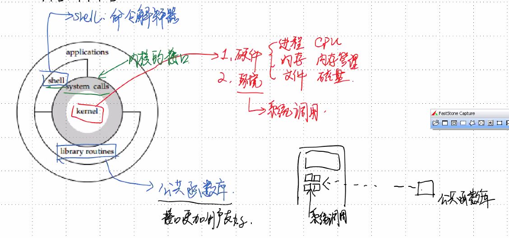
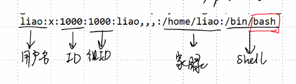
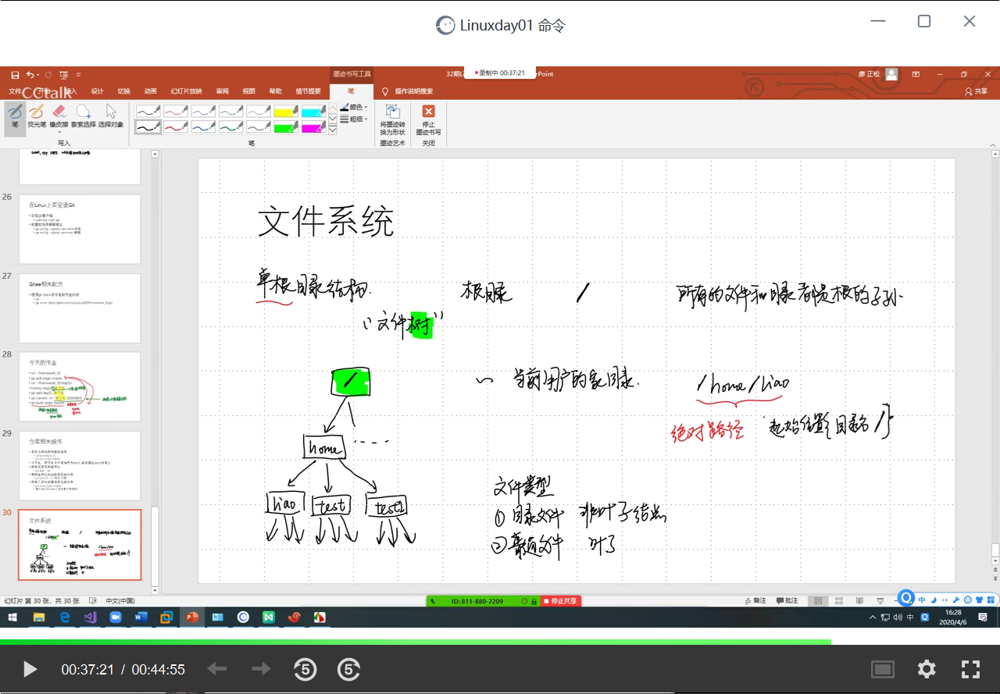

# Linux 从入门到~~rm-rf到扛着高铁跑路~~


### Ep01写在前面

- 悟已往之不谏，知来者之可追

#### linux学习指南

> - 
> - linux环境
>
>   - 历史
>   - 结构
>   - 登陆和其他
> - linux命令
>
>   - shell命令
> - 操作系统
>   - 如何配置用户
>
>     - ubuntu
>   - git
> - 文件系统
>   - 概况
>   - 目录
>   - 文件的增删查改
> - 文件权限
>   - 查找文件：按文件名&&按文件内容
>   - 压缩解压
> - 远程拷贝
>  - vim文本编辑器
>     - 
> - 编译调试工具
>   - GCC：编译工具
>   - GDB：调试工具
>   - 库文件
>   - Makefile：工程项目管理器
> - 系统编程：操作系统
>   - 文件操作：基本的增删查改&&**IO模型之多路复用**
>   - 进程
>   - 线程
>   - 网络编程
>   - 服务器框架
>   - MySQL数据库：底层&&B树
> - 杂七杂八
>     - 性能检测工具
>     - 性能调优：负载均衡
>     - HTTP服务器
>     - 五种IO模型
> - 项目02：百度网盘（1~6个版本）
>     - 难度不同，量力而为
>     - 一二期：团队合作
>     - 三四五六：个人独立完成

- 


### Ep02 虚拟机和Xshell的配置

- 配置网络

  > - 虚拟机的网络设置应为NAT模式
  > - 查看网络信息用`ctrl`+`alt`+`T`  打开终端，ping一个网站（`ctrl`+`c`停止）
  > - 调整成静态方便配置Xshell

- 配置Xshell

  - 安装ssh
  - 配置Xshell
  - 打开之前先ping虚拟机ip，本机为`192.168.10.129`
  - 优点：可以在windows下操作，并且可以避免图形化占据资源

### Ep03 Linux历史

- Linux是一个自由开放源码的类UNIX系统。所以我们在说Linux之前，先说说UNIX
  - UNIX的历史：略
  - UNIX的结构：内核，系统调用，应用层
    - 内核：操作硬件和环境
      - 硬件：进程&&内存&&文件
      - 环境：系统调用
    - shell：命令解释器
    - library routines：公共函数库
  - 
  - POSIX标准：统一系统调用的接口
  - 内核版本`$`
  - 查看用户信息`$cat /etc/passwd`
  - 查看版本信息`$cat /etc/issue`

### Ep04 用户相关命令

- 用户

  > - root用户
  >   - 所有功能
  >   - 命令提示符为`#`
  > - 普通用户
  >   - 部分功能
  >   - 命令提示符为`$`
  > - 切换用户

- `passwd`：password

  > - 给用户配置口令
  > - 修改&&配置用户密码
  > - 需要`sudo`提高权限
  > - `cat /etc/passwd`
  > - 

- `su`：switch user

  > - 切换用户，如果无参数则切换到根用户
  > - `su [其他用户名]`
  > - 从根用户切换到其他用户不需要密码

- 用户和组

  > - 组：用户的集合，方便共享组内资源

- 退出用户

  > -  栈结构储存 先su的后最后退出
  > - `exit`

- 注意：对于Linux，没有消息就是最好的消息

- 添加用户

  > - `useradd -m 用户名`
  > - 对于`useradd+用户名`而言，会创建一个bin/bash文件
  > - bin/sh鶸于bin/bash
  > - useradd -m 用户名 -s bin/bash

- 删除命令

  > - `userdelete+用户名`       不会删除家目录。
  > - `userdelete -r 用户名` 同时删除家目录
  > - 需要彻底退出账号（栈储存）
  > - 即待删除的账号不能在用户登陆栈中

### Ep05 Ubuntu 的安全设计

- ssh登陆的时候只能通过普通用户登陆
- ssh协议：secure shell 加密传输


### Ep06 git使用

- 使用之前需要添加`user.name`&&`user.email`

  - ```nginx
    git config user.name  	//查看user.name
    git config user.email 	//查看user.email
    
    git config --global user.name "用户名"
    //双引号可加可不加，但是空格一定要加
    git config --global user.email "用户邮箱"
    ```

- `clone`命令

  - 克隆远程的仓库到本地  一般接地址也可以接命名文件夹

  - ```nginx
    git clone +仓库地址.git 
    git clone +仓库地址.git ~/.文件夹名
    //克隆地址是 仓库地址 的仓库到本地的 文件夹名 文件夹
    ```

- `git pull origin master`
  - 相当于pull，先pull再push

- `git add +文件名`

  - 添加文件进提交请求

- `git commit -m “提交信息”`

  - 相当于提交信息

- `git push origin master`

  - push

- 此处如果要推送到别的分支 修改分支名

- linux文件系统：文件树 

  > - 根目录
  >   - 整个Linux系统只有一个根目录所有的目录文件都是根目录的子孙
  > - 家目录
  >   - 
  > - 绝对路径
  > - 相对路径