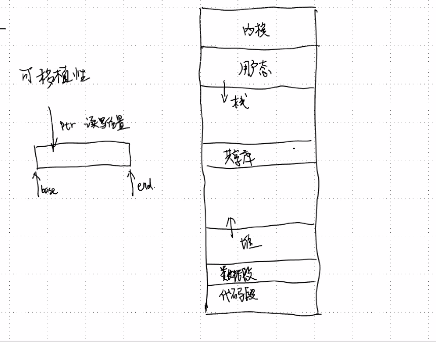
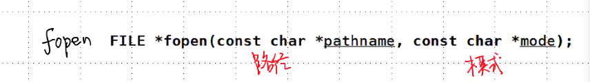
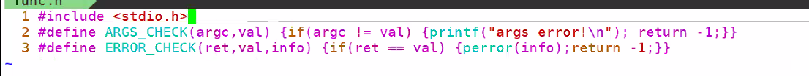
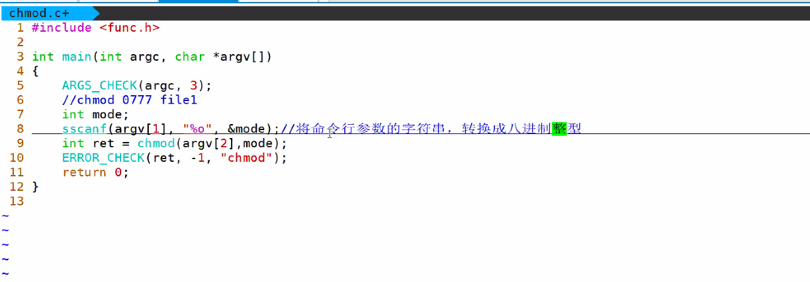
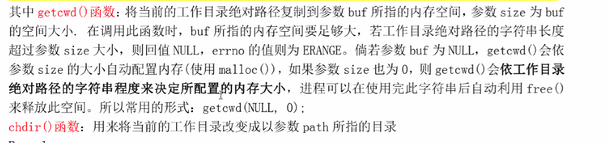

# day27 笔记

### Ep01 写在前面

- vim

  > - 普通模式
  >   - 普通模式到编辑模式
  >     - a/A/s/S/i/I	
  >     - 按下I光标移向行首，A移向行尾
  >     - s删除一个并进入编辑模式，S删除一行并进去
  >   - 普通模式到可视模式
  >     - v：横选
  >     - Ctrl+v：竖选
  > - 编辑模式
  >   - 同正常
  > - 可视模式
  >   - 如何批量注释代码：
  >     - 进去竖选可视模式
  >     - 选择合适的行
  >     - I表示向前插入
  >     - 输入//+ESC
  > - 光标移动
  >   - 上下左右：hjkl
  >   - 行首行尾：^/$
  >   - 文件头/文件尾：gg/G
  >   - 下/上一个单词：w/b
  >   - 翻页：Ctrl+b/f/u/d
  >   - 移动行：:[行号]/[行号]G
  >   - 向前/后n行：[行号]-/+
  > - 删除和复制
  >   - 删除字符：x
  >   - 删除一行/n行：dd/[n]dd
  >   - 删除到行尾：D/d$
  >   - 删除到行首：d^
  >   - 删除一个/n个单词：dw/dnw
  >   - 粘贴：p
  >   - 撤销：u
  >   - 僵死和解除：Ctrl+s /Ctrl+q
  >   - 拷贝一行/n行：yy/nyy
  > - 删除特定内容
  >   - 删除括号内：dt)
  >   - 删除>内：dt>
  >   - 删除}内：dt}
  > - 查找
  >   - /[str]：str可以是正则表达式
  > - 替换i
  >   - 替换第一个字符串：`:s/[stc]/[dst]` 
  >   - 替换当行的所有匹配字符串：`:s/[stc]/[dst]/g`
  >   -  替换当行的所有匹配字符串不区分大小写：`:s/[stc]/[dst]/ig`
  >   - 替换第x，y行：`:[x,y] s/[stc]/[dst]/ig`
  >   - 替换全部：`:%s/[stc]/[dst]/g`
  > - 保存并退出
  >   - :w：保存
  >   - :wq：和:x等价
  >   - ZZ：保存并退出
  >   - :q!：放弃修改退出
  > - 查看十六进制
  >   - :%!xdd
  >   - :%!xdd -r
  > - 多窗口
  >   - new
  >   - vnew
  >   - split
  >   - vsplit
  >   - sp
  >   - vsp
  >   - 切换：ctrl+w+w
  > - 多标签
  >   - tabnew
  >   - 切换：gt/gT
  > - 代码对齐：=
  >   - 在可视模式下选择需要对齐的代码，按=
  >   - gg=G
  > - 外部命令
  >   - 批量替换：sed
  >     - 显示替换结果：`sed “s/[src]/[dst]/g”`，可用重定向到另一个文件中
  >     - 确认替换：`sed -i “s/[src]/[dst]/g”`
  >   - 比较差异：vimdiff（用Ctrl+w+w切换窗口）
  >   - 直接跳转到第几行：vim [行号]
  >   - 直接跳转到某个位置：vim [src]
  > - 训练程序：vimtutor
  > - 配置文件：~/.vimsrc

- 编译

  > - 编译流程
  >   - 预处理：gcc -E
  >   - 编译：gcc -S
  >   - 汇编：$as
  >   - 链接：$ld
  > - 直接编译成可执行文件：gcc -c xxx.c -o [文件名]
  > - 其他选项
  >   - -i：添加头文件的目录
  >   - -D：加宏定义
  >   - -Wall：开启警告
  >   - -O[123]：汇编代码优化
  >   - -o：
  > - 库：
  >   - 静态库：加载进程序
  >     - 生成目标文件
  >     - 打包
  >       - $ar crsv lib[文件名/函数名].a [文件名/函数名].o
  >     - 拷贝到lib目录
  >     - 链接
  >       - -l[文件名/函数名]
  >   - 动态库：仅链接
  >     - 生成目标文件：-fpic 生成位置无关的代码
  >     - 打包：gcc -shared -o lib[func].so [func].o
  >   - 查看目标文件定位信息：$nm
  >   - 查看动态库依赖情况：$ldd
  >   - 生成软连接（动态库使用和升级）：不需要重新编译
  >     - 升级时修改库文件和软链接的指向

- gdb

  > - 编译时 -g
  > - 进入调试界面：gdb 可执行程序
  >   - 显示代码：i
  >   - 命令行参数
  >     - show args
  >     - set args
  >   - 断点
  >     - info b：显示所有断点
  >     - b：打断点
  >     - delete：删除所有断点
  >   - 单步调试
  >     - n/s
  >   - 打印信息
  >     - p：根据变量类型打印
  >     - x/[][][n] [f] [u]：内存内容
  >   - 调用堆栈：bt
  > - core文件
  >   - 允许core文件：ulmit -c unlimited
  >   - 生成core文件
  >   - gdb core 

- makefile //多看看

  > - 增量编译：按照生成时间，增量编译
  >   - 按照依赖文件生成的时间，如果
  > - 目标
  >   - 普通目标：生成文件的目标
  >   - 伪目标：不生成文件的目标
  > - 依赖
  > - 命令
  > - 变量：
  >   - =和:=
  >   - 预定义变量
  >   - 自动变量：
  >     - $@
  >     - $^
  >     - $<
  > - 模式匹配：%
  > - 函数
  >   - wildcard
  >   - subst
  >   - patsubst
  > - 循环
  >   - for in set; do 命令; done

### Ep02 文件

- 文件类型

  > - 普通文件：存放在磁盘里的文件
  > - 目录文件：存放在磁盘里的，其他文件的信息
  > - 链接：另一个文件的路径，大小和另一个文件文件名有关
  > - 设备文件
  >   - 字符设备：鼠标
  >   - 块设备：磁盘
  > - 管道：输入输出文件
  > - sorket：网络操作文件

- 文件指针

  > - FILE*
  > - 

- 打开关闭文件 // 下午复现上课代码

  > - 
  >   - 创建缓冲区（stream）
  > - 追加模式
  > - 
  > - ftall：文件的读写位置
  >   - 0
  
- chmod：修改文件权限

  > - 数字设定法
  > - chmod(文件名，0777)；
  > - 此处输入8进制
  > - 

- 传入参数VS传入传出参数

  > - const xxx xxx：传入参数
  >   - 仅传入值，不修改原内容
  > - 无const，则为传入传出参数
  >   - 会修改原本的值

- getcwd：相当于gwd命令

  > - 显示当前工作目录
  > - 

- mkdir函数

  > - 创建的时候权限会受到掩码的影响

### Ep03 目录流

- DIR：打开目录

- close：关闭目录

- readdir：读取目录中的每一项

  > - ```c
  >   struct dirent *readdir(DIR *dorp);
  >   ```

- seekdir：改变当前目录流的读写位置

  > - taildir：获取当前目录流的读写位置
  > - 

- rewinddir：直接回到头指针

  > - ```c
  >   #include<myLibrary.h>
  >   int main(int argc,char*argv[])
  >   {
  >       ARGS_CHECK(argc,2);
  >       DIR *dirl;
  >       dir = opendir(argv[]);
  >   }
  >   
  >   ```


### Ep04 获取文件状态

- stat：获取文件信息帮放在*statbuf中

- 硬链接和软链接的区别

  > - 软链接

