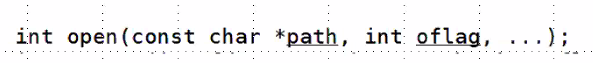
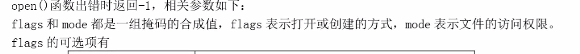
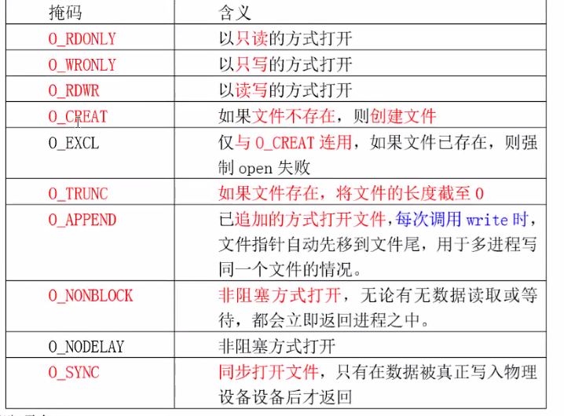
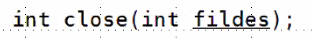
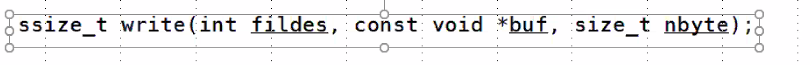

# day28 笔记

### Ep01 写在前面

- 实现tree命令
- 标准输入输出
- 文件描述符的复制
- 文件描述符和文件指针的转换
- IO多路转接模型

### Ep02 实现tree命令

- DFS：深度优先遍历

  > - 递归
  >
  > - 访问根节点，循环递归处理根的孩子
  >
  > - ```c++
  >   #include<stdio.h>
  >   #include<myLibrary.h>
  >   int DFSprint(char *path,int width)
  >   {
  >       DIR *dir = opendir(path);
  >       ERROR_CHECK(dir,NULL,"opendir");
  >       struct dirent *pDir;
  >       while(pDir = readdir(dir))
  >       {
  >           if(strcmp(pDir->d_name,".")==0 ||
  >             strcmp(pDir->d_name,".."==0)
  >              {
  >                  continue;
  >              }
  >           printf("%*s%s\n",width,"",pDir->d_name);
  >              //实现可变宽度
  >           spritnf(buf,"%s%s%s",path,"/",pDir->d_name);//实现字符串凭借
  >           if(pDir->d_type ==4)
  >              {
  >                  DFSprint( buf,width+4);
  >                  //dir1---->dir/dir1
  >              }
  >       }
  >       closedir(dir);
  >       return 0;
  >   }
  >   int main (int argc, char* argv[])
  >   {
  >       ARGS_CHECK(argc,2);
  >       puts(argv[1])；
  >       DFSprint(argv[1],0);
  >       return 0; 			
  >   }
  >   ```

### Ep02 文件描述符

- 文件对象面向内核

  - 图见课件，下课补

- 进程刚创建时，已经打开了三个文件对象（位于内核区）

  > - 标准输入
  > - 标准输出
  > - 标准错误输出

- 缓冲区类型

  > - 全缓冲：
  >   - 当填满缓冲区后才进行实际 I/O操作。
  >   - 典型代表是对磁盘文件的读写。
  > - 行缓存：
  >   - 遇到某个特定符号才写入文件对象
  >   - 典型代表是标准输入(stdin)和标准输出(stdout)。
  > - 不缓冲：
  >   - 直接写回文件对象
  >   - 典型代表是标准错误文件 stderr

- 不带缓冲的IO实现（无用户态的缓冲区）

  > - 打开：int open (const char*path,int oflag,...);
  >
  >   - 
  >
  >   - int 即为文件描述符
  >
  >   - 失败时返回-1
  >
  >   - 头文件 //重听整理 
  >
  >   - ```c
  >     #include<
  >     #include<fcntl.h>
  >     int main(int argc ,char *argv[])
  >     {
  >         ARGC_CHECK(argc,2);
  >         int fd;
  >         fd = open(argv[1],0_RDWR);  //open.c
  >         fd = open(argv[1],0_RDWR|0_TRUNC);//open_trunc.c
  >         //打开并清空文件内容 相当于fopen的w模式 
  >         fd = open(argv[1],0_RDWR|0_CREAT,0666);//open_creat.c
  >         //会受文件掩码影响
  >         fd = open(argv[1],0_RDWR|0_CREAT|0_EXCL,0666);//open_excl.c
  >         //会受文件掩码影响
  >         ERROR_CHECK(fd,-1,"open");
  >         printf("fd = %d\n",);
  >         close(fd);
  >         return 0;
  >     }
  >     ```
  >
  >   - 
  >
  >     
  >
  > - 关闭
  >
  >   - 
  >
  > - 读：``ssize_t read(int fildes, void *buf, size_t nbyte);``
  >
  >   - read.c
  >
  >     - ```c
  >       #include<
  >       #include<fcntl.h>
  >       int main(int argc ,char *argv[])
  >       {
  >           ARGC_CHECK(argc,2);
  >           int fd;
  >           fd = open(argv[1],0_RDWR);
  >           ERROR_CHECK(fd,-1,"open");
  >           printf("fd = %d\n",);
  >           char buf[128]={0};
  >           int ret = read(fd,buf,sizeof(buf));
  >           printf("buf = %s,ret = %d\n",buf,ret);
  >           //全部打印
  >           
  >           
  >           close(fd);
  >           
  >       }
  >           
  >       ```
  >
  >     - 
  >
  > - 写
  >
  >   - `write.c`
  >
  >   - ```c
  >     #include<
  >     #include<fcntl.h>
  >     int main(int argc ,char *argv[])
  >     {
  >         ARGC_CHECK(argc,2);
  >         int fd;
  >         fd = open(argv[1],0_RDWR);
  >         ERROR_CHECK(fd,-1,"open");
  >         printf("fd = %d\n",);
  >     	int val = 10;
  >         int ret = write(fd,&val,sizeof(int));
  >         printf("write count %d\n",ret);
  >        	//写入任何数值
  >         //:%!xdd  用转换命令查看
  >         close(fd);
  >         return 0；
  >     }
  >     ```
  >
  > - 读写效率
  >
  >   - 系统调用：用户态切换到内核态
  >   - 缓冲区太小导致频繁系统调用导致代码效率低下

- ftruncate：改变文件大小

  > - 实例：
  >
  >   - ```c
  >     #include<
  >     #include<fcntl.h>
  >     int main(int argc ,char *argv[])
  >     {
  >         ARGC_CHECK(argc,2);
  >         int fd;
  >         fd = open(argv[1],0_RDWR);
  >         ERROR_CHECK(fd,-1,"open");
  >         printf("fd = %d\n",);
  >         int ret = ftruncate(fd,3);
  >         ERROR_CHECK(ret,-1,"ftruncate");
  >         close(fd,-1,"open");
  >         //补不足或砍有余
  >         //不足的填充成0
  >         
  >     }
  >         
  >     ```
  >
  > - mmap：建立磁盘文件和内存的映射
  >
  >   - 直接交换内存和磁盘的数据，不通过cpu
  >
  >   - 要求文件有固定的大小
  >
  >   - ```c
  >     #include<sys/mman.h>  //头文件
  >     #include<fcntl.h>
  >     int main(int argc ,char *argv[])
  >     {
  >         ARGC_CHECK(argc,2);
  >         int fd;
  >         fd = open(argv[1],0_RDWR);
  >         ERROR_CHECK(fd,-1,"open");
  >         printf("fd = %d\n",);
  >     	char *p = (char*)mmap(NULL,5,PROT_READ|
  >     	PROT_WRITE,MAP_SHARED,fd,0);
  >         //5代表文件长度
  >         //fd：文件描述符
  >         ERROR_CHECK(ret,(char*)-1,"ftruncate");
  >         //较为复杂
  >         p[5] = '\0';
  >         printf("%s\n",p);
  >         p[0] = 'H';
  >         munmap(p,5);
  >         close(fd);
  >         return 0;
  >     }
  >        
  >     ```
  >
  >   - 

